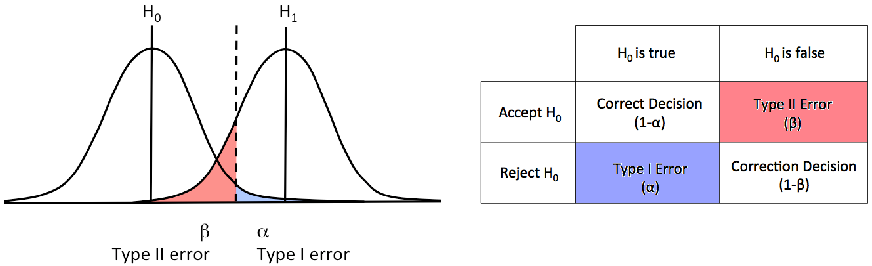
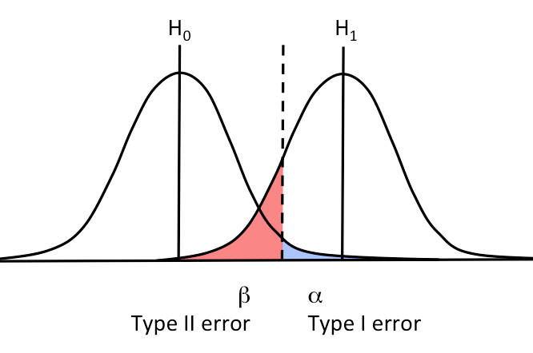
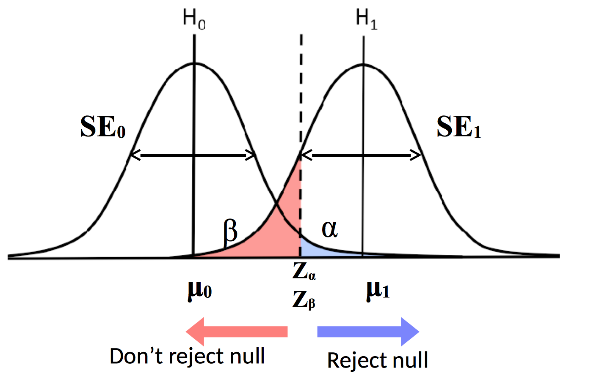

% Hypothesis Testing & Causal Inference
% [Benjamin S. Skrainka](skrainka@galvanize.com)
% September 15, 2016


##  Standards (1/2)

Today's standards:

*   Given a dataset, state and test the null vs. alternative hypothesis, using the p-value for the difference of means or proportions
*   Given a dataset, state and test the null vs. alternative hypothesis, using the p-value for Chi-square test of independence
*   Describe a situation in which a one-tailed test would be appropriate vs. a two-tailed test
*   State when to test hypothesis using:
    -   z-test
    -   t-test
    -   two sample t-test (one-sided and two-sided)
    -   two sample z-test (one-sided and two-sided)


##  Standards (2/2)

Today's standards:

*   Define and state application of p-value, Type I Error, Type II Error, significance level, and power
*   Account for the multiple hypotheses using Bonferroni correction
*   Compute the difference of two independent random normal variables
*   State when to use an A/B test to evaluate the efficacy of a treatment
*   Design a simple A/B test


## Objectives

Today's objectives:

*   List key properties for experimental data
*   Differentiate between experimental and observational data
*   Perform hypothesis testing
*   Design an A/B test to establish causality
*   Measure treatment effects


## Agenda

Today's plan:

#.  Frequentist hypothesis testing
#.  Key concepts: experimental vs. observational data
#.  Experimental design


## References

A couple references, ranked roughly by decreasing friendliness:

*   [Statistical Inference](http://www.amazon.com/Statistical-Inference-George-Casella/dp/0534243126) introduces basic probability and statistics
*   [All of Statistics: A Concise Course in Statistical Inference](http://www.amazon.com/All-Statistics-Statistical-Inference-Springer/dp/0387402721/ref=sr_1_5?ie=UTF8&qid=1436910638&sr=8-5&keywords=mathematical+statistics+springer) summarizes all things statistics
*   [A First Course in Design and Analysis of Experiments](http://users.stat.umn.edu/~gary/Book.html)
*   [Experimental and Quasi-Experimental Designs for Generalized Causal Inference](http://www.amazon.com/Experimental-Quasi-Experimental-Designs-Generalized-Inference/dp/0395615569/ref=sr_1_1?s=books&ie=UTF8&qid=1436910108&sr=1-1&keywords=Experimental+and+Quasi-Experimental+Designs+for+Generalized+Causal+Inference) is a popular introduction to experimental design for social scientists
*   [Causal Inference for Statistics, Social, and Biomedical Sciences](http://www.cambridge.org/US/academic/subjects/statistics-probability/statistical-theory-and-methods/causal-inference-statistics-social-and-biomedical-sciences-introduction) trenchantly explains the Rubin causal model
*  [Causality](http://www.amazon.com/Causality-Judea-Pearl-ebook/dp/B00AKE1VYK/ref=sr_1_2?s=digital-text&ie=UTF8&qid=1436909647&sr=1-2) covers the structural causal model
*   *The Design of Experiments* by R. A. Fisher is the classic reference, sadly out of print
*   [Sequential Analysis](http://www.amazon.com/Sequential-Analysis-Abraham-Wald/dp/0486615790)


#   Frequentist hypothesis testing


##  Frequentist hypothesis testing

To test a hypothesis:

#.  State *null hypothesis*, $H_0$
#.  State *alternative hypothesis*, $H_1$ ($H_A$)
#.  Choose a *significance level*, $\alpha$
#.  Choose and compute appropriate test statistics
#.  Compute *p-value* and 'reject' or 'fail to reject' $H_0$


##  Null  hypothesis vs. alternative hypothesis

*Null hypothesis* ($H_0$):

*   Typically, the status quo, such as no effect
*   $H_0:   \mu = 0$

*Alternative hypothesis ($H_A$)*

*   The alternative, such as advertising causes $1\%$ lift
*   $H_A:   \mu \neq 0$ or $H_A: \mu \geq 0$
*   Sometimes written as $H_1$

Statistics is conservative:

*   Cannot '*accept a hypothesis*'
*   Can only '*fail to reject*' it


##  Two-sided vs. one-sided tests

By default, we compute a *two-sided* test:

*   Reject $H_0$ if test statistic is in upper or lower tail
*   Compute p-value using probability of being in either tail

But, sometimes, we expect an effect to be in only one direction:

*   Example:    advertising should not decrease sales
*   Use *one-sided* test
*   $H_0: \theta = \theta_0$  vs. $H_A: \theta > \theta_0$
*   Reject $H_0$ if test statistic is in the wrong tail
*   Compute p-value using the probability of being in only one tail


##  Type I and Type II errors

Type I error:

*   Rejecting $H_0$ when it is true
*   Example:
    -   $H_0:$   defendant is innocent
    -   Convicting someone who is innocent

Type II error:

*   Failing to reject $H_0$ when it is false
*   Example:
    -   $H_A:$  defendant is guilty
    -   Acquitting someone who is guilty


##  $H_0$ vs. $H_A$




##  Statistics

We compute statistics to perform inference and characterize parameters of interest:

*   A *statistic*, $\Theta_n(X)$, is a function of data which characterizes some parameter of interest:
    -   Depends on the $n$ observations (rows)
    -   Is a random variable
*   A statistic, $\Theta_n(X)$, is *sufficient* for the parameter $\theta_0$ if conditioning on it and the true parameter provides the same information as just conditioning on the statistic:

$$\Pr[x| \Theta_n(x), \theta_0] = \Pr[x| \Theta_n(x)]$$


##  Properties of statistics

A good statistic is usually unbiased and consistent:

*   *Bias*:

$$bias = \mathbb{E}[\Theta_n(X)] - \theta_0,$$ where $\theta_0$ is the 'truth'

*   *Consistency*:  a statistic is consistent if:

$$ \underset{n \rightarrow \infty}{\mathit{plim}} \, \Theta_n(X) \rightarrow \theta_0$$

*   *Robustness*:   works well for a wide variety of distributions
*   Will often accept some bias to decrease variance (Will discuss bias-variance trade-off in a couple weeks)


##  Significance level

*Significance level* is the cutoff for rejecting $H_0$:

*   $\alpha$ is significance level
*   $\alpha = \Pr[ \texttt{reject } H_0 | H_0 \texttt{ is true}]$
*   *Confidence level* is $(1 - \alpha) \times 100$, e.g., $95\%$


##  Example:    significance level




##  P-value

A *p-value* is the probability of observing data which is at least as extreme as what was observed:

*   For a statistic $\Theta(X)$, $\texttt{p-value} = \Pr[ \Theta(X) \geq \Theta(x) ]$
*   Large values of $\Theta(X)$ (small p-values) increase our belief that $H_A$ is likely
*   Reject $H_0$ if $\texttt{p-value} \leq \alpha$
*   P-values can be controversial
*   Beware of 'p-hacking' -- manipulation to generate a significant result

Example:    p-value for z-test

$$\texttt{p-value} = \Pr[ Z < - |z| \texttt{ or } |z| < Z]$$


##  Confidence interval (CI)

To get a sense of the true value of the parameter of interest, compute a confidence interval:

| Term                  | Symbol    |
| :---                  | :-----    |
| Significance level    | $\alpha$  |
| Parameter estimate    | $\hat{\theta}$    |
| Standard error        | $\hat{\sigma}_{\theta}$ |
| Critical z-value for $CI^{1 - \alpha}$   | $z_{1 - \alpha / 2}$  |

$$CI^{1 - \alpha} = \left[ \hat{\theta} - \hat{\sigma}_{\theta} \cdot z_{1-\alpha/2}, \hat{\theta} + \hat{\sigma}_{\theta} \cdot z_{1-\alpha/2} \right]$$

Note: $95\%$ CI $\iff$ significance level $\alpha = 0.05$


##  More on confidence intervals

A couple things to note:

*   Meaning of CI: if you compute CIs from multiple random samples from population, then $95\%$ will contain the true, population value
*   Popular values for $\alpha \in \{0.10, 0.05, 0.01\}$
*   Use appropriate distribution to compute CI: e.g., for a t-statistic with $\nu$ degrees of freedom,

$$CI^{1 - \alpha} = \left[ \hat{\theta} - \hat{\sigma}_{\theta} \cdot t_{1-\alpha/2}^{\nu}, \hat{\theta} + \hat{\sigma}_{\theta} \cdot t_{1-\alpha/2}^{\nu} \right]$$


##  Getting the critical value

Can compute critical values using `scipy.stats` for any distribution:

```python
import scipy as sp

# To determine shape parameters, see <dist>.shapes
>>> sp.stats.t.shapes
'df'
>>> alpha = 0.05
>>> df = 20
>>> sp.stats.t.ppf(1 - alpha / 2, df=df)
2.0859634472658364
```


##  Power

Power is the probability of not making a Type II error, i.e., rejecting $H_0$ when $H_A$ is true:

*   $\beta = \Pr[ \texttt{reject } H_A | H_A \texttt{ is true}]$
*   $\beta$ is similar to $\alpha$, but if $H_A$ is true
*   $\mathit{power} = 1 - \beta$
*   An experiment with high power is more likely to reject $H_0$ when it is false
*   Typically, set $\mathit{power} = 1 - \beta = 0.80$


##  Example:    power


##  Trade-off: significance level vs. power

You must trade-off significance level and power:

*   Decreasing chance of Type I error will increase chance of Type II error
*   Wise men recommend:

| Term                          | Value     |
| :-----------                  | :----     |
| Significance level ($\alpha$) | $0.05$    |
| Confidence level              | $95\%$    |
| Power ($1 - \beta$)           | $0.80$    |


##  Factors affecting measurement of a signal

To increase probability of measuring a signal (rejecting $H_0$):

*   Increase number of observations, $n$
*   Increase effect size, i.e., $\theta_A - \theta_0$
*   Decrease noise, $\sigma^2$


##  Common test statistics

Common test statistics:

*   z-statistic
*   t-statistic
*   $\chi^2$ for Wald test, score (LM) test, LR test
*   $F$ to test restrictions in linear regression

Example:    regression parameter estimate

$$t = \dfrac{\hat{\beta}}{\hat{\sigma}(\hat{\beta})}$$


##  z-test

Use a z-test when the variance is known:

*   $H_0: \overline{x} = \mu$
*   We test if the mean is $\mu$, which could be known from past experiments
*   *z-statistic*:

$$z = \dfrac{\overline{x} - \mu}{\sigma / \sqrt{n}}$$

*   Population variance is known: $\sigma^2$
*   Compute p-value using Normal(0, 1)


##  t-test

Use a t-test when variance is unknown:

*   $H_0: \overline{x} = \mu$
*   *t-statistic*:

$$t = \dfrac{\overline{x} - \mu}{s / \sqrt{n}}$$

*   Use sample variance for denominator:

$$s^2 = \dfrac{1}{n-1} \underset{j=1}{\overset{n}{\sum}} \left( x_j - \overline{x} \right)^2$$

*   Compute p-value using Student's t distribution
*   Must specify *degrees of freedom*, $\nu$:
    -   Number of free parameters
    -   $\nu = n - k$, where $k$ is number of fitted parameters


##  Warning: `ddof`

Many Numpy functions compute population values by default:

*   Example:    `np.var(..., ddof=0, ...)` computes

$$s^2 = \dfrac{1}{n} \underset{i=1}{\overset{n}{\sum}} (x_i - \overline{x})^2$$

*   Must set `ddof=1` to get sample variance!

$$s^2 = \dfrac{1}{n-1} \underset{i=1}{\overset{n}{\sum}} (x_i - \overline{x})^2$$

*   `ddof` means 'delta degrees of freedom'
*   In Pandas, `ddof` defaults to $1$


##  Comparing two means:  one sample

To compare a sample vs a known mean, $\mu_0$, use the 1-sample t-statistic:

$$t = \dfrac{\overline{x} - \mu_0}{\sqrt{s^2/n}}$$

Then compute p-value:

```python
import scipy as sp

(tstat, pval) = sp.stats.ttest_1samp(data, truth)
```


##  Unpaired: comparison of two random samples

To compare two independent samples, use the two-sample t-statistic:

$$t = \dfrac{\overline{x_1} - \overline{x_2}}{\sqrt{s^2}}$$
$$s^2 = \dfrac{s_1^2}{n_1} + \dfrac{s_2^2}{n_2}$$

```python
import scipy as sp

x = sp.stats.norm.rvs(loc=1, size=10)
y = sp.stats.norm.rvs(loc=1.1, size=12)
(tstat, pval) = sp.stats.ttest_ind(x, y)
# Returns:  (1.2729753413788905, 0.21762566433145955)
```


##  Paired: comparison of paired samples

When you can pair data, use a paired t-test:

*   Example:    twin studies -- each twin is assigned a different treatment
*   Equivalent to a one-sample test on the paired differences
*   Compute mean based on paired differences because samples are not independent

$$t = \dfrac{\overline{d} -\mu_0}{s_{diff}/\sqrt{n}}$$
$$s_{diff}^2 = \dfrac{1}{n-1} \underset{i=1}{\overset{n}{\sum}} (d_i - \overline{d})^2$$
$$d_i = x_{i1} - x_{i2}$$

*   Use `sp.stats.ttest_rel()`


##  Review: Central Limit Theorem

How does the Central Limit Theorem motivate these tests?


##  Multiple hypothesis testing

Q:  If you test 20 different button colors and button color has no effect, how many button colors would you expect to be significant at the 5% level on average?


##  Bonferroni confidence intervals

When testing multiple hypotheses together, we must be more conservative:

*   Correct significance level to ensure overall significance remains the same
*   Bonferroni: $\alpha \rightarrow \alpha / m$ if you have $m$ tests:

$$\Pr[\cup (p_i \leq \dfrac{\alpha}{m})] \leq \underset{i}{\sum} \Pr[p_i \leq \dfrac{\alpha}{m}] \leq \alpha,$$

where $p_i$ is the p-value for the i-th hypothesis

*   Other corrections exist...


#   Key concepts: experimental vs. observational data


##  Models of causality: Rubin or Pearl

There are two main models of causality:

*   Rubin causal model
*   Structural causality model
    -   Use to establish causality with observational data
    -   See Judea Pearl's [Causality](http://www.amazon.com/Causality-Reasoning-Inference-Judea-Pearl/dp/0521773628)


##  Potential outcomes notation (Neyman, 1923)

I adopt the notation of Imbens & Rubin:

*   $Y_i(0)$    $i$'s response if untreated
*   $Y_i(1)$    $i$'s response if treated
*   $W_i\in \{0,1\}$    indicates treatment status

Note: $Y_i(0)$ and $Y_i(1)$ may well have different distributions


##  Assumption: SUTVA

*Stable unit treatment value assumption*:

*   Treatment is the same for all units
*   Treatment of one unit does not affect the outcome of another
*   Example:    does aspirin cure headaches?
    -   If you receive an aspirin, it has same effect on everyone
    -   Giving you an aspirin, does not affect my headache


##  Key assumptions to establish causality

Assignment to treatment should be:

*   *Individualistic*
    -   A unit's probability of assignment is not affected by assignment status of other units
    -   $p_i(X,Y(0),Y(1)) = q(X_i, Y_i(0), Y_i(1))$
*   *Probabilistic*
    -   Unit has non-zero probability of receiving either treatment
    -   $0 < p_i(X, Y(0), Y(1)) < 1$
*   *Unconfounded*
    -   Assignment is independent of potential outcomes


##  Experimental vs. observational data

A classical random experiment:

*   Is individualistic, probabilistic, and unconfounded
*   Has a known *assignment mechanism*, $\Pr[W| X, Y(0), Y(1)]$
*   If the assignment mechanism is unknown, the data is *observational*


##  Ceteris paribus

*Ceteris paribus* means 'other things equal':

*   We cannot compare apples to oranges
*   Attempt to establish causality by holding everything else fixed
*   Or, randomizing so unobserved effects average to $0$
*   Condition on observables to establish causality, e.g.,

$$\mathbb{E}[\cdot | X=x]$$


##  Selection bias

We would like compute the treatment effect as

$$\tau = \mathit{Avg}_n[Y_i(1)] - \mathit{Avg}_n[Y_i(0)]$$

But, we do not observe response to counterfactual treatment.  Thus, we would actually compute the **direct effect**,

$$\mathit{Avg}_n[Y_i(1)|W_i = 1] - \mathit{Avg}_n[Y_i(0)|W_i=0]$$

Which is equivalent to **treatment effect** + **selection bias**:

$$\mathtt{observed\:{}effect} =  \underbrace{\mathit{Avg}_n[Y_i(1)|W_i = 1] - \mathit{Avg}_n[Y_i(1)|W_i = 0]}_{\mathtt{direct\:effect}}$$ $$ + \underbrace{\mathit{Avg}_n[Y_i(1)|W_i = 0] - \mathit{Avg}_n[Y_i(0)|W_i = 0]}_{\mathtt{selection}}$$


##  Selection bias

Selection bias occurs when:

*   Treatment and control group have different distributions
*   Unconfoundedness is violated:
    -   Treatment status is correlated with responsiveness to treatment
    -   Unobserved factors are correlated with outcomes and treatment status
    -   E.g., smarter students are assigned to smaller classes
*   Random assignment to treatment $\Rightarrow Y_i(0), Y_i(1) \perp W_i$
*   Selection bias is everywhere -- beware!


##  Example:    selection bias

An MBA stack ranks zip codes by sales and advertises in the best performing zip codes:

*   Is this a good idea?
*   Can you establish causality?
*   How would you measure the impact of the advertising campaign?


##  Why randomize?

To ensure that the treatment and control group have the same distribution:

*   Block on observables to control for observable heterogeneity:
    -   Stratified sampling
    -   Clustered sampling
    -   Systematic sampling
*   Randomize over everything else
    -   Should eliminate bias from unobserved heterogeneity (factors) on average
*    Should ensure that our experiment has *internal validity*
*   *External validity*: can we generalize our results to the world beyond our laboratory?


#   Experimental design


##  Review: significance vs. power

**Q**:  What is the difference between significance and power?

**Q**:  Which is more important when designing an experiment?

**Q**:  How does changing the effect size, standard deviation, and sample affect power?


##  Overview

The goal of experimental design is to establish causality, estimate effect size, and avoid bias:

*   Block on observables
*   Randomize over everything else to avoid bias
*   Distribution of treatment and control group should be the same


##  Power calculation

Always perform a power calculation to calculate number of observations needed to measure a signal:

*   Make sensible guess about effect size and standard deviation ... or run a pilot experiment
*   Use $\alpha=0.05$ and $\mathit{power}=0.80$ unless you know better
*   Usually, effect size is 'standardized,' i.e., divided by standard deviation
*   Lift from advertising is often small, e.g., 1%
*   For more complicated situations, compute power via Monte Carlo simulation


##  Power calculation




##  Example:  power calculation

How big do $N_c$ and $N_t$ need to be to measure an effect?

```python
import statsmodels.stats.power as smp
import statsmodels.stats.api as sm

# Solve for number of observations needed
smp.zt_ind_solve_power(effect_size=0.01, alpha=0.05,
    power=0.80, alternative='two-sided')
# returns:  156977.21019023287

# Compute power for an design
smp.zt_ind_solve_power(effect_size=0.01, nobs1=10,
    alpha=0.05,ratio=1.0, alternative='two-sided')
# Returns:  0.050057277123711996
```


##  Check for balance

After designing your experiment, check for balance:

*   Are distributions of exogenous covariates in different treatments the same?
*   Are outcomes similar prior to treatment?
*   Examine:
    -   Moments of distribution (mean, standard deviation)
    -   Compare distributions with Kolmogorov-Smirnov test
    -   Train a logit model to predict if an observation is in the treatment or control group


##  Example:    measure impact of advertising on click-through-rate (CTR)

Your engineering team ran an experiment where they changed the color of the checkout button from red to blue.  How would you test if blue is better?

| Data              |   Control         |   Treatment   |
| :---------------  |   :------         |   :--------   |
| Total visitors    |   $N_C$           |   $N_T$       |
| Number of clicks  |   $n_C$           |   $n_T$       |

Questions:

*   What is $H_0$?
*   What is the CTR for each treatment?
*   What is the effect size?
*   What is the standard error?
*   What test should you perform to test $H_0$?


##  Example:    continued

Answer:

*   CTR: $\widehat{ctr}_C = n_C / N_C$ and $\widehat{ctr}_T = n_T / N_T$
*   $H_0: ctr_C = ctr_T$, i.e., treatment has no effect
*   Effect size: $\hat{\delta} = \hat{ctr}_T - \hat{ctr}_C$
*   Use pooled sample proportion for standard error:

$$\widehat{ctr} = \dfrac{n_C + n_T}{N_C + N_T}$$

*   Compute standard error for two independent samples:

$$\widehat{s}^2 = \widehat{ctr} \cdot (1 - \widehat{ctr}) \cdot \left( \dfrac{1}{N_C} + \dfrac{1}{N_T} \right)$$


##  Example:    continued

*   Test statistic:

$$z = \dfrac{\widehat{ctr}_C - \widehat{ctr}_T}{s}$$

*   z-test -- why is a t-test incorrect?

See [Stat Trek](http://stattrek.com/hypothesis-test/difference-in-proportions.aspx?Tutorial=AP) for details


##  Pearson $\chi^2$ test

For comparing counts in a table, ${O_{ij}}$, Pearson's $\chi^2$ test for independence is easier:

$$U = \underset{i=1}{\overset{I}{\sum}}  \underset{j=1}{\overset{J}{\sum}} \dfrac{\left(O_{ij}-E_{ij}\right)^2}{E_{ij}}$$

where the expected number of observations in a cell is:

$$E_{ij} = \dfrac{O_{i \cdot} O_{\cdot j}}{n}$$

Under $H_0$, $U \thicksim \chi^2_\nu$ where $\nu = (I-1)\cdot (J-1)$, i.e., reject $H_0$ if $U > \chi^2_{\nu,\alpha}$

Discussion based on [All of Statistics](http://www.amazon.com/All-Statistics-Statistical-Inference-Springer/dp/0387402721)


##  Intuition for Pearson's $\chi^2$ test

Intuition for the $\chi^2$ test:

*   Use test to compare observed and expected cell counts under $H_0$
*   $H_0 \Rightarrow p_{ij} = p_{i \cdot} \cdot p_{\cdot j}$
*   So MLE estimator is:

$$\hat{p}_{ij} = \hat{p}_{i \cdot} \cdot \hat{p}_{\cdot j} = \dfrac{O_{i \cdot}}{n} \cdot \dfrac{O_{\cdot j}}{n}$$

Then the expected number of observations in each cell is:

$$E_{ij} = n \hat{p}_{ij} = \dfrac{O_{i \cdot} \cdot O_{\cdot j}}{n}$$


##  Example: Pearson's $\chi^2$ test (1/3)

Is tonsillectomy related to Hodgkins disease?

|                   | Hodgkins disease  | No disease  | $O_{i \cdot}$   |
| :---------------- | :---------------  | :---------  | :---- |
| tonsillectomy     | 90                | 165         | 255 |
| no tonsillectomy  | 84                | 307         | 391 |
| $O_{\cdot j}$     | 174               | 472         | 646 |

Example from [All of Statistics](http://www.amazon.com/All-Statistics-Statistical-Inference-Springer/dp/0387402721)


##  Example: Pearson's $\chi^2$ test (2/3)

```python
data = [ [ 90, 165 ], [ 84, 307 ] ]
chi2, p, ddof, expected = sp.stats.chi2_contingency(data,
    correction=True)
msg = """Test Statistic: {}
p-value: {}
Degrees of Freedom: {}"""

print( msg.format( chi2, p, ddof ) )
print( expected )
```


##  Example: Pearson's $\chi^2$ test (3/3)

```python
Test Statistic: 14.2651105944
p-value: 0.000158780892398
Degrees of Freedom: 1

[[  68.68421053  186.31578947]
 [ 105.31578947  285.68421053]]
```


##  Other measurement methods

Several methods to measure results, depending on type of data and experimental design:

*   Regression/ANOVA, typically with dummy variables for treatment status
*   Instrumental variables (IV)
*   Difference-in-differences to control for heterogeneity
*   Regression discontinuity design


##  Other types of experiments

Sometimes, we get lucky and Nature provides a randomization device which effectively creates experimental data:

*   Field experiments:  occur in field and not laboratory
*   Natural experiments:    'nature' provides randomization
*   More complex designs:
    -   Multi-factor (A/B/C/...)
    -   Latin squared


##  Example:    natural experiment

A marketing manager runs an experiential marketing campaign on ten university campuses:

*   How would you measure if advertising worked?
*   What if the manager short-listed 50 campuses but could only obtain access to the chosen ten?
*   What assumption(s) did you make?


##  Example: best practice

Consider this scenario:

*   Collecting data is expensive.  
*   A manager collects data until the results appear significant and then terminates the experiment?

Is this a good idea?  Hint: what are the random variables?


##  Wald sequential Analysis

Sequential analysis provides method to terminate an experiment once you have collected enough data:

*   Treats experiment length as a random variable
*   The correct way to terminate an experiment before a fixed time
*   ... this is not the same thing as 'terminating early'
*   See reference for details
*   Example:    test quality of parts coming off an assembly line to compare two manufacturing processes


##  Summary

**Q:**  What is the difference between Type I and Type II errors?

**Q:**  How do you compute a confidence interval?

**Q:**  To compare two click through rates, should you use a z-test or t-test?

**Q:**  How can you establish causality?

**Q:**  What assumptions must hold to run a classical random experiment?

**Q:**  What is the difference between power and significance level?  Which matters for inference?  Which matters for designing an experiment?

**Q:**  What is selection bias?  How can I eliminate it?
