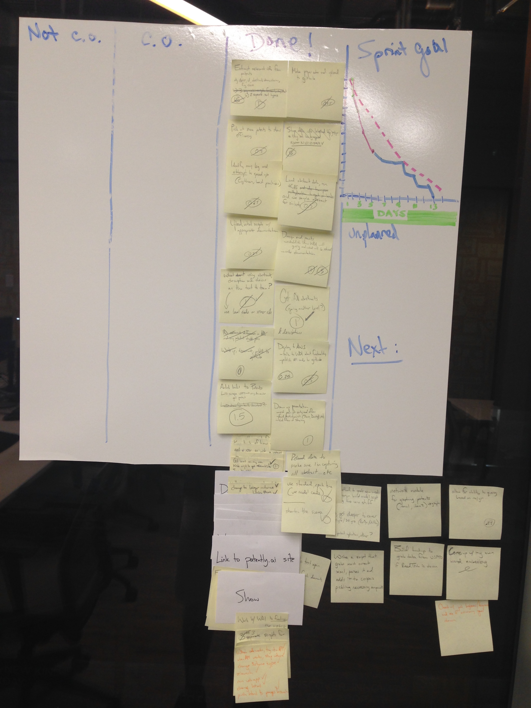

### Slide Notes

Ryan's lecture notes for each slide are in the [original Google Slides document](https://docs.google.com/a/galvanize.com/presentation/d/1eT1KkCAmcTigXqQy6eMM7NzfVNby_SvASszQySRgcbU/edit?usp=sharing).

### Student Capstone Sprint Planning

Here is a __generic__ list of _stories_ and _tasks_ for a student capstone project. Each student should write stories and tasks that are __specific to their own project__.

| story name                   | how to demo                                                         | notes                                                                                                                                                                                                                      | tasks                                                                                                                                                                                                                                                                                                                                                                           |
|------------------------------|---------------------------------------------------------------------|----------------------------------------------------------------------------------------------------------------------------------------------------------------------------------------------------------------------------|---------------------------------------------------------------------------------------------------------------------------------------------------------------------------------------------------------------------------------------------------------------------------------------------------------------------------------------------------------------------------------|
| Data preparation             | a graphic showing the process                                       | This assumes you already have the data on-hand and are ready to dive in.                                                                                                                                                   | - do EDA - clean the data - transform the data (e.g. put it in matrix-form) - package the data-prep code & upload to github - document the process & upload to github                                                                                                                                                                                                           |
| Preliminary modeling         | a few graphs and/or metrics describing early validation results     | The purpose of this is to quickly show that the data has signal that you can pick up on.                                                                                                                                   | - run a (simple?) learning algorithm on the (subset?) dataset - get better results than random guessing - pickle the model pipeline - validate the model by loading the pickle file - package the training and validation code & upload to github - document the process & upload to github                                                                                     |
| EC2 instance to host the API | (The API demo will cover this implicitly.)                          | We want a dedicated instance to host the API so that we don't accidentally kill it while doing other thing. E.g. Don't try to model on the same EC2 instance that hosts your API!                                          | - find and launch an appropriate AMI - customize the AMI - document the process & upload to github                                                                                                                                                                                                                                                                              |
| The mock-API                 | via swagger-ui or curl                                              | This mock API needs to be published after the first week of the sprint so that the WDI partner can use it during the entire second week. Be sure to expose all the functionality that the website needs.                   | - design the interface (endpoint, parameters, return values) - write mock endpoints - write FINAL documentation - publish the documentation via flask-swagger and swagger-ui - deploy the mock API to AWS - test the mock API - communicate with WDI partner about where it is and how it works - publish the mock-API code to github - document the process & upload to github |
| For-realz modeling           | a few graphs and/or metrics describing the final validation results | The end-goal here is to get the best results possible in the allotted time. Consider doing extra analysis like an ROC or profit curves or something.                                                                       | - find and launch an appropriate AMI - customize the AMI - upload the data - train several models using all the data - pickle the trained model pipeline - package the code & upload to github - document the process & upload to github                                                                                                                                        |
| Version 1.0.0 API            | via swagger-ui or curl                                              | This should be a drop-in-replacement for the mock-API so that the WDI partner only has to change URLs, not behavior. If done perfectly, it will take the WDI student 1 minute to switch from using the mock-API to v1.0.0. | - write the code - deploy the API alongside the mock-API - test the API - publish the code to github - communicate with WDI partner                                                                                                                                                                                                                                             |
| Showoff documentation        | ... just show it!                                                   | The purpose of this is to show off your skills and make your project shine like the sun!                                                                                                                                   | - work with WDI partner to finalize the website - brainstorm the best way to tell the story - write a beautiful README.md for github - prepare a slidedeck                                                                                                                                                                                                                      |
Students are encouraged to write as many stories as they can! Write the stories and tasks on sticky notes and/or index cards. These stories become the _product backlog_.

Then a _sprint planning meeting_ is held, where the instructor (playing the role of _product owner_) will prioritize the stories (by moving the story cards around) and help estimate _story points_ (by playing _planning poker_ and writing the estimates on each card) in order to create the _sprint backlog_.

After the _sprint backlog_ is created, the student will build themselves a _scrum board_. Here are some example scrum boards:

|         | Day 3 | Day 13 |
|---------|-------|--------|
| Clay    |  |  |
| Jostine |  |  |
| Patrick |  |  |

### Suggested Reading

The book, 'Scrum and XP from the Trenches', is free in PDF form.

See: https://www.infoq.com/minibooks/scrum-xp-from-the-trenches-2
