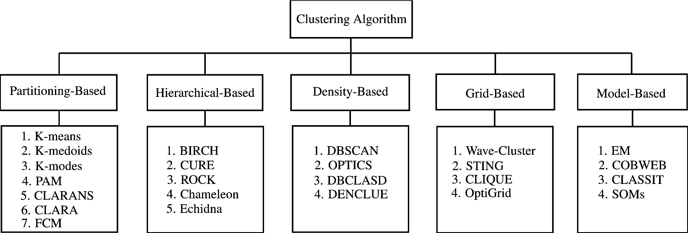

# Taxonomy of Clustering Algorithims

### Partitioning-based
In such algorithms, all clusters are determined promptly. Initial groups are specified and reallocated towards a union. In other words, the partitioning algorithms divide data objects into a number of partitions, where each partition represents a cluster. These clusters should fulfil the following requirements: (1) each group must contain at least one object, and (2) each object must belong to exactly one group. In the K-means algorithm, for instance, a center is the average of all points and coordinates representing the arithmetic mean. In the K-medoids algorithm, objects which are near the center represent the clusters. There are many other partitioning algorithms such as K-modes, PAM, CLARA, CLARANS and FCM.

### Hierarchical-based
Data are organized in a hierarchical manner depending on the medium of proximity. Proximities are obtained by the intermediate nodes. A dendrogram represents the datasets, where individual data is presented by leaf nodes. The initial cluster gradually divides into several clusters as the hierarchy continues. Hierarchical clustering methods can be agglomerative (bottom-up) or divisive (top-down). An agglomerative clustering starts with one object for each cluster and recursively merges two or more of the most appropriate clusters. A divisive clustering starts with the dataset as one cluster and recursively splits the most appropriate cluster. The process continues until a stopping criterion is reached (frequently, the requested number k of clusters). The hierarchical method has a major drawback though, which relates to the fact that once a step (merge or split) is performed, this cannot be undone. BIRCH, CURE, ROCK and Chameleon are some of the well-known algorithms of this category.

### Density-based
Here, data objects are separated based on their regions of density, connectivity and boundary. They are closely related to point-nearest neighbours. A cluster, defined as a connected dense component, grows in any direction that density leads to. Therefore, density-based algorithms are capable of discovering clusters of arbitrary shapes. Also, this provides a natural protection against outliers. Thus the overall density of a point is analyzed to determine the functions of datasets that influence a particular data point. DBSCAN, OPTICS, DBCLASD and DENCLUE are algorithms that use such a method to filter out noise (ouliers) and discover clusters of arbitrary shape.

### Grid-based
The space of the data objects is divided into grids. The main advantage of this approach is its fast processing time, because it goes through the dataset once to compute the statistical values for the grids. The accumulated grid-data make grid-based clustering techniques independent of the number of data objects that employ a uniform grid to collect regional statistical data, and then perform the clustering on the grid, instead of the database directly. The performance of a grid-based method depends on the size of the grid, which is usually much less than the size of the database. However, for highly irregular data distributions, using a single uniform grid may not be sufficient to obtain the required clustering quality or fulfill the time requirement. Wave-Cluster and STING are typical examples of this category.

### Model-based
Such a method optimizes the fit between the given data and some (predefined) mathematical model. It is based on the assumption that the data is generated by a mixture of underlying probability distributions. Also, it leads to a way of automatically determining the number of clusters based on standard statistics, taking noise (outliers) into account and thus yielding a robust clustering method. There are two major approaches that are based on the model-based method: statistical and neural network approaches. MCLUST is probably the best-known model-based algorithm, but there are other good algorithms, such as EM (which uses a mixture density model), conceptual clustering (such as COBWEB), and neural network approaches (such as self-organizing feature maps). The statistical approach uses probability measures in determining the concepts or clusters. Probabilistic descriptions are typically used to represent each derived concept. The neural network approach uses a set of connected input/output units, where each connection has a weight associated with it. Neural networks have several properties that make them popular for clustering. First, neural networks are inherently parallel and distributed processing architectures. Second, neural networks learn by adjusting their interconnection weights so as to best fit the data. This allows them to normalize or prototype. Patterns act as features (or attributes) extractors for the various clusters. Third, neural networks process numerical vectors and require object patterns to be represented by quantitative features only. Many clustering tasks handle only numerical data or can transform their data into quantitative features if needed. The neural network approach to clustering tends to represent each cluster as an exemplar. An exemplar acts as a prototype of the cluster and does not necessarily have to correspond to a particular object. New objects can be assigned to the cluster whose exemplar is the most similar, based on some distance measure.

### Source
A. Fahad et al., "A Survey of Clustering Algorithms for Big Data: Taxonomy and Empirical Analysis," in IEEE Transactions on Emerging Topics in Computing, vol. 2, no. 3, pp. 267-279, Sept. 2014.
doi: 10.1109/TETC.2014.2330519.
Available online: http://ieeexplore.ieee.org/stamp/stamp.jsp?tp=&arnumber=6832486&isnumber=6939750
