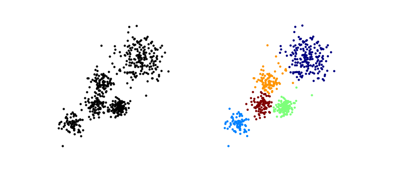
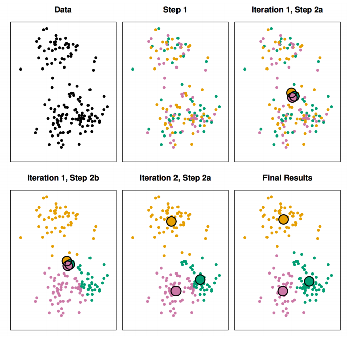
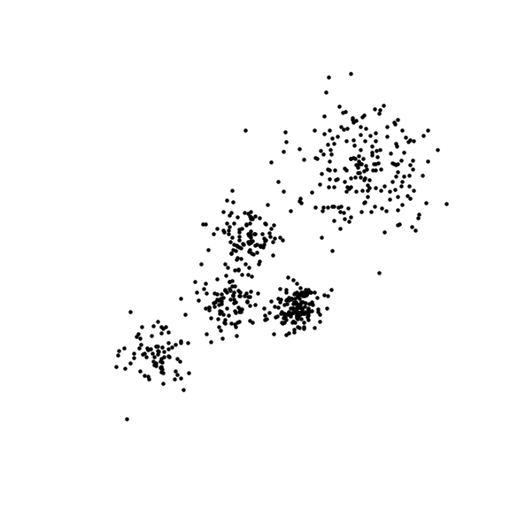
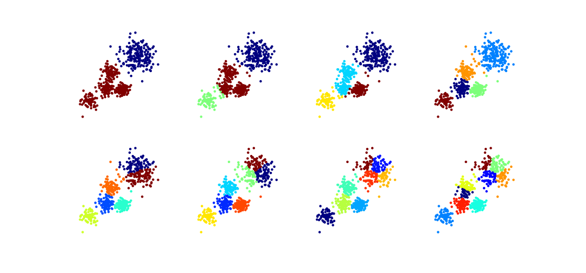
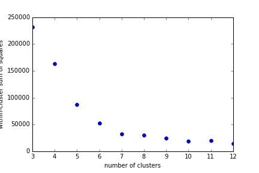
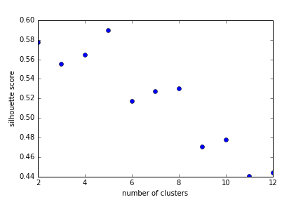
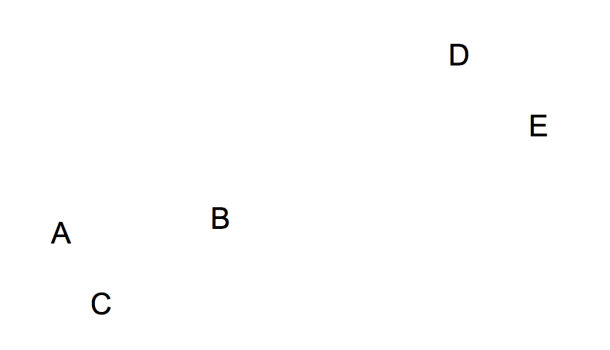
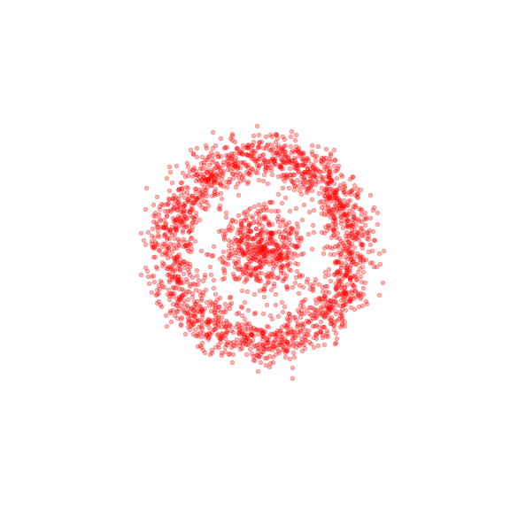

% Clustering
% [Jack Bennetto](jack.bennetto@galvanize.com)
% March 8, 2016

# Objectives

Today's objectives:

* Explain the difference between **supervised** and **unsupervised** learning
* Implement a **k-means** algorithm for clustering
* Choose the best k using the **elbow method** or **silhouette scores**
* Implement and interpret **hierarchical clustering**
* Discuss how **curse of dimensionality** affects clustering

# Agenda

Morning:

 * Supervised/unsupervised learning
 * Clustering
 * k-means algorithm

Afternoon:

 * Curse of dimensionality
 * How to choose k
 * Hierarchical and other clustering methods

# Supervised learning

Most of what you've learned so far

 * Linear & logistic regression with lasso or ridge regularization
 * Decision trees, bagging, random forest, boosting	
 * SVM
 * kNN

Label $==$ target $==$ endogenous variable $==$ dependent variable $==$ y

# Unsupervised learning

No labels. No target.

\only{<1>}{Why use it?}

\only{<2>}{

Used for:
\begin{itemize}
\item EDA
\item Discovering latent variables
\item Feature engineering
\item Preprossessing
\end{itemize}

}

# Unsupervised learning

\includegraphics[]{images/unsupervised.png}

# Clustering Problem

Divide data into **distinct subgroups** such that observations within each group are similar.

# Various Algorithms

There are several approachs to clustering, each with variations.

* k-means clustering
* Hierarchical clustering
* Density-based clustering (DBSCAN)
* Distribution-based clustering
* ...

How do we measure how good the clustering is?

# Within-Cluster Sum of Squares

Measures the goodness of a clustering

$$W(C) = \sum_{k=1}^{K} \frac{1}{n_k} \sum_{C(i)=k}  \sum_{C(j)=k} || x_i - x_j ||^2 $$

How long will it take to optimize this?

\only{<2>}{Do you need to normalize?}

# k-means Algorithm

The k-means algorithm

* Choose a number of clusters k
* Randomly assign each point to a cluster
* Repeat:
    * a\. For each of k clusters, compute cluster *centroid* by taking
mean vector of points in the cluster
    * b\. Assign each data point to cluster for which centroid is closest
(Euclidean)

...until clusters stop changing

# k-means Algorithm

# k-means++

k-means finds a local minimum, and sometimes a bad one.

One alternative: use random points as cluster center.

k-means++ is the same algoritm but with a different start.

 * Choose one point for first center.
 * Repeat:
    
    * Calculate distance from each point to the nearest center $d_i$
    * Choose a point to be the next center, randomly, using a weighed probability $d_i^2$

 ... until k centers have been choosen.

# The Curse of Dimensionality

Random variation in extra dimensions can many hide significant differences between clusters.

The more dimensions there are, the worse the problem.

More than 10 dimensions: consider PCA first.

# How Many Clusters?

# How Many Clusters?

# Choosing K

Can we use within-cluster sum of squares (WCSS) to choose k?

# Choosing K

More clusters $\implies$ lower WCSS

Several measures for the "best" K - no easy answer

 * The Elbow Method
 * Silhouette Score
 * GAP Statistic

# Choosing K -- The Elbow Method

# Choosing K -- Silhouette Score

For each point $x_i$:

 * $a(i)$ average dissimilarity of $x_i$ with points in the same cluster
 * $b(i)$ average dissimilarity of $x_i$ with points in the nearest cluster
    * "nearest" means cluster with the smallest $b(i)$

$$\text{silhouette}(i) = \frac{b(i) - a(i)}{max(a(i), b(i))} $$

What's the range of silhouette scores?

# Choosing K -- Silhouette Score

Silhouette score is between 1 and -1

 * near 1: very small tight cluster.
 * 0: at the edge of two clusters; could be in either.
 * < 0: oops.

The higher the the average silhouette score, the tigher and more separated the clusters.

# Choosing K -- Silhouette Score

# Silhouette Graph

(see notebook)

# Choosing K -- GAP Statistic

For each k, compare W(k) (within-cluster sum of squares) with that of randomly generated "reference distributions"

Generate B distributions

$$Gap(k) = \frac{1}{B} \sum_{b=1}^B \log{W_{kb}} - \log{W_k}$$

Choose smallest k such that $Gap(k) \ge Gap(k+1) - s_{k+1}$

where $s_{k}$ is the standard error of $Gap(k)$

# Hierarchical Clustering

# Hierarchical Clustering

\begin{columns}
    \begin{column}{0.48\textwidth}
        \includegraphics[]{images/letters-grouped.png}
    \end{column}
    \begin{column}{0.48\textwidth}
        \includegraphics[]{images/letters-dendrogram.png}
    \end{column}
\end{columns}

# Hierarchical Clustering

Algorithm

 * Assign each point to its own cluster
 * Repeat:
   * Compute distances between clusters
   * Merge closest clusters
 ...until all are merged

How do we define dissimilarity between clusters?

# Hierarchical Clustering -- Linkage

How do we define dissimilarity between clusters?

* **Complete:** Maximum pairwise dissimilarity between points in clusters -- good
* **Average:** Average of pairwise dissimilarity between points in clusters -- also good
* **Single:** Minimum pairwise dissimilarity between points in clusters -- not as good; can lead to long narrow clusters
* **Centroid:** Dissimilarity between centroids -- used in genomics; risk of inversions

# Problems with k-means

k-means has limitations.

# DBSCAN

Two parameters (number of clusters not specified)

 * $\epsilon$: distance between points for them to be connected
 * minPts: number of connected points for a point to be a "core" point

A cluster is all connected core points, plus others within $\epsilon$ of one of those. Other points are noise.

# Distribution-based clustering

Assume clusters follow some (generally gaussian) distribution

Find distributions with the **maximum likelihood** to produce this result

...except you don't know which point is part of which cluster, so you need to add some hidden variables and follow an **expectation-maximization** (EM) algorithm.

