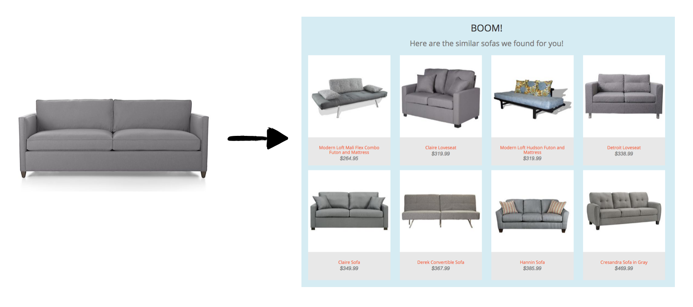

% Flask Web Apps
% Miles Erickson
% August 18, 2017

## Lecture Credits

* Emily Spahn
* Tetyana Kutsenko

## Objectives

At the end of the morning, you'll be able to:

* Describe example data product workflows
* Implement simple webpages using HTML and Flask
* Describe the HTTP methods GET and POST & list the differences

## Data Products & Workflow

* What do you deliver as a data scientist? (Think about case studies)

## Data Products & Workflow

Image by Ming Huang

## Why learn how to build web application

Galvanize Data Science Program - Capstone Project - Lili Yao

## Why learn how to build web application

Galvanize Data Science Program - Capstone Project - Lili Yao

## Web application
  * Web application is a client–server software which is run in a web browser.
  * Developing web application is simplified by frameworks such as Ruby on Rails, Django (Python), or Ember.js.

## HTTP methods: GET and POST

The Hypertext Transfer Protocol (HTTP) enables communications between clients and servers.

The two most common HTTP methods are:

  * **GET**: Requests data from a server. (Default method in http & flask)
  * **POST**: Submits data to server

Other HTTP Request Methods:

  * PUT -	Updates data on server
  * DELETE - Deletes data on server

Important differences: see table at [this w3 link](http://www.w3schools.com/tags/ref_httpmethods.asp)

## Review: HTML & CSS

Need basic HTML to build websites

  - HTML (Hyper Text Markup Language)
      - Based on markup tags
      - Each tag describes different document entity
  - CSS (Cascading Style Sheets)
      - Describes how HTML is displayed on screen
      - Assigns style properties to (sections of) your site
      - Can control the layout of multiple web pages all at once

## Review: HTML & CSS

Your main reference today is [W3 Schools](http://www.w3schools.com/).
They cover:

  * HTML
  * CSS
  * JavaScript
  * Bootstrap

## Example

## Flask

A [Flask](http://flask.pocoo.org/) is a microframework for Python.
“Micro” **does not mean**:

  * Your whole web application has to fit into a single Python file (although it certainly can)
  * Flask is lacking in functionality

It means:

  * Flask aims to keep the core simple
  * Flask won't make many decisions for you
  * Decisions that it does make are easy to change

## Installation

- **Install** using 'pip install flask'

[Jinja2](http://jinja.pocoo.org/) is a templating language for Python

## Flask Conventions

By convention

  * templates - subdirectory for html template files
  * static - subdirectory for files like css, js, font, images

Organize your files for flask [(Reference)](http://exploreflask.readthedocs.org/en/latest/organizing.html)

## Simple Flask application

## Simple Flask application

Run 'python example.py'

Open in browser 'http://localhost:8080/' or 'http://0.0.0.0:8080/'

## Routing

Routing is binding URLs to Python functions.

The route() call is used to bind a function to a URL.

## Routing

URL can contain variables (they are passed to bound function).

## Routing

You can generate URL for route with url_for() function.

## Routing

By default, a route only answers to GET requests, but you can add the 'methods' argument to the route() call.

## Templates

* Generating HTML from within Python is not fun
* Template engine provides handy language to describe dynamic HTML
* Use render_template() from Jinja2 template engine

## Templates

## Variables

Method _flask.render_template(template_name_or_list, context)_ accepts context – the variables that should be available in the template.

  * render_template('table.html', data=zip(x, y))
  * render_template('hello.html', name=name)

From inside templates you can access _request_ and _session_ objects

  * request.form['username']
  * request.args.get('key', '')
  * request.cookies.get('username')
  * session['username']

