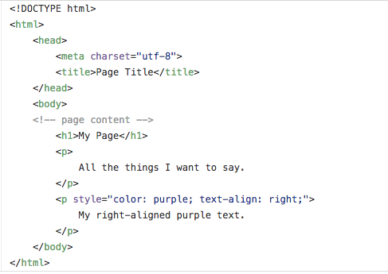
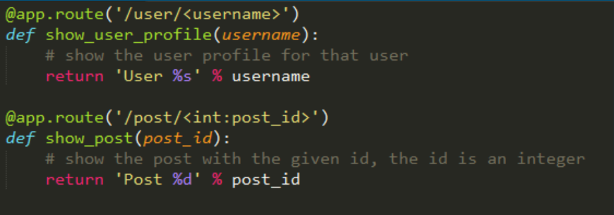

% Data Products & Flask Web Apps
% Miles Erickson
% March 6, 2017

## Lecture Credits

* Emily Spahn
* Tetyana Kutsenko

## Objectives

At the end of the day, you'll be able to:

* Describe example data product workflows
* Implement simple webpages using HTML and Flask
* Describe the HTTP methods GET and POST & list the differences
* Build a cross-platform, modern website using the Bootstrap framework
* Embed plots in your website using the bokeh package

## Data Products & Workflow

* What do you deliver as a data scientist? (Think about case studies)

## Data Products & Workflow

Image by Ming Huang

## Why learn how to build web application

Galvanize Data Science Program - Capstone Project - Lili Yao

## Why learn how to build web application

Galvanize Data Science Program - Capstone Project - Lili Yao

## Web application
  * Web application is a client–server software which is run in a web browser.
  * Developing web application is simplified by frameworks such as Django, Ruby on Rails or Symfony.

## HTTP methods: GET and POST

The Hypertext Transfer Protocol (HTTP) enables communications between clients and servers.

The two most common HTTP methods are:

  * **GET**: Requests data from a server. (Default method in http & flask)
  * **POST**: Submits data to server

Other HTTP Request Methods:

  * PUT -	Updates data on server
  * DELETE - Deletes data on server

Important differences: see table at [this w3 link](http://www.w3schools.com/tags/ref_httpmethods.asp)

## Review: HTML & CSS

Need basic HTML to build websites

  - HTML (Hyper Text Markup Language)
      - Based on markup tags
      - Each tag describes different document entity
  - CSS (Cascading Style Sheets)
      - Describes how HTML is displayed on screen
      - Assigns style properties to (sections of) your site
      - Can control the layout of multiple web pages all at once

## Review: HTML & CSS

Your main reference today is [W3 Schools](http://www.w3schools.com/).
They cover:

  * HTML
  * CSS
  * JavaScript
  * Bootstrap

## Example

## Flask

A [Flask](http://flask.pocoo.org/) is a microframework for Python.
“Micro” **does not mean**:

  * Your whole web application has to fit into a single Python file (although it certainly can)
  * Flask is lacking in functionality

It means:

  * Flask aims to keep the core simple
  * Flask won't make many decisions for you
  * Decisions that it does make are easy to change

## Installation

- **Install** using 'pip install flask'

[Jinja2](http://jinja.pocoo.org/) is a templating language for Python

- **Install** using 'pip install Jinja2'

## Flask Conventions

By convention

  * templates - subdirectory for html template files
  * static - subdirectory for files like css, js, font, images

Organize your files for flask [(Reference)](http://exploreflask.readthedocs.org/en/latest/organizing.html)

## Simple Flask application

## Simple Flask application

Run 'python example.py'

Open in browser 'http://localhost:8080/' or 'http://0.0.0.0:8080/'

## Routing

Routing is binding URLs to Python functions.

The route() call is used to bind a function to a URL.

## Routing

URL can contain variables (they are passed to bound function).

## Routing

You can generate URL for route with url_for() function.

## Routing

By default, a route only answers to GET requests, but you can add the 'methods' argument to the route() call.

## Templates

* Generating HTML from within Python is not fun
* Template engine provides handy language to describe dynamic HTML
* Use render_template() from Jinja2 template engine

## Templates

## Variables

Method _flask.render_template(template_name_or_list, context)_ accepts context – the variables that should be available in the template.

  * render_template('table.html', data=zip(x, y))
  * render_template('hello.html', name=name)

From inside templates you can access _request_ and _session_ objects

  * request.form['username']
  * request.args.get('key', '')
  * request.cookies.get('username')
  * session['username']

## Bootstrap: Introduction

[Bootstrap](http://getbootstrap.com/) is a popular front-end web framework combining HTML, CSS, & JavaScript.

  * Easy way to develop modern web pages
  * Cross-platform, including mobile
  * Downloadable templates available at [startbootstrap.com](http://startbootstrap.com/)
  * High quality results
  * Free & open source

## Bootstrap: Getting started

  Start Bootstrap is resource with free Bootstrap themes and templates.

  * Download a theme from [startbootstrap.com](http://startbootstrap.com/) & unzip
  * You can start with [bare](http://startbootstrap.com/template-overviews/bare/) template
  * Match the file structure Flask:
    * Move the js, css, and fonts to 'static' folder
    * Move .html files to 'templates' folder
  * Create flask application file .py
  * Edit content in .html template files
  * Run application

## Bootstrap: Getting started

  * Use the same .html template for all pages
  * Don't forget to add routes and links to connect all new pages

## Bokeh

[Bokeh](http://bokeh.pydata.org/en/latest/) is a python library to create interactive plots.

* Display your data in a more pleasing way than a static image
* Update charts easily
* Users can interact with your charts

## Installation

- **Install** using 'conda install bokeh' with all the dependencies that Bokeh needs
- If you have installed all dependencies you can use 'pip install bokeh'. (It does not install the examples)

## Use Bokeh in bootstrap/flask sites

Need to add the following two lines to the *.html template(s):

`<link rel="stylesheet" href="http://cdn.pydata.org
/bokeh/release/bokeh-0.11.1.min.css" type="text/css" />`

``

## Use Bokeh in bootstrap/flask sites

To add a bokeh plot to your site:

  * Build figure in python app

    _from bokeh.plotting import figure_

    _plot = figure(tools=TOOLS)_

  * Bokeh produces embeddable JavaScript that will render plot:

    _from bokeh.embed import components_

    _script, div = components(plot)_

    _return render_template('dashboard.html', script=script, div=div)_

  * Add plot to template
    _{{ script | safe }}_
    _{{ div | safe }}_

  The safe filter explicitly marks a string as "safe", i.e., it should not be automatically-escaped if auto-escaping is enabled.

## Content

Don't steal content:

  - Plenty of free-to-use images are available.
      - Google search options: filter images by usage rights
      - Flickr: license options in search
  - Give your sources credit!

## Post your website

Free options include:

  - [Python Anywhere](https://www.pythonanywhere.com/)
  - [Heroku](https://www.heroku.com/)

Paid options (free with credits) include:

  - [AWS](http://docs.aws.amazon.com/elasticbeanstalk/latest/dg/create-deploy-python-flask.html)
