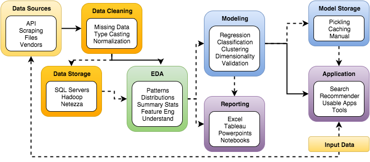

% Data Products & Flask Web Apps
% [Emily Spahn](spahn@uw.edu)
% April 5, 2016

## Objectives

At the end of the day, you'll be able to:

* Describe example data product workflows
* Implement simple webpages using HTML and Flask
* Describe the HTTP methods GET and POST & list the differences
* Build a cross-platform, modern website using the Bootstrap framework
* Embed plots in your website using the bokeh package

## Agenda
We'll be covering:

- AM:

    - HTML web pages
    - Flask web apps

- PM:

    - Bootstrap to develop flask web pages
    - Bokeh to display charts on websites

## Reference
Your main reference today is [W3 Schools](http://www.w3schools.com/).
They cover:

* HTML
* CSS
* JavaScript
* Bootstrap

## Data Products & Workflow

Image by Ming Huang

## Why Learn Basic Web Development?

**Show off your project!**

* Past Student Project Example: [Stone Soup](http://stone-soup.io/)

## Review: HTML & CSS

Need basic HTML to build websites

- HTML
    - HyperText Markup Language
    - Based on tags
- CSS
    - Cascading Style Sheets
    - Assigns style properties to (sections of) your site.

## Example: Working with HTML

Example files:

- `example.html`: a very basic website we'll build on in lecture
- `extended_example.html` for 'final' example.

## HTTP methods: GET and POST

HTTP methods
The two most common HTTP methods are:

* **GET**: Request data from a server. (Default method in http & flask)
* **POST**: Submits data to server.
* Important differences: see table at [this w3 link](http://www.w3schools.com/tags/ref_httpmethods.asp)

## Flask: Introduction

A [python web development microframework](http://flask.pocoo.org/).

* Lightweight, easy to use
* The more common/complex python web dev framework is [Django](https://www.djangoproject.com/)

## Why Learn Flask?

Modern web development has a lot of parts:

* HTML
* CSS
* JavaScript
* fonts
* etc

Flask is an easy way to avoid dealing with these elements directly.

Can include other python functionality (functions, modeling, etc).

## Flask: Folder Structure & Running

Organize your files for flask [(Reference)](http://exploreflask.readthedocs.org/en/latest/organizing.html):

- python file(s) containing web app
- a 'static' folder
    - contains css, js, font, images
- a 'templates' folder
    - contains html templates
- requirements.txt (optional)
- config.py (optional)

Run from command line using:

- `python flask_app.py`

## Flask Examples

We'll run through these together:

* example.py
* example_with_pages.py
* example_with_form.py
* example_with_matplotlib.py
* example_with_template.py

Note, there are more examples in student projects.

# AM exercise

## Bootstrap: Introduction

[Bootstrap](http://getbootstrap.com/) is a popular front-end web framework combining HTML, CSS, & JavaScript.

Why Bootstrap:

* Easy way to develop modern web pages
* cross-platform, including mobile
* downloadable templates available at [startbootstrap.com](http://startbootstrap.com/)
* high quality results
* free & open source

## Bootstrap to Flask: get started

For your reference:

* Download a theme from startbootstrap.com & unzip.
* Match the file structure Flask needs:
    - Create a "static" folder
      - move the js, css, and fonts folders to it.
    - Create a "templates" folder
      - move the index.html file into it.
* Edit index.html to reflect new file structure
    - add "static" in path name for css, js
* Create flask app file.
* Edit content as needed
    - Probably in '<--! Page content -->' in .html

## Bootstrap to Flask: add new pages

For your reference:

* Copy the existing html template to use as new page template
* Edit content
* Add new route block (page) to Flask app
* Add links to connect all the pages

## Example: bootstrap to flask

Working through example in class.

* Start from "bare" template from [http://startbootstrap.com/](http://startbootstrap.com/)
* Final result in `flask-bootstrap`

## Bokeh

[Bokeh](http://bokeh.pydata.org/en/latest/) is a python library to create interactive plots.

Why use bokeh?

* Display your data in a more pleasing way than a static image
* Update charts easily
* Users can interact with your charts

## Bokeh: version & installation

As of Apr 2016: Version 0.11.1

- Check version using `conda list bokeh`
- Install using `conda install bokeh`
    - or, upgrade with `conda update bokeh`

## Use Bokeh in bootstrap/flask sites (1/2)

Need to add the following two lines to the *.html template(s):

* `<link rel="stylesheet" href=
        "http://cdn.pydata.org/bokeh/release/
        bokeh-0.11.1.min.css" type="text/css" />`
* ``

## Use Bokeh in bootstrap/flask sites (2/2)

To add a bokeh page to your site:

- Build figure in python app
- Add a page for the figure
    - Add route block in flask
    - Copy/create a new template .html file for the page
- Add relevant content & variables to html template

## Example time!

Let's add a bokeh plot to our bootstrap page

* final result in `flask-bootstrap-bokeh`

## Content is King

Don't steal content:

- Plenty of free-to-use images are available.
    - Google search options: filter images by usage rights
    - Flickr: license options in search
- Give your sources credit!

## PM Assignment Extra Credit:

Post your website for the world to see!
Free options include:

- [Python Anywhere](https://www.pythonanywhere.com/)
- [Heroku](https://www.heroku.com/)

Pay options (free with credits) include:

- [AWS](http://docs.aws.amazon.com/elasticbeanstalk/latest/dg/create-deploy-python-flask.html)

# PM Assignment
