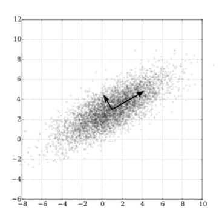
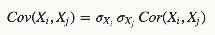
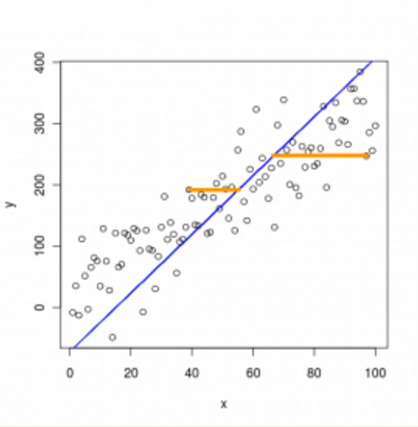
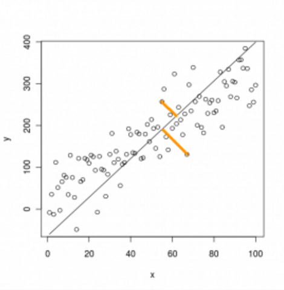
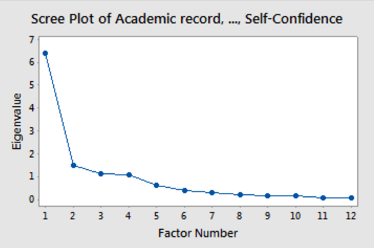

# Dimensionality Reduction

# Objectives

## PCA

- Reduce data dimensions
- Compress data to optimize ML speed and memory
- Visualize data by reducing dimensions to 2 or 3

## SVD

- Decompose matrix into factors
- Identify minimal underlying basis
- Extract generic categories from sample

# Curse of Dimensionality

## Intro

 

What is the curse of dimensionality?

1. Higher dimensional spaces have weird geometry. 
2. Average distance between data points increases. 
3. Data points become sparser the more dimensions you have. 
4. Classifier performance peaks then drops. 

## Distance

 

Why does the average distance increase?

1. Consider a unit ball in N-dimensions. 
2. Distance is calculated by adding up the sum of squares of
   difference in each dimension, and then taking a square root. 
3. The more dimensions there are the more terms there are in this
   sum. 
4. The more terms there are the higher the value of the sum. 

## Sparsity

 

Why does the sparsity increase?

A sub-hypercube will be a smaller fraction of the hypercube as the 
dimensions increase. 

## Classifier Performance

 

How do you expect classifier performance to be affected?

1. If you have too few dimensions the classifier is missing important information. 
2. Past an optimal number of dimensions the information will mostly be noise. 

## Fixing Problem

What if we could reduce the number of dimensions of the data and still
retain the information in our data?

## Sources of Dimensions

Suppose these are the ages and weights 4 people represented as a
matrix.

$
\left[ \begin{matrix}
20 & 130 \\ 
30 & 150 \\ 
1 & 20 \\ 
10 & 60 \\
\end{matrix} \right]
$

 

How many dimensions does this have? Are dimensions features or are
they the number of samples?

1. Dimensions are features. 
2. There are 2 dimensions. 
3. There are 4 samples. 

## Rank 

 

What is the rank of a matrix?

1. Maximum number of linearly independent column vectors of D 
2. Maximum number of linearly independent row vectors of D. 
3. $rank(D) = r \le \min(n,d)$ where $n$ is the number of rows and $d$ is the number of columns. 

## Rank Quiz

Consider this matrix.

$
\left[ \begin{matrix}
20 & 130 \\ 
30 & 150 \\ 
1 & 20 \\ 
10 & 60 \\
\end{matrix} \right]
$

 

What is its rank? 

Rank = 2 

## Rank Quiz

Consider this matrix.

$
\left[ \begin{matrix}
4 & 4 & 4 \\ 
5 & 5 & 5 \\ 
4 & 4 & 4 \\ 
3 & 3 & 3 \\
\end{matrix} \right]
$

 

What is is rank?

Rank = 1 

## Dimensionality of Data

 

What is the dimensionality of data?

1. The dimensionality of data is the number of linearly independent *basis vectors* needed to represent all the data vectors. 
2. The data points live in a *d*-dimensional *attribute space*. 
3. If $r \le d$ then the data points live in a lower *r*-dimensional space. 
4. Practically speaking, this will be the number of variables in the data. 

## Principal Component Analysis

 

What is Principal Component Analysis (PCA)?

1. PCA transforms your data to a smaller basis. 
2. The new smaller basis retains most of the variance of the original data set. 

## Eigenvectors

 

What are *eigenvectors* and *eigenvalues*?

1. Eigenvectors are fixed points of a matrix.  
2. $\mathbf{M}\times\mathbf{v} = \lambda\mathbf{v}$. 
3. Here $\mathbf{v}$ is an eigenvector, and $\lambda$ is an eigenvalue. 
4. Eigenvectors form a basis for $\mathbf{M}$ column vectors. 
5. Eigenvectors form a basis for $\mathbf{M}^T$ row vectors. 

## Eigenvectors and PCA

 

Why are eigenvectors useful for PCA?

1. Eigenvectors represent a basis for $\mathbf{M}$. 
2. Eigenvalues are the variance captured by each dimension. 
3. Eigenvectors and eigenvalues occur in pairs. 
4. Using eigenvector decomposition you can pick the eigenvectors and eigenvalues that capture most of the variance. 

## Intuition

 

What is PCA intuitively?

1. Intuitively, PCA is fitting an n-dimensional ellipsoid to data. 
2. Each axis of the ellipsoid represents a principal component. 
3. The axis along which the ellipsoid is fattest is the first principal component. 
4. The axes along which the ellipsoid is thinnest can be ignored. 
5. The thinner axes are not capturing as much variance as the fatter ones. 

## PCA Process

 

What is the process for finding the PCA?

1. Center your variables to their mean. 
2. Meaning, for each column vector of $\mathbf{M}$, find its mean and subtract it from the column values. 
3. Optionally, you can also scale the variables. For each column find its standard deviation, and divide each value in the column by the standard deviation. 
4. Find covariance matrix of the variables. 
5. Calculate eigenvalues and eigenvectors of covariance matrix. 
6. Orthogonalize and normalize eigenvectors to unit vectors.  
7. The mutually orthogonal unit eigenvectors form an axes of the ellipsoid fitted to the data.  
8. The proportion of the variance that each eigenvector represents can be calculated by dividing the eigenvalue corresponding to that eigenvector by the sum of all eigenvalues. 

## Scaling

 

Should I scale the data (divide by standard deviation) or not? What
are the pros and cons of scaling?

1. The variable with the higher variance will dominate the principal components. 
2. Argument for scaling: If variables are using different units the variable with
   the bigger values will dominate. 
3. Argument against scaling: If one variable is noisier it will
   dominate the principal components. 
4. There is no consensus on this; it is a judgement call. 

## Covariance vs Correlation

 

Should I use the covariance matrix or the correlation matrix?

1. If you scale the variables then that is the same as using the
   correlation matrix. 
2. If you do not scale the variables then you are using the
   covariance. 
3. The pros and cons are identical to what we discussed above. 

## Why Covariance

## Matrix Intuition

Consider this matrix in the following discussion.

$
\left[ \begin{matrix}
1 & 2 \\ 
3 & 4 \\ 
\end{matrix} \right]
$

 

What is a matrix? What does multiplying a matrix and a vector do?

1. A matrix is a transformation. 
2. When you multiply a matrix and a vector, that takes the vector, stretches it out, and reorients it. 

 

How do we know what the exact stretching and reorienting effect of a
matrix is?

1. Consider its effect on the unit vector. 
$
\left[ \begin{matrix}
1 & 2 \\ 
3 & 4 \\ 
\end{matrix} \right]
\times
\left[ \begin{matrix}
1 \\ 
0 \\ 
\end{matrix} \right]
$
 
2. Each vector is made up of a mixture of the unit vectors. 
3. The matrix's final effect on the vector is the sum of the effects
   on its unit vectors. 

## Eigenvector Intuition

An eigenvector is a vector that is stretched by a matrix but not
reoriented. 

 

Intuitively, what is an eigenvector?

1. Consider the ellipsoid of data points. 
2. The covariance matrix for this is a matrix that takes a unit ball
   and skews and stretches it into the ellipsoid. 
3. The eigenvectors are the axes of the ellipsoid because they only
   get stretched and not skewed. 
4. The eigenvalues are the amount that the eigenvectors are stretched by. 

## Eigenvectors and PCA

 

Why use eigenvectors for PCA?

1. If we think of the matrix as a stretching and a reorientation, then
   the matrix takes a unit ball and stretches and reorients it to an
   ellipsoid. 
2. The eigenvectors are the axes of this ellipsoid. 
3. The eigenvalues are the amount the ellipsoid is stretched along a
   particular eigen-direction. 

## Why Eigenvectors

 

What does the matrix look like if we transform it by this new
eigenvector basis?

1. The matrix now only stretches the basis.  
2. It does not reorient it.  
3. This means the matrix is now a diagonal matrix. 
4. Only its diagonal has non-zero values. 

## Eigenvalues And Variance

 

Why are eigenvalues the variance along a principal component?

1. Suppose we change the coordinates of a matrix to the basis formed
   by its eigenvectors. 
2. In this basis multiplying an eigenvector of the matrix by the
   matrix only scales the vector. 
3. The value of the diagonal, the eigenvalue, is how fat the ellipsoid
   is along that eigenvector axis. 

## PCA vs Regression

### Regression

### PCA

 

What is the difference between PCA and regression?

1. In regression you have labeled data and you are trying to find a
   line or a plane that predicts *y* based on *x*. 
2. You are trying to minimize your prediction error.
3. In PCA you do not have labeled data, there is no *y*. 
4. Instead you are trying to find a smaller dimensional space that
   approximates your features. 
5. You are trying to minimize your approximation error.
6. The similarity is only superficial.

## Applications

 

What are some applications of PCA?

1. Reduce memory used by machine learning algorithms. 
2. Improve performance of machine learning algorithms. 
3. Visualization. 

## How To Pick K

 

How can we decide what *k* to use?

1. Sort the eigenvalues? 
2. Divide them by the sum of the eigenvalues to get percentage
   variances explained. 
3. Add eigenvalues until you have 90% variance explained (or 95% or
   99% or whatever your goal is). 
4. Another approach is to create a Scree plot and look for the
   elbow. 

## Scree Plots

 

What is a Scree Plot?

1. A scree plot displays the eigenvalues associated with a component
   in descending order versus the number of the component. 
2. You can use scree plots in PCA to visually assess which components
   explain most of the variability in the data. 

## Job Performance Scree Plot

## Eigen

 

What does eigen mean?

1. Eigen means *proper* or *characteristic* in German. 
2. Eigenvectors and eigenvalues characterize a matrix viewed as a
   transformation. 
3. Why are we using a German word for them? Because they were named 
   by David Hilbert who wrote in German. 

