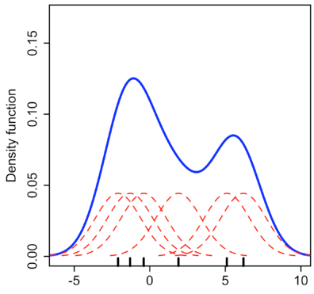
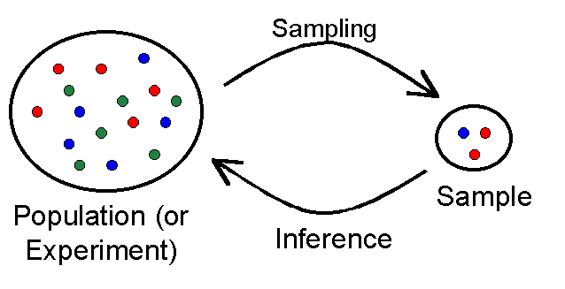

% Sampling and Estimation
% [Brian J. Mann](brian.mann@galvanize.com)

# Estimation

## Objectives

This morning we'll talk about estimating statistical distributions from observed data

* Recall what the expected value and variance of a random variable are
* Use Maximum Likelihood Estimation to estimate a parametric distribution from observed data
* Use the Method of Moments to estimate a parametric distribution from observed data
* Understand how Kernel Density Estimation estimates a non-parametric distribution from observed data

## Expected Value

Recall that the *expected value* of a discrete random variable is the weighted sum:

$$E[X] = P(X = x_1) * x_1 + P(X = x_2) * x_2 + \cdots + P(X = x_n) * x_n$$

For a continuous random variable with density function $f$:

$$E[X] = \int xf(x) \, dx$$

## Variance (1/2)

The *variance* of a random variable $X$ is the expected value of the square difference from the mean:

$$Var(X) = E[(X - E[X])^2]$$ $$= E[X^2 - 2XE[X] + E[X]^2]$$ $$= E[X^2] - E[X]^2$$

## Variance (2/2)

For a discrete random variable:

$$Var(X) = \sum_i P(X = x_i) * (x_i - E[X])^2$$

For a continuous random variable with density $f$:

$$Var(X) = \int (x - E[X])^2 f(x) dx$$

## Inference

### Parametric

* Assumes the data is drawn from a class of distributions determined by numeric parameters
* For example $Norm(\mu, \sigma)$, $Poisson(\lambda)$, or $Binom(n, p)$
* Determine which parameters are the best fit for the data

### Non-Parametric

* Make no assumption about the family of distribution the data is drawn from
* More flexible
* Less interpretable, often hard to compute anything about the inferred distribution

## Maximum Likelihood Estimation (MLE) (Parametric)

Assume each data point is drawn independently from the same distribution with density $f(x | \theta)$. Since the draws are independent the joint density function is

$$ f(x_1, x_2, \ldots, x_n | \theta) = f(x_1 | \theta) * f(x_2 | \theta) * \cdots * f(x_n | \theta)$$

If we have a formula for $f$ in terms of the parameters $\theta$, we can find the values of theta which maximizes the *likelihood* $$\mathcal{L}(\theta | x_1, x_2, \ldots, x_n) = f(x_1, x_2, \ldots, x_n | \theta) = \prod f(x_i | \theta)$$ or equivalently the *log-likelihood* $$\log \mathcal{L}(\theta | x_1, x_2, \ldots, x_n) = \sum \log f(x_i | \theta)$$

$$\hat{\theta} = argmax_\theta \log f(x_1, x_2, \ldots, x_n | \theta)$$

## Example - MLE

Suppose we flip a coin $N$ times and get $H$ heads. We want an estimate for how biased the coin is. Each flip is a Bernoulli trial with parameter $p$. The joint distribution is $Binom(N, p)$, so we need to find $p$ which minimizes

$$\log p^H(1-p)^{N-H}$$

## Maximum A Posteriori (MAP) (Parametric)

Generalization of MLE where we assume some prior distribution on the parameters $\theta$

$$ \mathcal{L}(\theta | x) = \frac{f(x | \theta)g(\theta)}{\int_\Theta f(x | t)g(t)dt}$$

To find the optimal $\theta$ we find $$\hat{\theta} = argmax_{\theta} \frac{f(x | \theta)g(\theta)}{\int_\Theta f(x | t)g(t)dt} = argmax_{\theta}f(x | \theta)g(\theta)$$

To get MLE, assume a uniform prior on $\theta$ so that the function $g$ disappears from the $argmax$ above

## Method of Moments (MOM) (Parametric)

Older method, generally MLE is preferred. But good to know anyway.

* A *moment* of a distribution is $E[X], E[X^2], E[X^3], \ldots$
* $E[X]$ is the first moment, $E[X^2]$ is the second moment, etc...
* Use the moments to derive as many equations as parameters, and then solve

## Example - MOM (1/2)

Suppose we flip a coin $N$ times again, and get $H$ heads. Let's use MOM this time to estimate $p$, the probability of flipping a head. Since the number of heads of $N$ flips is modeled by a Binomial distribution we can compute the first moment $$E[X] = Np$$

Since we have a single unknown, we stop at the first moment. We compute the sample first moment $\bar{x} = H$ and set this equal to theoretical first moment $$H = Np$$ So we estimate $$\hat{p} = H/N$$

## Example - MOM (2/2)

Suppose we have data sampled from a symmetric uniform distribution with unknown bounds $X \sim Unif(-b, b)$. The first moment is $$E[X] = 0$$ so that doesn't help. The second moment is $$E[X^2] = Var(X) + E[X]^2 = Var(X) = b^2/3$$ Computing the sample variance $s^2$ $$s^2 = b^2/3$$ so that $$\hat{b} = \sqrt{3s^2}$$

## Kernel Density Estimation (KDE) (Non-Parametric)

A *kernel* is another word for a density function of a distribution with mean 0.

*Kernel Density Estimation* estimates a distribution empirically given data by summing kernels centered at each point. The density function of the kernel density estimate is:

$$\hat{f}_h(x) = \frac{1}{nh} \sum_i K\left(\frac{x - x_i}{h}\right)$$

$K$ is a kernel. The parameter $h$ is called the *bandwidth*, and it's analogous to the width of bins in a histogram.

## Example - KDE

{width=150px}

# Sampling

## Objectives

## Statistical Discovery in General

1. Ask a question
2. Design an experiment
3. Collect data (Sampling)
4. Analyze data (Estimation/Inference)
5. Repeat

{width=200px}

## Make sure you have good data!

Your results are only as good as your data. Garbage in, garbage out.

* Your data should be representative of the population
* Important to make sure there is no bias when designing your experiment or "randomly" sampling
* For example, if you want to estimate the average height of a person in the US, but all the people you measure are in the 90th percentile for weight, something is wrong!

## Simple Random Sampling

The most common way to sample from a population is called *simple random sampling*

* Each subject has an equal chance of being selected from the population
* If your population is $x_1, \ldots, x_n$, to sample choose a number uniformly at random from $1, \ldots, n$ and select that observation

## Central Limit Theorem

One of the most important results in classical statistical inference is the *Central Limit Theorem* which says that if $X_1, X_2, \ldots, X_n$ are i.i.d. random variables with mean $\mu$ and variance $\sigma^2$ then their mean $$\bar{X} = \frac{X_1 + \cdots + X_n}{n}$$ is approximately normally distributed with mean $\mu$ and variance $\frac{\sigma^2}{n}$ $$\bar{X} \sim N(\mu, \frac{\sigma}{\sqrt{n}})$$

## Example - CLT

Recall that $Binom(n, p)$ is the sum of $n$ independent Bernoulli trials with parameter $p$. This means that $$Binom(n, p) \sim N\left(np, \sqrt{np(1-p)}\right)$$

Why??

## Confidence Intervals (1/2)

A *confidence interval* is an interval estimate of the true parameter of your population

* An $\alpha$ confidence interval is an interval centered around estimated parameter which contains the true value of that parameter with *confidence* $\alpha$ ($\alpha$ is usually 99\%, 95\%, 90\%, or 80\%)
* In other words, if you resample or rerun the experiment many times, $\alpha$ percent of the time the true value will be in the computed confidence interval
* It is *not* a statement that the true value of the parameter is contained in the interval with a certain probability

## Confidence Intervals (2/2)

For $n \geq 30$ a 95\% confidence interval for the mean is $$(\bar{x} - 1.96\frac{\sigma}{\sqrt{n}}, \bar{x} + 1.96\frac{\sigma}{\sqrt{n}})$$

* Why??
* Since we don't know $\sigma$, use the sample standard deviation $s$ instead
* If $n$ is small, the central limit theorem does not guarantee normality. We need a $t$-distribution instead $$\bar{x} \pm t_{(\alpha/2, n-1)}\frac{s}{\sqrt{n}}$$

## Check for Mastery

Using Python, sample $100$ times from a normal distribution. Compute the sample mean and a 95\% confidence interval. Is the true mean in your interval?!? Rerun your code several time and see if you find an interval which doesn't contain the true mean.

## Bootstrapping (1/2)

Another way to generate confidence intervals for a population parameter is through a process called bootstrapping

* Simple idea: sample from your observed data *with replacement* $B$ times
* With these $B$ samples, compute the statistic (i.e. mean, median, variance, etc...) of interest and then estimate the sample variance
* Computationally expensive

## Bootstrapping (2/2)

How to bootstrap:

Start with $n$ i.i.d. samples $X_1, \ldots, X_n$.

For $i$ from $1$ to $B$:

1. Sample $X_1^*, \ldots, X_n^*$ with replacement from your data
2. Compute your sample statistic $\theta_i^* = g(X_1^*, \ldots, X_n^*)$

Then compute $$v_{boot} =\frac{1}{B}\sum_{b=1}^B \left( \theta_b^* - \frac{1}{B} \sum_{r=1}^B \theta_r^*\right)^2$$

which is the sample variance of your statistic

## Bootstrap Confidence Intervals (The Normal Interval)

There are a few different ways to build bootstrap confidence intervals that rely of differing assumptions. The first is the *normal interval*

* If your parameter is approximately normally distributed (like the mean of a sample with $n > 30$) your interval will be $$\theta_n \pm z_{\alpha/2} \hat{se}_{boot}$$ where $\theta_n = g(X_1, \ldots, X_n)$ is your estimate of the parameter, $z$ is standard normal (e.g. for 95% it is 1.96), and $\hat{se}_{boot} = \sqrt{v_{boot}}$ is the bootstrap estimated standard error of your parameter

## Bootstrap Confidence Intervals (Percentile Method)

Let $\theta^*_{\beta}$ be the $\beta$ sample quantile of your bootstrap sample statistics $(\theta_1^*, \ldots \theta_B^*)$. Then an $\alpha$ bootstrap percentile interval is $$C_n = (\theta^*_{1-\alpha/2}, \theta^*_{\alpha/2})$$

## Why Bootstrap?

Why would we use bootstrapping over standard confidence intervals?

* Small sample size
* The distribution of the statistic is complicated or hard to compute
