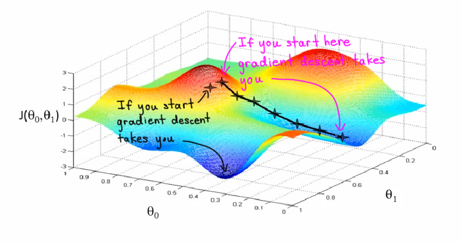

% Optimization in Data Science
% [Brian J. Mann](brian.mann@galvanize.com)
% June 13, 2016

## Objectives

* Know How Gradient Descent Works
* Use Gradient Descent to Optimize the Cost Function For Logistic Regression
* Know How Stochastic Gradient Descent Works
* Implement Stochastic Gradient Descent
* Know How Newton's Method Works
* Implement Newton's Method

## Agenda

* Morning
    1. What is Gradient Descent and why do we need it?
    2. Examples of gradient descent
    3. What can go wrong?
    4. Using Gradient Descent to solve logistic regression
* Afternoon
    1. Stochastic Gradient Descent
    2. Newton's Method

## Cost Functions

* Machine learning often involves fitting a model to test data
* The best fit is often determined using a *cost function* or *likelihood function*
    * Linear Regression: $$\displaystyle \sum (y_i - \beta^T \mathbf{x}_i)^2$$
    * Logistic Regression: $$\displaystyle \sum y_i \log g(\beta^T\mathbf{x}_i) + (1 - y_i)\log(1 - g(\beta^T\mathbf{x}_i))$$ $\left(g(z) = \frac{1}{1 + e^{-z}}\right)$

## Linear Regression

* The cost function $\displaystyle \sum (y_i - \beta^T \mathbf{x}_i)^2$ can be represented in matrix format:

$$|| \mathbf{y} - X\beta ||^2$$

* Has a closed-form solution for the minimum

$$\beta = (X^TX)^{-1}X^T\mathbf{y}$$

* Why is this infeasible sometimes?

## Logistic Regression

* The log-likelihood function $$\displaystyle \sum y_i \log g(\beta^T\mathbf{x}_i) + (1 - y_i)\log(1 - g(\beta^T\mathbf{x}_i))$$
has no such closed form for its maximum.
* How will you find the maximum?

## Ideas?

## Gradient Descent

* Algorithm for finding the minimum of a function
* Question: Can be used to find maxima by _____?

## Recall

* The *gradient* of a multivariate function $f(x_1, \ldots, x_n)$ is
$$ \nabla f(\mathbf{a}) = \left(\frac{\partial f}{\partial x_1}(\mathbf{a}), \ldots, \frac{\partial f}{\partial x_n}(\mathbf{a})\right)$$
* $\nabla f(\mathbf{a})$ points in the direction of greatest increase of $f$ at $\mathbf{a}$

## Gradient Descent

* Minimize $f$
* Choose:
    * a starting point $\mathbf{x}$
    * *learning rate* $\alpha$
    * threshold $\epsilon$
* Move in the direction of $-\nabla f(\mathbf{x})$:
    * Update $\mathbf{x} = \mathbf{x} - \alpha \nabla f(\mathbf{x})$
* If $\frac{|f(\mathbf{x}) - f(\mathbf{y})|}{|f(\mathbf{x})|} < \epsilon$, return $f(\mathbf{y})$ as the min, and $\mathbf{y}$ as the argmin

## Gradient Descent

* `alpha` is called the *step-size* or *learning rate*
    * If 'alpha' is too small, convergence takes a long time
    * If 'alpha' is too big, can overshoot the minimum

## Choosing Alpha

* If the value of $$\frac{|\nabla f(\mathbf{x}) - \nabla f(\mathbf{y})|}{|\mathbf{x}-\mathbf{y}|}$$ is bounded above by some number $L(\nabla f)$ then $$\alpha \leq \frac{1}{L(\nabla f)}$$ will converge.
* For example:
    * $f(x) = x^2$
    * $L(\nabla f) = 2$
    * $\alpha = 1/2$ will be the best value

## Adaptive Step Size

* Change $\alpha$ at each iteration
* Barzilai and Borwein, 1998
    * Suppose $\mathbf{x}_i$ is the value of $\mathbf{x}$ at the iteration $i$
    * $\Delta \mathbf{x} = \mathbf{x}_{i} - \mathbf{x}_{i-1}$
    * $\Delta g(\mathbf{x}) = \nabla f(\mathbf{x}_{i}) - \nabla f(\mathbf{x}_{i-1})$
    * At each step $$\alpha = \frac{\Delta g(\mathbf{x})^T \Delta \mathbf{x}}{||\Delta g(\mathbf{x})||^2}$$ is a good choice of $\alpha$

## Convergence Criteria

Choices:

* $\frac{|f(\mathbf{x}) - f(\mathbf{y})|}{|f(\mathbf{x})|} < \epsilon$
* Max number of iterations
* Magnitude of gradient $|\nabla f| < \epsilon$

## Gradient Ascent

* To maximize $f$, we can minimize $-f$
* Still use almost the same algorithm
    * Just replace $$\mathbf{x} = \mathbf{x} - \alpha \nabla f(\mathbf{x})$$ with $$\mathbf{x} = \mathbf{x} + \alpha \nabla f(\mathbf{x})$$

## Some Examples

* [Examples](http://vis.supstat.com/2013/03/gradient-descent-algorithm-with-r/)

## What Can Go Wrong

* Where do you think gradient descent fails?

## Example

## More Bad Things

* Need differentiable and convex cost/likelihood function
* Only finds local extrema
* Poor performance without feature scaling

## Back to Logistic Regression

* Trying to maximize the log-likelihood function
$$\ell(\beta) = \displaystyle \sum y_i \log g(\beta^T\mathbf{x}_i) + (1 - y_i)\log(1 - g(\beta^T\mathbf{x}_i))$$
* To use gradient ascent: need to compute $\nabla \ell(\beta)$

## More Logistic Regression

First, let's compute the derivative of the sigmoid function $g$:

{ width=200px }

## More Logistic Regression

* Using this and the chain rule, compute $\frac{\partial \ell}{\partial \beta_i}$

{ width=400px }

## More Logisitic Regression

* Simplifying:

{ width=350px }

## More Logisitic Regression

* This is what you'll use to update the value of $\beta$ in each iteration of gradient descent

# Stochastic Gradient Descent

## Why Not Regular Gradient Descent?

* Can you think of some problems with gradient descent as we learned it this morning?

## Problems with Gradient Descent

* Memory constrained
    * Need to store all data in memory
* CPU constrained
    * Cost function is a function of *all* data
* What if you are getting new data continuously?

## Solution

* Only use a single data point, or a small subset of your data, at in each step!

## Algorithm

* Same as gradient descent except **at each step compute the cost function by using just one observation**
* For example in linear regression, instead of computing the gradient of
$$\sum_i (y_i - \beta^T\mathbf{x}_i)^2$$
randomly select some $\mathbf{x}_i, y_i$ and compute the gradient of
$$ (y_i - \beta^T \mathbf{x}_i)^2$$

## Properties

* Faster than *batch* (regular) Gradient Descent on average
* Prone to oscillation around an optimum
* Only requires one observation in memory at once

## Variants

* Can use a small subset of your data instead of a single observations
    * "Minibatch" Stochastic GD
* "Online" Stochastic GD updates the model by performing a gradient descent step each time a new observation is collected

# Newton's Method

## What Is It?

* Optimization technique similar to gradient descent
* Uses a root-finding method applied to $f^{\prime}(x)$

## Algorithm in One Dimension

* Choose initial $x_0$
* While $f^{\prime}(x) > \epsilon$: $$x_{i+1} = x_i - \frac{f^{\prime}(x_i)}{f^{\prime\prime}(x_i)}$$

## Higher Dimensions

* $\mathbf{y}_{i+1} = \mathbf{y}_{i} - H(\mathbf{y}_i)^{-1}\nabla f(\mathbf{y}_i)$

( $H(\mathbf{a}) = \left[\frac{\partial f}{\partial x_i \partial x_j}(\mathbf{a})\right]$ is the *Hessian* matrix, the matrix of second partial derivatives at $\mathbf{a}$)

## Problems

* Hessian might be singular, or computation can be slow
* Can diverge with a bad starting guess
