# Machine Learning Intro

In Machine Learning, we design a system that can learn from data.

## Cost Functions

The general way machine learning algorithms work is by optimizing a cost function.

## Linear Regression

In the case of linear regression, the cost function we want to optimize is the residual sum of squares, which is as follows: 

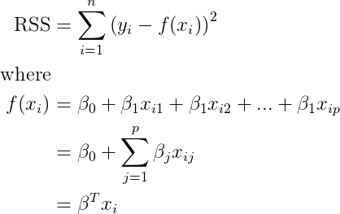

We're lucky in the case of linear regression that there is what we call a *closed form*. This is an equation we can use to directly find the optimal beta coefficients. For linear regression, we call this equation the Normal Equation:

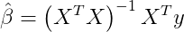

## Logistic Regression

With Logistic Regression we will be *maximizing* the likelihood function (instead of minimizing a cost function).

The likelihood is going to be a value from 0 to 1 that is created based on the idea of being probability of our chosen coefficients making the perfect model.

### Hypothesis Function

Let's start by looking at our hypothesis function. First recall the sigmoid function:

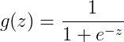

And here's our hypothesis function. This gives us a value from 0 to 1, which is our predicted probability that the datapoint belongs to the positive class.

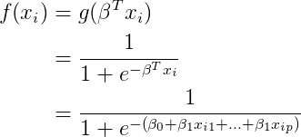

### Likelihood

First we calculate the probability that a given data point is predicted correctly.

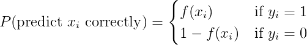

We can rewrite this as follows. Take a moment to convince yourself that this is equivalent. Try plugging in both 1 and 0 for y and look at the equation. Note that y is the true value so cannot take on any other values besides 0 and 1.

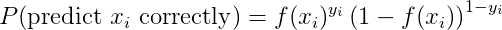

We are going to calculate the *likelihood* that we predict all the datapoints correctly. This is calculated by taking the product of all the individual likelihoods for each data point in our training set.

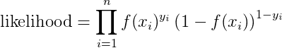

This is essentially the function we're trying to maximize. However, for computational reasons, we will be maximizing the log of this function instead. Maximizing the *log likelihood* is equivalent, but will make computations easier. One issue with calculating small probabilities with a computer is *numerical underflow*. Once the values get sufficiently small, they will be rounded to 0 and we will lose all information.

We use the following two log properties:

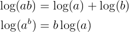

If we take the log of the likelihood function above, we get the following as our *log likelihood*:

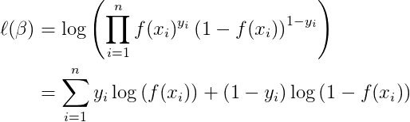

## Gradient Descent/Ascent

Gradient descent/ascent is an algorithm for solving optimization problems. In gradient descent, we would like to find the solution which minimizes the cost function. In gradient ascent (which is the case of logistic regression), we will be maximizing the likelihood. From this point on we'll just talk about gradient ascent.

The best way to visualize gradient ascent is to view a contour surface with hills. You start at some point. You'd like to find the highest point on the hill but you are blindfolded so you can't see where to go, you can just feel in every direction. Every step you take should be in the direction of the steepest slope up. Mathematically, we can find the slope by taking the *gradient* (this is like the derivative in multiple dimensions).

Here's a high level idea of the algorithm:

```
Gradient Ascent:
    Choose a starting point
    Repeat until incremental increase in likelihood is sufficiently small:
        Take a step in the direction of steepest slope (gradient) upwards
```

For completeness, here's *Gradient Descent*:

```
Gradient Descent:
    Choose a starting point
    Repeat until incremental decrease in cost is sufficiently small:
        Take a step in the direction of steepest slope (gradient) downwards
```

For our specific example of logistic regression, here's what our gradient ascent algorithm will look like:

```
Gradient Ascent
    Initialize your beta coefficients (generally choose 0)
    Repeat until incremental increase in likelihood is sufficiently small:
        beta <- beta + alpha * gradient
```

*alpha* is a parameter in our algorithm, generally called the *step size* or *learning rate*.

### Optimizing the learning rate

When using gradient descent, the choice of the learning rate alpha is important.

* If alpha is too small, it will take a really long time to converge.

* If alpha is too large, we'll actually end up overshooting the optimal value and keep getting further and further away! So in this case it will diverge!

    


### Gradient of the Likelihood

The only bit left is to calculate the gradient of the likelihood function. Here we'll really see the mathematical advantages of the sigmoid function.

First, let's just calculate the derivative of the sigmoid:

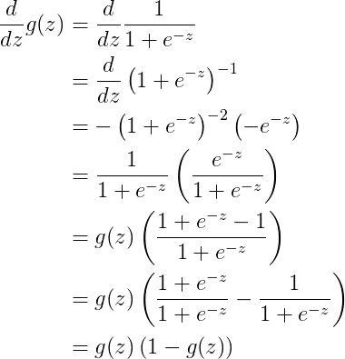

It works out really nicely!

To get the gradient, we need to take the partial derivative of the likelihood function for each coefficient (beta_j). Recall that the derivative of the log function `log(z)` is `1/z`.

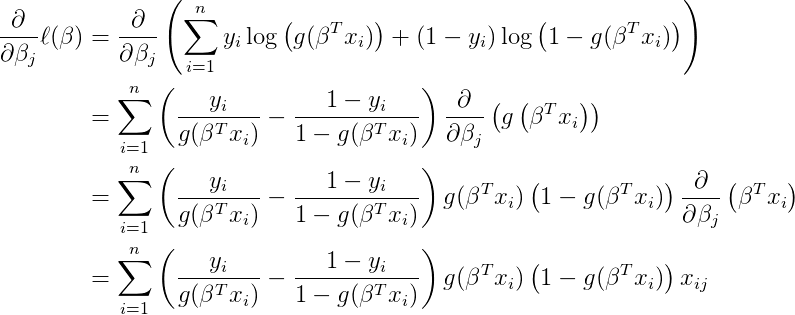

We can do some rearranging and simplifying.


This is what we'll use to update the coefficients in each iteration of gradient descent.


#### Resources
* [Andrew Ng's Lecture Notes](http://cs229.stanford.edu/notes/cs229-notes1.pdf)
* [Gradient Descent Animation](http://vis.supstat.com/2013/03/gradient-descent-algorithm-with-r/)

