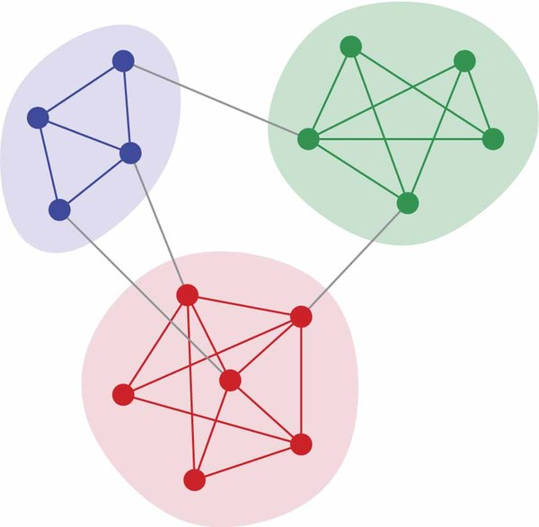

% Graphs
% [Erich Wellinger](erich.wellinger@galvanize.com)
% July 15th, 2016


## Morning Goals
* Motivation and Examples
* General Understanding of Graphs
* Terminology
* Importance of a node through various measures of centrality
* How to traverse a graph


## Examples


## Examples


## What is a Graph?
A Graph is an ordered pair $G = (V, E)$ such that $V$ is a set of **verticies** and $E$ is a set of **edges** or relations.  Each edge is a two element subset of $V$.


If an edge exists between two nodes $v_i$ and $v_j$ (i.e. $\{v_i, v_j\} \in E$), we say those nodes are *connected*.


## Terminology
* **Node / Vertex**: A node or vertex is a single point in a graph
* **Neighbors**: The *neighbors* of a node are the nodes that it is connected to.
* **Degree**: The *degree* of a node is the number of neighbors a node has (often denoted $k_i$).  In the case of a directed graph, the degree of a node is split into indegree and outdegree.
* **Walk**: A *walk* is a sequence of nodes and edges that connect them.  A walk is said to be *open* if the starting and ending nodes are different and *closed* otherwise.  The *length* of the walk is the number of edges.
* **Path**: A *path* is a walk where no node is crossed twice (called a *simple* walk).  A closed path is known as a *cycle*.


## Terminology
* **Connected**: A graph is *connected* if every pair of vertices is connected by some path (i.e. they are either directly connected by an edge(s) or there exists a walk between them)
* **Subgraph**: A *subgraph* is a subset of the nodes of a graph and all the edges between them.
* **Connected Component**: A *connected component* is a subgraph that is connected and which is connected to no additional vertices in the supergraph.
* **Graph Diameter**: The *diameter* of a graph is the largest number of vertices that much be traversed in order to get from one vertex to any other vertex.


## Types of Graphs
* **Directed Graph**: A *directed graph* is a graph where edges go in one direction (e.g. following someone on Twitter)
* **Undirected Graph**: A *undirected graph* is a graph where edges go in both directions (e.g. friending someone on FaceBook)
* **Weighted Graph**: In a *weighted graph* the edges have an associated weight (e.g. number of times a user retweeted another user)
* **Unweighted Graph**: In a *unweighted graph* the edges have no weight (or all edges are considered to have the same weight)
* **Bipartite**: A *bipartite graph* is a graph whose vertices can be divided into two disjoint sets such that every edge connects a vertex from one set to a vertex in the other set (e.g. a graph of actors and movies)


## Data Structures
There are a variety of ways to store the components of a graph in a data structure with the most common being...

* Adjacency Matrices
* Adjacency Lists


## Adjacency Matrices


## Adjacency List
Adjacency lists take up significantly less space and, if implemented using the Python `dict` data structures (see below), searching, adding, and removing nodes and edges is quick and efficient.

```python
edges = {'A': {'B': 2, 'D': 5, 'E': 5}, \
         'B': {'A': 2, 'D': 1}}
```

## Adjacency List


# Node Importance

## Centrality
* Measures of centrality roughly indicate the importance of a particular node
* Centrality is a formal way of analyzing networks to measure power and influence of each $v_i \in V$
* In terms of a social network, an actors influence often only extends up to two steps away and therefore their ability to influence the overall structure of the network is directly affected by their neighbors and the neighbors of their neighbors


## Degree Centrality
* Degree centrality defines an important node as being connected to a large number of other nodes
* We normalize the degree centrality by dividing by $|V| - 1$, this will make the degree centrality of a particular node be between 0 and 1
* Degree Centrality does not always capture the most “important” nodes such as those connecting different subgraphs


## Degree Centrality


## Degree Centrality


## Closeness Centrality
* In connected graphs there is a natural distance metric between all pairs of nodes, defined by the length of their shortest path
* This involves finding the shortest path between every pair of nodes in the network using Dijkstra’s algorithm (more on this in a minute)

$$C(x) = \frac{1}{\sum_y d(y,x)}$$

* $C(x)$: The centrality of node $x$
* $d(y,x)$: The distance of the shortest path between node $x$ and node $y$


## Closeness Centrality
* Thus, the more central a node is the lower its total distance from all other nodes
* Due to the overwhelming number of combinations of nodes in a graph, the calculation of closeness centrality is computationally expensive


## Betweenness Centrality
* We can also consider a node important if it controls the passage from one node to another, or presides over a communication bottleneck in social networking terms
* We quantify this with $C_b(v)$, which is the sum of fractions of shortest paths that pass through vertex $v$

$$C_b(v) = \sum_{s \ne v \ne t} \frac{\sigma_{st}(v)}{\sigma_{st}}$$

* $\sigma_{st}(v)$ is the # of shortest paths between $s$ and $t$ that pass through $v$
* $\sigma_{st}$ is the # of shortest paths between $s$ and $t$


## Betweenness Centrality
We would then normalize this centrality using the following equation:

$$normal(C_b(v)) = \frac{C_b(v)}{(N-1)(N-2)}$$

* $N$ is the number of nodes in the graph


## Betweenness Centrality


## Eigenvector Centrality
* Eigenvector centrality, $C_E$, is a measure of centrality that can identify so called “gray cardinals” who may not be identified when using metrics such as degree centrality, betweenness or closeness
    * e.g. a mob boss who intentionally isolates himself from any direct connections to a crime
* It considers a vector to be important if it has important neighbors, but doesn’t necessarily have to have high degree itself


## Eigenvector Centrality


## Eigenvector Centrality Algorithm
Can be thought of as a recursive version of degree centrality

1. Start by assigning a centrality score of 1 to all nodes ($v_i = 1, \forall v_i \in V$)
2. Recompute the scores of each node as a weighted sum of centralities of all nodes in a node's neighborhood:

$$v_i = \sum_{j \in V} A_{ij} * v_j$$

3. Normalize $v$ by dividing each value by the largest value
4. Repeat steps 2 and 3 until the values of v stop changing

This an iterative algorithm which requires iterating through all neighbors of a node to compute the weighted degree and thus is extremely computationally expensive and is thus not realistic to compute on very large networks.


## Dijkstra's Algorithm
* Way of identifying the shortest path between two nodes on a weighted graph and is run with an initial node and a goal node
* The resulting path will have the least cost between the two nodes

1. Start by assigning each node a tentative distance value – setting it to 0 for the initial node and $\infty$ for all other nodes
2. Keep a set of visited nodes which starts with just the initial node


## Dijkstra's Algorithm
3. For the current node, consider all the unvisited neighbors and calculate distance to the current node + distance from current node to the neighbor. If this is less than their current tentative distance, replace it with this new value
4. When all neighbors have been considered, mark the current node as visited. If the goal node has been marked visited, then the algorithm is finished and the shortest path has been found
5. Set the unvisited node marked with the smallest tentative distance as the next “current node” and go back to step 3


# Graph Traversal

## Breath First Search
* A Breath First Search consists of visiting all the neighbors of a node before visiting the neighbors of those neighbors
* This is done by using a First In, First Out (FIFO) queue
* For implementing in python we will utilize the `deque` object


## Breath First Search Code
```python
from collections import deque

def bfs_connected_components(graph, starting_node):
    '''
    Returns the connected component of a graph
    containing the starting_node
    '''
    visited = set()
    queue = deque([starting_node])
    while queue:
        node = queue.popleft()
        if node not in visited:
            visited.add(node)
            neighbors = graph[node]
            queue.extend(neighbors)
    return visited
```


## Breath First Search Code
```python
if __name__ == '__main__':
    graph = {'A': {'B', 'C'},
             'B': {'A', 'E'},
             'C': {'A', 'D', 'E'},
             'D': {'C', 'E'},
             'E': {'B', 'C', 'D'}}
    starting_node = 'A'
    target_node = 'E'
    print bfs_connected_components(graph, starting_node)
    print bfs_shortest_path_length(graph, starting_node,
                                   target_node)
    print bfs_shortest_path(graph, starting_node,
                            target_node)
```


# Community Detection

## Afternoon Goals
* Community Detection Applications
* Measure of the quality of a community
    * Modularity
    * Node Similarity
* Divide a graph into communities
    * Divisive Algorithm (Girvan and Newman)
    * Hierarchical Clustering (Agglomerative Algorithm)


## Community Quality
The general idea behind trying to quantify the “quality” of a community is that we would like to have the # of edges inside a community be greater than the # of edges between that community and others




## Modularity
* A high modularity signifies a “better” community (i.e. a community with high modularity will have dense connections between the nodes of the module, but sparse connections between nodes in a different module)
* We calculate this by taking the fraction of edges within a subgraph minus the fraction of edges within the subgraph if all edges were distributed randomly throughout the graph
* To be regarded as high modularity, we would expect the edge density to be higher than if they were just randomly assigned throughout the graph


## Randomizing Subgraph & Expected Edges
* We would like to ascertain what the "expected" number of edges between two nodes given a random distribution of connections
* First we will halve each edge (stub) in the graph yielding us $2m$ stubs (there were originally $m$ edges)
* We can then get the expected number of edges between nodes $v$ and $w$ like so:

$$\frac{k_v k_w}{2m}$$

* $k_v$ is the degree of node $v$


## Randomizing Subgraph


## Calculating Modularity

$$Q(G, C) = \frac{1}{2m} \sum_{c \in C} \sum_{i, j \in c} A_{ij} - \frac{k_i k_j}{2m}$$

where:

* $C$: the collection of communities
* $m$: number of edges in the graph
* $A_{ij}$: 1 if an edge connects $i$ and $j$, 0 otherwise
* $k_i$: degree of node $i$


# Node Similarity

## Node Similarity
We can say that two nodes are similar if they share many of the same neighbors

$$n_{ij} = \sum_k A_{ik} A_{kj}$$

* Node similarity is not normalized and fluctuates according to the degree of the nodes
* Usually measure the similarity with **Cosine Similarity** or dissimilarity with **Euclidean Distance**


## Node Dissimilarity: Euclidean Distance

$$d_{ij} = \sum_k (A_{ik} - A_{jk})^2$$

$$normal(d_{ij}) = \frac{d_{ij}}{k_i + k_j}$$

* $d_{ij}$ is the euclidean distance between $i$ and $j$
* $k_i$ is the degree node $i$


## Node Similarity: Cosine Similarity

$$\sigma_{ij} = \frac{n_{ij}}{\sqrt{k_i k_j}}$$

* $n_{ij}$ is the # of shared neighbors
* $k_i$ is the degree of node $i$


# Community Detection

## How to Divide a Graph
--                  |     Divisive      |      Agglomerative
--------------------|:-----------------:|:----------------------:
Approach            |     Top-Down      |        Bottom-Up
Starting Point      |       Graph       |    Individual Nodes
Community Formation |  Removing Edges   |   Iteratively merging
Technique           | Girvan and Newman | Hierarchical Clustering

Divisive is typically the more popular of these techniques


## Divisive (Girvan and Newman)
This algorithm extends the notion of vertex betweenness to the case of an edge, defining "edge betweenness" of an edge as the number of shortest paths between nodes that run along it

1. Compute betweenness for all edges
2. Remove edge with largest betweenness (high betweenness = many shortest paths traverse that edge)
3. Recalculate betweenness
4. Calculate modularity if new communities formed
5. Stop if average modularity is maximized (i.e. further iteration would reduce modularity).  Otherwise repeat from step 2


## Divisive (Girvan and Newman)


## Divisive (Girvan and Newman)
* **Note**: The betweenness must be recalculated for each path effected by the removal of an edge
* Severe errors will occur if this is not done. For instance, if two communities are connected through multiple edges there is no guarantee that **all** edges will have a high betweenness
* All we know is that at least one will have a high betweenness, and thus the other edges must be updated after each iteration


## Agglomerative Algorithm (Hierarchical Clustering)
Merge based on max similarity / minimum distance between elements from each of the two clusters

* We have to decide the cut-off for hierarchical clustering
* Hierarchy is by construction and not always sensible
* Good for networks that are hierarchical (social / biological)


## Graphs in Python
* `NetworkX`
    * Suitable for small graphs (up to ~10,000 vertices)
* `python-igraph`
    * Words for larger graphs (C code)
* `graph-tool`
    * Even larger graphs (heavily optimized C code)
    * Pain to install


## Sample `NetworkX` Code
Create a simple graph with 10 nodes and 18 edges:

```python
import networkx

g = networkx.generators.small.krackhardt_kite_graph()
# Number of Edges
g.number_of_edges()
# Number of Nodes
g.number_of_nodes()
# Get Adjacency List
g.adjacency_list()
# Get list of Edge Tuples
g.edges()

```

## Sample `NetworkX` Code
```python
# Get Adjacency Dict
dict((x, g.neighbors(x)) for x in g.nodes())

import matplotlib.pyplot as plt

# Plot our graph using Matplotlib
networkx.draw(g)
plt.show()
```
