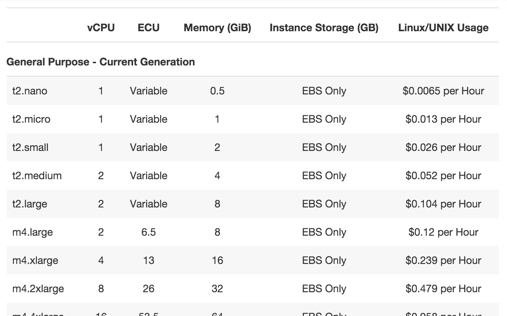
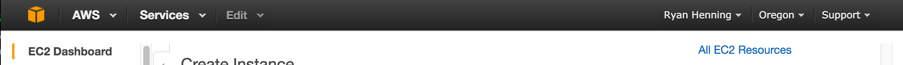
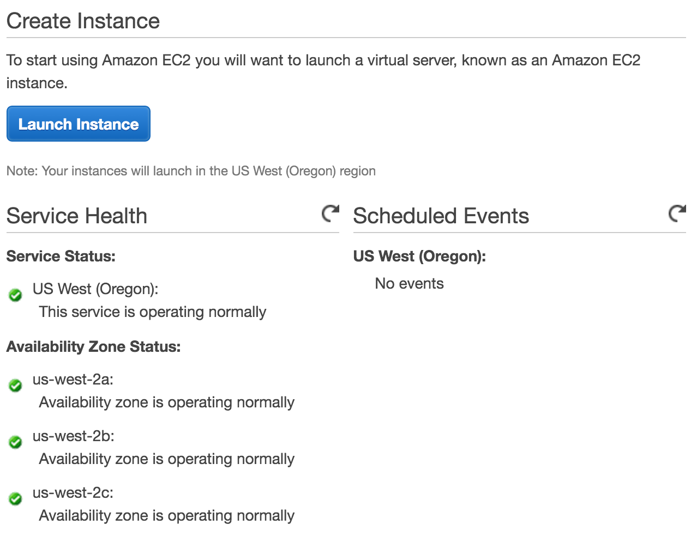
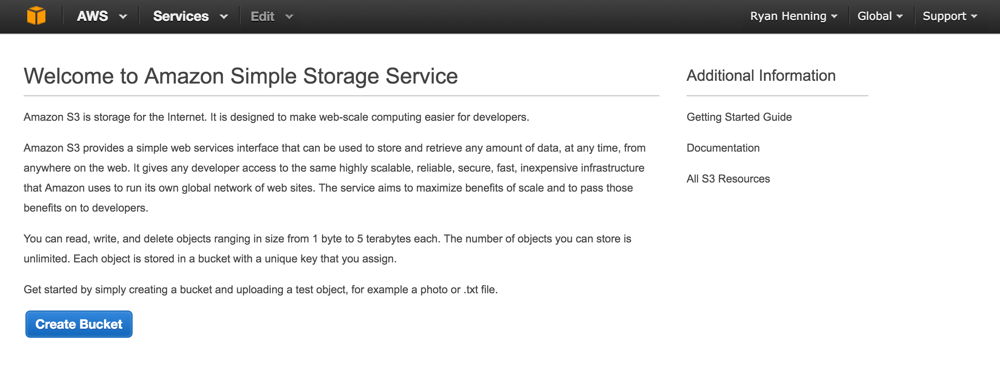

# Amazon Web Services (AWS)

These notes are to supplement the lecture. Don't worry about taking notes during the lecture; I'd rather you just listen and ask questions so that you know what's going on. These notes contain all the commands I'll use along the way, so there's no need to write them down yourself.

Also note, the following is how Ryan likes the use AWS. This is by no means the only way to do things; it's only how Ryan likes to do things! :)

## Outline:

- Intro to sh, bash, ssh, scp, sftp
- Intro to AWS EC2 options and pricing
- Create an AWS EC2 instance
- Access your EC2 instance
- Configure your EC2 instance:
  - customize the PS1 prompt
  - install/test Anaconda
  - use sftp
  - use Jupyter (over an ssh tunnel)
- Amazon Machine Image (AMI)
- Identity and Access Management (IMA)
- Amazon Simple Storage Service (S3)

## Intro to sh, bash, ssh, scp, sftp

`sh`
- just a program on your computer
- it's a command line interpreter, meaning that its job in life is to launch other programs based on user input
- located on most systems at `/bin/sh`
- called the "Bourne shell" (written by Stephen Bourne at Bell Labs in 1977)

`bash`
- created for the GNU project as a free replacement for `sh`
- called the "Bourne-again Shell" (bash)... haha right? get it the double meaning?
- located on most systems at `/bin/bash`

`ssh`
- "Secure Shell" (ssh)
- a secure version of `rsh`, i.e. "Remote Shell", `rsh` doesn't use any encryption/security of any kind
- `ssh` is very secure and is widely used as a safe way to access remote servers -- e.g. it is used extensively by AWS

`scp`
- "Secure Copy" (scp)
- recall: `cp` is the program you use to copy local files from one directory to another
- a version of `cp` that runs atop `ssh`

`sftp`
- "Secure FTP" (sftp)
- recall: `ftp` is for "file transfer protocol", a very old way to transfer files from computer-to-computer that doesn't employ any encryption/security of any kind
- a version of `ftp` that runs atop `ssh`

What is a "terminal" then?
- The terminal is the GUI program that hosts the shell.
- The terminal's job in life is to launch your shell (usually `bash`) and provide a window and keyboard IO to/from your shell (usually `bash`).
- As an experiment, configure your terminal to use the shell `/usr/bin/python`. Open new terminal window, and what happens?

## Intro to AWS EC2 options and pricing

AWS has a subservice named the "Elastic Compute Cloud" (EC2).

Basically, EC2 lets you deploy Virtual Private Servers (VPSs) easily and quickly. A VPS is a server running as a virtual computer and connected publicly to the internet. You choose the size of each VPS (#CPUs, #GBs of RAM, etc), and the number of VPSs you need, and EC2 creates and deploys them for you easy-squeezy.

The number and size of VPSs you need depends on your goal:
- Need to run a small website? Then create 1 small VPS on EC2 to run your web sever.
- Need to be Netflix? Then create 10,000 medium sized VPSs, put your custom Netflix software on them, and have EC2 deploy them.

As of March 30, 2016, here is a screenshot of the prices for some of the VPS sizes on EC2. See: [https://aws.amazon.com/ec2/pricing/]()



Note: As of March 30, 2016, Amazon offers a "Free Tier" for users and one of the perks is that you get 12 months of free `t2.micro` usage. See: [https://aws.amazon.com/free/]()

## Create an AWS EC2 instance

Decide where you want your instance to live (currently, you options are: N. Virginia, N. California, Oregon, Ireland, Frankfurt, Tokyo, Seoul, Singapore, Sydney, Sao Paulo).

Next, select that location in the EC2 dashboard.



Next, click the "Launch Instance" button.



Follow the steps:
- Choose "Amazon Linux 64-bit" as your OS.
- Be sure to choose the free size (`t2.micro` at the time of this writing).
- All other settings can be left as the default.
- When you've stepped through the configuration, click the final "Launch" button.


Before the instance is launched, you will be prompted to select an RSA key pair to install into your new instance. If you've never created an EC2 instance, you'll have to choose to "Create a new key pair". You can name it anything you want; I named my "awskey". If you create a new key pair here, be sure to download it before you move on. Take note of *where* you downloaded the key pair (e.g. to your *Downloads* folder, or wherever).

You'll be taken back to the EC2 Dashboard where you'll have to wait for about a minute for your instance to boot up. Go ahead and wait until it is running and says that "2/2 checks..." are complete.

**Optional:** Once the instance boots up and has been checked, select the instance, click "Actions", click "Instance Settings", and then click "Get System Log". Take note of the ECDSA key fingerprint. You'll need this later.

Take note of your new instances IP address. You'll need this later.

## Access your EC2 instance

In the remainder of this document, I'll use this all-caps word *IP_ADDRESS* to refer to *your* instance's IP address. When you see *IP_ADDRESS*, replace it with *your* instance's IP address before executing the command.

**Optional:** If you recorded the ECDSA key fingerprint in the optional step above, then execute `ssh -o FingerprintHash=md5 root@IP_ADDRESS`. That command will print a key fingerprint and prompt you to accept or reject it. If the printed fingerprint matches what you recorded in the section above, type `yes` and hit enter. If it doesn't match, then either you did something wrong *or* someone is trying to man-in-the-middle attach you. Either way, type `no` and hit enter.

Now, try the command `ssh root@IP_ADDRESS`. It will fail saying "Permission denied". Let's fix that.

In your terminal, navigate to where you stored your key pair that you downloaded in the section above. (Mine is in my home folder, and mine is named "awskey.pem".) Run the command `chmod 0600 awskey.pem` to make your key pair file readable ONLY BY YOU. This is important, because this file is essentially the password you'll use to sign-in to your EC2 instance. Be sure to keep this file to yourself; be especially careful not to commit this file to Github!

Okay, let's try again to `ssh` into our EC2 instance. Try this command `ssh -i ~/Desktop/awskey.pem root@IP_ADDRESS`. Did it work? It probably told you to use the user named "ec2-user" instead of "root". Fine, we'll do that.

We finally are ready to do this successfully. Run the command `ssh -i ~/Desktop/awskey.pem ec2-user@IP_ADDRESS`. That should work! You should now have a command-line (aka, a shell) access to your EC2 instance. Yay.

## Configure your EC2 instance:

We now have `ssh` access to our EC2 instance, but it is just a bare-bones computer (server) right now. Let's work on installing stuff and configuring stuff so that we can make this server (rather, VPS) useful.

### customize the PS1 prompt

If you want to use the PS1 prompt that Ryan users, run these commands:
- `wget https://raw.githubusercontent.com/acu192/bash_stuff/master/linux/Dotbashrc`
- `cat Dotbashrc >> .bashrc`
- `rm Dotbashrc`
- `exit`

Now re-`ssh` into your ECS instance.

### install/test Anaconda

The first step is to get the link to the most recent version of Anaconda for 64-bit Linux. At the time of writing, that link is [https://3230d63b5fc54e62148e-c95ac804525aac4b6dba79b00b39d1d3.ssl.cf1.rackcdn.com/Anaconda2-4.0.0-Linux-x86_64.sh]().

`ssh` into your ECS instance.

Run the following commands (replace commands with the most recent version of Anaconda for 64-bit linux):
- `wget https://3230d63b5fc54e62148e-c95ac804525aac4b6dba79b00b39d1d3.ssl.cf1.rackcdn.com/Anaconda2-4.0.0-Linux-x86_64.sh`
- `bash Anaconda2-4.0.0-Linux-x86_64.sh`
- `exit`

Now re-`ssh` into your EC2 instance.

Make sure the `python` command will launch Anaconda's version of Python. Run the command `which python` to be sure Anaconda is being used.

### use scp

`scp myfile ec2-user@IP_ADDRESS:project/`

The command above will copy the local file "myfile" to your EC2 instance into the directory "project" that lives on your EC2 instance.

`scp ec2-user@IP_ADDRESS:project/myfile .`

The command above will copy the remote file at "project/myfile" to the current directory of your local machine.

### use sftp

While `scp` works great, it is a very bare-bones command. We can use the `sftp` command to add more pizzazz. Rather, we'll use programs that user `sftp` under the hood.

First up, Cyberduck. Cyberduck is a great free program that can use sftp to connect to your EC2 instance and let you transfer and edit remote file with ease. See: [https://cyberduck.io/]()

Next up, OSX Fuse and SSHFS. Together these two programs can mount your remote EC2 instance's file system as a drive on your Mac. The mounted drive looks and works much like a Flash Drive, allowing you to drag-and-drop and edit remote files like they were local. See: [https://osxfuse.github.io/]()

Note: SSHFS requires you use the Terminal to mount your remote file system. To mount your EC2 instance's file system, run
- `sshfs ec2-user@IP_ADDRESS: ec2server -o IdentityFile=~/Desktop/awskey.pem -f`
- Note that the command above will appear to hang--that is normal and it will continue to hang until the remote file system is unmounted.
- To unmount your remote file system, right click the mounted drive and click "eject". That will make the command above terminate.

### use Jupyter (over an ssh tunnel)

Recall: When you launch Jupyter, it starts a local HTTP server that you can connect to locally in your browser. So... does that mean we can't connect to Jupyter if it's running on our EC2 instance?

We *can* still connect to Jupyter if it's running on our EC2 instance. We can do it safely too. We'll employ an awesome feature of `ssh`: TCP tunneling. Here's the new `ssh` command you'll need in order to configure a TCP tunnel to use and launch Jupyter: `ssh -L localhost:8888:localhost:8888 -i ~/Desktop/awskey.pem ec2-user@IP_ADDRESS`

Now, you can start Jupyter (on your EC2 instance), and connect to it like normal (on your local machine). Recall: the URL to use in your local browser is [http://localhost:8888/]().

### Conclusion

You now can use your EC2 instance much like it is your local machine! This gives the best of two worlds: (1) a powerful machine *in the cloud*, and (2) convenience to move around and develop/test from your laptop.

In conclusion, once you have a running (and configured) EC2 instance, here's what you'll do when you're ready to utilize your instance:
1. If you want to use Jupyter, SSH in using the command: `ssh -L localhost:8888:localhost:8888 -i ~/Desktop/awskey.pem ec2-user@IP_ADDRESS` and then start Jupyter.
2. If you want shell-access, SSH in using the command: `ssh -i ~/Desktop/awskey.pem ec2-user@IP_ADDRESS`
3. If you want to transfer files to/from your EC2 instance, use Cyberduck or SSHFS.

The three options above, when combined, ought to make your EC2 instance feel very close.

## Amazon Machine Image (AMI)

AMIs are re-configured VPS images that you can clone. This is usually more convenient than configuring your own image; e.g. we have a Data-Science-ready AMI that you can clone! See the morning sprint for details.

## Identity and Access Management (IMA)

We'll only use IMA enough to allow us to programmatically store things in S3. Here's what you need to do.

Steps:
1. Open the IMA console.
2. Create a user. Be sure to note the **Access Key Id** and the **Secret Access Key** because they will only be shown once! You will use these two keys in your program; they are essentially passwords that your program will use to sign-in to your AWS account.
3. Create a group, give the group the permission named "AmazonS3FullAccess".
4. Add the user created above to the group created above.

## Amazon Simple Storage Service (S3)

To motivate S3, `ssh` into your EC2 instance and run `df -h`. Notice how you've already used probably about 50% of your storage capacity, and you haven't even done much! So... we'll need a way to store stuff elsewhere. Enter S3...

S3 is cloud storage hosted and maintained by Amazon. The benefits are that there is no size limit; Amazon will store anything and everything you want, for a price. Another benefit is that Amazon will ensure your files are always accessible, backed-up, and secure. That's a load off our minds.

From your AWS dashboard, enter the S3 subservice. Let's create our first *S3 Bucket*. Click the "Create Bucket" button.



You must name your bucket. The name must be globally unique (usually you'll just prefix it with the name of your organization). Don't use periods or else you won't be able to use your bucket from python!

Here's a short python script that will upload a file from your local computer into your new S3 bucket:

```python
import boto
conn = boto.connect_s3(<Your Access Key Id>, <Your Secret Access Key>)
b = conn.get_bucket(<Your Bucket Name>)
o = b.new_key(<Name of New Bucket Object>)
o.set_contents_from_filename(<Name of a local file>)
```

Note: boto has many bugs. One that I've seen is that uploading a large file will make it fail. Make sure you have the most recent version of boto installed. (See: https://github.com/boto/boto/issues/621)
