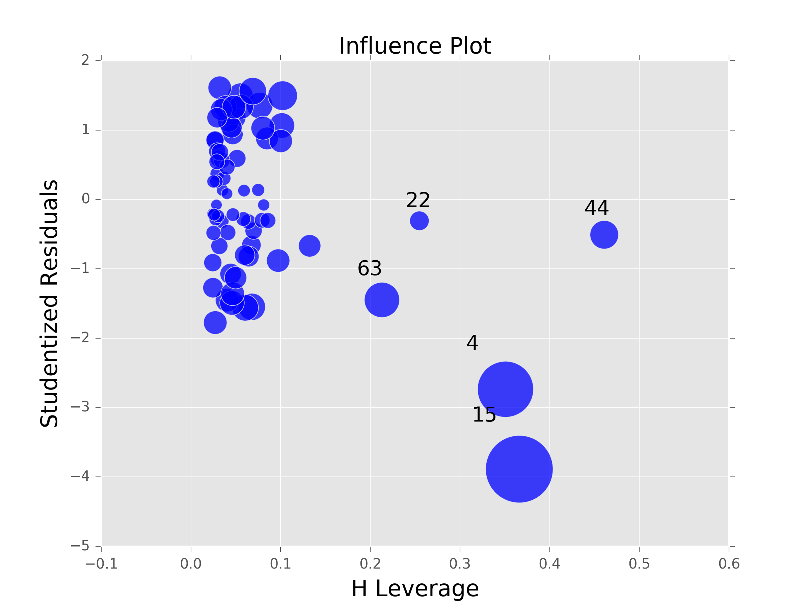

## General Terms


* TSS = Total Sum of Squares = $\sum (y_i - \bar{y})^2$
* RSS = Residual Sum of Squares = $\sum_{i=1}^n (y_i - \hat{y}_i)^2$
    * Somewhat of a meaningless number as it grows with $n$
* $R^2 = \frac{TSS - RSS}{TSS} = 1 - \frac{RSS}{TSS}$
    * We can think of the $R^2$ value as the proportion of variance explained
    * Gives us a nice interpretation and is independent from the scale of 1 (value always lies between 0 and 1)
    * $R^2$ has the downside that it doesn't factor in the number of features (i.e. your $R^2$ can only ever go up given additional features)
* AIC (Akaike Information Criterion)
    * Used as a relative estimate of the information lost when a given model is used to represent the process that generates the data
    * The lower the AIC the better when comparing models
    * Unlike $R^2$, AIC takes the complexity of the model into account
    * See the [wikipedia page](https://en.wikipedia.org/wiki/Akaike_information_criterion) for more information on how to calculate this statistic
* BIC (Bayesian Information Criterion)
    * Closely related to AIC
    * Lower BIC is better
    * See the [wikipedia page](https://en.wikipedia.org/wiki/Bayesian_information_criterion) for more information on how to calculate this statistic
* F-Statistic $= \frac{(TSS - RSS)/p}{RSS / (n - p - 1)}$
* RSE = Residual Standard Error = $\sqrt{RSS / (n-p-1)}$
    * where $n$ is the number of observations and $p$ is the number of predictors
    * The RSE is considered a measure of the *lack of fit* of the model
    * We can use the RSE to approximate the variance of the error terms, $Var(\epsilon) = \sigma^2$, which is used to calculate confidence intervals around our coefficients.  For example, the following could be used to calculate the standard error for a coefficient $\beta_i$, which in turn could be used to calculate a confidence interval...

$$SE(\hat{\beta}_i)^2 = \frac{\sigma^2}{\sum_{i=1}^n (x_i - \bar{x})^2}$$

$$\hat{\beta}_i \pm 2 \cdot SE(\hat{\beta}_i)$$

## Dummy Variables

### Predictors with two levels

If our predictor has only two levels we can simply create an indicator or *dummy variable* that takes on two possible numerical values.  For example, let's say we are looking at gender we might code it as follows:

$$x_i = \begin{cases}
    1 & \text{if $i$th person is female}, \\
    0 & \text{if $i$th person is male}
  \end{cases}$$

$$y_i = \beta_0 + \beta_1 x_i + \epsilon_i = \begin{cases}
    \beta_0 + \beta_1 + \epsilon & \text{if $i$th person is female}, \\
    \beta_0 + \epsilon & \text{if $i$th person is male}
\end{cases}$$

It is worth noting that the decision to codify females as 1 is arbitrary and has no effect on the regression fit.  It does, however, alter the interpretation of the coefficients.  In this case, the $\beta_1$ term indicates the expected change in $y_i$ from the male baseline holding all else equal.

### Predictors with more than two levels

Of course we aren't limited to only creating dummy variables for predictors with two levels.  Let's suppose we have a column indicating the ethnicity of a person and it takes on the values Asian, Caucasian, and African American (AA).  We could then dummy them like so:

$$x_{i1} = \begin{cases}
    1 & \text{if $i$th person is Asian}, \\
    0 & \text{if $i$th person is \textbf{not} Asian}
  \end{cases}$$

$$x_{i2} = \begin{cases}
  1 & \text{if $i$th person is Caucasian}, \\
  0 & \text{if $i$th person is \textbf{not} Caucasian}
\end{cases}$$

$$y_i = \beta_0 + \beta_1 x_{i1} + \beta_2 x_{i2} + \epsilon_i = \begin{cases}
    \beta_0 + \beta_1 + \epsilon & \text{if $i$th person is Asian}, \\
    \beta_0 + \beta_2 + \epsilon & \text{if $i$th person is Caucasian}, \\
    \beta_0 + \epsilon & \text{if $i$th person is AA}
\end{cases}$$

As we can see, the African American (AA) ethnicity fell into our baseline.  Therefore we can interpret the $\beta_1$ term as the expected change in $y_i$ from moving to the Asian ethnicity from the African American baseline holding all else equal.

It is important that at least one of these factors be dropped when dummying a multilevel predictor.  If this is not done we will experience multicollinearity because each category can be perfectly recreated from the others (more on this later).

---

```python
import pandas as pd
import numpy as np

df = pd.read_csv('data/balance.csv', index_col=0)

df['Married'] = df['Married'].map({'Yes': 1, 'No': 0})
df['Student'] = df['Student'].map({'Yes': 1, 'No': 0})

# We could also achieve this like so
df = pd.get_dummies(df, columns=['Married', 'Student', 'Ethnicity'], drop_first=True)
```

---

# Potential Problems with Linear Regression

1. Non-linearity of the response-predictor relationships
2. Correlation of error terms
3. Non-constant variance of error terms
4. Outliers
5. High-leverage points
6. Collinearity


### 1. Non-Linearity of the Data

We can check this assumption by looking at a *residual plot* of our model.  We do this by plotting the residuals $\epsilon_i = y_i - \hat{y}_i$ versus the predicted (or fitted) values $\hat{y}_i$ (in the case of multiple predictors).  We should expect to see no discernible pattern; the presence of a pattern may indicate a problem with our linear assumption.

![Example of non-linearity in residual plot[^1]](./imgs/non-linearity.png){width=500px}

### 2. Correlation of the Error Terms

An important assumption when creating a linear regression model is that the error terms, $\epsilon_1, \epsilon_2, ..., \epsilon_n$, are uncorrelated.  But what does that actually mean?

If our errors are uncorrelated, then the fact that $\epsilon_i$ is positive tells us nothing about the value of $\epsilon_{i+1}$.  What happens if this assumption is violated?

Recall that our standard errors are based off of this assumption.  If in fact there is correlation among the error terms, then the estimated standard errors will tend to underestimate the true standard errors.  As a result, confidence and prediction intervals will be narrower than they should be as well as leading us to p-values that are smaller than they should be.  This can then lead us to erroneously conclude that a feature is statistically significant.

When might this assumption be violated?  This assumption will often be violated in the case of time series data.

![Varying levels of residual correlation[^2]](./imgs/correlation-error.png){width=500px}

### 3. Non-constant Variance of Error Terms

When running a linear regression model we would like to have the presence of *homoscedasticity* (i.e. constant variance of the error terms), Var($\epsilon_i$) = $\sigma^2$

One can identify non-constant variances in the errors, or *heteroscedasticity*, from the presence of a *funnel shape* in the residual plot.  When faced with this issue, one approach is to alter your response variable using a concave function such as log $Y$ or $\sqrt{Y}$ which will work to shrink the larger values of $Y$, thereby reducing the heteroscedasticity of the model.

![Example of heteroscedasticity (left) and homoscedasticity (right)[^3]](./imgs/heteroscedasticity.png){width=500px}

We should also check the normality of the residuals when running a linear regression.  It is common to check this assumption using a [QQ-Plot](https://en.wikipedia.org/wiki/Q%E2%80%93Q_plot) to compare the quantiles of our residuals against the quantiles of a normal distribution.  If the resulting points roughly fall along the line $y = x$ we know that we have satisfied the normality assumption.  If they don't, we might try transforming the response to see how that affects the QQ-Plot.  The following is code for achieving this using `statsmodels`:

```python
import matplotlib.pyplot as plt
import statsmodels.api as sm

# Assuming y and X have already been loaded in
model = sm.OLS(y, X).fit()

fig, ax = plt.subplots(figsize=(8, 6))
fig = sm.qqplot(model.resid, line='45', fit=True, ax=ax)
```

{width=400px}

### 4. Outliers

An *outlier* is a point for which $y_i$ is far from the value predicted by the model.  An outlier that does not have an unusual predictor value often has little effect on the resulting least squares fit.  This outlier could, however, have a significant effect on the RSE and $R^2$.

Residual plots are useful for identifying outliers.  It can be hard, however, to determine how large of a residual is large enough to qualify for being an outlier.  To address this problem, instead of plotting the residuals, we can plot the *studentized residuals*, computed by dividing each residual $e_i$ by its estimated standard error.  Observations whose studentized residuals are greater than 3 in absolute value are possible outliers.

Why do we need to studentize our residuals?  The residuals, unlike the errors, *do not all have the same variance*: the variance decreases as the corresponding x-value gets farther from the average x-value.  When fitting a regression with least squares, the endpoints have more influence over the slope of the line.  This can also be seen because the residuals at endpoints depend greatly on the slope of a fitted line, while the residuals at the middle are relatively insensitive to the slope.

All that studentizing the residuals does is divide the residual by its standard error, thereby putting all the residuals on an even scale.  Many software applications will calculate these for you (e.g. `statsmodels` provides the `model.outlier_test()` method; see below), so knowing how to manually calculate them isn't really necessary.  If you are feeling adventurous, read on.

How do we calculate studentized residuals?  We first need to calculate the hat matrix, $H$, which is the orthogonal projection onto the column space of the design matrix ($X$):

$$H = X(X^T X)^{-1} X^T$$

The *leverage* $h_{ii}$ is the $i$th diagonal entry in the hat matrix.  The variance of the $i$th residual is then:

$$var(\hat{\epsilon}_i) = \sigma^2 (1 - h_{ii})$$

The corresponding **studentized residual** is then:

$$t_i = \frac{\hat{\epsilon}_i}{\hat{\sigma} \sqrt{1 - h_{ii}}}$$

where $\hat{\sigma}$ is an appropriate estimate of $\sigma$.  As an example of an *internally studentized residual* we have:

$$\hat{\sigma}^2 = \frac{1}{n - m} \sum_{j=1}^n \hat{\epsilon}_j^2$$

where $m$ is the number of parameters in the model.


![Least Squares fit with and without outlier and corresponding residual plots[^4]](./imgs/studentized-residuals.png)


#### Studentized Residuals in StatsModels

Let's say we have a design matrix `X` and an array of targets `y`...

```python
import pandas as pd
import numpy as np
import statsmodels.api as sm
import matplotlib.pyplot as plt

# Need to add intercept for statsmodels
X = sm.add_constant(X)

# Create an fit our Ordinary Least Squares model
model = sm.OLS(y, X).fit()

# NOTE: model.outlier_test() will return a Dataframe if y and X are a series
# and Dataframe respectively.  Otherwise a numpy array will be returned
student_resid = model.outlier_test()['student_resid']

plt.scatter(y, student_resid)
plt.title('Studentized Residuals of Model')
```


---

### 5. High Leverage Points

While outliers are points which have an unusual response $y_i$ given the predictor $x_i$, points with high leverage are observations with unusual values for $x_i$.  Inclusion of points with high leverage can have a drastic effect on the least squares fit to the data.  It is cause for concern if the least squares line is heavily affected by just a couple of observations because any problems with these points may invalidate the entire fit.

Points with high leverage can easily be identified in the case of a simple linear regression.  Identifying these points can become quite difficult in the case of a multiple linear regression model because each individual feature can be within the range of accepted values for that feature but the combination of all features can constitute a high leverage point.

To quantify an observations leverage, we compute the *leverage statistic* (which is also used to calculate the studentized residuals).  An observations leverage statistic $h_i$ is always going to fall between $1/n$ and $1$ and the average leverage for all the observations is always equal to $(p + 1)/n$.  If a given observation has a leverage statistic that greatly exceeds $(p+1)/n$, then we may suspect this point of having high leverage.

Another option is plotting the leverage of points vs. the studentized residuals.

---

```python
import statsmodels.api as sm
import matplotlib.pyplot as plt

# Load in the credit_card dataset from statsmodels
df = sm.datasets.ccard.load_pandas().data

# Pop out income as our target
y = df.pop('INCOME')

# Need to add intercept for statsmodels
X = sm.add_constant(df)

model = sm.OLS(y, X).fit()

fig, ax = plt.subplots(figsize=(8,6))
fig = sm.graphics.influence_plot(model, ax=ax)
```

---

{width=400px}

### 6. Collinearity

Collinearity refers to the situation in which two or more predictor variables are closely related to one another.  For example, let's say we had health data and one feature was the sex of the patient and another was whether that patient had previously given birth.  It's clear that these features are collinear because having given birth necessarily tells us the sex of the patient.

The presence of collinearity can pose problems in the regression context because it can be difficult to separate out the individual effects of collinear variables on the response.  In addition, collinearity will cause our standard error to grow, thereby shrinking out t-statistic.  This means that the *power* of the hypothesis test---the probability of correctly detecting a *non-zero* coefficient---is reduced by collinearity.

One way of identifying collinearity is to look at the correlation matrix.  Unfortunately this doesn't always work though because it's possible for a feature to be collinear with a combination of other features, but not be collinear with any one of them.  This is referred to as *multicollinearity*.  Instead, a better way of accessing multicollinearity is to compute the **variance inflation factor** (VIF).

Intuitively speaking, the VIF of a particular feature is the amount of that feature's variance that is contained by any of our other features.  If a feature is collinear with some other feature, then we should be able to recreate that information using our other features.  The smallest possible value for VIF is 1, which indicates the complete absence of collinearity.  As a rule of thumb, a VIF value that exceeds 5 or 10 indicates a problematic amount of collinearity.

The VIF for each variable can be computed using the formula:

$$VIF(\hat{\beta}_j) = \frac{1}{1 - R_{X_j | X_{-j}}^2}$$

where $R_{X_j | X_{-j}}^2$ is the $R^2$ from a regression of $X_j$ onto all of the other predictors.

The following code will calculate the VIF scores for each column of a feature array using `sklearn` as the estimator (**NOTE**: This can also be done in `statsmodels` using `from statsmodels.stats.outliers_influence import variance_inflation_factor`):

---

```python
from sklearn.linear_model import LinearRegression

def vif(X):
    ''' Returns VIF values for each column of the input array '''
    vif_arr = []
    lin_model = LinearRegression()
    for col in range(X.shape[1]):
        lin_model.fit(np.delete(X, col, axis=1), X[:, col])
        r2 = lin_model.score(np.delete(X, col, axis=1), X[:, col])
        vif_arr.append(1 / (1 - r2))
    return np.array(vif_arr)
```

---

Once we have identified which features are collinear, we can safely drop them out in an iterative fashion because we know that the information contained in those features is represented in the remaining matrix.  Care should be taken to drop one feature at a time as this could affect the remaining VIF scores.

Suppose we are working with the Balance dataset and are concerned with using `Income`, `Limit`, and `Rating` as our feature set.  The resulting VIF scores for these three predictors would be `[   2.68746074,  161.19332277,  160.70791807]`.  If we drop `Limit` from our feature space, the resulting VIF scores are now `[ 2.67578965,  2.67578965]`.


<!-- Citations -->
[^1]: An Introduction to Statistical Learning page 93
[^2]: An Introduction to Statistical Learning page 95
[^3]: An Introduction to Statistical Learning page 96
[^4]: An Introduction to Statistical Learning page 97
