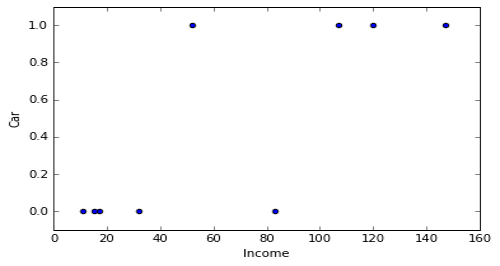

% Logistic Regression & ROC
% [Miles Erickson](miles.erickson@galvanize.com)
% September 23, 2016

## DSI Standards: Logistic Regression

* Place logistic regression in the taxonomy of ML algorithms
* Explain the key similarities and differences between logistic and linear regression
* Implement and interpret a logistic regression model in scikit-learn
* Use the odds ratio to interpret the coefficients of linear regression
* Thoroughly explain ROC curves

## Binary Classification - Problem Motivation

Common examples of classification problems:

* detecting spam emails
* identifying potentially fraudulent transactions
* predicting the probability of default on a loan
* determining whether someone has a disease

## Binary Classification - Mathematical Description

* Classifier model: a mapping between your feature space and a finite set
* Binary classifier: maps X to y in {0, 1}
* Example
    * Features: GPA [1.3, 4.0], SAT score [600, 2400]
    * Target: Not admitted {0}, Admitted {1}
* Binary classifiers can generalize to multiple classes

## Your turn: plot a dataset

| income  |  car  |
|---------|-------|
| 11      | 0     |
| 17      | 0     |
| 32      | 1     |
| 83      | 0     |
| 147     | 1     |
| 55      | 0     |
| 67      | 1     |
| 52      | 1     |
| 15      | 1     |

## Plot: income, car

## Logistic Regression - Introduction
* Baseline model for classification (predicting probability)
* Estimates probability that an observation is in a given
category based on the observation’s features
  * Regression step estimates the probability
  * Classification step rounds the probability to 0 or 1
