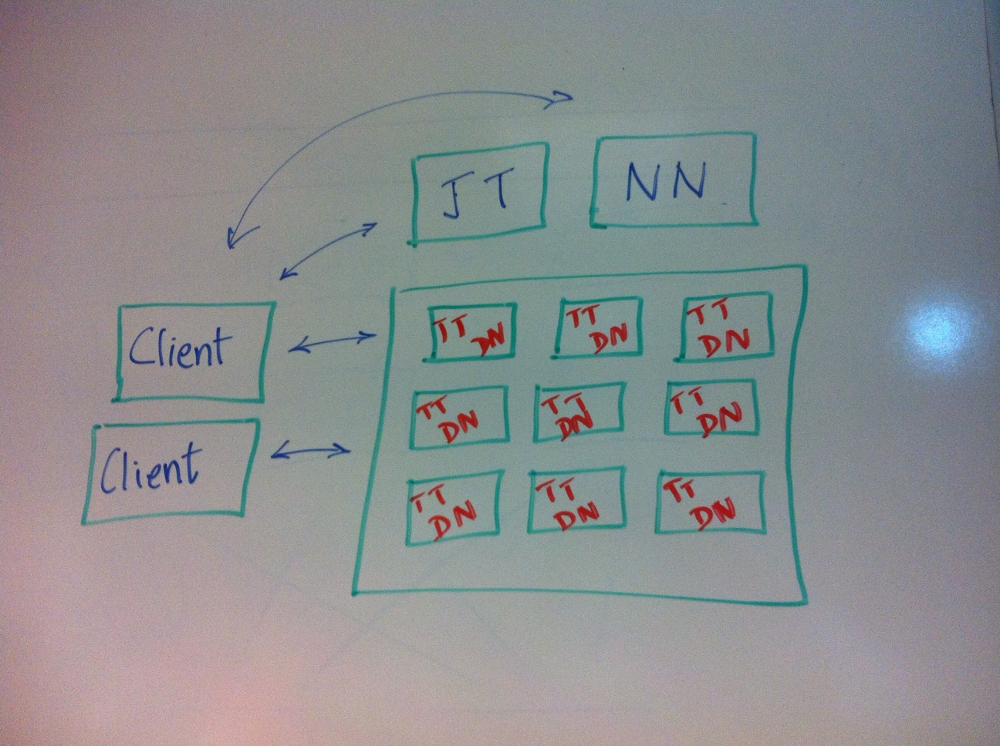
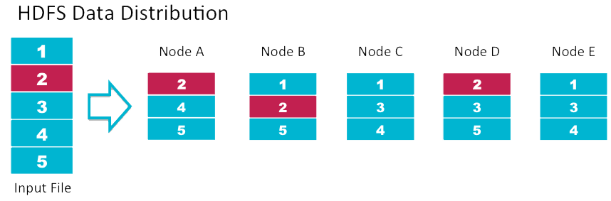
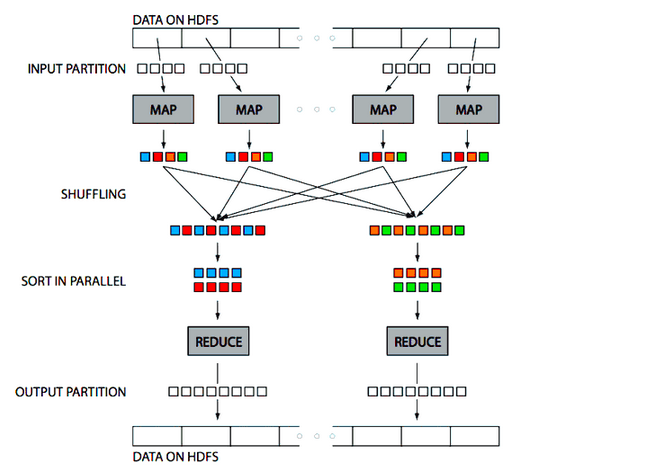

<!-- 
The ipynb was auto-generated from markdown using notedown.
Instead of modifying the ipynb file modify the markdown source. 
-->


Hadoop: MapReduce and HDFS
==========================

Objectives
----------

By the end of this class, we will be able to:

- Explain how HDFS stores large files on a cluster so that they are
  resilient to disk and machine failure, using blocks and replication.

- Explain how it enables MapReduce to process Big Data stored on HDFS
  while minimizing network traffic using data locality.

- Decide when Hadoop is an appropriate solution for our data
  processing needs.

- Create MapReduce jobs using MRJob to process large data sets. 

- Chain together multi-step MapReduce jobs to translate sophisticated
  sequential algorithms to work on distributed systems.

- Speed up MapReduce jobs using map-only jobs and counters. 

Why Hadoop
==========

Big Data Problem
----------------

We have a 100 TB of sales data that looks like this:

ID    |Date          |Store  |State |Product   |Amount
--    |----          |-----  |----- |-------   |------
101   |11/13/2014    |100    |WA    |331       |300.00
104   |11/18/2014    |700    |OR    |329       |450.00

What If
-------

What are some of the questions we could answer if we could process this huge data set?

- How many transactions were there by store, by state?

- How many transactions were there by product?

- How many transactions were there by week, month, year?

- How many transactions were there by store, state, product, month?

- How much revenue did we make by store, state?

- How much revenue did we make by product?

- How much revenue did we make by week, month, year?

- How much revenue did we make by store, state, product, month?

Statistical Uses
----------------

Why are these interesting?

- These questions can help us figure out which products are selling
  in which markets, at what time of the year.

- Using statistical algorithms such as linear regression or random forests we
  can predict sales.

What kinds of sales can we predict?
  
- How much of each product will sell in each store next week.

- How much of each product to stock in inventory.

- If there are any large-scale trends.

- If there are any blips in the data.

Engineering Problem
-------------------

To answer these questions we have to solve two problems:

- Store 100 TB of data

- Process 100 TB of data

Here is our starting point:

- To solve this problem we have been provided with 1000 commodity Linux servers.

- How can we organize these machines to store and process this data.

Hadoop Intro
============

Hadoop
------

Hadoop is a cluster operating system. It is made up of:

- HDFS, which coordinates storing large amounts of data on a
  cluster.

- MapReduce which coordinates processing data across a cluster of
  machines.

Google Papers
-------------

Hadoop, HDFS, and MapReduce are open source implementations of the
ideas in these papers from Google and Stanford.

- Paper #1: [2003] The Google File System     
    <http://research.google.com/archive/gfs-sosp2003.pdf>

- Paper #2: [2004] MapReduce: Simplified Data Processing on Large Clusters    
    <http://research.google.com/archive/mapreduce-osdi04.pdf>

- Paper #3: [2006] Bigtable: A Distributed Storage System for Structured Data
    <http://static.googleusercontent.com/media/research.google.com/en/us/archive/bigtable-osdi06.pdf>


Doug Cutting
------------


Hadoop Cluster
--------------

Subsystem  |Master Node        |Worker Node
---------  |-----------        |-----------
HDFS       |NameNode           |DataNode
MapReduce  |JobTracker         |TaskTracker




Hadoop Analogy
--------------

System     |Analogy
------     |-------
Hadoop     |Cluster Operating System
HDFS       |Cluster Disk Drive
MapReduce  |Cluster CPU

- Hadoop clusters are made up of commodity Linux machines.

- Each machine is weak and limited.

- Hadoop combines these machines.

- The Hadoop cluster is bigger and more powerful than the individual
  machines.


HDFS
----



HDFS Notes
----------

- HDFS breaks up large files into 128 MB blocks.

- The system stores 3 replicas of each block.

- When a machine goes down the NameNode daemon makes the DataNode
  daemons rereplicate the lost bocks.

Pop Quiz
--------

<details><summary>
Q: In this picture how many machines can crash before we lose data?
</summary>
Any 2 machines can crash without HDFS losing data.
</details>

<details><summary>
Q: If a machines crashes, the system rereplicates the lost blocks, and
then the machine rejoins the cluster. What happens to the block replication
count?
</summary>
1. Some blocks will now be over-replicated.
<br>
2. The NameNode will randomly remove replicas of the over-replicated
   blocks to preserve the default 3x replication factor.
</details>

MapReduce
---------



MapReduce Notes
---------------

How does MapReduce work?

- The developer provides mapper and reducer code.

- The mapper function transforms individual records and attaches a key to each record.

- All the records with the same key end up on the same reducer.

- For each key the reduce function combines the records with that key.

Which machines run mappers and which run reducers?

- The JobTracker tries to run the mappers on the machines where the
  blocks of input data are located.

- This is called data locality--ideally, the mapper does not need to
  pull data across the network.

- The reducers are assigned randomly to machines which have memory and
  CPUs currently available.

Pop Quiz
--------

<details><summary>
Q: How many mappers does each job get?
</summary>
1. One mapper per block of data.
<br>
2. Large files get more mappers, small files get fewer.
</details>

<details><summary>
Q: How many reducers does each job get?
</summary>
1. This is configured by the programmer.
<br>
2. By default each job gets one reducer.
</details>

<details><summary>
Q: Suppose I want to find out how many sales transactions are in a
data set for each state. What key should the mapper output?
</summary>
1. The mapper should output *state* as the key, and *1* as the value.
<br>
2. This will ensure that all the records for a specific state end up
   on the same reducer.
<br>
3. The reducer can then add up the *1*s to get the total number of
   transactions.
</details>


MapReduce Using MRJob
=====================
- Hadoop is technically a Java library from Apache. You really don't want to use it in Java (too much boilerplate code required).
- MRJob is a Python wrapper around Hadoop created by Yelp (luckily for you). It makes your life a lot easier.
 


Sales Data
----------

Here is the sales data we are going to analyze. 

    %%writefile sales.txt
    #ID    Date           Store   State  Product    Amount
    101    11/13/2014     100     WA     331        300.00
    104    11/18/2014     700     OR     329        450.00
    102    11/15/2014     203     CA     321        200.00
    106    11/19/2014     202     CA     331        330.00
    103    11/17/2014     101     WA     373        750.00
    105    11/19/2014     202     CA     321        200.00

Transactions By State
---------------------

Q: How many transactions were there for each state?

- Create the `SaleCount.py` file.

        %%writefile SaleCount.py
        from mrjob.job import MRJob
        class SaleCount(MRJob):
            def mapper(self, _, line):
                if line.startswith('#'):
                    return
                fields = line.split()
                state = fields[3]
                yield (state, 1)
            def reducer(self, state, counts): 
                yield state, sum(counts)
        if __name__ == '__main__': 
            SaleCount.run()

- Run it locally.

        !python SaleCount.py sales.txt > output.txt

- Check the output.

        !cat output.txt

Pop Quiz
--------

<details><summary>
Q: Suppose instead of counting transactions by state we want to count
transactions by store. What should we change in the code above?
</summary>
1. Replace `state = field[3]` with `store = field[2]`
<br>
2. Replace `yield (state, 1)` with `yield (store, 1)`
</details>

<details><summary>
Q: Suppose instead of counting transactions we want to find total
revenue by state. What should we change in the code above?
</summary>
1. Add `amount = float(fields[5])` 
<br>
2. Replace `yield (state, 1)` with `yield (state, amount)`
</details>

Using MapReduce For Statistics
------------------------------

- Using MapReduce we can calculate statistics for any factors.

- Our factor or condition becomes the key.

- The parameter that we want to calculate the statistic on becomes
  the value.

- The reducer contains the logic to apply the statistic.

- The statistic can be sum, count, average, stdev, etc.

Using MRJob for Word Count
--------------------------

Q: Count the frequency of words using MRJob.

- Create an input file.

        %%writefile input.txt
        hello world
        this is the second line
        this is the third line
        hello again

- Create the `WordCount.py` file.

        %%writefile WordCount.py
        from mrjob.job import MRJob
        import re
        WORD_RE = re.compile(r"[\w']+")
        class WordCount(MRJob):
            def mapper(self, _, line):
                for word in WORD_RE.findall(line):
                    yield word.lower(), 1
            def reducer(self, word, counts): 
                yield word, sum(counts)
        if __name__ == '__main__': 
            WordCount.run()

- Run it locally.

        !python WordCount.py input.txt > output.txt

- Check the output.

        !cat output.txt

Word Count Notes
----------------

- WordCount is used as a standard distributed application

- For a large number of words it is not solvable on a single machine

- A large corpus can require more storage than the disk on a single
  machine

- A large vocabulary can require more memory than on a single machine.

- WordCount generalizes to other counting applications: such as
  counting clicks by category.

MapReduce Abstractions
======================

Why Hive and Pig
----------------

- Instead of writing MapReduce programs what if we could write SQL.

- Hive and Pig let you write MapReduce programs in SQL-like languages.

- These are then converted to MapReduce on the fly.

- We will look at Spark SQL later, which fills the same niche.

Hive Example
------------

```sql
SELECT user.*
FROM user
WHERE user.active = 1;
```

Hive
----

- Hive was developed at Facebook.

- It translates SQL to generate MapReduce code.

- Its dialect of SQL is called HiveQL.

- Data scientists can use SQL instead of MapReduce to process data.

Pig Example
-----------

```pig
user = LOAD 'user';
active_user = FILTER user BY active == 1;
dump active_user;
```

Pig
---

- Pig was developed at Yahoo.

- It solves the same problem as Hive.

- Pig uses a custom scripting language called PigLatin instead of SQL.

- PigLatin resembles scripting languages like Python and Perl.

- Pig is frequently used for processing unstructured or badly formed
  data.

Advanced MapReduce Applications
================================

Combiner
--------

- Sometimes the mapper can reduce the records before it sends them out
  to the reducer.
  
- What is the advantage of this? It reduces the disk footprint for the
  map output. Also it saves network bandwidth.

- The *combiner* if specified is the reducer that the mapper uses to
  reduce the data locally.

- A reducer can only be used as a combiner if it is commutative and associative.

Transactions By State Using Combiner
------------------------------------

Q: How many transactions were there for each state?

- Create the `SaleCountFast.py` file.

        %%writefile SaleCountFast.py
        from mrjob.job import MRJob
        class SaleCountFast(MRJob):
            def mapper(self, _, line):
                if line.startswith('#'):
                    return
                fields = line.split()
                state = fields[3]
                yield (state, 1)
            def combiner(self, state, counts): 
                yield state, sum(counts)
            def reducer(self, state, counts): 
                yield state, sum(counts)
        if __name__ == '__main__': 
            SaleCountFast.run()

- Run it locally.

        !python SaleCountFast.py sales.txt > output.txt

- Check the output.

        !cat output.txt

Pop Quiz
--------

<details><summary>
Q: Can we use the reduce function as a combiner if we are calculating
the total transaction revenue per state?
</summary>
Yes.
</details>

<details><summary>
Q: Can we use the reduce function as a combiner if we are calculating
the average transaction revenue per state? </summary>
1. No we cannot.
<br>
2. This is because average is non-associative.
</details>


Using Map-Only Job To Clean Data
--------------------------------

Q: Write an ETL application that extracts all the `CA` sales records.

- This only requires transforming records, without consolidating them.

- Any time we don't have to consolidate records we can use a *Map
  Only* job.

- Create the `SaleExtract.py` file.

        %%writefile SaleExtract.py
        from mrjob.job  import MRJob
        from mrjob.step import MRStep
        class SaleExtract(MRJob):
            def mapper_extract(self, _, line):
                if line.startswith('#'): return
                fields = line.split()
                state = fields[3]
                if state != 'CA': return
                yield (state, line)
            def steps(self):
                return [
                    MRStep(mapper=self.mapper_extract)
                ]
        if __name__ == '__main__': 
            SaleExtract.run()

- Run it locally.

        !python SaleExtract.py sales.txt > output.txt

- Check the output.

        !cat output.txt

Map-Only Applications
---------------------

Here are some other applications of map-only jobs.

- Web-crawler that finds out how many jobs are on Craigslist for a
  particular keyword.

- Application that maps property addresses to property back-taxes by
  scraping county databases.

Pop Quiz
--------

<details><summary>
Q: Do map-only applications shuffle and sort the data?
</summary>
1. No they do not shuffle and sort the data.
<br>
2. Map-only jobs immediately output the data after it is transformed
   by map.
</details>

Counters
--------

Q: Count how many transactions there were in California and Washington.

- One way to solve this problem is to use a MapReduce application we
  did before.

- However, if we have a fixed number of categories we want to count we
  can use counters.

- If we use counters we no longer need a reduce phase, and can use a
  map-only job.
  
- MapReduce has a limit of 120 counters.

- So this cannot be used to count frequencies for an unknown number of
  categories.

- Create the `SaleCount1.py` file.

        %%writefile SaleCount1.py
        from mrjob.job  import MRJob
        from mrjob.step import MRStep
        class SaleCount1(MRJob):
            def mapper_count(self, _, line):
                if line.startswith('#'): return
                fields = line.split()
                state = fields[3]
                if state == 'CA':
                    self.increment_counter('State', 'CA', 1)
                if state == 'WA':
                    self.increment_counter('State', 'WA', 1)
            def steps(self):
                return [
                    MRStep(mapper=self.mapper_count)
                ]
        if __name__ == '__main__': 
            SaleCount1.run()

- Run it locally.

        !python SaleCount1.py sales.txt > output.txt

- There should not be any output. The counter values were printed when
  the job was executed.

        !cat output.txt

Counter Notes
-------------

- Counters can be incremented in both the map and the reduce phase.

- Counter values from all the machines participating in a MapReduce
  job are aggregated to compute job-wide value.

- Counter values are printed out when the job completes and are also
  accessible on the Hadoop Web UI that stores job history.

- Counters are have a group name and a counter name.

- Group names help organize counters.

- Here is how we increment a counter:
  `self.increment_counter(group_name, counter_name, 1)`

Pop Quiz
--------

<details><summary>
Q: SalesStrategy Inc employs 100,000 part-time sales partners to sell
their products. The salespeople get monthly bonuses based on the
number of transactions they ring up. Should SalesStrategy use counters
to calculate these bonuses? Why or why not?
</summary>
1. Instead of counters they should use a regular MapReduce counting
   application.
<br>
2. Counters are only appropriate if the number of categories is fixed
   and is about 100.
<br>
3. While the Hadoop admin can configure the system to support more
   counters than 120, this increases intra-cluster network traffic,
   and is not recommended.
</details>

Map-Only Job Observations
-------------------------

- Map-only jobs are the multi-machine equivalent of the
  multi-threading and multi-processing exercises we did earlier.

- Like our multi-threading and multi-processing applications, map-only
  jobs break up a larger problem into smaller chunks and then work on
  a particular chunk.

- Any time we have a problem where we don't need to reconcile or
  consolidate records we should use map-only jobs.

- Map-only jobs are much faster than regular MapReduce jobs.

Pop Quiz
--------

<details><summary>
Q: Why are map-only jobs faster than regular MapReduce jobs?
</summary>
1. The map phase is perfectly parallelizable.
<br>
2. Map-only jobs don't have a shuffle-and-sort or reduce phase, which
   tend to be the bottleneck for regular MapReduce jobs.
</details>

Chaining Jobs Together
----------------------

Q: Find word frequencies and sort the result by frequency. 

- This requires running two MapReduce jobs.

- The first job will calculate word frequencies.

- The second job will sort them.

- This can be accomplished in MRJob by chaining multiple jobs together
  as steps.

- Create `MostUsedWords.py`.

        %%writefile MostUsedWords.py
        from mrjob.job  import MRJob
        from mrjob.step import MRStep
        import re

        WORD_RE = re.compile(r"[\w']+")

        class MostUsedWords(MRJob):

            def mapper_get_words(self, _, line):
                for word in WORD_RE.findall(line):
                    yield (word.lower(), 1)

            def reducer_count_words(self, word, counts):
                count_sum = '{cnt:03d}'.format(cnt=sum(counts))
                yield (count_sum, word)

            def reducer_sort(self, count, words):
                for word in words:
                    yield (word, count)

            def steps(self):
                return [
                    MRStep(mapper=self.mapper_get_words,
                           reducer=self.reducer_count_words),
                    MRStep(reducer=self.reducer_sort)
                ]

        if __name__ == '__main__':
            MostUsedWords.run()

- Run it locally.

        !python MostUsedWords.py input.txt > output.txt

- Check the output.

        !cat output.txt

MapReduce Streaming API
-----------------------

- Why are we left-padding the amount with zeros? 

- MRJob is a wrapper around the MapReduce Streaming API.

- The MapReduce Streaming API converts all intermediate types to strings for comparison.

- So `123` will be smaller than `59` because it starts with `1` which
  is less than `5`.
  
- To get around this in MRJob if we want our data to sort numerically
  we have to left-pad the numbers with zeros.

Pop Quiz
--------

<details><summary>
Q: How can we find out which state had the highest sales total revenue?
</summary>
1. We can chain together two jobs.
<br>
2. The first one calculates revenue per state.
<br>
3. The second sorts the result of the first step by revenue.
</details>

Sorting Sales Data
------------------

Q: Find the total sales per state and then sort by sales to find the
state with the highest sales total.

- We can use a multi-step MRJob to do this.

- Sort sales data using two steps.

        %%writefile SaleCount.py
        from mrjob.job  import MRJob
        from mrjob.step import MRStep
        import numpy as np
        class SaleCount(MRJob):
           
            def mapper1(self, _, line):
                if line.startswith('#'):
                    return
                fields = line.split()
                amount = float(fields[5])
                state = fields[3]
                yield (state, amount)

            def reducer1(self, state, amounts):
                amount = '{amt:07.2f}'.format(amt=sum(amounts)) 
                yield (state, amount)
            
            def mapper2(self, state, amount):
                yield (amount, state)

            def reducer2(self, amount, states):
                for state in states: 
                    yield (state, amount)
            
            def steps(self):
                return [
                    MRStep(mapper=self.mapper1, reducer=self.reducer1),
                    MRStep(mapper=self.mapper2, reducer=self.reducer2)
                ]
        if __name__ == '__main__': 
            SaleCount.run()

- Run it locally.

        !python SaleCount.py sales.txt > output.txt

- Check the output.

        !cat output.txt
