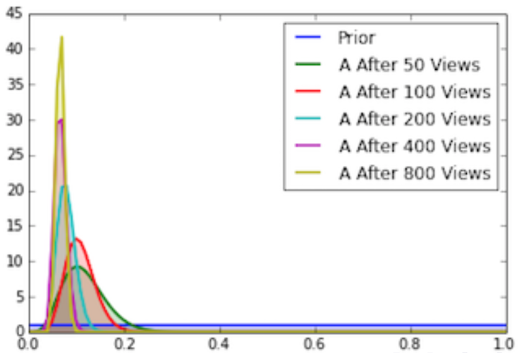
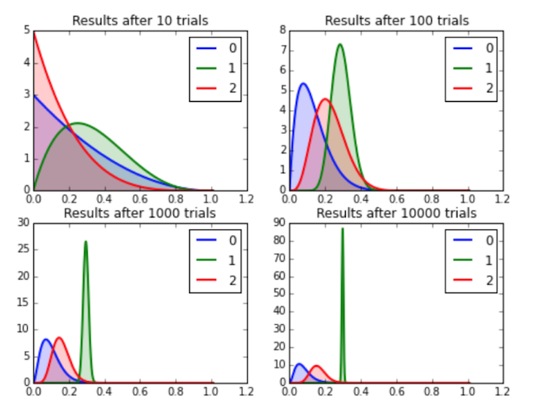

% Multi-Arm Bandit
% [Erich Wellinger](erich.wellinger@galvanize.com)
% May 27th, 2016

## Goals

Morning objectives:

* Overview of Frequentist A/B testing
* Overview of Bayesian A/B testing
* Review of Bayes' Theorem and Conjugate Priors
* Determining whether $CTR_A$ is better than $CTR_B$ through Code


## Frequentist A/B Testing
How do frequentist A/B tests work?

\pause

* Run all experiments and observe the data

\pause

* Significance of the result depends on how many experiments you run ($N$ is a parameter)

\pause

* Does **not** tell you how likely it is that A is better than B, just that you are confident A *is* better than B at some significance.


## Bayes Theorem
$$Pr(\theta | y) = \frac{Pr(y | \theta)Pr(\theta)}{Pr(y)}$$

* $Pr(\theta | y)$: Posterior Probability
* $Pr(y | \theta)$: Likelihood of Observations
* $Pr(\theta)$: Prior Probability
* $Pr(y)$: Normalizing Constant


## Beta Distribution
$$\frac{p^{\alpha - 1}(1 - p)^{\beta - 1}}{B(\alpha, \beta)}$$

* $p$: conversion rate (between 0 and 1)
* $\alpha$, $\beta$: shape parameters
    * $\alpha$ = 1 + number of conversions
    * $\beta$ = 1 + number of non-conversions
* Beta Function ($B$) is a normalizing constant
* $\alpha = \beta = 1$ gives the *uniform distribution*


## Binomial Distribution (likelihood)
$${n \choose k} p^k (1-p)^{n-k}$$

* $p$: conversion rate (between 0 and 1)
* $n$: number of visitors
* $k$: number of conversions


## Conjugate Priors
$$\begin{aligned}
posterior &\propto prior * likelihood \\
beta &\propto beta * binomial \\
&= \frac{p^{\alpha - 1}(1 - p)^{\beta - 1}}{B(\alpha, \beta)} * {n \choose k} p^k (1-p)^{n-k} \\
&\propto p^{\alpha - 1}(1 - p)^{\beta - 1} * p^k (1-p)^{n-k} \\
&\propto p^{\alpha + k - 1}(1 - p)^{\beta + n - k - 1}
\end{aligned}$$

Result is a beta distribution with parameters $\alpha$ = $\alpha + k$ and $\beta$ = $\beta + n - k$


## Bayesian A/B Testing
How do Bayesian A/B tests work?

\pause

* Update your knowledge of the experiment each time you run it (replace prior with posterior based on observed data)

\pause

* Stop the test at any time and have a result, although running it longer will generally give more accurate results

\pause

* Be able to say how *likely* it is that A is better than B


## Bayesian Example on CTR of Site A



## Is $CTR_A$ better than $CTR_B$ through Code!
```python
num_samples = 10000

A = np.random.beta(1 + num_clicks_A,
                   1 + num_views_A - num_clicks_A,
                   size=num_samples)

B = np.random.beta(1 + num_clicks_B,
                   1 + num_views_B - num_clicks_B,
                   size=num_samples)

# Probability that A wins:
print np.sum(A > B) / float(num_samples)
```

----

## Goals

Afternoon objectives

* Introduction to Multi-Arm Bandits
* Use Cases of Multi-Arm Bandits
* Zen and the Art of Minimizing Regret
* Overview of Common Strategies
    * Epsilon-Greedy
    * Softmax
    * UCB1
    * Bayesian Bandit
* Other forms of Multi-Arm Bandits


## Example Scenario
* You work for a company that is testing out a new version of it's website
\pause
* After running for an afternoon, version B appears to be performing slightly better
\pause
* After running for two days, version B is performing better with a statistically significant p-value of 0.04.  Do you stop the test or keep running it?


## Exploration vs. Exploitation
* **Exploration**: Trying out different options to try and determine the reward associated with the given approach (i.e. acquiring more knowledge)


* **Exploitation**: Going with the approach that you believe to have the highest expected payoff (i.e. optimizing decisions based on existing knowledge)


## Traditional A/B testing
* Start with pure *exploration* in which groups A and B are assigned equal number of users


* Once you think you have determined the better option, switch to pure *exploitation* in which you stop the experiment and send all users to the better performer


## Pitfalls
* Equal number of observations are routed to A and B for a preset amount of time or iterations


* Only after that preset amount of time or iterations do we stop and use the better performer


* Waste time (and money!) showing users the site that isn't performing as well


## Multi-Arm Bandit Approach
* Shows a user the site that you think is best *most* of the time (exactly how is dictated by the strategy chosen)

\pause

* As the experiment runs, we update the belief about the true CTR (Click Through Rate)

\pause

* Run for however long until we are satisfied the experiment has determined the better site

\pause

* Balances *exploration* and *exploitation* rather than doing only one or the other


## Origins
* The problem originated with a gambler standing in front of a row of slot machines (referred to as "one-armed bandits")


* The agent has to decide which machines to play, how many times to play each machine, and it which order


* Each bandit will provide a reward from a unknown distribution


* Objective is to maximize the sum of rewards earned through a series of lever pulls


## Use Cases
* Traditional A/B testing


* Budget allocation among competing projects


* Clinical trials investigating effects of treatments on patient losses


* Adaptive routing efforts to minimize delays on a network


* Reinforcement learning


## Fun Fact
"Originally considered by Allied scientists in World War II, it proved so intractable that, according to Peter Whittle, the problem was proposed to be dropped over Germany so that German scientists could also waste their time on it."


## Multi-Armed Bandit Model
The model is given by a set of real distributions $B = \{R_1, \dots , R_K\}$, where each distribution is associated with the a reward delivered by one of the $K \in \mathbb{N}^+$ levers.

We will let $\mu_1, \dots, \mu_K$ be the mean values associated with these reward distributions.

The gambler plays one lever per round and observes the associated reward.  The goal is to maximize the sum of the collective rewards, or alternatively minimize the agent's **regret**


## Zen and the Art of Minimizing Regret
The regret $p$ that an agent experiences after $T$ rounds is the difference between the reward sum associated with an optimal strategy and the sum of collected rewards...

$$p = T \mu^* - \sum_{t=1}^{T} \hat{r}_t$$

* $\mu^*$ is the maximal reward mean, $\mu^* = {max}_k \{\mu_k\}$
* $\hat{r}_t$ is the reward at time $t$
* **Regret** is simply a measure of how often you choose a suboptimal bandit.  We can think of this as the cost function we are trying to minimize


## Zero-Regret Strategy
* A *zero-regret strategy* is a strategy whose average regret per round $p/T$ tends to zero when the number of rounds played tends toward infinity


* Interestingly enough, a zero-regret strategy *does not* guarantee you will never choose a sub-optimal outcome, but rather guarantees that, over time, you will tend to choose the optimal outcome


# Strategies


## Epsilon-Greedy
* **Explore** with some probability $\epsilon$ (often 10%)


* All other times we will **exploit** (i.e. choose the bandit with the best performance so far)


* After we choose a given bandit we update the performance based on the result.


## UCB1 (Upper Confidence Bound)
For the UCB1 algorithm we will choose whichever bandit that has the largest value.  The value associated with bandit $A$ would be given by...

$$p_A + \sqrt{\frac{2 log N}{n_A}}$$

* $p_A$ = the conversion rate of bandit $A$
* $n_A$ = number of times bandit $A$ has been played
* $N$ = total number of times any bandit has been played


## Softmax
For the softmax algorithm we will choose the bandit randomly in proportion to its estimated value.  For example, the proportion that bandit $A$ is chosen out of bandits $A$, $B$, and $C$ is given by...

$$\frac{e^{p_A/\tau}}{e^{p_A/\tau} + e^{p_B/\tau} + e^{p_C/\tau}}$$

$\tau$ is a choosen parameter that controls the 'randomness' of the choice, usually around 0.001


## Bayesian Bandit
The Bayesian bandit algorithm involves modeling each of our bandits with a beta distribution with the following shape parameters:

* $\alpha$ = 1 + number of times bandit has won
* $\beta$ = 1 + number of times bandit has lost

We will then take a random sample from each bandit's distribution and choose the bandit with the highest value.


## Bayesian Bandit



## Contextual Bandit
* Like in a normal multi-arm problem, an agent must choose between arms during each iteration


* Before making the choice, the agent sees a d-dimensional feature vector (context vector), associated with the current iterations state


* The agent uses the context vector as well as the history of past rewards to choose the arm to play in the current iteration


* Over time, the aim is for the agent to learn how the context vectors relate to the associated rewards so as to pick the optimal arm
