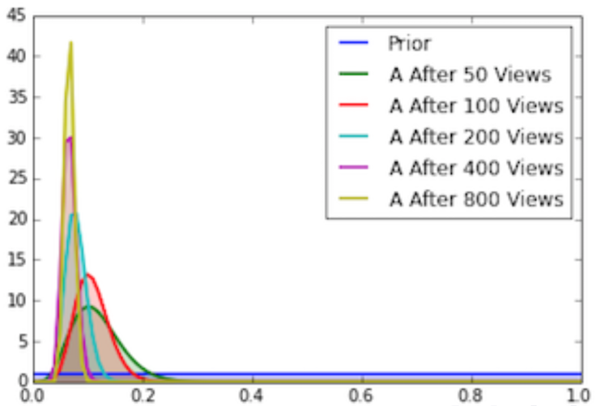
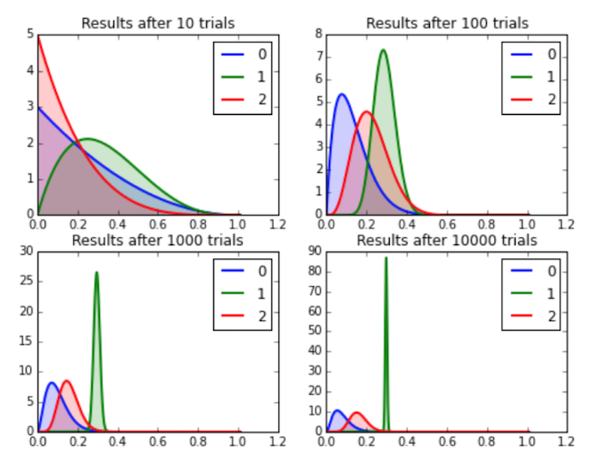

### Goals
* Overview of A/B testing in a frequentist mindset
* Overview of A/B testing in a bayesian framework
* Review Bayes Theorem
* Introduction to Multi-Arm Bandits
* Use Cases for Multi-Arm Bandits
* Zen and the Art of Minimizing Regret
* Overview of Common Strategies
    * Epsilon-Greedy
    * Softmax
    * UCB1
    * Bayesian Bandit
* Other forms of Multi-Arm Bandits

---

### Frequentist A/B Testing
When running a frequentist A/B test we will run all experiments and observe the data for a set amount of time (i.e. you choose the number of iterations of the experiment $N$ that you will perform and thus we have $N$ as a parameter).  This framework **will not** tell you how likely it is that A is better than B, just that you have some confidence that A *is* better than B at a certain significance.


### Bayes Theorem

Bayes Theorem gives us a nice mechanism for updating the probability of a given event given new observations.  This provides us a perfect mechanism for intelligently running an A/B test that dynamically responds to information as the test runs.  As a reminder, Bayes Theorem is given by...

$$Pr(\theta | y) = \frac{Pr(y | \theta)Pr(\theta)}{Pr(y)}$$

* $Pr(\theta | y)$: Posterior Probability
* $Pr(y | \theta)$: Likelihood of Observations
* $Pr(\theta)$: Prior Probability
* $Pr(y)$: Normalizing Constant

Bayes theorem states that the **posterior** is proportional to the product of the **prior** and the **likelihood**.  If using the beta distribution as the prior and the posterior, we would use the binomial distribution as the likelihood update.  Below is the definition of each of these distributions as a refresher...

##### Beta Distribution

$$\frac{p^{\alpha - 1}(1 - p)^{\beta - 1}}{B(\alpha, \beta)}$$

* $p$: conversion rate (between 0 and 1)
* $\alpha$, $\beta$: shape parameters
    * $\alpha$ = 1 + number of conversions
    * $\beta$ = 1 + number of non-conversions
* Beta Function ($B$) is a normalizing constant
* $\alpha = \beta = 1$ gives the *uniform distribution*

##### Binomial Distribution (likelihood)

$${n \choose k} p^k (1-p)^{n-k}$$

* $p$: conversion rate (between 0 and 1)
* $n$: number of visitors
* $k$: number of conversions

### Conjugate Priors
As a quick refresher let's take a look at how the prior (beta distribution) interacts with the likelihood (binomial distribution) to result in a new, updated posterior (beta distribution).  Using the above definitions of the distributions we have that...

$$\begin{aligned}
posterior &\propto prior * likelihood \\
beta &\propto beta * binomial \\
&= \frac{p^{\alpha - 1}(1 - p)^{\beta - 1}}{B(\alpha, \beta)} * {n \choose k} p^k (1-p)^{n-k} \\
&\propto p^{\alpha - 1}(1 - p)^{\beta - 1} * p^k (1-p)^{n-k} \\
&\propto p^{\alpha + k - 1}(1 - p)^{\beta + n - k - 1}
\end{aligned}$$

We can see that the end result is going to be a beta distribution with these shape parameters:

* $\alpha$ = $\alpha + k$
* $\beta$ = $\beta + n - k$

Thus we can use this mechanism to dynamically update our knowledge of the experiment each time we run an iteration.  This allows us to stop the test at any time and have a result, although running for longer will generally give more accurate results.  We can also say how *likely* it is that A is better than B given this framework.

### How a Distribution Changes
Assuming we have a uniform prior (i.e. $\alpha$ and $\beta$ are both initialized as 1) we start off with a flat line indicating we have no idea as to what the true CTR (Click Through Rate) is.  As we run more iterations of the experiment we see that the shape of the distribution will morph to become more concentrated around the true CTR.




### Is $CTR_A$ better than $CTR_B$ through Code!
Given we have been running a particular A/B test in a Bayesian setting we have some values for both versions A and B of the page.  We have values for number of clicks (`num_clicks_A` and `num_clicks_B`) and the number of views (`num_views_A` and `num_views_B`) and we want to know the probability that page A is a better version than B.  Would could do this like so...

```python
num_samples = 10000

A = np.random.beta(1 + num_clicks_A,
                   1 + num_views_A - num_clicks_A,
                   size=num_samples)

B = np.random.beta(1 + num_clicks_B,
                   1 + num_views_B - num_clicks_B,
                   size=num_samples)

# Probability that A wins:
print np.sum(A > B) / float(num_samples)
```

---

# Multi-Arm Bandits

### Example Scenario

You work for a company that would like to test out a new version of their website in the hopes that it will drive more conversions and ultimately more profit.  Two versions of the website are created and you are tasked with setting up an A/B test to determine which one is better.  You randomly direct visitors to either A or B and track whether they convert or not.  After running the experiment for an afternoon, version B appears to be doing slightly better but is it statistically significant?  After running it for two days you are seeing that version B is performing better with a statistically significant p-value of 0.04.  Do you stop the test or continue running it?

What if these two days were on a Tuesday and a Wednesday when most of your traffic occurs on a weekend, do you keep the test running?  When do you decide to pick one version of the site and stick with it, because in reality directing people to a site that performs worse is money lost.  This is the prime use-case for using a **multi-arm bandit** approach; effectively balancing *exploitation* vs. *exploration*.

* **Exploration**: Trying out different options to try and determine the reward associated with the given approach (i.e. acquiring more knowledge)
* **Exploitation**: Going with the approach that you believe to have the highest expected payoff (i.e. optimizing decisions based on existing knowledge)

The way that traditional A/B testing treats these two concepts is to first start with pure *exploration* in which you assign equal numbers of users to Group A and Group B.  Once you think you have determined the better performing approach you switch to pure *exploitation*, in which you stop the experiment and send all your users to the more successful version of your site.


### How Does This Differ From Traditional A/B Testing?
Traditional A/B testing as we saw before suffers from multiple pitfalls including...

* Equal number of observations are routed to A and B for a preset amount of time or iterations
* Stop the test and use the better site
* Waste time showing users the site that isn't performing as well (i.e. throw money in the trash)

This differs from what the multi-arm bandit approach offers us by showing a user the site that you think is best most of the time (how exactly this is determined is given by the algorithm used which we will see shortly).  As we run the experiment we will update the belief about the true CTR (Click Through Rate) of that particular site.  From here we will rinse and repeat until we are satisfied that the experiment has determined the better site.


### Origins
Like many statistical optimization problems, the notion of using a multi-arm bandit approach comes straight from gambling.  The problem originated with a gambler standing in front of a row of slot machines (referred to as "one-armed bandits") and has to decide which machines to play, how many times to play each machine, and in which order to play them.  When played, each machine will provide a reward from a probability distribution specific to that machine.  The objective then, is to maximize the sum of rewards earned through a series of lever pulls.[^1]


### Use Cases
* A/B testing different versions of a website or marketing template
* Modeling the problem of managing research projects in a large organization.[^2]  Given a fixed budget, you must allocate resources among competing projects, whose properties are only partially known at the time of allocation, but whose payoff may become better understood as time passes.
* Clinical trials investigating the effects of different treatments on patient losses
* Adaptive routing efforts for minimizing delays in a network
* The trade-off associated with choosing between exploration and exploitation can also be faced in the realm of *reinforcement learning* (do I try new things that might work or keep sticking with the best performing strategy I've already tried?)

Originally considered by Allied scientists in World War II, it proved so intractable that, according to Peter Whittle, the problem was proposed to be dropped over Germany so that German scientists could also waste their time on it.[^4]


### The Multi-Armed Bandit Model
The multi-armed bandit can be seen as a set of real distributions $B = \{R_1, \dots , R_K\}$, where each distribution is associated with the a reward delivered by one of the $K \in \mathbb{N}^+$ levers.  We will let $\mu_1, \dots, \mu_K$ be the mean values associated with these reward distributions.

The gambler plays one lever per round and observes the associated reward.  The objective its to maximize the sum of the collected rewards.  The regret $p$ after $T$ rounds is defined as the expected difference between the reward sum associated with an optimal strategy and the sum of the collected rewards...

$$p = T \mu^* - \sum_{t=1}^{T} \hat{r}_t$$

Where $\mu^*$ is the maximal reward mean, $\mu^* = {max}_k \{\mu_k\}$, and $\hat{r}_t$ is the reward at time $t$.  **Regret** is simply a measure of how often you choose a suboptimal bandit.  We can think of this as the cost function we are trying to minimize.


### Zero-Regret Strategy
A *zero-regret strategy* is a strategy whose average regret per round $p/T$ tends to zero when the number of rounds played tends toward infinity.  Interestingly enough, a zero-regret strategy *does not* guarantee you will never choose a sub-optimal outcome, but rather guarantees that, over time, you will tend to choose the optimal outcome.


## Strategies

### Epsilon-Greedy Algorithm
**Explore** with some probability $\epsilon$ (often 10%).  All other times we will **exploit** (i.e. choose the bandit with the best performance so far).  After we choose a given bandit we update the performance based on the result.

### UCB1 Algorithm (Upper Confidence Bound)
For the UCB1 algorithm we will choose whichever bandit that has the largest value.  The value associated with bandit $A$ would be given by...

$$p_A + \sqrt{\frac{2 log N}{n_A}}$$

* $p_A$ = the conversion rate of bandit $A$
* $n_A$ = number of times bandit $A$ has been played
* $N$ = total number of times any bandit has been played

### Softmax Algorithm
For the softmax algorithm we will choose the bandit randomly in proportion to its estimated value.  For example, the proportion that bandit $A$ is chosen out of bandits $A$, $B$, and $C$ is given by...

$$\frac{e^{p_A/\tau}}{e^{p_A/\tau} + e^{p_B/\tau} + e^{p_C/\tau}}$$

$\tau$ is a choosen parameter that controls the 'randomness' of the choice, usually around 0.001.

### Bayesian Bandit Algorithm
The Bayesian bandit algorithm involves modeling each of our bandits with a beta distribution with the following shape parameters:

* $\alpha$ = 1 + number of times bandit has won
* $\beta$ = 1 + number of times bandit has lost

We will then take a random sample from each bandit's distribution and choose the bandit with the highest value.



---

### Contextual Bandit
In a contextual multi-armed bandit problem, the agent must choose between arms during each iteration.  Before making the choice, the agent sees a d-dimensional feature vector (context vector), associated with the current iterations state.  The agent uses the context vector as well as the history of past rewards to choose the arm to play in the current iteration.  Over time, the aim is for the agent to learn how the context vectors relate to the associated rewards so as to pick the optimal arm.[^3]

#### Contextual-Epsilon-Greedy Strategy
One such contextually aware strategy is an adaptation of the Epsilon-Greedy strategy whereby the value of $\epsilon$ is chosen dynamically based on the current situation that the experiment is in.  Thus we can have our algorithm be more prone to perform highly explorative behavior when the situation is not critical while being highly exploitative when at a critical situation.

We can imagine this being a perfect application in a business setting.  When your business is doing really well and flush with capital you can afford to make riskier bets and invest a lot of capital in RND projects (explorative behavior).  But if the market turns and you are strapped for cash, you would turn to investing money in projects that you know will profitable (exploitative behavior).


<!-- Citations -->
[^1]: [Wikipedia's overview of Multi-Arm Bandits](https://en.wikipedia.org/wiki/Multi-armed_bandit) (https://en.wikipedia.org/wiki/Multi-armed_bandit)
[^2]: Gittins, J. C. (1989), Multi-armed bandit allocation indices, Wiley-Interscience Series in Systems and Optimization., Chichester: John Wiley & Sons, Ltd.
[^3]: Langford, John; Zhang, Tong (2008), "The Epoch-Greedy Algorithm for Contextual Multi-armed Bandits", [Advances in Neural Information Processing Systems 20](http://papers.nips.cc/paper/3178-the-epoch-greedy-algorithm-for-multi-armed-bandits-with-side-information), Curran Associates, Inc., pp. 817–824
[^4]: Whittle, Peter (1979), "Discussion of Dr Gittins' paper", [Journal of the Royal Statistical Society](https://en.wikipedia.org/wiki/Journal_of_the_Royal_Statistical_Society), Series B 41 (2): 165, JSTOR 2985029
