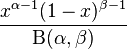
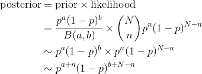
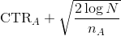
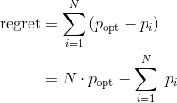

# Bayesian A/B Testing

## The Boss's Complaint

You've now been running A/B tests, evaluating them, and making useful business decisions for months. You're confident that you're actually making correct decisions. Life seems good. But then in a meeting:

Your boss asks, *"So when can we wrap up that button test?"*

*"It doesn't look like it will stop any time soon,"* you reply.

*"I know,"* says your boss, *"we've been running it for three months, it has over 10k conversions. We have other ideas to try, we need to kill that test."*

*"But,"* you say, *"it is nowhere near significance. Stopping it is completely wrong under the procedure we're using, we'll have no idea whether we're making the right decision!"*

Your boss snaps, "*Doing 'the right decision' could easily take a million more conversions! If we knew how to get to a million conversions, we'd all be rich and wouldn't care about the color of the button! We'll declare the red button the winner, and you need to figure out a better way to stop the next test."*

Clearly your boss has a point. Businesses need to be able to make decisions, and have a limited ability to collect data. But how can we say that in math? And what are the consequences if we do?

Why are null hypothesis tests under fire?  There are many reasons, and a crucial one is that null hypothesis tests and p-values are hard to understand and hard to explain.  There are arbitrary thresholds (0.05?) and the results are binary - you can either reject the null hypothesis or fail to reject the null hypothesis.  And is that what you really care about? Which of these two statements is more appealing:

(1) "We rejected the null hypothesis that A=B with a p-value of 0.043."

(2) "There is an 85% chance that A has a 5% lift over B ."

Bayesian modeling can answer questions like (2) directly.


## Bayesian Terms

* `prior` - a distribution that encodes your prior belief about the parameter-of-interest
* `likelihood` - a function that encodes how likely your data is given a range of possible parameters
* `posterior` - a distribution of the parameter-of-interest given your data, combining the prior and likelihood

## The Beta Distribution

If you recall, the beta distribution looks like this:



*x* must be between 0 and 1. The *B* on the bottom is just a normalizing function so that the pmf integrates to 1. The Beta Distribution is a very natural distribution for probabilities, since probabilities range from 0 to 1.

Note that when alpha and beta (the shape parameters) are both 1, the beta distribution simplifies to the uniform distribution.

## Bayesian Inference

The essence of Bayesian methods consists in identifying our prior beliefs about what results are likely, and then updating those according to the data we collect.

### Prior
For example, if our conversion rate is 5%, we may say that it's reasonably likely that a change we want to test could improve that by 5 percentage points—but that it is most likely that the change will have no effect, and that it is entirely unlikely that the conversion rate will shoot up to 30% (after all, we are only making a small change).

### Updating the prior
As the data start coming in, we start updating our beliefs. If the incoming data points point to an improvement in the conversion rate, we start moving our estimate of the effect from the prior upwards; the more data we collect, the more confident we are in it and the further we can move away from our prior. The end result is what is called the **posterior**—a probability distribution describing the likely effect of our treatment.

### Example
For example, we may want to use Bayesian inference to analyze the results of an A/B test where the result variable is conversion rate. We know that our current conversion rate is around 5%, and that very high conversion rates (above 20%) are extremely unlikely. To formalize this belief we could say that possible conversion rates are described by the Beta distribution with parameters `α=3` and `β=50`:


We can then simulate observations from a distribution with a 20% conversion rate and see our estimate shift from the prior to our posterior as we gather an increasing number of observations:


Intuitively, the updating process will more readily accept estimates consistent with the prior (if we believe ex ante that a 10% conversion rate is perfectly likely, our posterior will move there readily after a small number of observations), but will require more data to accept estimates that are less probable according to the prior.

This is all very straightforward: we start with a prior belief, and then update it in line with the incoming data.

## Why Bayesian?

There are three major advantages the Bayesian A/B test has over the frequentist method.

1. It’s far easier to interpret the results. For example, you can easily compute the probability that version B is better than version A. In contrast, a frequentist test does not allow this even as a possibility.

    _Important note: The p-value is NOT the probability that either A is larger than B or B is larger than A. A P-Value is the likelihood of a seemingly unlikely event happening in a world governed only by chance._

2. You can peek as often as you like. The Bayesian test is measuring the probability at time t that B is better than A (or vice versa). You can look at the data, check if the test is finished, and stop the test early if the result is highly conclusive. This philosophical advantage is also an empirical, business advantage when dealing with the reality that timing a test is often at odds with the reality that in a standard test, your results may come after a point where you ABSOULTELY NEED need to make a decision.

3. You can alter your test material in the middle of the test. If you beleive your test is not going anywhere, you can use your current posteriors as new priors for what is essentially the start of a new test without any major interruptions in your development flow. Standard tests do not allow for this because of the “no peeking” problem. This means a bayesian approach is extremely useful to anyone involved in either Agile Development or Agile Marketing, since the testing schedule can be made to work with your development lifecycle.

## Metrics / Parameters of interest

There's a lot of different possible metrics (or parameters of interest) you might be looking to optimize. Of course in order to do an A/B test, you need to know what determines which is the best!

A common metric is the *Click-Through Rate*, or *CTR*. The CTR comes up most often in internet advertising and it is the percent of users who see your ad that click on it. We also generically call these *conversions*. The click-through rate can also be calculated like this:

```
       number of users who click on ads
CTR = ----------------------------------
         number of users who view ads
```

## Setting Up The Test		

Let's think this through with an example. Assume your parameter of interest is click-through rate (CTR), and your A/B test is pitting two different product recommendation engines against one another. With null hypothesis testing, you assume that there exist true-but-unknown click-through rates for A and B, which we will write as *pA* and *pB*, and the goal is to figure out if they are different or not.

With Bayesian statistics we we will instead model the *pA* and *pB* as random variables, and specify their entire distributions. *pA* and *pB* are no longer two numbers, but are now two distributions.

So forget everything you know about statistical testing for now. Let's start from scratch and answer our customer's most important question directly: what is the probability that *pA* is larger than *pB* given the data from the experiment (i.e. a sequence of 0s and 1s in the case of click-through-rate)?

## Observed vs True Frequency

For the moment, we will focus on the analysis of site A only. Assume that there is some true `0 < p_A < 1` probability that users who, upon shown site A, eventually purchase from the site. This is the true effectiveness of site A. Currently, this quantity is unknown to us. 

Suppose site A was shown to `N` people, and `n` people purchased from the site. One might conclude hastily that `p_A = n/N`. Unfortunately, the *observed frequency* `n/N` does not necessarily equal `p_A`. There is a difference between the *observed frequency* and the *true frequency* of an event. The true frequency can be interpreted as the probability of an event occurring. For example, the true frequency of rolling a 1 on a 6-sided die is 1/6.

Knowing the true frequency of events like the fraction of users who make purchases or the percent of internet users with cats are common requests we ask of Nature. Unfortunately, often Nature hides the true frequency from us and we must *infer* it from observed data.

The *observed frequency* is then the frequency we observe: say rolling the die 100 times you may observe 20 rolls of 1. The observed frequency, 0.2, differs from the true frequency, 1/6. We can use Bayesian statistics to infer probable values of the true frequency using an appropriate prior and observed data.

With respect to our A/B example, we are interested in using what we know, `N` (the total trials administered) and `n` (the number of conversions), to estimate what `p_A`, the true frequency of buyers, might be.

## Updating the Posterior

We start with some prior belief about the distribution of `p_A`. We often will assume that all possible values of `p_A` are equally likely (the uniform distribution), but let's work more generally and assume it's a beta distribution with shape parameters `a` and `b`. Recall this is also the beta distribution with alpha=beta=1. This is the *prior*.

After collecting some data, we can update our prior to get a new distribution for `p_A`. The *likelihood* is the probability that we observed the data we observed. In our case, we are repeating a bernoulli trial with probability `p_A` *N* times and got *n* successes (since out of *N* views, we had *n* clicks). This is a *binomial* distribution.

The new distribution is called the *posterior*.

Here's the math for calculating the posterior. Note that we only care about what it's proportional to and will be ignoring the denominator of the beta distribution.



So our posterior is a beta distribution! The shape parameters are `a + N` and `b + N - n`.

It may not be clear here, but we are in fact *very lucky*! Our prior and our posterior are in the same distribution family! They are both beta distributions. The *beta distribution* is what we call a *conjugate prior*. In the case where we're not so lucky, we have to use a method called *Monty Carlo Markov Chain (MCMC)* to determine the posterior distribution.

## Comparing Two Distributions

What we're trying to do is determine the probability that site A is better than site B. We can get the posterior distributions (beta distributions) for both site A and site B based on our prior and observation data.

We will use the uniform distribution as our prior. This is the same as the beta distribution with both shape parameters = 1.

We do this calculation by simulating a large number (let's say 10,000) draws from both distributions. We count the number of times A was higher than B. This is the number of times out of 10,000 that A was better than B, so we get a probability that A is better than B!

Here's how we can do that in code. We use `np.random.beta` to get the random samples from the distributions. `num_clicks_A`, `num_views_A`, `num_clicks_B`, and `num_views_B` are the observation data.

```python
num_samples = 10000
A = np.random.beta(1 + num_clicks_A,
                   1 + num_views_A - num_clicks_A,
                   size=num_samples)
B = np.random.beta(1 + num_clicks_B,
                   1 + num_views_B - num_clicks_B,
                   size=num_samples)
print "The probability that site A is better than site B is %d" \
    % np.sum(A > B) / num_samples
```

Note that we have `1 + num_clicks_A` since the `1` is the value of the alpha shape parameter for the prior.

Bayesian A/B testing enables us to answer a more interesting questions: *What is the probability that site A has a conversion rate of k percentage points more than site B?*

All we need to so is count the number of times `A` is at least `B + k / 100.`.

## Multi-Arm Bandit

Let's go back to the Boss's complaint. If you're running an A/B test and it looks like version A is doing better than version B, you are basically wasting potential by showing users version B. But if you're not confident yet, you're in a quandry.

The *Multi-Arm Bandit* is a way of algorithmically deciding what percent of traffic to send to each version of the site, so that you can still get statistically significant results, but show what is likely to be the better version to a higher percent of users. Now your boss is happy because more users are seeing the better version of the site and you're happy because you can keep your test running until you are confident about the results.

We call trying out each site to gather data *exploration* and showing the site that we believe to be the best *exploitation*. Our goal is to minimize the *regret*, the amount of time you showed a suboptimal site.

The term *Multi-Arm Bandit* comes from slot machines, as one-armed bandit is another term for a slot machine. Common terminology is to call each version of the site a bandit (or a lever). Multi-Arm Bandit is actually a class of algorithms, and we'll explore a few.

### Epsilon-Greedy Algorithm

In the *epsilon-greedy* algorithm, some percent of the time we explore and randomly choose one of the options. The rest of the time we choose the option that has so far had the highest conversion rate. *epsilon* is a value between 0 and 1 which is the probability that we explore. 10% is a standard choice for epsilon.

Here's the pseudocode:

```
randomly choose a number r from 0 to 1
if r < epsilon:
    randomly choose one of the possible sites, each with equal probability
else:
    choose the site with the highest conversion rate from the data so far
```

Note that each version will have seen a different number of users. You will calculate each conversion rate like this:

```
                             # clicks from site A
conversion rate of site A = ----------------------
                              # visits of site A
```

This algorithm is simple, but it has some flaws.

* At the beginning, we are trying to do exploitation, but we don't yet know which version is right.

* If epsilon is 90%, the epsilon-greedy algorithm will eventually show the best option 90% of the time. So this means that 10% of the time the algorithm will continue to randomly show different versions of the site, no matter how confident we are that a certain version is the best. There is a point where we should stop the exploration.

### Softmax

In this algorithm, we choose each version of the site in proportion to its estimated value using a *Boltzman Distribution*. Say `CTR_A`, `CTR_B` and `CTR_C` are the conversion rates for three versions of the site. We would choose site A with the following probability.

```
                  exp(CTR_A/tau)
-------------------------------------------------
 exp(CTR_A/tau) + exp(CTR_B/tau) + exp(CTR_C/tau)
```

`tau` here is the "temperature" parameter and controls the randomness of the choice. A standard value for `tau` is 0.001.

### Upper Confidence Bound (UCB)

This is a class of algorithms that can be proven to have a logarithmic upper bound for regret. We won't worry about the mathematical proof and will just be focusing on the UCB1 algorithm.

We choose the strategy that where the following value is the largest.



where `N` is the total number of rounds (for all sites) and `n_A` is the number of times site A has been shown. `CTR_A` is the conversion rate for that version so far.

You should first make sure to play each bandit once so none of the `n_A`'s are 0.


### Bayesian Bandit

This strategy is extending the Bayesian A/B testing from above. We model each of the bandits with a beta distribution. We set the shape parameters to be `a=1+wins` and `b=1+trials-wins`. We take a random sample from each distribution and choose the bandit with the highest value. You can use `scipy.stats.beta.rvs` for this.

## Regret

When evaluating a Multi-Arm Bandit algorithm, we want to look at the total *regret*. This is how much we played a subpar bandit machine. This can be measured with the following equation.



where there are *N* trials and *p_i* is the probability of winning with the bandit chosen on the *i*-th run. *p_opt* is the probability of winning with the best bandit.

A regret of 0 would mean you always played the best machine. This isn't ever possible since you need to collect data to determine which one is the best.

Note that you need to know the true probabilities to calculate the regret. This is a theoretical idea to evaluate which algorithm is best and is probably not something you would calculate in practice.
