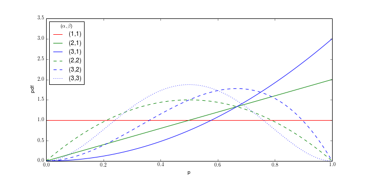

% Bayesian A/B Testing and the Multi-Armed Bandit
% [Jack Bennetto](jack.bennetto@galvanize.com)
% September 19, 2016

# Objectives

Morning objectives:

 * Define and explain prior, likelihood, and posterior.
 * Explain what a conjugate prior is and how it applies to A/B testing.
 * Explain the difference between Frequentist and Bayesian A/B tests.
 * Analyze an A/B test with the Bayesian approach.

Afternoon Objectives:

 * Explain how multi-armed bandit addresses the tradeoff between exploitation and exploration, and the relationship to regret.
 * Implement the multi-armed bandit algorithm.

# Agenda

Morning:

 * Review Bayesian statistics.
 * Discuss an example of Bayesian A/B testing.
 * Discuss conjugate priors.
 * Compare to Bayesian and Frequentist approches.

Afternoon:

 * What is a multi-armed bandit?
 * How do we use this to do smarter A/B tests?

# Bayes' Theorem

Recall **Bayes' Theorem**

$$P(x|\theta) = \frac{P(\theta | x) P(x)}{P(\theta)}$$

where

 * $P(x|\theta)$ is the **posterior probability distribution** of hypothesis $x$ being true, given observed data $\theta$,
 * $P(\theta|x)$ is the **likelihood** of observing $\theta$ given $x$,
 * $P(x)$ is the **prior distribution** of $x$, and
 * $P(\theta)$, the **normalizing constant**, is

$$P(\theta) = \sum_x P(\theta|x) P(x)$$

# Example: Click-through rates

Consider two version of an ad on a website.

 * Which produces a higher click-through rate?
 * Each visit follows a Bernoulli distribution.
 * Use Bayesian analysis to find probability distributions of effectiveness.

# Binomial Distribution (likelihood)

Likelihood of k successes out of n trials is

$${n \choose k} p^k (1-p)^{n-k}$$

where

* $p$ is the conversion rate (between 0 and 1),
* $n$ is the number of visitors, and
* $k$ is the number of conversions.

# Beta Distribution

Use the beta distribution for prior probabilities. 

$$\frac{p^{\alpha - 1}(1 - p)^{\beta - 1}}{B(\alpha, \beta)}$$

where

* $p$ is the conversion rate (**between 0 and 1**) and
* $\alpha$, $\beta$ are the shape parameters:
    * $\alpha$ = 1 + number of conversions and
    * $\beta$ = 1 + number of non-conversions.
* Beta Function ($B$) is a normalizing constant.
* $\alpha = \beta = 1$ gives the *uniform distribution*.
* Mean is $\frac{\alpha}{\alpha + \beta}$.

# Beta Distribution

$$\frac{p^{\alpha - 1}(1 - p)^{\beta - 1}}{B(\alpha, \beta)}$$

# Conjugate Priors
$$\begin{aligned}
posterior &\propto prior * likelihood \\
beta &\propto beta * binomial \\
&= \frac{p^{\alpha - 1}(1 - p)^{\beta - 1}}{B(\alpha, \beta)} * {n \choose k} p^k (1-p)^{n-k} \\
&\propto p^{\alpha - 1}(1 - p)^{\beta - 1} * p^k (1-p)^{n-k} \\
&\propto p^{\alpha + k - 1}(1 - p)^{\beta + n - k - 1}
\end{aligned}$$

Result is a beta distribution with parameters $\alpha$ = $\alpha + k$ and $\beta$ = $\beta + n - k$

# Conjugate Priors

A conjugate prior for a likelyhood is a class of functions such that if the prior is in the class, so is the posterior. 

Likelihood                 | Prior
---------------------------|------------
Bernoulli/Binomial         | Beta distribution
Normal with known $\sigma$ | Normal distribution
Poisson                    | Gamma

How important are these to do Bayesian statistics?

# Frequentist vs. Bayesian

In both cases, we consider an ensemble of possible randomly generated universes.

Frequentist: The hypothesis is a fixed (though unknown) reality; the observed data follows some random distribution

Bayesian: The observed data is a fixed reality; the hypotheses follow some random distribution.

# Frequentist A/B testing

Frequentist procedure

* Choose n (number of experiments/samples) based on expected size of effect.
* Run **all** experiments and observe the data.
* The significance is probability of getting result (or more extreme) assuming no effect.
* Doesn't tell you how likely it is that a is better than b.

(aside: Wald sequential analysis)

# Bayesian A/B testing

Bayesian procedure

* No need to choose n beforehand.
* Update knowledge as the experiment runs.
* Gives probability of *anything you want*.

Why doesn't everyone like this better?

# Objectives

Morning objectives:

 * Define and explain prior, likelihood, and posterior.
 * Explain what a conjugate prior is and how it applies to A/B testing.
 * Explain the difference between Frequentist and Bayesian A/B tests.
 * Analyze an A/B test with the Bayesian approach.

Afternoon Objectives:

 * Explain how multi-armed bandit addresses the tradeoff between exploitation and exploration, and the relationship to regret.
 * Implement the multi-armed bandit algorithm.

# What Is a Multi-Armed Bandit?

Each slot machine (a.k.a. one-armed bandit) has a different (unknown!) chance of winning.

How do you maximize your total payout after a finite number of plays?

Assume all have the same payoff. ("binary bandits")

# Why Is This Interesting?

\pause

Example: which version of an web ad has a higher click-through rate (CTR)?

\pause

Example: which website is easier to navigate?

\pause

Example: which drug is more effective?

# Minimizing Regret

Regret is the difference of what we won and what we would expect with optimal strategy.

# Exploration vs Exploitation

Traditional A/B testing: first find the best bandit (explore) then take advantage of it (exploit)

But we will loose money playing bandits we don't *think* are good.

Could we do better by exploring and exploiting at the same time?

How would *you* solve this?

# Epilon-Greedy Algorithm

Usually choose the best so far, but sometimes (with probability $\epsilon$) choose one randomly.

No "best" value, but $\epsilon = 0.1$ is typical.

What are the limitations?

# Softmax

Choose a bandit randomly in proportion to the softmax function of the payouts, e.g.

If there are three bandits, A, B, and C, the probability of choosing A is

$$ \frac{ e^{p_A/\tau} }{  e^{p_A /\tau} +  e^{p_B /\tau} + e^{p_C /\tau  } } $$

where

* $p_A$ is the average payoff of bandit A so far (assume 1.0 to start).
* $\tau$ is the "temperature" (generally constant).

How does this behave in the extremes?

\pause

* As $\tau \to \infty$, the algorithm will choose bandits equally.
* As $\tau \to 0$, it will choose the most successful so far.

What are the limitations?

# UCB1 Algorithm

Choose a bandit to maximize

$$p_A + \sqrt{\frac{2 \ln{N}}{n_A}} $$

where

 * $p_A$ is the expected payout of bandit $A$.
 * $n_A$ is the number of times bandit $A$ has played.
 * N is the total number of trials so far.

This chooses the bandit for whom the Upper Confidence Bound is the highest.

# Bayesian Bandit

Use Bayesian statistics:

* Find probability distribution of payout of each bandit thus far. (how?)
* For each bandit, sample from distribution.
* Choose bandit for whom the sample has highest expected payout.

