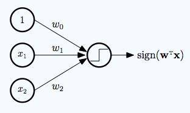
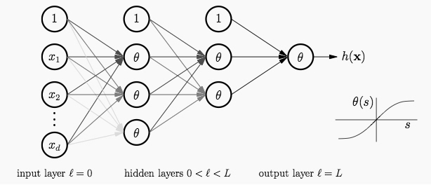
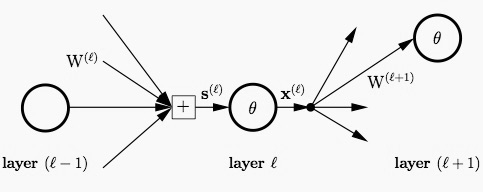
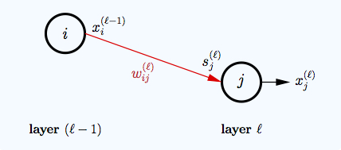
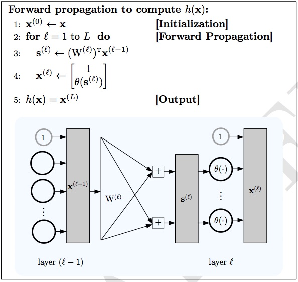
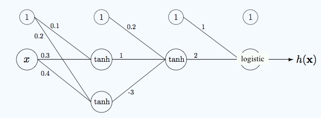
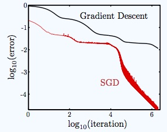

% Neural Networks
% [Brian J. Mann](brian.mann@galvanize.com)
% March 28, 2016

## Morning Objectives

* Understand the intuition and use cases for neural networks
* Learn how neural networks predict on new observations (forward propagation) and how to train them (backpropagation)
* Build and train a simple neural network

## Introduction to Neural Networks

Originally designed to mimic neurons in the brain

* Neurons "fire" when the input reaches a certain threshold
* Modeled by an *activation function* ($sign$, $logistic$, $tanh$, a rectifier, etc...)
* Otherwise not a good analogy, don't think about NNs as models for the brain. They're not.

## When Do I Use One

Most of the time other (simpler) models will be better, but...

* Work well on high dimensional data (images, text, audio)
* Can model *arbitrarily* complicated decision functions given enough training time
* Not interpretable
* Hard to tune, many parameters and choices to make
* Long training time, hard to train
* Easy to overfit if not careful

## You've Already Seen One!

{width=200px}

Replacing the output activation function $sign$ with:

* $\sigma(z) = \frac{1}{1 + e^{-z}}$ $\rightarrow$ logistic regression
* The identity $id(z) = z$ gives linear regression
* For a multi-class classification problem (multiple output nodes) use softmax $$\frac{e^{z_i}}{\sum_j e^{z_j}}$$

## Adding Hidden Layers

{width=400px}

A NN is *fully connected* if all the outputs of each layer are inputs to every neural on the next layer

## Notation

Notation for neural networks can be quite messy (lots of indices and variables floating around)

* Layers are given by indices $0, 1, 2, \ldots, L$ where $0$ is the input layer, and $L$ is the output layer
* $\theta$ is an activation function, can change from layer to layer. We'll use $\tanh$ in each hidden layer and $\sigma$ for the output activation (or softmax for multi-class)
* For each layer $\ell$:
    * $\mathbf{s}^{(\ell)}$ is the $d^{(\ell)}$-dimensional input vector
    * $\mathbf{x}^{(\ell)}$ is the $d^{(\ell)}+1$-dimensional output vector
    * $W^{(\ell)}$ is the $d^{(\ell-1)}+1 \times d^{(\ell)}$ matrix of input weights

## More Notation

{width=250px}

{width=250px}

## Forward Propagation

Let's describe how a neural network takes an input and produces an output. Using the notation from before:

* $\mathbf{x}^{(\ell)} = \begin{bmatrix} 1 \\ \theta(\mathbf{s}^{(\ell)}) \end{bmatrix}$
* $\mathbf{s}^{(\ell)} = (W^{(\ell)})^T \mathbf{x}^{(\ell - 1)}$

So we get the chain:

$$\mathbf{x}^{(0)} \xrightarrow{W^{(1)}} \mathbf{s}^{(1)} \xrightarrow{\theta} \mathbf{x}^{(1)} \xrightarrow{W^{(2)}} \mathbf{s}^{(2)} \cdots \rightarrow \mathbf{s}^{(L)} \xrightarrow{\theta} \mathbf{x}^{(L)} = h(\mathbf{x}^{(0)})$$

## More Forward Propagation

## Question

What's the complexity of forward propagation in terms of the numbers of nodes $V$ and edges $E$ of the network?

## Training a Neural Networks

* Need to determine the optimal weights $\mathbf{w} = (W^{(1)}, \ldots, W^{(L)})$
* Loss function $E(\mathbf{w})$
    * $\hat{y_n} = h(x_n; \mathbf{w})$
    * For regression $E(\mathbf{w}) = \frac{1}{N} \sum (\hat{y_n} - y_n)^2$ and $\theta = id$
    * For binary classification $E(\mathbf{w}) = \sum - y_n \log \hat{y_n} - (1-y_n) \log(1 - \hat{y_n})$ and $\theta = \sigma$
    * For multi-class classification $E(\mathbf{w}) = \sum -y_n \log \hat{y_n}$ and $\theta =$ softmax

## Backpropagation

The most common way to train a neural network is a gradient descent algorithm called *backpropagation*

* Recall the update step in gradient descent: $\mathbf{w}(t+1) = \mathbf{w}(t) - \eta \nabla E(\mathbf{w}(t))$
* Consider a loss/error function which is a sum of the errors $e_n$ on each input $E(\mathbf{w}) = \frac{1}{N} \sum e_n$
    * $\frac{\partial E}{\partial W^{(\ell)}} = \frac{1}{N} \sum \frac{\partial e_n}{\partial W^{(\ell)}}$
* Could use a numerical finite difference approximation to compute $\frac{\partial e_n}{\partial W^{(\ell)}}$ for each input observation, but this is computationally infeasible
* Instead we'll use a clever stepwise, dynamic programming approach

## Backpropagation

Backpropagation uses the chain rule to compute the partial derivatives of layer $\ell$ in terms of layer $\ell + 1$.

* Define the sensitivity vector of layer $\ell$ $$\mathbf{\delta}^{(l)} = \frac{\partial e}{\partial \mathbf{s}^{(\ell)}}$$
* Then we can compute $$\frac{\partial e}{\partial W^{(\ell)}} = \mathbf{x}^{(l-1)} (\mathbf{\delta}^{(\ell)})^T$$
* In order to compute $\delta^{(\ell)}$
$$\mathbf{\delta}^{(\ell)} = \theta^{\prime}(\mathbf{s}^{(\ell)}) \otimes [W^{(\ell+1)}\mathbf{\delta}^{(\ell+1)}]_1^{d^{(\ell)}}$$  
where $\otimes$ is component-wise multiplication of vectors

## Backpropagation

* Now we have a way to get $\delta^{(\ell)}$ from $\delta^{(\ell + 1)}$
* Remains to compute $\delta^{(L)}$ to seed the process
    * Depends on the error function $E(\mathbf{w})$ and the output activation function
    * For $\theta = id$ and $e = (\mathbf{x}^{(L)} - y)^2$ (regression) $\rightarrow$ $$\delta^{(L)} = 2(\mathbf{x}^{(L)} - y)s^{(L)}$$
    * For $\theta = \sigma$ and $e = -y \log \hat{y}$ (binary classification) $\rightarrow$ $$\delta^{(L)} = -y(1 - \sigma(\mathbf{s}^{(L)}))$$ $$= -y(1 - \hat{y})$$

## Example

Consider the following neural network

{width=300px}

The weights are $$W^{(1)} = \begin{bmatrix} 0.1 & 0.2 \\ 0.3 & 0.4 \end{bmatrix}; W^{(2)} = \begin{bmatrix} 0.2 \\ 1 \\ -3 \end{bmatrix}; W^{(3)} = \begin{bmatrix} 1 \\ 2 \end{bmatrix}$$

## Example Continued

Suppose our observation is $x = 2, y = 1$

* $\mathbf{x}^{(0)} = \begin{bmatrix} 1 \\ 2 \end{bmatrix}$; $\mathbf{s}^{(1)} = \begin{bmatrix} 0.1 & 0.3 \\ 0.2 & 0.4 \end{bmatrix} \begin{bmatrix} 1 \\ 2 \end{bmatrix} = \begin{bmatrix} 0.7 \\ 1 \end{bmatrix}$; $\mathbf{x}^{(1)} = \begin{bmatrix} 1 \\ 0.6 \\ 0.76 \end{bmatrix}$
* $\mathbf{s}^{(2)} = \begin{bmatrix} -1.48 \end{bmatrix}$; $\mathbf{x}^{(2)} = \begin{bmatrix} 1 \\ -0.90 \end{bmatrix}$
* $\mathbf{s}^{(3)} = \begin{bmatrix} -0.8 \end{bmatrix}$; $\mathbf{x}^{(3)} = \begin{bmatrix} 0.31 \end{bmatrix}$

## Example Continued

Backpropagation gives:

* $\delta^{(3)} = -1(1 - 0.31) = -0.69$; $\delta^{(2)} = (1 - 0.9^2)(2)(-0.69) = -0.2622$; $\delta^{(1)}
 = \begin{bmatrix} -0.104 \\ 0.188 \end{bmatrix}$

Now we can find the partial derivatives

* $\frac{\partial e}{\partial W^{(1)}} = \mathbf{x}^{(0)}(\delta^{(1)})^T = \begin{bmatrix} -0.104 & 0.188 \\ -0.208 & 0.376 \end{bmatrix}$; $\frac{\partial e}{\partial W^{(2)}} = \mathbf{x}^{(1)}(\delta^{(2)})^T = \begin{bmatrix} -0.69 \\ -0.42 \\ -0.53 \end{bmatrix}$; $\frac{\partial e}{\partial W^{(3)}} = \mathbf{x}^{(2)}(\delta^{(3)})^T = \begin{bmatrix} -1.85 \\ 1.67  \end{bmatrix}$

## Exercise

Repeat the computations in that example, but for the case when the output transformation is the identity and the loss function is squared error.

## Stochastic Gradient Descent

Rather than compute the gradient for each observation and add up the result, you can update the weights based on the error of each observation as you loop through your data

{width=250px}

## Afternoon Objectives

* Get acquainted with some more complicated versions of neural networks
* Use Keras to build neural networks in Python

## References

Books

* Y. S. Abu-Mostafa, M. Magdon-Ismail, H.-T. Lin *Learning From Data: A Short Course*
