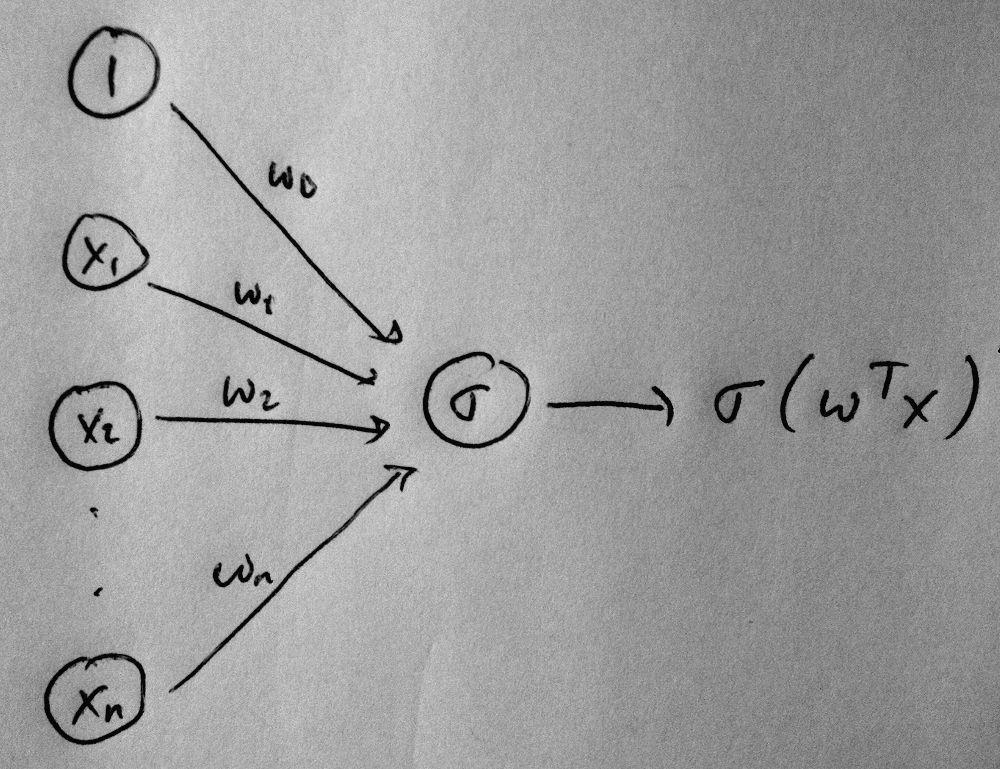
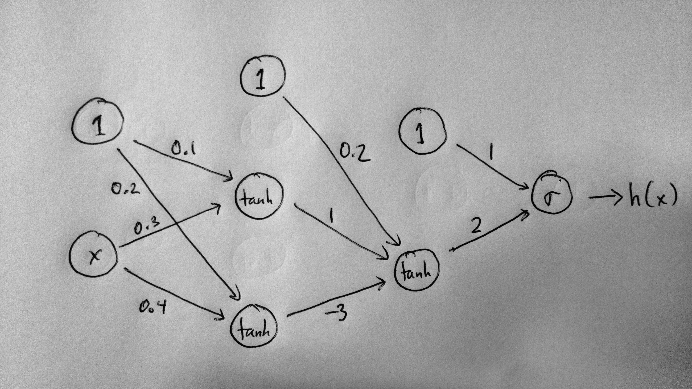

% Neural Networks
% [Brian J. Mann](brian.mann@galvanize.com)
% March 28, 2016

## Morning Objectives

This morning's objectives are:

* Know the best use cases for neural networks
* Know the benefits and drawbacks of using a neural network
* Build a simple neural network for binary classification
* Train a neural network using backpropagation

## Background

Neural Networks were introduced in the 1950's as a model which mimics the human brain.

* Biological neurons "fire" at a certain voltage threshold
* An artificial neuron will be modeled by an activation function like sign, the sigmoid function, or $\tanh$
* Otherwise, not a good analogy
    * Don't think of neural networks as models for a brain

## Why Neural Networks?

Pros:

* Works well with high dimensional data:
    * images
    * text
    * audio
* Can model *arbitrarily* complicated decision functions

Cons:

* Not interpretable
* Slow to train
* Easy to overfit
* Difficult to tune
    * Many parameters/choices when building the network

## Example: Logistic Regression (1/3)

Recall logistic regression:

* Input $\mathbf{x}$
* Weights $\mathbf{w}$
* $\sigma(z) = \frac{1}{1 + e^{-z}}$
* Classify $\mathbf{x}$ as positive if $\sigma(\mathbf{w}^T\mathbf{x}) > 0.5$
* Think of $\sigma$ as an *activation function* which *activates* if the input is larger than $0$

## Example: Logistic Regression (2/3)

Draw logistic regression schematically as

{width=180px}

Think of the diagram as having two *layers*

* Input layer: The nodes which hold the inputs $1, x_1, x_2, \ldots, x_n$
* Output layer: The single node that holds the output value
* The weights $w_0, w_1, \ldots, w_n$ transition between the two layers

## Example: Logisitic Regression (3/3)

The hypothesis $h(\mathbf{x}; \mathbf{w}) = \sigma(\mathbf{w}^T\mathbf{x})$ only models linear decision functions.

* The decision boundary is the set of points where $\mathbf{w}^T\mathbf{x} = 0$, a hyperplane
* What about more complicated behavior?

## Example: Neural Network with Multiple Layers (1/2)

Consider the following network with 4 layers:

{width=250px}

* Input (layer 0): Contains the input value $x$ and a bias term $1$
* Two *hidden layers* (layers 1 and 2)
* Output (layer 3): Contains the output value (probability of positive classification)

## Example: Neural Network with Multiple Layers (2/2)

Let's compute the output of the network for $x = 3$. We'll go layer by layer to keep things straight:

* Layer 1:
    * The first non-bias node is $\tanh((0.1)(1) + (0.3)(3)) = 0.76$
    * The second non-bias node is $\tanh((0.2)(1) + (0.4)(3)) = 0.89$
* Layer 2:
    * The non-bias node is $\tanh((0.2)(1) + (1)(0.76) + (-3)(0.89)) = -0.94$
* Output:
    * The value of the output layer is $\sigma((1)(1) + (2)(-0.94)) = 0.29$

So $h(3) = 0.29$ for this example.

## Check for Mastery

Compute the output of the this neural network for $x = 1$.

## Why tanh?

The hyperbolic tangent function is commonly used as an *activation function* in hidden layers:

{width=180px}

* Smooth (differentiable), unlike sign
* $\tanh(z) = 2\sigma(2z) - 1$
    * Same shape as the sigmoid function
    * Output values centered around $0$
* $\tanh^{\prime}(z) = 1 - \tanh^2(z)$

## Check for Mastery

Why do you think the fact that the value of $\tanh$ being centered around $0$ is important?

## Let's Keep it Simple For Now

Since this is some heavy-duty stuff, let's keep things as simple as possible while still trying to grasp the general picture:

* Stick to networks for binary classification (a single output node)
* The output node will use the sigmoid activation function $\sigma$
* Hidden layers will use the $\tanh$ activation function
* $\theta$ will always represent an activation function (like sign, $\tanh$, $\sigma$, or something else like a rectifier)

## Notation (1/2)

We need a way to write down the network mathematically to do anything with it. As a warning, this can get quite messy:

* Layers are given by indices $0, 1, 2, \ldots, L$ where $0$ is the input layer, and $L$ is the output layer
* For each layer $\ell$:
    * $\mathbf{s}^{(\ell)}$ is the $d^{(\ell)}$-dimensional input vector
    * $\mathbf{x}^{(\ell)}$ is the $d^{(\ell)}+1$-dimensional output vector
    * $W^{(\ell)}$ is the $d^{(\ell-1)}+1 \times d^{(\ell)}$ matrix of input weights. $W^{(\ell)}_{ij}$ is the weight of the edge from the $i$-th node in layer $\ell -1$ to the $j$-th node in $\ell$

## Notation (2/2)

If we zoom in to a single node in a single layer, the picture looks like:

{width=300px}

## Schematic

In general, neural networks look something like

## Example: Notation in Toy Network from Before (1/2)

Let's go back to our earlier example to clear up as much confusion as possible:

* $\mathbf{x}^{(0)}$ is $\begin{bmatrix} 1 \\ 3 \end{bmatrix}$
* $\mathbf{s}^{(1)}$ is the result of applying the weights on the edges between layer 0 and 1: $$\begin{bmatrix} (0.1)(1) + (0.3)(3) \\ (0.2)(1) + (0.4)(3) \end{bmatrix} = \begin{bmatrix} 1 \\ 1.4 \end{bmatrix}$$
* $W^{(1)} = \begin{bmatrix} 0.1 & 0.2 \\ 0.3 & 0.4 \end{bmatrix}$
* $\mathbf{x}^{(1)}$ is the output of layer 1 after applying $\tanh$ and adding a bias node: $$\begin{bmatrix} 1 \\ \tanh(1) \\ \tanh(1.4) \end{bmatrix} = \begin{bmatrix} 1 \\ 0.76 \\ 0.89 \end{bmatrix}$$

## Example: Notation in Toy Network from Before (2/2)

Continuing:

* $\mathbf{s}^{(2)} = \begin{bmatrix} (0.2)(1) + (1)(0.76) + (-3)(0.89) \end{bmatrix} = \begin{bmatrix} -1.71 \end{bmatrix}$
* $W^{(2)} = \begin{bmatrix} 0.2 \\ 1 \\ -3 \end{bmatrix}$
* $\mathbf{x}^{(2)} =  \begin{bmatrix} 1 \\ \tanh(-1.71) \end{bmatrix} = \begin{bmatrix} 1 \\ -0.94 \end{bmatrix}$
* $\mathbf{s}^{(3)} = \begin{bmatrix} (1)(1) + (2)(-0.94) \end{bmatrix} = \begin{bmatrix} -0.88 \end{bmatrix}$
* $W^{(3)} = \begin{bmatrix} 1 \\ 2 \end{bmatrix}$
* $\mathbf{x}^{(3)} = \begin{bmatrix} \sigma(-0.88) \end{bmatrix} = \begin{bmatrix} 0.29 \end{bmatrix}$

## Check for Mastery

What are $\mathbf{x}^{(2)}$ and $\mathbf{s}^{(2)}$ when $x = 1$?

## Forward Propagation (1/2)

Studying the above example gives general formulae for computing the output of a neural network with fixed weights:

* $\mathbf{x}^{(\ell)} = \begin{bmatrix} 1 \\ \theta(\mathbf{s}^{(\ell)}) \end{bmatrix}$
* $\mathbf{s}^{(\ell)} = (W^{(\ell)})^T \mathbf{x}^{(\ell - 1)}$

So we get the chain:

$$\mathbf{x}^{(0)} \xrightarrow{W^{(1)}} \mathbf{s}^{(1)} \xrightarrow{\theta} \mathbf{x}^{(1)} \xrightarrow{W^{(2)}} \mathbf{s}^{(2)} \cdots \rightarrow \mathbf{s}^{(L)} \xrightarrow{\theta} \mathbf{x}^{(L)} = h(\mathbf{x}^{(0)})$$

## Forward Propagation (2/2)

This chain of transformations is called the *forward propagation* algorithm.

## Check for Mastery

In terms of the number of nodes $V$ and weights $E$, what is the algorithmic complexity of forward propagation (in Big-O notation)?

## Backpropagation (1/4)

We now know how NNs with fixed weights make predictions. But how do we train a neural network?

* Training data $\{(\mathbf{x_i}, y_i\}$
* Need to minimize some error function $E$ on our training set over the weights $\mathbf{w} = (W^{(1)}, \ldots, W^{(L)})$
    * We'll use $$E(\mathbf{w}) = \frac{1}{N} \sum_i (h(\mathbf{x_i}; \mathbf{w}) - y_i)^2$$ (mean squared error)
* This function can be *extremely* complicated to write algebraically
    * No closed form solution for minima

## Check for Mastery

What tool/tools do we have available to find the minimum value? Why don't we use sign as an activation function?

## Backpropagation (2/4)

Train a neural network using a gradient descent algorithm called *backpropagation*:

* Recall the update step in gradient descent: $$\mathbf{w}(t+1) = \mathbf{w}(t) - \eta \nabla E(\mathbf{w}(t))$$
* Our total error is a sum of the errors $e_n$ on each input $E(\mathbf{w}) = \frac{1}{N} \sum e_i$
    * $e_i = (h(\mathbf{x_i}; \mathbf{w}) - y_i)^2$
    * $\displaystyle \frac{\partial E}{\partial W^{(\ell)}} = \frac{1}{N} \sum \frac{\partial e_n}{\partial W^{(\ell)}}$
    * Can consider one data point at a time and add the results to get the total gradient

## Backpropagation (3/4)

Backpropagation uses the chain rule to compute the partial derivatives of layer $\ell$ in terms of layer $\ell + 1$.

* The *sensitivity vector* of layer $\ell$ is $$\mathbf{\delta}^{(l)} = \frac{\partial e}{\partial \mathbf{s}^{(\ell)}}$$
* Then we can compute $$\frac{\partial e}{\partial W^{(\ell)}} = \mathbf{x}^{(l-1)} (\mathbf{\delta}^{(\ell)})^T$$
* For $j$ in $1, \ldots, d^{(\ell)}$
$$\mathbf{\delta}^{(\ell)}_j = \theta^{\prime}(\mathbf{s}^{(\ell)})_j \times [W^{(\ell+1)}\mathbf{\delta}^{(\ell+1)}]_j$$  

## Backpropagation (4/4)

* Can compute $\delta^{(\ell)}$ from $\delta^{(\ell + 1)}$
* Must still compute $\delta^{(L)}$ to seed the process
    * Depends on the error function and the output activation function
    * In our case $$\delta^{(L)} = 2(h(\mathbf{x_i}; \mathbf{w}) - y_i)h(\mathbf{x_i}; \mathbf{w})(1 - h(\mathbf{x_i}; \mathbf{w}))$$
* $W^{(\ell)} = W^{(\ell)} - \eta \frac{\partial E}{\partial W^{(\ell)}}$

## Example: Backpropagation

Suppose our observation is $x = 2, y = 1$

* $\mathbf{x}^{(0)} = \begin{bmatrix} 1 \\ 2 \end{bmatrix}$; $\mathbf{s}^{(1)} = \begin{bmatrix} 0.1 & 0.3 \\ 0.2 & 0.4 \end{bmatrix} \begin{bmatrix} 1 \\ 2 \end{bmatrix} = \begin{bmatrix} 0.7 \\ 1 \end{bmatrix}$; $\mathbf{x}^{(1)} = \begin{bmatrix} 1 \\ 0.6 \\ 0.76 \end{bmatrix}$
* $\mathbf{s}^{(2)} = \begin{bmatrix} -1.48 \end{bmatrix}$; $\mathbf{x}^{(2)} = \begin{bmatrix} 1 \\ -0.90 \end{bmatrix}$
* $\mathbf{s}^{(3)} = \begin{bmatrix} -0.8 \end{bmatrix}$; $\mathbf{x}^{(3)} = \begin{bmatrix} 0.31 \end{bmatrix}$

## Example: Backpropagation

Backpropagation gives:

* $\delta^{(3)} = 2(0.31 - 1)(0.31)(1 - 0.31) = -0.30$; $\delta^{(2)} = (1 - 0.9^2)(2)(-0.30) = -0.114$; $\delta^{(1)}
 = \begin{bmatrix} -0.104 \\ 0.188 \end{bmatrix}$

Now we can find the partial derivatives

* $\frac{\partial e}{\partial W^{(1)}} = \mathbf{x}^{(0)}(\delta^{(1)})^T = \begin{bmatrix} -0.104 & 0.188 \\ -0.208 & 0.376 \end{bmatrix}$; $\frac{\partial e}{\partial W^{(2)}} = \mathbf{x}^{(1)}(\delta^{(2)})^T = \begin{bmatrix} -0.69 \\ -0.42 \\ -0.53 \end{bmatrix}$; $\frac{\partial e}{\partial W^{(3)}} = \mathbf{x}^{(2)}(\delta^{(3)})^T = \begin{bmatrix} -1.85 \\ 1.67  \end{bmatrix}$

## Stochastic Gradient Descent

Backpropagation finds the gradient at each observation, adds then up to find the total gradient

* $\displaystyle \nabla E(\mathbf{w}) = \frac{1}{N} \sum_i \nabla e_i(\mathbf{w})$
* $\mathbf{w}(t+1) = \mathbf{w}(t) - \eta \nabla E(\mathbf{w}(t))$

Instead, update weights at each observation

* $\mathbf{w}(t+1) = \mathbf{w}(t) - \eta \nabla e_i(\mathbf{w}(t))$

{width=175px}

## Afternoon Objectives

This afternoon's objectives are:

* Understand how neural networks can be used for regression and multi-class classification by using different loss functions and output activations
* Explain the properties/pros/cons of different activation functions
* Explain some methods to avoid overfitting
* Learn about some more complicated versions of neural networks
* Use Keras to build neural networks in Python

## References

Books

* Y. S. Abu-Mostafa, M. Magdon-Ismail, H.-T. Lin *Learning From Data: A Short Course*
