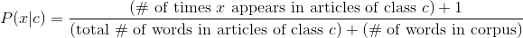

# Natural Language Processing / Naive Bayes

## Objectives

- Build a Naive Bayes classifier.
- Use it to classify documents into categories.

# Naive Bayes

## Bayes Theorem

What is Bayes theorem?

$ p(A|B) = \dfrac{p(B|A) \cdot p(A)}{p(B)} $

## Bayes Theorem Quick Proof

Why is this true?

Consider this picture.

$ A \cap B = p(A|B) \cdot p(B) = p(B|A) \cdot p(A) $

$ p(A|B) \cdot p(B) = p(B|A) \cdot p(A) $

$ p(A|B) = \dfrac{p(B|A) \cdot p(A)}{p(B)} $

## Applying Bayes to Classification

How can we apply this to classification?

$ p(C_k|\mathbf{x}) = \dfrac{p(\mathbf{x}|C_k) \cdot p(C_k)}{p(\mathbf{x})} $

$ p(C_k|\mathbf{x}) \propto p(C_k) \cdot p(\mathbf{x}|C_k) $

$ p(C_k|\mathbf{x}) \propto p(C_k) \cdot p(x_1,x_2,\dotsc,x_n|C_k) $

$ p(C_k|\mathbf{x}) \propto 
  p(C_k) \cdot p(x_1|C_k) \cdot p(x_2|C_k) \dotsm p(x_n|C_k) $

$ p(C_k|\mathbf{x}) \propto p(C_k) \prod_{i=1}^{n} p(x_i|C_k) $

## Independence Assumption Step

## Final Expression

$ p(C_k|\mathbf{x}) \propto p(C_k) \prod_{i=1}^{n} p(x_i|C_k) $

## Spam

 

How can we apply this to spam?

1. We have two categories: spam and not-spam. 
2. The probability that an email is spam is based on computable probabilities.  
3. $ p(S|\mathbf{w}) = \dfrac{p(\mathbf{w}|S) \cdot p(S)}{p(\mathbf{w})} $ 

 

How can we get all these probabilities?

1. $p(\mathbf{w}|S)$ is computed in the training step. 
2. $p(S)$ is computed in the training step. 
3. $p(\mathbf{w})$ can be ignored. 

 

Why can $p(\mathbf{w})$ be ignored?

1. Because we only care about maximum likelihood. 
2. For a specific $\mathbf{w}$ the value of $p(\mathbf{w})$ will be the same for all classes (spam and not-spam). 

## Naive Bayes

 

What is Naive Bayes Classification?

1. Naive Bayes classifies text into classes using probabilities. 
2. It assumes that the probability of each word is independent. 
3. It works well for text classification. 

## When to use it

 

Under what conditions does it perform well?

1. n (# of training observations) << p (# of features) 
2. n somewhat small __or__ p very large 
3. streams of input data (online learning) 
4. not bounded by memory; it is possible to keep partially in memory 
5. Multi-class 

## Strengths

 

What are some strengths of Naive Bayes?

1. Great performance. It is just counting probabilities. 
2. Online. As new data comes in we can add it to existing probabilities. Don't need to build models from scratch. 
3. Each class has its own parameterization. So we can add new classes. 
4. No features are discarded. Even improbable features are incorporated into model.  
5. Results are interpretable. 

## Naive Bayes and Text

 

Why should Naive Bayes be used with text?

1. Text fits the requirements. 
2. Using bag-of-words, the number of features is very large (~10,000 - 50,000) 
3. Usually this is larger than the number of samples. 
4. So n << p. 
5. Also empirical evidence shows that it works well. 

## Feature Independence

 

Why is this algorithm called naive?

Because it makes the naive assumption that the features are 
independent. 

 

Are the features in text classification independent? For example,
"rolex" and "watches" might occur together. Why is this not hurting
us?

1. The words in text classification are frequently not independent. 
2. All the algorithm cares about is the relative probabilities. 
3. Dependent features don't affect relative probabilities or the rank of classes. 

## History 

 

What is the history of Naive Bayes? 

1. Naive Bayes was studied in the 60s. 
2. It was used in the early 90s for spam filtering. 
3. In 2002 Paul Graham wrote an essay about using Naive Bayes for spam filtering which popularized it. 
4. Also Graham tweaked it to reduce the false positive rate. 

 

How did Paul Graham reduce the false positive rate?

1. Tokenized email headers as well. 
2. Did not use stemming. 
3. Decreased false positive rate by double counting words in nonspam dataset. 
4. Various other techniques. See [essay][pg-spam] for details. 

[pg-spam]: http://www.paulgraham.com/better.html

## Spam Detection

 

Consider case sensitivity? For spam detection should you lowercase
the tokens?

1. Graham in fact preserved the case. 
2. This leads to all uppercase emails going straight to the spam folder, which is what you usually want. 

 

What are false positives and negatives in the case of spam? Are they the
same?

1. False positives are non-spam emails that get classified as spam. 
2. For example, your boss's email goes into the spam folder. 
3. False negatives are spam emails that show up in your inbox. 
4. False positives are much worse than false negatives. 

 

What features of Naive Bayes helps it as a spam filter?

1. Speed. It is fast. You don't want to delay email. 
2. Online. It can be run incrementally as training set grows. Does not require rebuilding model from scratch. 
3. Low false positive. It can be tweaked to have a low false positive rate. 

## Naive Bayes Intuition

What is the Naive Bayes algorithm?

- Lets apply the algorithm to classifying articles into topics.
- *x* here is a word
- *c* is the class (possible topic)
- *X* is the document text of a specific document
- *xi* are all the words in the given document

## The Algorithm

## Algorithm Summary

 

How can we summarize the algorithm where we apply Naive Bayes?

1. For each document we calculate the probability that the document belongs to a class. 
2. Then we choose the class with the highest probability. 

 

What do we do in the training phase?

1. We calculate the data structures we need for the classification stage. 
2. *P(c)*: probability that document belongs to a class (priors). 
3. *P(x|c)*: probability that the word appears in a class (conditional probabilities). 

## Priors

What are priors?

- Priors are the likelihood of each class.
- Based on the training set, we can assign a probability to each class.

- Take a very simple example where 3 classes: sports, news, arts. 
- There are 3 sports articles, 4 politics articles and 1 arts articles. 
- This is 8 articles total. Here are our priors:

## Conditional Probability Table

How do we compute conditional probability tables?

- CPTs contain for every word how many times it appears in each class. 
- We are calculating the probability that a random word chosen from an
  article of class *c* is word *x*.

- Again, let's take our example. 
- Let's look at the word "ball". 
- Here are the occurrences in each of the 8 documents. 
- We also need the word count of the documents.

| Article    | Occurrences of "ball" | Total # of words |
| :--------- | --------------------: | ---------------: |
| Sports 1   |                     5 |              101 |
| Sports 2   |                     7 |               93 |
| Sports 3   |                     0 |              122 |
| Politics 1 |                     0 |               39 |
| Politics 2 |                     0 |               81 |
| Politics 3 |                     0 |              142 |
| Politics 4 |                     0 |               77 |
| Arts 1     |                     2 |              198 |

- Here are the values in the CPT table for the word "ball". 
- We will do these calculations for all the words that appeared in the
  training documents.

## Maximum Likelihood Estimation

How do we make a prediction?

- To make a prediction we need to pull all this together. 
- *X* is the content of an article.
- *x1, x2, x3, ...* are the words
  that make up the article.

- Assign the topic that has the largest probability. 
- Note that these "probabilities" will not add to 1.

## Example

How does this apply to a concrete example? 

- In our example, if we had the very short article of `The Giants beat
  the Nationals`, we would do the following calculations:

- The first probability is the prior.
- The remaining come from the Conditional Probability Table.
- We make the same calculation for each of the 3 classes and choose
  the class with the biggest probability.

## Zero Probabilities

 

Suppose a word never appears sports article (e.g. "bayes"). What will
*P(sports|bayes)* be?

It will be zero. 

 

If there is a sports article *X* with *bayes* in it what will its
probability *P(sports|X)* be in our model?

It will be zero. 

 

How can we fix this?

1. Use Laplace Smoothing. 
2. Replace these probabilities with 1. 

## Laplace Smoothing

Here is our new probability with Laplace Smoothing.

You can also use a different smoothing constant such as $\alpha$.

 

What is the advantage of using Laplace Smoothing?

No weird boundary behavior at zero. 

## Log Likelihood

A common convention is to replace the probabilities with log of the
probabilities.

 

What are some advantages of this?

1. Multiplication becomes addition because $\log(ab) = \log(a) + \log(b)$. 
2. Word frequencies have a Zipfian distribution. 
3. This makes their ratio vary linearly instead of exponentially. 
4. Note that this makes Laplace smoothing required. 

 

What would happen if we used log-probabilities and did not do Laplace smoothing?

$\log(0) = - \infty$. 

## Log Likelihood MLE

Using log-probabilities we actually calculate the *log maximum
likelihood error*.

 

Why does this not affect MLE?

1. Recall that if $a > b$ then $\log(a) > \log(b)$. 
2. So we can still find the maximum of the log likelihoods. 
3. We only care about rank, not about the values. 

## Summary of Naive Bayes Algorithm

- **Training**: Calculate the priors and Conditional Probability Table
- **Predict**: Calculate the MLE for the new article for each label
  and pick the max

## Various Bayes Models

What are the different Naive Bayes models?

- Multinomial Bayes
- Bernoulli Naive Bayes
- Gaussian Naive Bayes

## Multinomial Bayes

 

What is Multinomial Bayes?

1. The predictors our target variables are multiple classes. 
2. This is the Bayes algorithm we discussed. 

## Bernoulli Naive Bayes

 

What is Bernoulli Naive Bayes?

1. Features are independent booleans. 
2. For example whether a term occurs or not. 
3. Note that this is not the same as Multinomial Bayes with frequencies truncated to 1. 

 

Why is this not the same as Multinomial Bayes with frequencies
truncated to 1?

Because we are explicitly considering the absence of terms. 

 

Where might Bernoulli Naive Bayes be useful?

Useful for classifying short texts. 

## Gaussian Naive Bayes

 

What is Gaussian Naive Bayes?

Features are continuous variables. 

 

How can we modify Bayes to handle continuous variables?

One approach is suggested by name Gaussian Naive Bayes: 

1. Compute the mean and variance of each class. 
2. Assume the probability distribution is a Gaussian. 
3. Here is the probability calculation when using the Gaussian approach. 

 

Another approach is to convert it to Bernoulli Naive Bayes.

1. Use binning to discretize the features. 
2. Then use Bernoulli Naive Bayes based on whether the a particular feature in a bin is present or not. 

## Combining

 

Suppose you have a mixture of boolean and continuous features. How can
you apply Naive Bayes?

This is a limitation of Python's SciKit Learn API. 

According to Oliver Grisel, one of the main committers of SciKit Learn
here are some [options][ogrisel-bayes]. 

1. Use Bernoulli Naive Bayes and use binning for the continuous features. 
2. Create two classifiers for the two different kinds of features. For details see [here][ogrisel-bayes]. 
3. Write your own Naive Bayes classifier.

[ogrisel-bayes]: http://stackoverflow.com/questions/14254203/mixing-categorial-and-continuous-data-in-naive-bayes-classifier-using-scikit-lea

