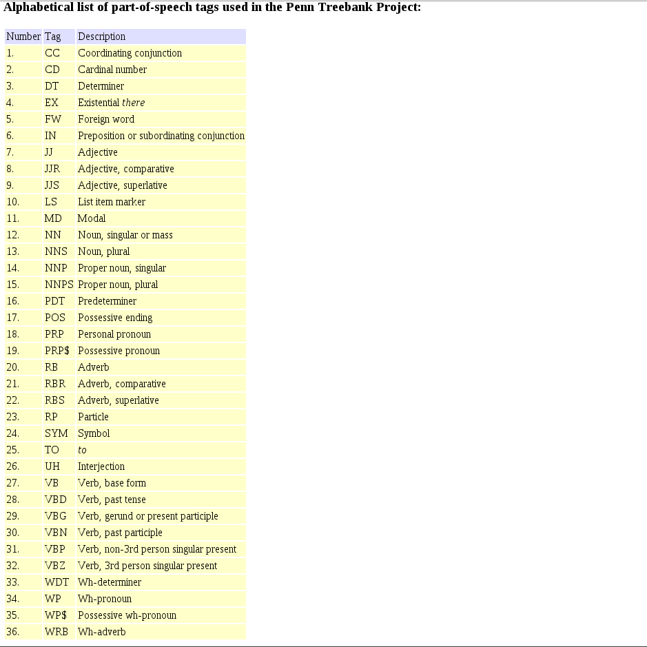

NLP
================================

Natural Lanaguge Processing is a subfield of machine learning focused on making sense of text. Text is inherently unstructured and has all sorts of tricks required for converting (vectorizing) text into a format that a machine learning algorithm can interpret.


One thing we will be covering today (relevant for a lot of applications) is Information Retrieval (ranking of documents via a search query)


IR is a subfield of NLP focusing on identifying document similarity.

Think of  a document as something we search for in a corpus (a textual data set)

We can think of a document as an article, an email, or even just a sentence.

A good analogy for a corpus we use everyday is the web search index from google.

Text pipeline
=================================

A natural language processing pipeline allows for the creation of a bag of words
over a corpus. This bag of words is composed of a vocabulary (1 column for each
word in the overall corpus.) These bags of words are then represented by word
counts over the whole corpus, with 0 marking words as not present.

The pipeline starts with tokenization. Tokenization takes the corpus or document
and splits it in to a list of strings. This list of strings then composes up a
document.

When we translate to a bag of words, assuming we already have a vocabulary, we
can then take the words that appear in the document and represent this as 0. Any
words that appears in the document is represented by a special token called OOV
(Out-of-Vocabulary).

```python
#Run this to setup nltk if its not setup already
import nltk
nltk.download('all')
```

```python
#Using the news groups data set, let's fetch all of the data
from sklearn.datasets import fetch_20newsgroups
newsgroups_train = fetch_20newsgroups(subset='train')

#Subset the data, this dataset is huge
cats = ['alt.atheism', 'sci.space']
newsgroups_train = fetch_20newsgroups(subset='train', categories=cats)
```

```python
#Tokenization example
from nltk.tokenize import word_tokenize
sentence = 'Giovanna is teaching at zipfian'
#Note how each word is an individual entry in a list.
document = word_tokenize(sentence)
print document   # ['Giovanna', 'is', 'teaching', 'at', 'zipfian']
```

The above is a tokenization example. Note that I call the list of tokens a
document. This could be any number of sentences and is purely meant as an
example.


Part of Speech Tagging
=====================================

Part of speech tagging is exactly as we remember back in english class. Given a
word, what is its part of speech? This could be a verb, noun, adverb, ...



So there's the list. Part of speech tags are used as features in all sorts of
NLP applications. Many of these are featurization techniques that are NOT bag of
words or tfidf encoding. These are used in sequential applications with trained
conditional random fields or other sequential techniques for applications
including parse trees and named entity recognition. This is further down the NLP
pipeline.

Stop Words
=============================

If we remember from information theory/decision trees, features that do not have
that much information in them are not worth keeping around. In NLP, we call
these stop words.

```python
from nltk.corpus import stopwords
these_are_stop_words = stopwords.words('english')
word_list = []
#filter words
filtered_words = [w for w in word_list if not w in stopwords.words('english')]
print these_are_stop_words

['i', 'me', 'my', 'myself', 'we', 'our', 'ours', 'ourselves', 'you', 'your', 'yours', 'yourself', 'yourselves', 'he', 'him', 'his', 'himself', 'she', 'her', 'hers', 'herself', 'it', 'its', 'itself', 'they', 'them', 'their', 'theirs', 'themselves', 'what', 'which', 'who', 'whom', 'this', 'that', 'these', 'those', 'am', 'is', 'are', 'was', 'were', 'be', 'been', 'being', 'have', 'has', 'had', 'having', 'do', 'does', 'did', 'doing', 'a', 'an', 'the', 'and', 'but', 'if', 'or', 'because', 'as', 'until', 'while', 'of', 'at', 'by', 'for', 'with', 'about', 'against', 'between', 'into', 'through', 'during', 'before', 'after', 'above', 'below', 'to', 'from', 'up', 'down', 'in', 'out', 'on', 'off', 'over', 'under', 'again', 'further', 'then', 'once', 'here', 'there', 'when', 'where', 'why', 'how', 'all', 'any', 'both', 'each', 'few', 'more', 'most', 'other', 'some', 'such', 'no', 'nor', 'not', 'only', 'own', 'same', 'so', 'than', 'too', 'very', 's', 't', 'can', 'will', 'just', 'don', 'should', 'now']
```

A lot of these words are very common in english and do not really differentiate
on any particular topic. There will be words like this on a per topic basis, but
these are in general agreed upon that they are bad language wide.

Sentence Segmentation
=======================================

We typically want to convert lists of tokens into sentences. If we look at an
example here:

```python
words = 'This is one sentence. This is another sentence.'
document = word_tokenize(words)
print document

['This', 'is', 'one', 'sentence.', 'This', 'is', 'another', 'sentence', '.']
```

This isn't what we want! What if instead, we do sentence boundary detection?

```python
sent_tokenizer=nltk.data.load('tokenizers/punkt/english.pickle')
sents = sent_tokenizer.tokenize(words)
print sents

['This is one sentence.', 'This is another sentence.']
```

This makes a little more sense. Now let's turn these "documents" into tokens.

```python
def to_doc(sentences):
    ret = []
    for sentence in sentences:
        ret.append(word_tokenize(sentence))
    return ret

print to_doc(sents)

[['This', 'is', 'one', 'sentence', '.'], ['This', 'is', 'another', 'sentence', '.']]
```

That looks better. Now that we have two documents, we can think about how to do
all sorts of techniques on them.

Textual Transformations/Pre processing
===================================

When we are dealing with text, there are a lot of homogenization techniques
applied to actually getting the text into a computer parseable form. An example
of this could be as simple as lower casing words so your features generalize
better. This is known as pre processing.

Pre processing techniques can happen before or after your NLP pipeline (even
during!) It really depends on what you're looking to do with text.

Context
========================
 * N grams
 * Moving Window
 * Skip Grams
 * Sequence of features

NGrams
================================

NGrams if we remember are strings of word sequences. NGrams can be individual
tokens or multi word sequences. Very similar to a moving window. An example of
ngrams:

```python
from nltk.util import ngrams
sentence = 'the rain in Spain falls mainly on the plain'
n = 6
sixgrams = ngrams(sentence.split(), n)
for grams in sixgrams:
  print grams

('the', 'rain', 'in', 'Spain', 'falls', 'mainly')
('rain', 'in', 'Spain', 'falls', 'mainly', 'on')
('in', 'Spain', 'falls', 'mainly', 'on', 'the')
('Spain', 'falls', 'mainly', 'on', 'the', 'plain')
```

How would we use this in practice? Bag of words vectorization perhaps?

```python
from sklearn.feature_extraction.text import TfidfVectorizer
vectorizer = TfidfVectorizer(max_df=0.8,
                             stop_words='english',
                             ngram_range=(1,2))
X = vectorizer.fit_transform([sentence])
print X

  (0, 8)    0.333333333333
  (0, 7)    0.333333333333
  (0, 6)    0.333333333333
  (0, 5)    0.333333333333
  (0, 4)    0.333333333333
  (0, 3)    0.333333333333
  (0, 2)    0.333333333333
  (0, 1)    0.333333333333
  (0, 0)    0.333333333333
```

Moving Window
=================

If we remember moving window, just note that ngrams are a textual moving window.

This is very similar to images.

Skipgram
==================================

the set of 1-skip-2-grams includes all the bigrams (2-grams), and in addition
the subsequences for the sentence:

```
the rain in Spain falls mainly on the plain

the in, rain Spain, in falls, Spain mainly, mainly the and on plain.
```

Sequence of Features
==================================

Feature sequencing would be used with part of speech tagging (think features per
token) to identify named entities such as people.

Unicode
===================================

```python
unicode('abcdef')
u'abcdef'
s = unicode('abcdef')
print type(s)
#stayed the same
print type(s.replace("abc","123"))
#converts to byte string
print type(str(s))
#converts to unicode
print type(s.decode('utf8'))
#encode unicode to bytestring
print type(s.encode())

def to_unicode(word):
   try:
     return word.encode('latin-1').decode('utf8')
   except:
     return ''

to_unicode(s)
```

General idea: Start with utf8, convert to unicode in the middle, write back to
bytestrings.

Big Picture
============================

Let's go over a simple example.

Sample sentence:

I banked on going to the river bank today.

Let's start with the flow:

```
Tokenization ----> Sentence segmentation ----> Stemming/Lemmatization ---->
stop words ----> Bag of words/TFIDF
```

Tokenization
=====================

```python
['I', 'banked', 'on', 'going', 'to', 'the', 'river', 'bank', 'today', '.']
```

Document Creation
======================

Remember: a document is a list of lists where each list is a list of strings
that contains one token.

```python
[['I', 'banked', 'on', 'going', 'to', 'the', 'river', 'bank', 'today', '.']]
```

lower case
=========================

```python
[['i', 'banked', 'on', 'going', 'to', 'the', 'river', 'bank', 'today', '.']]
```

Stemming/Lemmatization
=============================================

```python
[['i', 'bank', 'on', 'go', 'to', 'the', 'river', 'bank', 'today', '.']]
```

Remove stop words
=====================================

```python
[['bank', 'on', 'go', 'to', 'the', 'river', 'bank', 'today', '.']]
```

Information Retrieval
=================================================

IR is a subfield of natural language processing used for understanding similar documents. We can think of similar documents as a web search problem.

Whenever you search a website, tfidf is what a lot of websites to do bring up relevant web pages for a query.

TFIDF is a relevance measure. It is used for identifying documents that are related to a search query.

A search query itself is also a document.

If we remember documents are word counts based on a vocab. Search queries get encoded in the same way and then compared against the search engine to identify and rank candidate search results.

Documents are stored in a data structure called an inverted index. An inverted index is a reverse store of words to documents.

TO build an inverted index first a forward index mapping words to document occurrences is built.

In this case, it would look something like:

```
T[0] = "it is what it is"
T[1] = "what is it"
T[2] = "it is a banana"
```

This process is encapsulated by our tokenization process from before. Basically, we store full text documents and occurrences in a database. We use this to build an inverted index which we then do seaerch queries against.

This will look something like:

```
"a":      {2}
"banana": {2}
"is":     {0, 1, 2}
"it":     {0, 1, 2}
"what":   {0, 1}
```

Note that the inverted index is composed of our vocab.

Let's remind ourselves of the tfidf formula and dive in to what it means to be a relevance measure.

In a document d with term t:

```
tfidf(t,d) = tf(t,d) * idf(t)
```

Concretely, we take a document from the postings list (and even search queries!)

and based on the term frequencies and document frequencies compute a score for each term.

We then use this for identifying documents relevant to a search query.

Concretely:

```
idf(t, D) = log(N / (1 + number of documents containing term t ))
```

where N is the number of documents in the corpus.

idf is again the amount of information an individual word provides.

Let's run through how this works using our inverted indices.

Documents
=========================

1. I am teaching at Zipfian Academy.
2. There are students learning at zipfian Academy.
3. Students teach each other at Zipfian Academy.
4. Students are learning from other students.

The first step is to remove stop words, stem and lowercase. Now we can calculate the Term Frequency.

**Term Frequency (tf)**

| document | teach | zipfian | academy | student | learn |
| -------- | ----- | ------- | ------- | ------- | ----- |
|        1 |     1 |       1 |       1 |       0 |     0 |
|        2 |     0 |       1 |       1 |       1 |     1 |
|        3 |     1 |       1 |       1 |       1 |     0 |
|        4 |     0 |       0 |       0 |       2 |     0 |

This is our document table. Each document has word counts. Let's compute some tfidf scores.

```
tfidf(t, d) = tf(t, d) * idf(t)
idf(t, D) = log(N / (1 + number of documents containing term t) )
```

**Inverse Document Frequency (idf)**

```
| word    | df |                 idf |     idf |
| ------- | -- | ------------------- | ------- |
| teach   |  2 | `log (4 / (1 + 2))` | 0.28768 |
| zipfian |  3 | `log (4 / (1 + 3))` |     0.0 |
| academy |  3 | `log (4 / (1 + 3))` |     0.0 |
| student |  3 | `log (4 / (1 + 3))` |     0.0 |
| learn   |  1 | `log (4 / (1 + 1))` | 0.69315 |
```

After formula applications:


 **Term Frequency - Inverse Document Frequency (tfidf)**

| document |   teach | zipfian | academy | student |   learn |
| -------- | ------- | ------- | ------- | ------- | ------- |
|        1 | 0.28768 |     0.0 |     0.0 |     0.0 |     0.0 |
|        2 |     0.0 |     0.0 |     0.0 |     0.0 | 0.69315 |
|        3 | 0.28768 |     0.0 |     0.0 |     0.0 |     0.0 |
|        4 |     0.0 |     0.0 |     0.0 |     0.0 |     0.0 |
