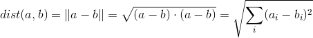
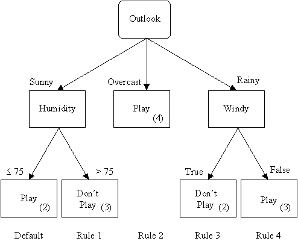

1. [k Nearest Neighbors](#k-nearest-neighbors-knn)
2. [Decision Trees](#decision-trees)


# k Nearest Neighbors (kNN)

__INPUTS:__ Nominal (discrete) or Continuous

__OUTPUTS:__ Nominal (discrete) or Continuous

k Nearest Neighbors is another classifier that is very simple to implement. Using a distance metric, you determine which k data points are closest to the one you put in and give each of them a vote on the prediction.

### Pseudocode

To train the model, all you need to do is save the training data. There's absolutely no preprocessing that can be done.

To predict a new value, here's the pseudocode:

```
For datapoint in training set:
    calculate distance from datapoint to new_value
Order distances in increasing order and take the first k
Take the label with the most votes
```

### kNN Tradeoffs

#### Why kNN
* Really easy to train (just save all the data)
* Easily works with any number of classes
* Easy to add new training datapoints

#### Why not kNN
* Really slow to predict (especially if you have a lot of features)


### Distance metrics

There are two main distance metrics used for kNN: euclidean distance and cosine similarity.

#### Euclidean distance
*Euclidean distance* is the distance metric you've probably heard of before:



#### Cosine Similarity
*Cosine Similarity* is another commonly used distance metric. It's measuring the angle between the two vectors.


# Decision trees
 
We will using a [decision tree classifier](http://en.wikipedia.org/wiki/Decision_tree_learning) to predict.  Decision trees are one of the most popular and widely used algorithms. Most classifiers (SVM, kNN, Neural Nets) are great at giving you a (somewhat) accurate result, but are often black boxes. With these algorithms it can be hard to interpret their results and understand ___why___ a certain instance was assigned a label. Decision trees are unique in that they are very flexible and accurate while also being easily interpreted.



__INPUTS:__ Nominal (discrete) or Continuous

__OUTPUTS:__ Nominal (discrete) or Continuous

__(basically anything in and anything out)__


### Decision Tree Tradeoffs
#### Why Decision Trees

* Easily interpretable
* Handles missing values and outliers
* [non-parametric](http://en.wikipedia.org/wiki/Non-parametric_statistics#Non-parametric_models)/[non-linear](http://www.yaksis.com/static/img/02/cows_and_wolves.png)/model complex phenomenom
* Computationally _cheap_ to ___predict___
* Can handle irrelevant features
* Mixed data (nominal and continuous)

#### Why Not Decision Trees

* Computationally _expensive_ to ___train___
* Greedy algorithm (local optima)
* Very easy to overfit

## How to build a Decision Tree
How to predict with a decision tree it pretty clear: you just answer the questions and follow the path to the appropriate *leaf* node. But how do we build a decision tree? How do we determine which feature we should split on? This is the crux of the decision tree algorithm.

We will start by dealing with a particular type of decision tree, where we only do binary splits. To do a binary split:

* for a categorical variable, choose either value or not value (e.g. sunny or not sunny)
* for a continuous variable, choose a threshold and do > or <= the value (e.g. temperature <75 or >=75)

### Information Gain
In order to pick which feature to split on, we need a way of measuring how good the split is. This is what *information gain* is for. The *gini impurity* is another alternative, which we'll discuss later.

First, we need to discuss *entropy*. The entropy of a set is a measure of the amount of disorder. Intuitively, if a set has all the same labels, that'll have low entropy and if it has a mix of labels, that's high entropy. We would like to create splits that minimize the entropy in each size. If our splits do a good job splitting along the boundary between classes, they have more predictive power.

The intuition of entropy is more important than the actual function, which follows.


Here, P(c) is the percent of the group that belongs to a given class.

If you have a collection of datapoints, the entropy will be large when they are evenly distributed across the classes and small when they are mostly the same class. Here's a graph to demonstrate what entropy looks like:


So we would like splits that minimize entropy. We use *information gain* to determine the best split:


Here, S is the original set and D is the splitting of the set (a partition). Each V is a subset of S. All of the V's are disjoint and make up S.

### Gini impurity

The *Gini impurity* is another way of measuring which split is the best. It's a measure of this probability:

* Take a random element from the set
* Label it randomly according to the distribution of labels in the set
* What is the probability that it is labeled incorrectly?

This is the gini impurity:


### Pseudocode
To build our tree, we use a brute force method. We try literally every possibility for splitting at each node and choose the one with the best information gain. Here's the pseudocode for building a Decision Tree:

```
function BuildTree:
    If every item in the dataset is in the same class
    or there is no feature left to split the data:
        return a leaf node with the class label
    Else:
        find the best feature and value to split the data 
        split the dataset
        create a node
        for each split
            call BuildTree and add the result as a child of the node
        return node
```


## Pruning
As is mentioned above, Decision Trees are prone to overfitting. If we have a lot of features and they all get used in building our tree, we will build a tree that perfectly represents our training data but is not general. A way to relax this is *pruning*. The idea is that we may not want to continue building the tree until all the leaves are pure (have only datapoints of one class). There are two main ways of pruning: *prepruning* and *postpruning*.

### Prepruning
*Prepruning* is making the decision tree algorithm stop early. Here are a few ways that we preprune:

* leaf size: Stop when the number of data points for a leaf gets below a threshold
* depth: Stop when the depth of the tree (distance from root to leaf) reaches a threshold
* mostly the same: Stop when some percent of the data points are the same (rather than all the same)
* error threshold: Stop when the error reduction (information gain) isn't improved significantly.

### Postpruning
As the name implies, *postpruning* involves building the tree first and then choosing to cut off some of the leaves (shorten some of the branches, the tree analogy really works well here).

Here's the psuedocode:

```
function Prune:
    if either left or right is not a leaf:
        call Prune on that split
    if both left and right are leaf nodes:
        calculate error associated with merging two nodes
        calculate error associated without merging two nodes
        if merging results in lower error:
            merge the leaf nodes
```


## Decision Tree Variants

As noted above, there are several decisions to be made when building a decision tree:

* Whether to split categorial features fully or binary
* Whether to use information gain or Gini impurity
* If and how to do pruning

There is some terminology to the different variants. Some of them are proprietary algorithms so we don't yet know all the parts.

#### ID3
Short for Iterative Dichotomiser 3, the original Decision Tree algorithm developed by Ross Quinlan (who's responsible for a lot of proprietary decision tree algorithms) in the 1980's.

* designed for only categorial features
* splits categorical features completely
* uses entropy and information gain to pick the best split

#### CART
Short for Classification and Regression Tree was invented about the same time as ID3 by Breiman, Friedman, Olshen and Stone. The CART algorithm has the following properties:

* handles both categorial and continuous data
* always uses binary splits
* uses gini impurity to pick the best split

Algorithms will be called CART even if they don't follow all of the specifications of the original algorithm.

#### C4.5
This is Quinlan's first improvement on the ID3 algorithm. The main improvements are:

* handles continuous data
* implements pruning to reduce overfitting

There is now a **C5.0** which is supposedly better, but is propietary so we don't have access to the specifics of the improvements.

#### In practice

In practice:

* We always implement pruning to avoid overfitting
* Either gini or information gain is acceptable
* Sometimes fully splitting categorial features is preferred, but generally we air on the side of binary splits (simpler and doesn't run into issues when a feature has many potential values)

In `sklearn` ([documentation](http://scikit-learn.org/stable/modules/generated/sklearn.tree.DecisionTreeClassifier.html#sklearn.tree.DecisionTreeClassifier))

* Pruning with `max_depth`, `min_samples_split`, `min_samples_leaf` or `max_leaf_nodes`
* gini is default, but you can also choose entropy
* does binary splits (you would need to binarize categorial features)


## Regression Trees

You can also use Decision Trees for regression! Instead of take a majority vote at each leaf node, if you're trying to predict a continuous value, you can average the values. You can also use a combination of decision trees and linear regression on the leaf nodes (called *model trees*).

