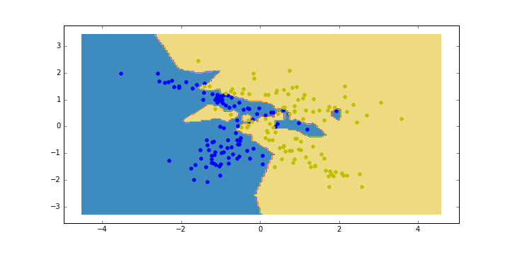

% Non-Parametric Learners: KNN, Decision Trees
% [Isaac Laughlin](isaac.laughlin@galvanize.com)
% May 9, 2016

## Objectives

At the end of today's lecture you should:

1. Be able to describe the KNN algorithm.
1. Describe the curse of dimensionality.
1. Recognize the conditions under which the curse may be problematic.
1. Enumerate strengths and weaknesses of KNN.

## KNN

## New data point

## KNN

## The KNN algorithm

Training:

1. Store all data.

Prediction:

1. Calculate the distance from new point to all points in dataset.
1. Keep the k nearest points to new point.
1. Predict the majority label.

## What's k?

## 1-neighbor

## 3-neighbor

## 10-neighbor

## 100-neighbor

## Distance Metrics

So far we  haven't been explicit about what distance metrics we're using. Some choices:

* Euclidean: $$ \sqrt{\sum_i (a_i - b_i)^2} $$

* Manhattan: $$ \sum_i |a_i - b_i| $$

* Cosine: $$ 1 - \frac{a \cdot b}{||a|| ||b||} $$

## Variants

* One variant is to weight the votes by $\frac{1}{d_i}$ so closer points get more weight.
* Use for regression, take (optionally, weighted) mean of continuous target rather than vote.
* Approximate nearest neighbors, overcomes performance issues.

#Curse of Dimensionality

## Curse of dimensionality

## Another view

## Still another view

You have a dataset with 100 samples and one predictor.

You decide 1 predictor isn't enough so you decide to measure 10 predictors instead.

How many samples do you need to achieve the same sample density you originally had?

$$ 100 ^ 10 = 1,000,000,000,000,000,000 $$

## Last one

$$ lim_{d \rightarrow \infty} \frac{V_{sphere}(R, d)}{V_{cube}(R, d)} = lim_{d \rightarrow \infty} \frac{\frac{\pi^{d/2}R^d}{\Gamma(d/2+1)}}{(2R)^d} = lim_{d \rightarrow \infty} \frac{\pi^{d/2}}{2^d\Gamma(d/2 + 1)} = 0 $$

## Curse Takeaways

* Methods that use distance will be ineffective in high dimensions.
* High-d data is sparse and it's easy to overfit sparse data.
* Overcoming curse requires LOTS of data.

## KNN Takeaways

### Pros
* Non-parametric model. No assumptions about data required.
* Simple.
* Often effective.
* Multi-class
* Computationally cheap to train

### Cons
* Computationally expensive to make predictions.
* Can't work in high-d
* Categorical features

