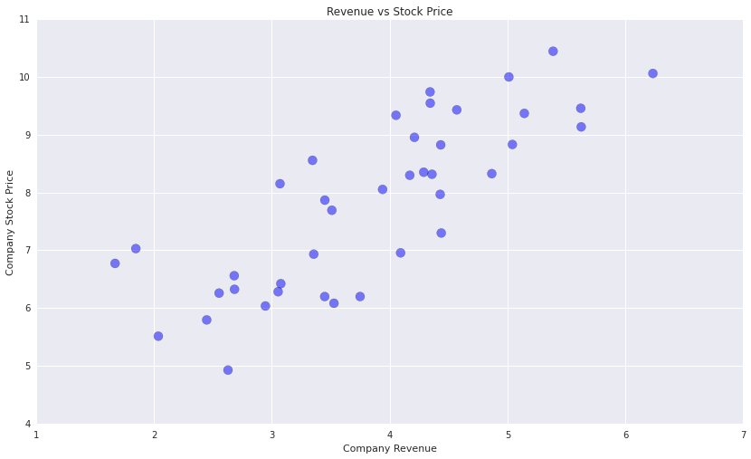
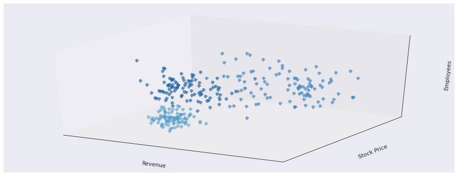

# who, what, where, when, why:

                Anmol
Data Visualization Your Boss Will Like
Zipfian Academy
March 10, 2014
Because a chart is worth 1000+ datapoints

the tools I used: ipython, pandas, matplotlib, and seaborn


```python
%pylab inline
import pandas as pd
import numpy as np
from numpy.random import randn
import statsmodels.formula.api as sm
```

    Populating the interactive namespace from numpy and matplotlib


    //anaconda/lib/python2.7/site-packages/pandas/io/excel.py:626: UserWarning: Installed openpyxl is not supported at this time. Use >=1.6.1 and <2.0.0.
      .format(openpyxl_compat.start_ver, openpyxl_compat.stop_ver))


#the essentials: bar charts

Say you worked at zipfian and noticed that the number of pull requests per week
seemed to be decreasing. Let's investigate.


```python
# bar_charts.0
n = 12
X = np.arange(n)
Y1 = (1-X/float(n)) * np.random.uniform(0.5,1,n)

fig, ax = plt.subplots(figsize=(14,6))
ax.bar(X, Y1, facecolor='#7A68A6', align='center')

title('Proportion of Students who made pull requests')
xlim(-.5,n)
xticks(range(0,13), range(1,13))
xlabel('week')
ylim(0,+1.1);
```


But your boss isn't happy. He says he doesn't like having to guess what each
value is since the range is so wide.


```python
fig, ax = plt.subplots(figsize=(14,6))
ax.bar(X, Y1, facecolor='#7A68A6', align='center')

title('Proportion of Students who made pull requests')
xlim(-.5,n)
xticks(range(0,13), range(1,13))
xlabel('week')
ylim(0,+1.1)

# let's add labels and remove the y-ticks
for x,y in zip(X,Y1):
    text(x-.015,  y+0.04, '%.2f'%y, ha='center', va='top')
yticks([]);
```


He says 'Good Job. This shows more information than before and looks just as
clean. However, I have a hunch that the students in the class under 35 are
decreasing at a faster rate than those over 35. Could you look into that?'


```python
# bar_charts.1
Y1 = (1-X/float(n)) * np.random.uniform(0.5,1.2,n) # age <35
Y1 = np.asarray([1 if d>1 else d for d in Y1])
Y2 = (1-X/float(n)) * np.random.uniform(0.7,1.0,n) # age >=35
Y2 = np.asarray([1 if d>1 else d for d in Y2])

fig, ax = plt.subplots(figsize=(14,6))
width=.35
ax.bar(X,       Y1, width=width, facecolor='#7A68A6', label='Students under 35',     align='center')
ax.bar(X+width, Y2, width=width, facecolor='#A60628', label='Students 35 and older', align='center')

for x,y in zip(X,Y1):
    text(x-.015,  y+0.04, '%.2f'%y, ha='center', va='top')

for x,y in zip(X,Y2):
    text(x+width+.015, y+0.04, '%.2f'%y, ha='center', va='top')

title('Proportion of Students who made pull requests')
xlim(-.5,n)
ylim(0,+1.1)
xticks(range(0,13), range(1,13))
xlabel('week')
yticks([])
legend();
```


'Hmm, interesting... However I think this better suited for comparing the 2
groups of students against each other for a given week. I was more interested in
seeing how their distributions look..'


```python
# bar_charts.2
fig, ax = plt.subplots(figsize=(14,8))
ax.bar(X, Y1, facecolor='#7A68A6', label='Students under 35', align='center')
ax.bar(X, -Y2, facecolor='#A60628', label='Students 35 and older', align='center')

for x,y in zip(X,Y1):
    text(x, y+0.05,  '%.2f'%y, ha='center', va='bottom')

for x,y in zip(X,Y2):
    text(x, -y-0.05, '%.2f'%y, ha='center', va='top')

title('Proportion of Students who made pull requests')
xlim(-.5,n)
ylim(-1.25,+1.25)
xticks(range(0,13), range(1,13))
xlabel('week')
yticks([])
legend();
```


#side note: boxplots

Now let's say your boss is interested in the distributions over all the weeks
and wants to see the mean and quantiles.


```python
# boxplots.0
plt.boxplot((Y1, Y2));
```


```python
# boxplots.1
import seaborn as sns
sns.boxplot((Y1, Y2), names=['< 35', '>= 35'], color=['#7A68A6', '#A60628'], linewidth=2, alpha=.6)
title('Proportion of Students who made pull requests');
```


#the essentials: scatter plots

Now let's say you work at a young company here in the Mission. Your boss is
interested in how your company compares against the 40 physically closest
competitors. So you acquire their average stock price for the last week, their
total revenue from last year, and their company sizes and standardize all the
variables.


```python
### [reset kernel] ###
%pylab inline
# scatter_plots.0
n = 40
rev = np.random.normal(4,1,n)
price = rev + np.random.normal(4,1,n)

fig, ax = plt.subplots(figsize=(14,8))
ax.set_xlabel('Company Revenue')
ax.set_ylabel('Company Stock Price')

plt.scatter(rev, price, s=100, alpha=.5)
title('Revenue vs Stock Price');
```

    Populating the interactive namespace from numpy and matplotlib





You see a correlation between the two variables and now want to investigate this
relationship with the number of employees. So let's scale the size of the marker
to represent employee size.


```python
# scatter_plots.1
sizes = rev*10 + price + np.random.normal(5,5,n)

fig, ax = plt.subplots(figsize=(14,8))
ax.set_xlabel('Company Revenue')
ax.set_ylabel('Company Stock Price')

plt.scatter(rev, price, s=sizes*20, alpha=.6)
title('Revenue vs Stock Price (size relative to #employees)');
```


You think the plot looks pretty good but boss wants it to be web ready so we
will pretty it up by adding the company names, removing the arbitray x and y
ticks as well as adding color showing which axis they are leaning towards
(revenue or stock price).


```python
# scatter_plots.2
names = ['a','bar','c','d','e','foo','g','h','i','j','k','l','m','n','o']*10

fig, ax = plt.subplots(figsize=(14,8))
ax.set_xlabel('Company Revenue')
ax.set_ylabel('Company Stock Price')

T = np.arctan2(price,rev)
plt.scatter(rev, price, s=sizes*20, c=T, alpha=.6, cmap='winter')
title('Revenue vs Stock Price (size relative to #employees)')

for x,y,name in zip(rev, price, names):
    text(x, y+.35, name, ha='center', va= 'bottom', fontsize=10)

# since x and y on arbitrary scales
xticks([])
yticks([]);
```


Boss says 'Great, that's going to look good on the site. Now can you show me the
distributions of both variables as well as the best fit line through the
points?'. We have just the tool for that: seaborn regplots.


```python
# # scatter_plots.3, for the geek boss
# import seaborn as sns
# from scipy import stats
# import pandas as pd

# sns.set(palette="Blues_r")
# sns.regplot(rev, price, corr_func=stats.spearmanr, ci=95, xlabel='Company Revenue', ylabel='Company Stock Price', size=8)
# # still need to remove ticks
```

#side note: histograms and kernel density estimate

'But wait, wheres by histogram and kde of the employee sizes?'


```python
# histograms and kernel density estimates
hist(sizes, normed=True)
pd.Series(sizes).plot(kind="kde", lw=3, style='k--');
```


more: can do more advanced KDEs with sklearn.

#the essentials: lines

Now lets say the boss wants to see the invidual attributes' score across the 40
companies in some order. Let's create line plots of each.


```python
df = pd.DataFrame({'Revenue': (rev),
                          'Stock Price': (price),
                          'Employees': (sizes)})

df.head()
```


<div style="max-height:1000px;max-width:1500px;overflow:auto;">
<table border="1" class="dataframe">
  <thead>
    <tr style="text-align: right;">
      <th></th>
      <th>Employees</th>
      <th>Revenue</th>
      <th>Stock Price</th>
    </tr>
  </thead>
  <tbody>
    <tr>
      <th>0</th>
      <td> 42.056346</td>
      <td> 3.053087</td>
      <td> 6.282771</td>
    </tr>
    <tr>
      <th>1</th>
      <td> 64.227695</td>
      <td> 4.053610</td>
      <td> 9.339339</td>
    </tr>
    <tr>
      <th>2</th>
      <td> 48.018525</td>
      <td> 4.437808</td>
      <td> 7.299621</td>
    </tr>
    <tr>
      <th>3</th>
      <td> 52.774727</td>
      <td> 4.170499</td>
      <td> 8.299727</td>
    </tr>
    <tr>
      <th>4</th>
      <td> 39.659229</td>
      <td> 3.345115</td>
      <td> 8.558624</td>
    </tr>
  </tbody>
</table>
</div>


```python
# lines.0
df = pd.DataFrame({'Revenue': (rev),
                          'Stock Price': (price),
                          'Employees': (sizes)})
df.plot(subplots=True, lw=3);
```


Boss says 'Could you put them all on one chart? I know the scales are different
but I am curious.'


```python
# lines.1
df.plot(lw=3, color=['#7A68A6', '#467821', '#A60628']);
```


Your boss is finally starting to understand what a correlation is as he sees the
revenue and stock price moving together. Let's help him out some more by showing
just those 2 variables and by putting the revenue on a secondary axis.


```python
# lines.2
df[['Stock Price', 'Revenue']].plot(secondary_y='Revenue', lw=3, color=['#467821', '#A60628']);
```


#the essentials: pie charts

Now let's say you work at restaurant and are trying to see which types of meat
people are mostly like to eat for dinner. So you gather data and calculate the
percentages. This type of data makes the most sense to show in a pie chart.


```python
### [reset kernel] ###
%pylab inline
# pie_charts.0
plt.subplots(figsize=(7,7))
fracs   = [30, 45, 10, 15]
labels  = 'Beef', 'Chicken', 'Bacon', 'Fish'

pie(fracs, labels=labels)
title("What's for dinner?");
```

    Populating the interactive namespace from numpy and matplotlib


Boss says "Cool. But that chart looks like it was made in MS Paint. Could you
pretty it up and call out 'chicken' as that's what we're trying to push next
season?"


```python
# pie_charts.1
plt.subplots(figsize=(7,7))
explode = [0.01, 0.1, 0.01, 0.01]
colors  = ['#348ABD', '#7A68A6', '#467821', '#A60628']

pie(fracs, explode=explode, labels=labels, autopct='%.0f%%', shadow=True, colors=colors)
title("What's for dinner?");
```


#does your chart pass the xkcd test?


```python
with plt.xkcd():
    n = 12
    X = np.arange(n)
    Y1 = (1-X/float(n)) * np.random.uniform(0.5,1.2,n) # age <35
    Y2 = (1-X/float(n)) * np.random.uniform(0.7,1.0,n) # age >=35

    fig, ax = plt.subplots(figsize=(14,8))
    ax.bar(X, +Y1, facecolor='#7A68A6', label='Students under 35', align='center')
    ax.bar(X, -Y2, facecolor='#A60628', label='Students 35 and older', align='center')

    for x,y in zip(X,Y1):
        text(x, y+0.05, '%.2f'%y, ha='center', va= 'bottom')

    for x,y in zip(X,Y2):
        text(x, -y-0.05, '%.2f'%y, ha='center', va= 'top')

    title('Proportion of Students who made pull requests')
    xlim(-.5,n)
    ylim(-1.25,+1.25)
    xticks(range(0,13), range(1,13))
    xlabel('week')
    yticks([])
    legend();
```


```python
with plt.xkcd():
    Y1 = (1-X/float(n)) * np.random.uniform(0.5,1.2,n) # age <35
    Y1 = np.asarray([1 if d>1 else d for d in Y1])
    Y2 = (1-X/float(n)) * np.random.uniform(0.7,1.0,n) # age >=35
    Y2 = np.asarray([1 if d>1 else d for d in Y2])

    import seaborn as sns
    sns.boxplot((Y1, Y2), names=['< 35', '>= 35'], color=['#7A68A6', '#A60628'], linewidth=2)
    title('Proportion of Students who made pull requests');
```


```python
### [reset kernel] ###
%pylab inline

with plt.xkcd():
    n = 15
    rev = np.random.normal(4,1,n)
    price = rev + np.random.normal(4,1,n)
    sizes = rev*10 + price + np.random.normal(5,5,n)
    names = ['a','b','c','d','e','f','g','h','i','j','k','l','m','n','o']*10

    fig, ax = plt.subplots(figsize=(14,8))
    ax.set_xlabel('Company Revenue')
    ax.set_ylabel('Company Stock Price')

    T = np.arctan2(price,rev)
    plt.scatter(rev, price, s=sizes*20, c=T, alpha=.6, cmap='winter')
    title('Revenue vs Stock Price (size relative to #employees)')

    for x,y,name in zip(rev, price, names):
        text(x, y+.35, name, ha='center', va= 'bottom', fontsize=10)

    # since x and y on arbitrary scales
    xticks([])
    yticks([]);
```

    Populating the interactive namespace from numpy and matplotlib


    WARNING: pylab import has clobbered these variables: ['colors']
    `%matplotlib` prevents importing * from pylab and numpy


```python
with plt.xkcd():
    plt.subplots(figsize=(7,7))
    labels  = 'Beef', 'Chicken', 'Ba', 'Fish'
    fracs   = [30, 45, 10, 15]
    explode = [0, 0.1, 0, 0]

    pie(fracs, explode=explode, labels=labels, autopct='%.0f%%', shadow=True, colors=['#348ABD', '#7A68A6', '#467821', '#A60628'])
    title("What's for dinner?");
```


#other:

Now let's say you're back to working at the Mission based company and you've now
gathered about 300 datapoints and performed a cluster analysis to pull out 3
clusters. These clusters are awesome but on 3 dimensions so it may be difficult
to visualize in an intuitive fashion for your boss. We'll try a 3d scatterplot
using color coding.


```python
# not_so_essential:3d scatter
%pylab inline
from mpl_toolkits.mplot3d import Axes3D

class1 = 0.6 * random.standard_normal((100,3))
class2 = 1.0 * random.standard_normal((100,3)) + array([2,2,0])
class3 = 0.3 * random.standard_normal((100,3)) + array([0,-1,-2])

fig = plt.figure(figsize=(16,6))
ax = fig.gca(projection='3d')
ax.plot(class1[:,0], class1[:,1], class1[:,2], 'o', alpha=.6)
ax.plot(class2[:,0], class2[:,1], class2[:,2], 'o', alpha=.6)
ax.plot(class3[:,0], class3[:,1], class3[:,2], 'o', alpha=.6)
ax.set_xlabel('Revenue')
ax.set_ylabel('Stock Price')
ax.set_zlabel('Employees')
xticks([])
yticks([])
ax.set_zticks([]);
```

    Populating the interactive namespace from numpy and matplotlib





#more: D3, Bokeh, ggplot python port, etc.
