% Putting it all together
% Tanya Kutsenko
% August 19, 2016

## Objectives

At the end of the day, you'll be able to:

* Use Pipeline to develop more compact and comprehensive code
* Build your own transformer and estimator
* Use FeatureUnion for running parallel processes for features extraction
* Use GridSearchCV for model tuning

## Before

We usually start modeling with simple steps like:

  * Reading and splitting prepared data into train/test subsets
  * Extracting target
  * Extracting features
  * Scaling & standardizing features
  * handling outliers or missing values
  * aggregating data to a suitable grain
  * Iterate: choose model, fit, predict, print the scores

Then we want more features, and more models, and more tuning...  

Example: [Classification of text documents using sparse features](http://scikit-learn.org/stable/auto_examples/text/document_classification_20newsgroups.html)

## Why Pipeline

Why use Pipeline instead of keeping the steps separate?

* It makes code more readable
* It keeps data during intermediate steps
* It makes it easy to change the order or add/remove steps
* You only have to call fit and predict once
* Joint parameter selection: grid search over parameters of all estimators at once

## scikit-learn Pipeline

Scikit learn provides the 'Pipeline' class to manage data science pipelines:

* Chain multiple estimators into one
* All estimators in a pipeline, except the last one, must be transformers
* The last estimator may be any type (transformer, classifier, etc.)

## scikit-learn Pipeline

Pipeline Example:

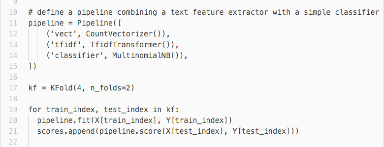

## make_pipeline

The utility function make_pipeline is a shorthand for constructing pipelines:

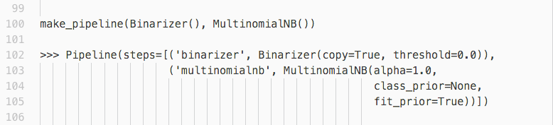

## Custom Steps

You can build your own steps:

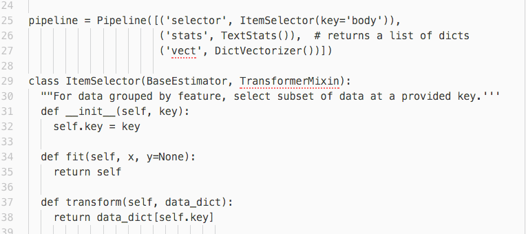

## Custom Transformers

All estimators in a pipeline, except the last one, must be transformers:

* It's just an object that responds to fit, transform, and fit_transform
* Inheriting from TransformerMixin is not required, but helps to communicate intent, and gets you fit_transform for free
* The pipeline treats these objects like any of the built-in transformers and fits them during the training phase, and transforms the data using each one when predicting

## Custom Transformers

Transformer example:

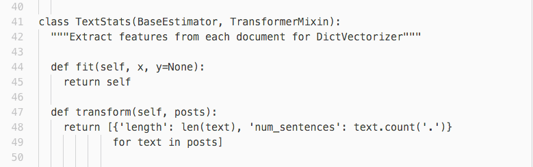

## Using FunctionTransformer

You can convert an existing Python function into a transformer with FunctionTransformer:

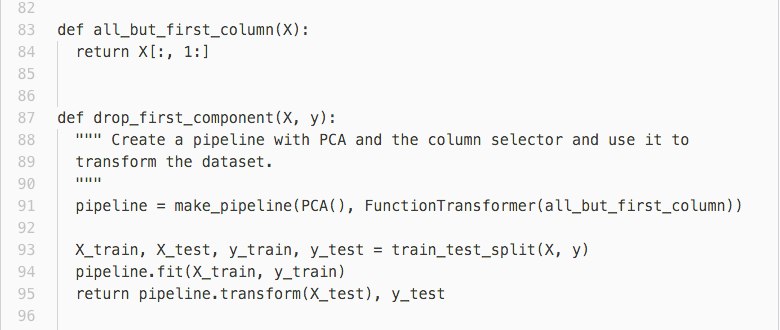

## FeatureUnion

FeatureUnion combines several transformer objects into a new transformer that combines their output:

* Each of transformer objects is fit to the data independently
* Transformers are applied in parallel
* The sample vectors they output are concatenated end-to-end into larger vectors

FeatureUnion and Pipeline can be combined to create complex models.

## FeatureUnion

FeatureUnion example:

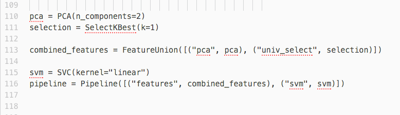

## Pipeline parameters

The purpose of the pipeline is to assemble several steps that can be cross-validated together while setting different parameters.

It enables setting parameters of the various steps using their names and the parameter name separated by a "\_\_" (\<estimator\>\_\_\<parameter\>).
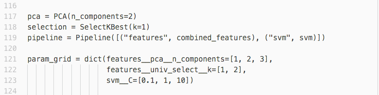

## GridSearchCV

Parameters that are not directly learnt within estimators can be set by searching a parameter space for the best Cross-validation.

The grid search provided by GridSearchCV exhaustively generates candidates from a grid of parameter values specified with the param_grid parameter.

## GridSearchCV

The following param_grid specifies that two grids should be explored:

* With a linear kernel and C values in [1, 10, 100, 1000],
* With an RBF kernel, and the cross-product of C values ranging in [1, 10, 100, 1000] and gamma values in [0.001, 0.0001].

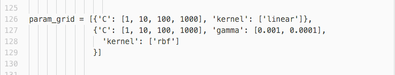

## Pipeline with GridSearchCV
All together:

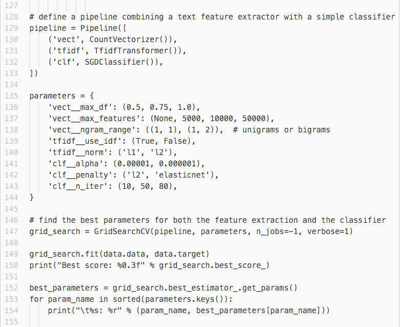

# Advanced Pipeline

## Custom Estimators

A estimator is an object that fits a model based on some training data and is capable of inferring some properties on new data. All estimators implement the fit method.

To create custom estimator, you need to implement the following interface:

  * get_params([deep])	Get parameters for this estimator
  * set_params(**params)	Set the parameters of this estimator

You can inherit from BaseEstimator and optionally the mixin classes in sklearn.base.

## Custom Estimators

Estimator example:

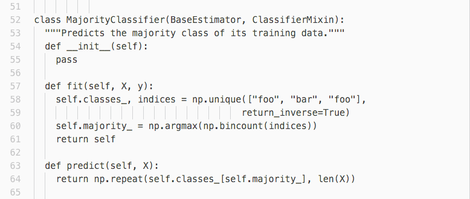

## Custom Estimators

If you do not want to make your code dependent on scikit-learn, the easiest way to implement the interface is:

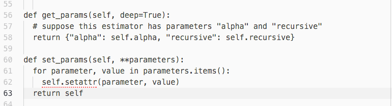

## Custom Estimators

You can check whether your estimator adheres to the scikit-learn interface and standards by running utils.estimator_checks.check_estimator on the class:

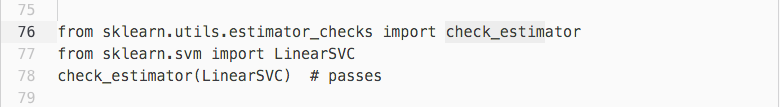

## Estimator types

Some common functionality depends on the kind of estimator passed.
This distinction is implemented using the _estimator_type attribute:

* "classifier" for classifiers
* "regressor" for regressors
* "clusterer" for clustering methods

Inheriting from ClassifierMixin, RegressorMixin or ClusterMixin will set the attribute automatically.

## Check for Mastery

* What tools can we use to develop more compact and comprehensive code?
* How can we do joint parameter selection?

## References

* [sklearn Pipeline](http://scikit-learn.org/stable/modules/generated/sklearn.pipeline.Pipeline.html)
* [sklearn.FeatureUnion](http://scikit-learn.org/stable/modules/generated/sklearn.pipeline.FeatureUnion.html#sklearn.pipeline.FeatureUnion)
* [sklearn.GridSearchCV](http://scikit-learn.org/stable/modules/generated/sklearn.grid_search.GridSearchCV.html)
* [Putting it all together](http://scikit-learn.org/stable/tutorial/statistical_inference/putting_together.html)
* [Concatenating multiple feature extraction methods](http://scikit-learn.org/stable/auto_examples/feature_stacker.html)
* [Pipeline and FeatureUnion: combining estimators](http://scikit-learn.org/stable/modules/pipeline.html)
* [Grid Search: Searching for estimator parameters](http://scikit-learn.org/stable/modules/grid_search.html)
* [Sample pipeline for text feature extraction and evaluation](http://scikit-learn.org/stable/auto_examples/model_selection/grid_search_text_feature_extraction.html)
* [Using FunctionTransformer to select columns](http://scikit-learn.org/stable/auto_examples/preprocessing/plot_function_transformer.html)
* [Feature Union with Heterogeneous Data Sources](http://scikit-learn.org/stable/auto_examples/hetero_feature_union.html)
* [Workflows in Python: Using Pipeline and GridSearchCV for More Compact and Comprehensive Code](https://civisanalytics.com/blog/data-science/2016/01/06/workflows-python-using-pipeline-gridsearchcv-for-compact-code/)
* [Using scikit-learn Pipelines and FeatureUnions](http://zacstewart.com/2014/08/05/pipelines-of-featureunions-of-pipelines.html)
