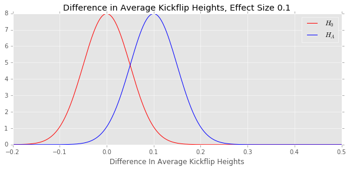
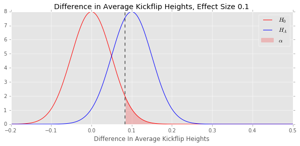
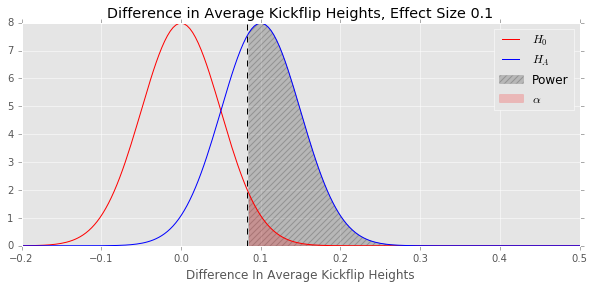
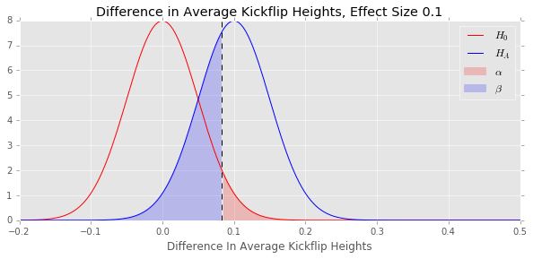
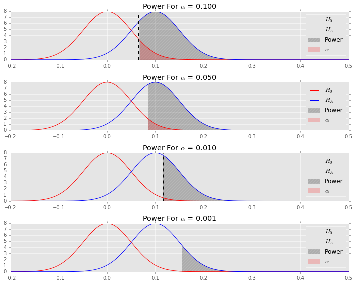
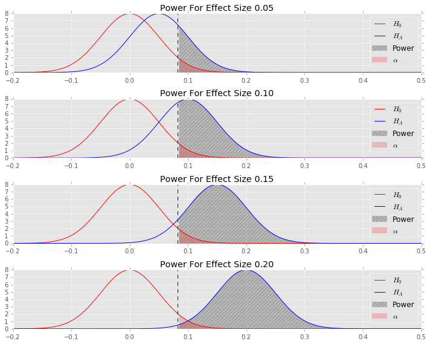
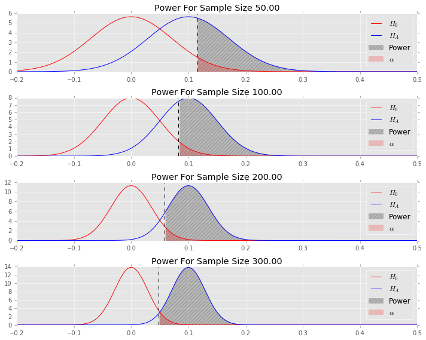
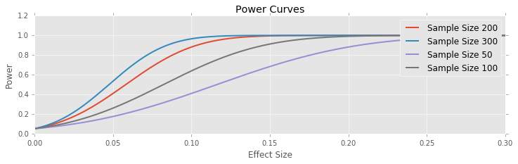
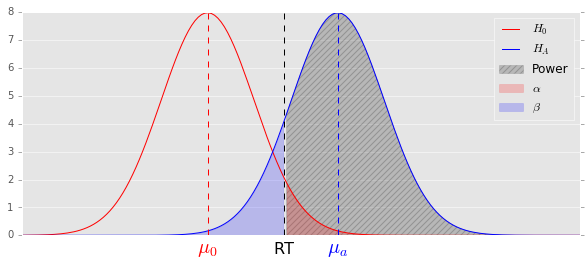

# **Statistical Power**

## 1. Hypothesis Testing: Review and Unanswered Questions

### Review of Hypothesis Testing

We have previously discussed Null Hypothesis Significance testing, a classic and popular procedure for deriving statistical information from data.  Let's review the process quickly:

#### Null Hypothesis Significance Testing Procedure

1. State a scientific yes/no question
2. Take a skeptical stance: state a null hypothesis
3. State the opposite of your null hypothesis: the alternative hypothesis
4. Create a probabilistic model of the situation when the null is true
5. Determine how surprised you need to be to reject the null: determine a rejection level alpha
6. Collect your data
7. Calculate the conditional probability of finding a result equally or more extreme than you actually observed, assuming the null is true: this is your p-value
8. Compare the p-value to your stated rejection threshold, reject the null hypothesis if the p-value is smaller than your rejection level alpha

This whole process rests on our ability to compute a **p-value**

> The **p-value** is the conditional probability of observing a result equally or more extreme than we actually observed, assuming the null hypothesis is true.

In symbols the p-value is

$$ P(\text{Observe result equally or more extreme than actual} \mid H_0) $$

We also observed that the rejection level alpha has a nice interpretation under this scheme

> The rejection level alpha is the **false positive rate under the null**.  I.e., if the null hypothesis is true, it is the probability we would collect data that falsely rejects the null hypothesis.

We call this a **false positive** or **type-1 error**.  Clearly increasing alpha results in making more false positive errors, and decreasing alpha will result in less.

  - **positive** because we rejected the null, which we think of as a positive result (our research hypothesis is true, yay!)
  - **false** because we were wrong to do so, the null hypothesis is actually true!

Fisher viewed the p-value as a direct measure of evidence against the null, Neumann and Person viewed the entire procedure as a control on the false positive rate.

### Unanswered Questions

There are a few points here we have left un-explored.

#### Bayesian Statistics

We would really, if at all possible, like to know the probability our research hypothesis is true, given the data we have collected

$$ P(H_{a} \mid \text{Data}) $$

This is **not** what the p-value measures.  Following this path leads us to a new dicipline, Bayesean Statistics, which we will touch on in the future.

#### Statistical Power

The p-value really only tells us half of the story.  It measures the rate we will falsely adopt positive beliefs, it would be wise to know how often we will flasely adopt negative beliefs.

A **false negative** or a **type 2 error** is the failure to reject a null hypothesis when it is actually false_.  As we mentioned, decreasing alpha results in less false positives, but there is a trade-off involved: it will *increase* our false negative rate.

The probability of making a false negative error, given that the null hypothesis is actually false, is called the **false negative rate**, and is denoted by beta

$$ \beta = P(\text{Fail to reject } H_0 \mid H_0 \text{ is false}) $$

More common in practice is 1 - beta, called the **statistical power** or just **power**

$$ \text{Power} = P( \text{Reject } H_0 \mid H_0 \text{ is false}) $$

Here's a summary of the relationship between all of these concepts

|             | Reject H_0           | Fail to reject H_0
|-------------|----------------------|---------------
|**H_0 false**| Correct (1 - beta)   | Type II error (beta)
|**H_0 true** | Type I error (alpha) | Correct (1 - alpha)
 

## 2. Statistical Power

### The Effect Size

Let's setup an example we can use to explore the concept of statistical power, we'll continue our theme of Matt's quest to become a better skateboarder.

Matt would like to increase the height (and therefore stylishness) of his kickflips.  After researching online, it seems like a standard approach is to change the positioning of his front foot.

His **current** foot position is like so:


this results in low kickflips that skim the ground and rarely gain much height.  His research suggests to changing his foot position like so


This change in position results in Matt dragging his front foot further along the board, and should increase the height of his kickflips.

Matt's goal is to determine whether this change actually works, does a change in foot position actually increase the height of his kickflips?

The amount that the change in foot position *truly* changes the average height of Matt's kickflips is called the **effect size**.  It is the magnitude of the **effect** of the experimental treatment (the change in foot position).  The null and alternate hypothesis can be stated in terms of the effect size

> H_0: The effect size is zero.  Changing the foot positioning does not change the average height of Matt's kickflips.

> H_a: The effect size is positive.  Changing the foot position increases the height of Matt's kickflips.

By the central limit theorem, the average heights of Matt's kickflips in any sample is normally distributed.  Assuming the necessary independence, this means that the difference between the mean height with the old foot positioning and the mean height from the new positioning, i.e. the effect size, is also normally distributed.  Under the **null hypothesis** this difference is thus normally distributed centered at zero.

We would like to say that our difference in heights is also normally distributed under the **alternate hypothesis** but this is not quite true.  The alternate hypothesis does not assume a specific effect size, just that the effect size is positive, so to determine the distribution of difference in average heights we would need to average across *all possible effect sizes* (this is what Bayes theory does).

On the other hand, if we **assume a specific, precise effect size**, then the difference in average heights **is** normally distributed.  Under this assumption, our data on mean difference in heights would be generated from a picture like this



Lets set up a z-test to detect whether we have increased our kickflip height at a level of

$$ \alpha = 0.05 $$

We'll assume that our sample size is 100, and we know the population standard deviation in height differences in 0.5 (otherwise we would have to estimate it from our data).  Under these assumptions, the distribution of kickflip heights under the null hypothesis is

$$ \text{Difference in Heights} \mid H_0 = Normal\left(0, \sigma=\frac{0.5}{\sqrt{100}}\right) $$

Then the p-value we need to get from our data to reject the null hypothesis satisfies

$$ p = F^{-1} (0.95) $$

where, as usual

$$ F^{-1} = \text{Percentile function of null distribution} $$

In our case, this computation works out to

```
null_distribution = scs.norm(0, 0.5/10)
critical_value = null_distribution.ppf(0.95)

print("Critical Value to Reject H_0: {:2.2f}".format(critical_value))

Critical Value to Reject H_0: 0.08
```

Let's plot this critical value on our plot, and shade the rejection region.



Now let's bring in our concept of power.  

As mentioned, to calculate the power, we need to assume a distribution under the **alternate hypothesis**, which is generally only possible when we can assume a specific effect size.  In practice, we assume the minimum effect size we want our test to reliably detect (we will have more to say on this point soon).  For this example, let's assume the effect size we would like to detect is a tenth of a foot difference in heights.

With this effect size, the distribution of height differences under the *alternate hypothesis* is

$$ \text{Difference in Heights} \mid H_a = Normal\left(0.1, \sigma=\frac{0.5}{\sqrt{100}}\right) $$

The power is the probability we detect an effect, when there actually is one

$$ \text{Power} = P( \text{Reject } H_0 \mid H_a ) $$

Let's add a shaded region to our plot representing the power of our test



We can easily now calculate the power of our test

```
alternate_distribution = scs.norm(0.1, 0.5/10)
critical_value = null_distribution.ppf(0.95)
power = 1 - alternate_distribution.cdf(critical_value)

print("Power of Test: {:2.2f}".format(power))

Power of Test: 0.64
```

This is not that powerful of a test, we can only detect an effect of the size we would like to 64% of the time.

Another way to look at this: our false negative rate is 0.44 (beta), we will *fail* to detect an effect 44% of the time, even when it is truly there.



### The Effect of Experimental Parameters on Power

The statistical power of a test is affected by a few different things:

  - The rejection level alpha.
  - The effect size we wish to detect.
  - The size of the sample we collect.
  
We've already discussed the relation between the power and the rejection level alpha.  As we decrease alpha we **decrease** the false positive rate, **increase** the false negative rate, and thus **decrease** the power.  We can observe the effect of this by varying the rejection level in our pictures.



The relationship between effect size and power is straightforward: it is easier to detect larger effects.  That is, as we **increase** the effect size we would like to detect, our power to detect that effect **increases**.  Said differently, it is much harder to detect minute effects than large ones.



Finally, the relationship between sample size and power is what one would expect, though its source is a bit more subtle than the other two relationships.  As we collect more data, we tighten our estimate of the sample mean (or whatever sample statistic we happen to be studying) as the standard error of the estimate decreases.  This tends to better separate the null and alternate distributions, which **increases** the power.



It is common to summarize these results in a **power curve**, which traces out the power of an experiment as the desired effect size changes.  We can get a sense for how the sample size we collect affects the power by plotting multiple power curves.




## 3. Power Calculations

### Calculating the Power for an Experiment

Let's start by computing the power for a known experiment.

The following picture represents our general setup



In the picture above, mu_0 is the assumed mean under the null hypothesis, and mu_a is the assumed mean under the alternate (so the difference is the effect size).  The black vertical line labeled "RT" is the rejection threshold (sometimes called the critical value).

To compute the power in a setup like this we first need to calculate the rejection threshold by using the percentile function of the null distribution, then compute the area under the alternate distribution to the right of the threshold.  This gives the shaded area, the power of the experiment.

```
def compute_power(n, sigma, alpha, mu0, mua):
    standard_error = sigma / n**0.5
    h0 = scs.norm(mu0, standard_error)
    ha = scs.norm(mua, standard_error)
    critical_value = h0.ppf(1 - alpha)
    power = 1 - ha.cdf(critical_value)
    return power
```

### Calculating the Sample Size Needed to Obtain a Given Power

Let's finish with a more complex computation that comes up more often in practice: we have a fixed significance level alpha, and we would like to know how large of a sample we need to collect in order to achieve a certain power.

We can express our setup as

$$ \text{Null Distribution} = Normal \left( \mu_0, SE \right) $$

$$ \text{Alternate Distribution} = Normal \left( \mu_a, SE \right) $$

where

$$ SE = \frac{\sigma}{\sqrt{n}} $$

is the standard error of the sample mean.

We need one more piece of notation, let's denote the distribution function (i.e. CDF) of a normal distribution with mean mu and standard deviation sigma as

$$ F_{\mu, \sigma} = \text{Distribution Function of Normal Distribution} $$

Then the rejection threshold (aka critical value) is defined by the relation

$$ F_{\mu_0, SE}(RT) = 1 - \alpha $$

We can standardize the null distribution by subtracting the mean and dividing by the standard error.  If we apply this standardization to the rejection threshold, we get

$$ F_{0, 1} \left( \frac{RT - \mu_0}{SE} \right) = 1 - \alpha $$

or, applying the inverse function (aka the percentile function)

$$ \frac{RT - \mu_0}{SE} = F_{0, 1}^{-1} (1 - \alpha) $$

Let's follow the same procedure for the alternate distribution, starting with the relationship

$$ F_{\mu_a, SE}(RT) = \beta $$

Following the same path, we will arrive at

$$ \frac{RT - \mu_a}{SE} = F_{0, 1}^{-1} (\beta) $$

If we subtract these two equations, the RT's cancel, and we get

$$ \frac{\mu_a - \mu_0}{SE} = F_{0, 1}^{-1} (1 - \alpha) - F_{0, 1}^{-1} (\beta) $$

Shuffling things around, we can solve for n

$$ n = \left( \frac{ \sigma ( F_{0, 1}^{-1} (1 - \alpha) - F_{0, 1}^{-1} (\beta) ) } { \mu_a - \mu_0 } \right)^2 $$

This is the formula for the sample size needed to achieve a given power (1 - beta).

```
def sample_size_needed_for_power(alpha, power, mu0, mua, sigma):
    standard_normal = scs.norm(0, 1)
    beta = 1 - power
    numerator = sigma * (standard_normal.ppf(1 - alpha) - standard_normal.ppf(beta))
    denominator = sigma * (mua - mu0)
    return (numerator / denominator) ** 2
```

Let's see how many (pairs of) kickflips we would have to perform to achieve various powers in our experiment from before

```
alpha, mu0, mua, sigma = 0.05, 0.0, 0.1, 0.5
powers = [0.5, 0.75, 0.9, 0.99, 0.999]

for power in powers:
    print("Sample Size Needed to Achive Power {:2.3f}: {}".format(
        power, sample_size_needed_for_power(alpha, power, mu0, mua, sigma)))

Sample Size Needed to Achive Power 0.500: 270.55434541
Sample Size Needed to Achive Power 0.750: 537.935370112
Sample Size Needed to Achive Power 0.900: 856.384735067
Sample Size Needed to Achive Power 0.990: 1577.04413615
Sample Size Needed to Achive Power 0.999: 2242.1038794
```

Clearly our formula does not always give an integer answer, and sample sizes should always be integers, so we really should round up to the next largest integer

```
def sample_size_needed_for_power(alpha, power, mu0, mua, sigma):
    standard_normal = scs.norm(0, 1)
    beta = 1 - power
    numerator = sigma * (standard_normal.ppf(1 - alpha) - standard_normal.ppf(beta))
    denominator = (mua - mu0)
    return math.ceil((numerator / denominator) ** 2)
```

```
for power in powers:
    print("Sample Size Needed to Achive Power {:2.3f}: {}".format(
        power, sample_size_needed_for_power(alpha, power, mu0, mua, sigma)))

Sample Size Needed to Achive Power 0.500: 68.0
Sample Size Needed to Achive Power 0.750: 135.0
Sample Size Needed to Achive Power 0.900: 215.0
Sample Size Needed to Achive Power 0.990: 395.0
Sample Size Needed to Achive Power 0.999: 561.0
```

We can check our answer using the function for computing power we created before

```
for power in powers:
    sample_size = sample_size_needed_for_power(alpha, power, mu0, mua, sigma)
    computed_power = compute_power(sample_size, sigma, alpha, mu0, mua)
    print("Power With Computed Sample Size {}: {:2.3f}".format(sample_size, computed_power))

Power With Computed Sample Size 68.0: 0.502
Power With Computed Sample Size 135.0: 0.751
Power With Computed Sample Size 215.0: 0.901
Power With Computed Sample Size 395.0: 0.990
Power With Computed Sample Size 561.0: 0.999
```
