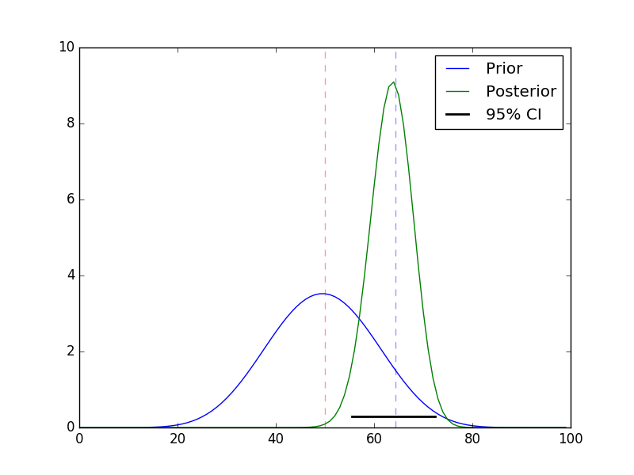

.. advanced-plotting documentation master file, created by
   sphinx-quickstart on Tue Oct 11 15:24:00 2016.
   You can adapt this file completely to your liking, but it should at least
   contain the root `toctree` directive.

Probability and data science
===============================

Before we dig into probability, one of the essential pillars of
**data science**, lets provide some perspective.  Some folks refer to
data science as
`EDA <https://en.wikipedia.org/wiki/Exploratory_data_analysis>`_
followed by predictive modeling, but there are other schools of
thought.  Here is one I like:

**Data science is OSEMN**

  * Obtaining data
  * Scrubbing data
  * Exploring data
  * Modeling data
  * iNterpreting data
		    
At a very high level we are going to understand:

  1. Basic Probability Theory
  2. Probability distributions and application of probability distributions

A motivating example
------------------------

Starting with some data we want to use statsitics to answer certain kinds of questions:

  * How well does the data match some assumed (null) distribution [hypotehsis testing]?
  * If it doesn’t match well can we estiamte the parameters to approximate it [point estimate]?
  * How accurate are the parameter estimates [interval estimates]?
  * Can we estimate the entire distribution [function estimation or approximation]?

Most commonly, the computational approaches used to address these questions will involve

  * Least squeares
  * Numerical optimization
  * maximum likelihood
  * Numerical optimization
  * Expectation maximization (EM)
  * Monte Carlo methods
  * Variational methods
  * Simulation of null distribution (bootstrap, permutation)
  * Estimation of posterior density (Monte Carlo integration, MCMC, EM)

**Is my coin fair?**

.. code-block:: python

   import numpy as np
   import matplotlib.pyplot as plt
   import scipy.stats as st

   n = 100
   pcoin = 0.62 # actual value of p for coin
   results = st.bernoulli(pcoin).rvs(n)
   h = sum(results)
   print("we observed %s heads out of %s"%(h,n))

 
.. code-block:: none

   we observed 67 heads out of 100
   The expected distribution for a fair coin is mu=50.0, sd=5.0

The **Expected distribution** for fair coin

.. code-block:: python

   p = 0.5
   rv = st.binom(n,p)
   mu = rv.mean()
   sd = rv.std()
   print("The expected distribution for a fair coin is mu=%s, sd=%s"%(mu,sd))

.. code-block:: none

   The expected distribution for a fair coin is mu=50.0, sd=5.0

**Hypothesis testing**

If we move into a hypothesis testing framework we can use the **binomial test**

.. code-block:: python

   print("binomial test - %s"%st.binom_test(h, n, p))

.. code-block:: none

   binomial test - 0.000873719836912
   
or a **normal approximation for binomal** (Z-test with continuity correction)

.. code-block:: python

   z = (h-0.5-mu)/sd
   print("normal approx for binomial - %s"%(2*(1 - st.norm.cdf(z))))

.. code-block:: none

   normal approx for binomial - 0.000966848284768

**Simulation**
   
We **can use simulation** to test things as well

.. code-block:: python

   nsamples = 100000
   xs = np.random.binomial(n, p, nsamples)
   print("simulation p-value - %s"%(2*np.sum(xs >= h)/(xs.size + 0.0)))

.. code-block:: none   

   simulation p-value - 0.00062

.. topic:: Interpretation
	   
	  Can anyone interpret this p-value based on this level of significance (assuming :math:`\alpha=0.05`)
	      

**Maximum likelihood estimation (MLE)**

.. code-block:: python

   print("Maximum likelihood %s"%(np.sum(results)/float(len(results))))
   bs_samples = np.random.choice(results, (nsamples, len(results)), replace=True)
   bs_ps = np.mean(bs_samples, axis=1)
   bs_ps.sort()
   print("Bootstrap CI: (%.4f, %.4f)" % (bs_ps[int(0.025*nsamples)], bs_ps[int(0.975*nsamples)]))

.. code-block:: none

   Maximum likelihood 0.67
   Bootstrap CI: (0.5800, 0.7600)

**Bayesian estimation**
   
The **Bayesian approach** directly estimates the posterior
distribution, from which all other point/interval statistics can be
estimated.

.. code-block:: python
		
   fig  = plt.figure()
   ax = fig.add_subplot(111)

   a, b = 10, 10
   prior = st.beta(a, b)
   post = st.beta(h+a, n-h+b)
   ci = post.interval(0.95)
   map_ =(h+a-1.0)/(n+a+b-2.0)

   xs = np.linspace(0, 1, 100)
   ax.plot(prior.pdf(xs), label='Prior')
   ax.plot(post.pdf(xs), label='Posterior')
   ax.axvline(mu, c='red', linestyle='dashed', alpha=0.4)
   ax.set_xlim([0, 100])
   ax.axhline(0.3, ci[0], ci[1], c='black', linewidth=2, label='95% CI');
   ax.axvline(n*map_, c='blue', linestyle='dashed', alpha=0.4)
   ax.legend()
   plt.savefig("coin-toss.png")
   

						

.. note:: The above calculations have simple analytic solutions. For
   most real life problems an appropriate model is generally more
   complex and more complex models statistical models make use of more
   advanced numerical methods and simulations.

Main contents    
---------------------

More specifically:

.. toctree::
   :maxdepth: 2

   defs-concepts
   combinatorics
   probability
   random-variables
   probability-distributions 	      
   

