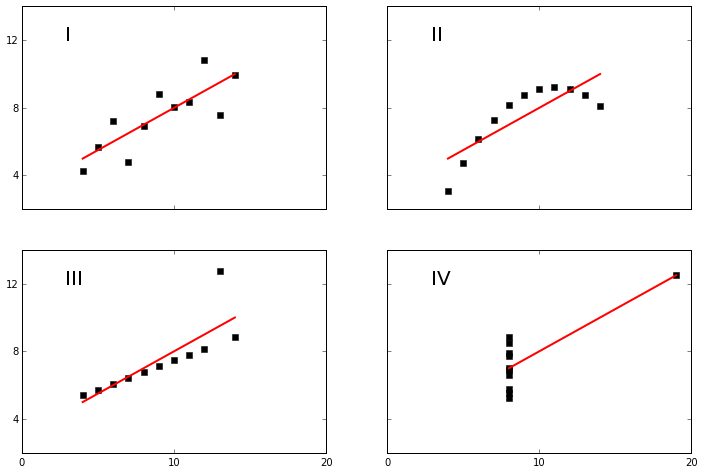
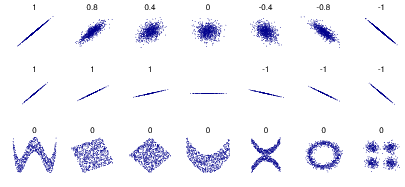

.. probability lecture

Random Variables
==================================

Random variables formalize a mapping we have been implicitly using already:

:math:`X(s) : S\Rightarrow \Re`

   * Capital letters refer to random variables.
   * Lowercase to refer to specific realization.
   * :math:`P(X=x) = P(\{s\in S : X(s) = x\})`
   * `X \sim XYZ(\alpha, \beta, ...)` means X is distributed as, XYZ with parameters.
   * "i.i.d."

PDFs and CDFs
-----------------------------

.. plot:: pdf-cdf-plot.py

Cumulative distribution function
----------------------------------

:math:`F_X(x) = P(X < x)`

   * What kinds of bounds can we put on this function?
   * This works for both continuous and discrete functions.

Probability mass function, PMF
----------------------------------

For discrete variables:

:math:`f_X(x) = P(X = x), \forall x`

For continuous variables, think of it as the derivative of the CDF:

:math:`f_X(x)dx = P(x < X < x+dx)`

:math:`f_X(x) = \frac{dF_X(x)}{dx}`

	    
Expectation
------------------

   Discrete:
      :math:`E[X] = \sum_{s\in S} X(s) f_X(s)`

   Continuous:
      :math:`E[X] = \int_{-\infty}^{\infty}X(s) f_X(s)ds`

   A measure, but not the only one, of the central tendecy of a distribution. Alternatives?

      Note, the sample mean is:

      :math:`\bar{x} = \frac{1}{n}\sum_j^n x_j`

Variance
------------

:math:`Var[x] = E[(x - E[X])^2]`

What are the units?

Note, the sample variance is:

:math:`s^2 = \frac{1}{n-1} \sum_j^n (x_j - \bar{x})^2`

Standard deviation
^^^^^^^^^^^^^^^^^^^

:math:`\sigma(x) = \sqrt{Var[x]}`

Useful because its units are in units of our original RV.
      
Covariance
^^^^^^^^^^^^^^^
We can also compute the covariance between two different variables:

:math:`Cov[X,Y] = E[(x - E[X])(y - E[Y])]`

Which is related to the

Correlation
^^^^^^^^^^^^^^

:math:`Corr[X,Y] = \frac{E[(x - E[X])(y - E[Y])]}{\sigma(X)\sigma(Y)} = \frac{Cov[X,Y]}{\sigma(X)\sigma(Y)}`

Anscombe's quartet
-----------------------

.. code-block:: python

   from numpy import array, amin, amax

   def fit(x):
      return 3+0.5*x

   def anscombe():
       x =  array([10, 8, 13, 9, 11, 14, 6, 4, 12, 7, 5])
       y1 = array([8.04, 6.95, 7.58, 8.81, 8.33, 9.96, 7.24, 4.26, 10.84, 4.82, 5.68])
       y2 = array([9.14, 8.14, 8.74, 8.77, 9.26, 8.10, 6.13, 3.10, 9.13, 7.26, 4.74])
       y3 = array([7.46, 6.77, 12.74, 7.11, 7.81, 8.84, 6.08, 5.39, 8.15, 6.42, 5.73])
       x4 = array([8,8,8,8,8,8,8,19,8,8,8])
       y4 = array([6.58,5.76,7.71,8.84,8.47,7.04,5.25,12.50,5.56,7.91,6.89])
       xfit = array( [amin(x), amax(x) ] )

   figure(figsize(12,8))
   subplot(221)
   plot(x,y1,'ks', xfit, fit(xfit), 'r-', lw=2)
   axis([2,20,2,14])
   setp(gca(), xticklabels=[], yticks=(4,8,12), xticks=(0,10,20))
   text(3,12, 'I', fontsize=20)

   subplot(222)
   plot(x,y2,'ks', xfit, fit(xfit), 'r-', lw=2)
   axis([2,20,2,14])
   setp(gca(), xticklabels=[], yticks=(4,8,12), yticklabels=[], xticks=(0,10,20))
   text(3,12, 'II', fontsize=20)

   subplot(223)
   plot(x,y3,'ks', xfit, fit(xfit), 'r-', lw=2)
   axis([2,20,2,14])
   text(3,12, 'III', fontsize=20)
   setp(gca(), yticks=(4,8,12), xticks=(0,10,20))

   subplot(224)
   xfit = array([amin(x4),amax(x4)])
   plot(x4,y4,'ks', xfit, fit(xfit), 'r-', lw=2)
   axis([2,20,2,14])
   setp(gca(), yticklabels=[], yticks=(4,8,12), xticks=(0,10,20))
   text(3,12, 'IV', fontsize=20)

   #verify the stats
   pairs = (x,y1), (x,y2), (x,y3), (x4,y4)
   for x,y in pairs:
       print ('mean=%1.2f, std=%1.2f, r=%1.2f'%(mean(y), std(y), corrcoef(x,y)[0][1]))

.. code-block:: none

   mean=7.50, std=1.94, r=0.82
   mean=7.50, std=1.94, r=0.82
   mean=7.50, std=1.94, r=0.82
   mean=7.50, std=1.94, r=0.82

Correlation
-----------------   

A **spurious relationship** is a relationship where two or more events, that are not causally related to each other have a relationship.  This may be due to a "common response variable" or a "confounding factor".

Correlation coefficients vary between -1 and +1 with 0 implying no correlation.
		

	      
Pearson
^^^^^^^^^^^^^^^
>>> from scipy.stats import pearsonr
>>> pearsonr([1,2,3,4,5],[5,6,7,8,7])
(0.83205029433784372, 0.080509573298498519)

The Pearson correlation coefficient measures the linear relationship
between two datasets.  The p-value roughly indicates the probability
of an uncorrelated system producing datasets that have a Pearson
correlation at least as extreme as the one computed from these dataset.

In other words null hypothesis is that two sets of data are uncorrelated.

Spearman
^^^^^^^^^^^^^^^^

>>> from scipy.stats import spearmanr
>>> spearmanr([1,2,3,4,5],[5,6,7,8,7])
(0.82078268166812329, 0.088587005313543812)

The Spearman correlation is a nonparametric measure of the monotonicity of the relationship between two datasets. Unlike the Pearson correlation, the Spearman correlation does not assume that both datasets are normally distributed.

Marginal Distributions
--------------------------

Marginal distribution takes a--possibly not independent--multivariate distribution. And considers only a single dimension.

Accomplished by summing (discrete) or integrating (continuous).

.. math:: 

   f_X(x) = \int_{-\infty}^\infty f_{XY}(x,s) ds

.. figure:: MultivariateNormal.png
   :scale: 75%
   :align: center
   :alt: coin-toss
   :figclass: align-center

Discrete case
^^^^^^^^^^^^^^^^^^	      

+------+---------------------+---------------------+---------------------+---------------------+---------------------+
| -    | x1                  | x2                  | x3                  | x4                  | py(Y)               |
+======+=====================+=====================+=====================+=====================+=====================+
|y1    |:math:`\frac{4}{32}` |:math:`\frac{2}{32}` |:math:`\frac{1}{32}` |:math:`\frac{1}{32}` |:math:`\frac{8}{32}` |
+------+---------------------+---------------------+---------------------+---------------------+---------------------+
|y2    |:math:`\frac{2}{32}` |:math:`\frac{4}{32}` |:math:`\frac{1}{32}` |:math:`\frac{1}{32}` |:math:`\frac{8}{32}` |
+------+---------------------+---------------------+---------------------+---------------------+---------------------+
|y3    |:math:`\frac{2}{32}` |:math:`\frac{2}{32}` |:math:`\frac{2}{32}` |:math:`\frac{2}{32}` |:math:`\frac{8}{32}` |
+------+---------------------+---------------------+---------------------+---------------------+---------------------+
|y4    |:math:`\frac{8}{32}` | 0                   |0                    | 0                   |:math:`\frac{8}{32}` |
+------+---------------------+---------------------+---------------------+---------------------+---------------------+
|px(X) | ?                   | ?                   | ?                   | ?                   | ?                   |
+------+---------------------+---------------------+---------------------+---------------------+---------------------+

Conditional Distributions
-----------------------------

.. math::

   f(y|x) = \frac{f_{XY}(x,y)}{f_X(x)}
