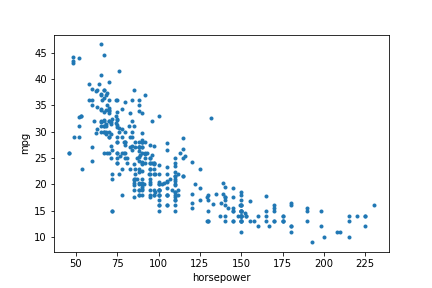

# Assignment for pymc

This is a short assignment for a pymc half-day session, using the cars dataset, mostly focusing on using Baysian statistics to do linear regression.

0. Load the cars dataset from data directory.

1. Make a scatterplot of the mpg against the horsepower. Use pymc3 to create a linear model predicting the mpg from the horsepower. You'll have three parameters: beta0 (the intercept), beta1 (the slope), and sigma (the standard deviation of the error). Use a Normal distribution as prior for the first two, and a HalfNormal for the third.
Hint: there might be some bad data points. Since it's just a couple you can drop them.

2\. Sample from your model to plot histgrams of your trace. Compare the results for beta0 and beta1 with those calculated from sklearn, and the values produced by pymc3's find_MAP.

3\. Make a scatter plot of the results. Show the actual data points and a sample of the lines generated (note this won't express the values for sigma, only beta0 and beta1). To simplify it, only plot every 10th element of the trace.

4\. pymc3 has a glm module to simplyfy the expression of linear regression. To call that, replace the specifications of the variables with a line like `pm.glm.GLM.from_formula('mpg ~ horsepower', df)`. See http://docs.pymc.io/notebooks/GLM-linear.html for more information.

5\. The plot isn't very linear. Try improving in by adding the square of the horsepower as an additional feature and add that to your model.

6\. The problem with that approach is that the mpg is inherently non-negative. There are a few approaches you can take to build this into your model. The simplest is to predict the log of the horsepower, but you can also explore other distributions.

7\. Try adding additional features. Look at the scatterplot to see what might be appropriate.

