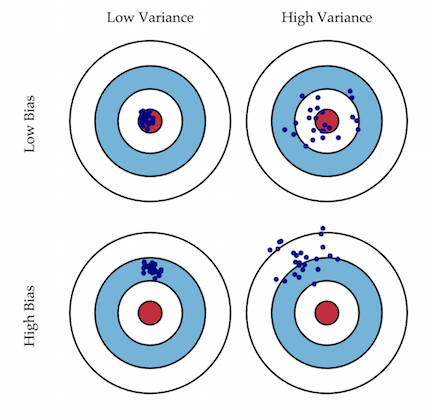
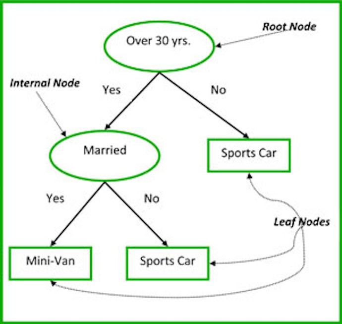

% Random Forests
% [Brian Bargh](brian.bargh@gmail.com)
% March 2, 2016

## Objectives

Morning Objectives:

*   Explain in terms of bias and variance why a Random Forest is better than a single decision tree
*   Be able to implement a simple Random Forest model
*   Explain the benefits of bagging and subspace sampling

##  Bias vs Variance

## Pros and Cons of Random Forest

* Pros
    - Often give near state of the art performance
    - Good 'out of the box' performance.  No feature scaling needed.
    - Model nonlinear relationships
* Cons
    - Can be expensive to train

## Review: Classification Trees

 * Training:
    - Iteratively divide the nodes into subnodes such that (entropy/gini impurity) is minimized
    - Various stopping conditions like a depth limit
 * Inference:
    - Take the most common class in the leaf node

## Review: Classification Trees

 

## Regression Trees

Similar to Classification Trees But:

* Instead of predicting a class label we're not trying to predict a number
* We minimize *mean squared error* instead of entropy or impurity
$$ \sum_{i\in R} (y_i - m_R)^2 + \sum_{i\in S} (y_i - m_S)^2$$

* For inference take the mean of the leaf node

## Decision Tree Summary

* Pros
    - No feature scaling needed
    - Model nonlinear relationships
    - Highly interpretable
    - Can do both classification and regression
* Cons
    - Can be expensive to train
    - Often poor predictors - high variance

## Example Linear Regression vs Decision Tree Regression

In ipython notebook

## Review: Bootstrapping

Pop Quiz!  Ask your neighbor:

* What is a bootstrap sample?
* What have we learned that bootstrap samples are good for so far?

## Review: Bootstrapping

Pop Quiz!  Ask your neighbor:

* What is a bootstrap sample?
    - Given n data points we select a sample of n points with replacement
* What have we learned that bootstrap samples are good for so far?
    - We use bootstrap samples to construct confidence intervals around sample statistics
    - Ex: If I want a confidence interval around my sample median I could take 200
      bootstrap samples and take the median of all 200 bootstrap samples.  
      I am about 95% confident that the true population median is between the
      5th from smallest and the 5th from largest.  

## Bagging

We've seen that repeatedly sampling from the population, building decision tree
models and averaging the results gives a good estimate.  But we only have
one sample.  

* Simulate multiple draws from the data by using multiple bootstrap samples
* Bagging stands for Bootstrap Aggregation

## Bagging

Second slide saying the same thing again to emphasize that Bagging is important.

* Take a bunch of bootstrap samples - say n
* Train a high variance, low bias model on each of them
* Average the results - this can reduce your variance by up to $\sqrt n$
    - Quiz your neighbor: Why is the reduction in variance less than $\sqrt n$?
* This is Bootstrap Aggregation or 'Bagging'

## Correlation Between the Trees

Why is the reduction in variance less than $\sqrt n$?

* We are thinking about the population of all possible decision tree models on our data.
* If I take $n$ samples *iid* from this distribution and average them the variance goes down by $\sqrt n$
* There is some correlation between my models because they are all trained on bootstrap samples from the same draw.

## Random Forests

Random Forests improve on Bagging by de-correlating the trees using a technique called Subspace Sampling.

* At each decision tree split only $m$ (often $m = \sqrt n$) features are considered for the split.

## Random Forest Parameters

Random Forest Parameters

* Total number of trees
* Number of features to use at each split
* Number of points for each bootstrap sample
* Individual decision tree Parameters
    - Usually the individual trees are grown to maximum depth to reduce bias.  The Random Forest will average away the variance.

In general, RF are fairly robust to the choice of parameters and overfitting.

## End of Morning Lecture

Thank You

## Afternoon Lecture

Afternoon Lecture: Interpreting Random Forests

## Objectives

Afternoon Objectives:

*   Understand OOB error
*   Rank feature importances in a Random Forest model

## Out Of Bag Error

* Out Of Bag error is a method of estimating the error of ensemble methods that use Bagging.  
* About 1/3 of the estimators will not have been trained on each data point.  (Why?)
* Test each data point only on the estimators that didn't see that data point during training.  

## Out Of Bag Error

* Often we'll use cross validation anyway because we're comparing random forest to other models and we want to measure the accuracy the same way.

## Feature Importances

* Determining which features are important in predicting the target variable is often a critically important business question.
* Example: Churn analysis - it's generally more important to understand *why* customers are churning than to predict which customers are going to churn.

## Feature Importances: Mean Decrease Impurity

* For each tree, each split is made in order to reduce the total impurity of the tree (Gini Impurity for classification, mean squared error for regression); we can record the magnitude of the reduction.
* Then the importance of a feature is the average decrease in impurity across trees in the forest, as a result of splits defined by that feature.  
* This is implemented in sklearn.

## Feature Importances: Mean Decrease Accuracy

To compute the importance of the jth variable:

* When the bth tree is grown, use it to predict the OOB samples and record accuracy.
* Scramble the values of the jth variable in the OOB samples and do the prediction again.  Compute the new (lower) accuracy.
* Average the decrease in entropy across all trees.

## Feature Importances: ipython

See example in ipython notebook.  
