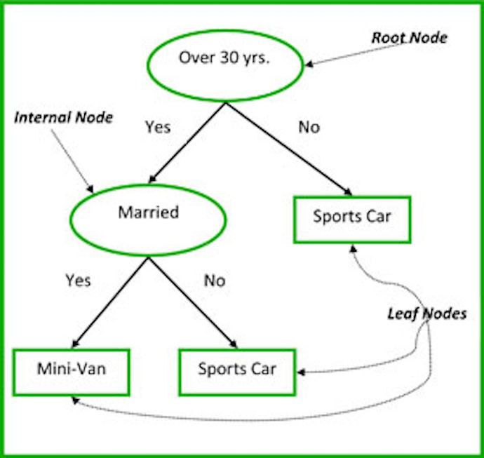

# Bagging and Random Forests
### [Jack Bennetto](jack.bennetto@galvanize.com)
### September 28, 2016

---

## Objectives

Morning Objectives

 * Explain & construct a random forest (classification or regression).
 * Explain the relationship and difference between random forest and bagging.
 * Explain why random forests are more accurate than a single decision tree.

Afternoon Objectives

 * Get feature importances from a random forest.
 * Explain how OOB error is calculated and what is it an estimate of.

---

## Agenda

Morning Agenda:

 * Discuss ensemble methods
 * Review bias/variance tradeoff
 * Review decision trees
 * Discuss bagging (bootstrap aggregation)
 * Discuss random forests

Afternoon Agenda:

 * Discuss out-of-bag error
 * Discuss feature importance

---

## What is an Ensemble Method?

**Ensemble:** many weak learners combined to form a strong learner

Train multiple different models on the data. The overall prediction is

 * the average prediction, for a regressor, or
 * the plurality choice, for a classifier (fraction of models is probability).

Note: ask why probability is important

---

## Ensembles: Intuition

Supposed we have 5 *independent* binary classifers each 70% accurate.

 * What's the overall accuracy?

$$ \binom{5}{5} 0.7^5 \times \binom{5}{4} 0.7^4 0.3 \times \binom{5}{3} 0.7^3 0.3^2 \approx 0.83 $$

With 101 such classifiers we can achieve 99.9% accuracy.

 
 
 
What's the limitation?

---

## How to Make Them Independent?

If the learners are all the same, ensembles don't help.

Train each learner on different subset of data.

 * Why is this better than a single good model?

---

## Bias and Variance

**Bias:** Error from failure to match training set

**Variance:** Error from sampling training set

 * What is the bias of an unpruned decision tree?

Decision trees are easy to overfit.

---

## Review: Classification Trees

Training:

* Iteratively divide the nodes such that (entropy/gini impurity) is minimized
* Various stopping conditions like a depth limit
* Prune trees by merging nodes

Inference:

* Take the most common class in the leaf node

---

## Review: Classification Trees

 

---

## Review: Regression Trees

Predicting a number, not a class

Training:

* Iteratively divide the nodes such that *total squared error* is minimized

`$$\sum_{i \in L} (y_i - m_L)^2 + \sum_{i\in R} (y_i - m_R)^2$$`

* Various stopping conditions like a depth limit
* Prune trees by merging nodes

Inference:

* Take the most average value of samples the leaf node

---

## Regression Trees: Example

 $x_1$ |   $x_2$ |  $y$
-------|---------|--------
 1     |    1    |   1
 0     |    0    |   2
 1     |    0    |   3
 0     |    1    |   4

 Prior to the split we guess the mean, 2.5, for everything, giving total squared error:
 `$$ E = (1-2.5)^2 + (2-2.5)^2 + (3-2.5)^2 + (4-2.5)^2  = 5$$`
 After we split on $x_1$ we guess 2 for rows 1 & 3 and 3 for rows 2 & 4:
 `$$ E = (1-2)^2 + (3-2)^2 + (2-3)^2 + (4-3)^2 = 4 $$`

---

## Decision Tree Summary

What are the pros and cons?

Pros
 * No feature scaling needed
 * Model nonlinear relationships
 * Can do both classification and regression
 * Robust
 * Highly interpretable

<!-- .element: class="fragment" data-fragment-index="1" -->
Cons
 * Can be expensive to train
 * Often poor predictors - high variance

<!-- .element: class="fragment" data-fragment-index="2" -->

---

## Review: Bootstrapping

Questions:

 * What is a bootstrap sample?

Given n data points we select a sample of n points with replacement
<!-- .element: class="fragment" data-fragment-index="1" -->
 * What have we learned that bootstrap samples are good for so far?
<!-- .element: class="fragment" data-fragment-index="1" -->

We use bootstrap samples to construct confidence intervals around sample statistics.
<!-- .element: class="fragment" data-fragment-index="2" -->

Example: get a confidence interval around sample median
<!-- .element: class="fragment" data-fragment-index="2" -->  

  * Take 1000 bootstrap samples.
  * Take the median of each sample.
  * The 95% confidence inverval for the median is between the 25th and 975th largest samples.

<!-- .element: class="fragment" data-fragment-index="2" -->

---

## Bagging

We could repeatedly sample from the population, building decision tree
models and averaging the results.  But we only have one sample.  

 * Simulate multiple draws from the data by using multiple bootstrap samples
 * Bagging stands for Bootstrap Aggregation

---

## Bagging

In a bit more detail:

 * Take a bunch of bootstrap samples - say n
 * Train a high variance, low bias model on each of them
 * Average the results - this can reduce your variance by up to $\sqrt n$
    - Question: Why is the reduction in variance less than $\sqrt n$?

---

## Correlation Between the Trees

Why is the reduction in variance less than $\sqrt n$?

 * We are thinking about the population of all possible decision tree models on our data.
 * If I take $n$ samples *iid* from this distribution and average them the variance goes down by $\sqrt n$
 * There is some correlation between models because they are all trained on bootstrap samples from the same draw.

---

## Random Forests

Random Forests improve on Bagging by de-correlating the trees using a technique called Subspace Sampling.

 * At each decision tree split only $m$ (often $m = \sqrt n$) features are considered.

---

## Random Forest Parameters

Random Forest Parameters

 * Total number of trees
 * Number of features to use at each split
 * Individual decision tree Parameters
    - e.g., tree depth, pruning, split criterion

In general, RF are fairly robust to the choice of parameters and overfitting.

---

## Pros and Cons of Random Forest

Pros

 * Often give near state-of-the-art performance
 * Good out-of-the-box performance
 * No feature scaling needed
 * Model nonlinear relationships

Cons

 * Can be expensive to train (though can be done in parallel)
 * Not interpretable

---

## Afternoon Lecture

### Interpreting Random Forests

---

## Objectives

Morning Objectives

 * Explain & construct a random forest (classification or regression).
 * Explain the relationship and difference between random forest and bagging.
 * Explain why random forests are more accurate than a single decision tree.

Afternoon Objectives

 * Get feature importances from a random forest.
 * Explain how OOB error is calculated and what is it an estimate of.

---

## Agenda

Morning Agenda

 * Discuss ensemble methods
 * Review bias/variance tradeoff
 * Review decision trees
 * Discuss bagging (bootstrap aggregation)
 * Discuss random forests

Afternoon Agenda

 * Discuss out-of-bag error
 * Discuss feature importance

---

## Out-Of-Bag Error

Measuring error of a bagged model.

* Out-of-bag (OOB) error is a method of estimating the error of ensemble methods that use Bagging.  
* About 37% of the estimators will not have been trained on each data point.
* Test each data point only on the estimators that didn't see that data point during training.  
* Often use cross validation anyway because we're comparing with other models and want to measure the accuracy the same way.

---

## Feature Importances

Bringing interpretability to random forests

 * Determining which features are important in predicting the target variable is often a critically important business question.
 * Example: Churn analysis - it's generally more important to understand *why* customers are churning than to predict which customers are going to churn.

How should we measure it?

---

## Feature Importances: Mean Decrease Impurity

How much does each feature decrease the impurity?

To compute the importance of the $j^{th}$ feature:

 * For each tree, each split is made in order to reduce the total impurity of the tree (Gini/entropy/MSE); we can record the magnitude of the reduction.
 * Then the importance of a feature is the average decrease in impurity across trees in the forest, as a result of splits defined by that feature.  
 * This is implemented in sklearn.

---

## Feature Importances: Mean Decrease Accuracy

How much does randomly mixing values of a feature affect accuracy?

To compute the importance of the $j^{th}$ feature:

 * When the $b^{th}$ tree is grown, use it to predict the OOB samples and record accuracy.
 * Scramble the values of the $j^{th}$ feature in the OOB samples and do the prediction again.  Compute the new (lower) accuracy.
 * Average the decrease in accuracy across all trees.

---

## Feature Importances: ipython

See example in ipython notebook.
