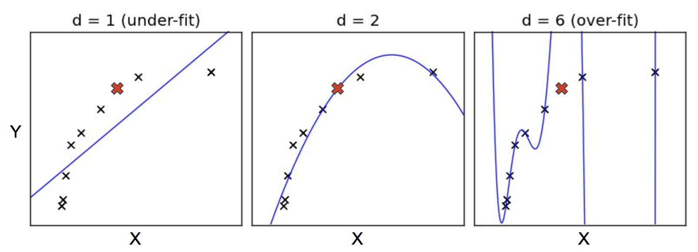
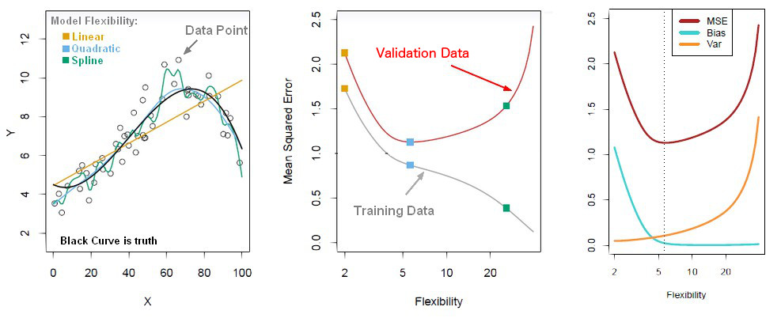
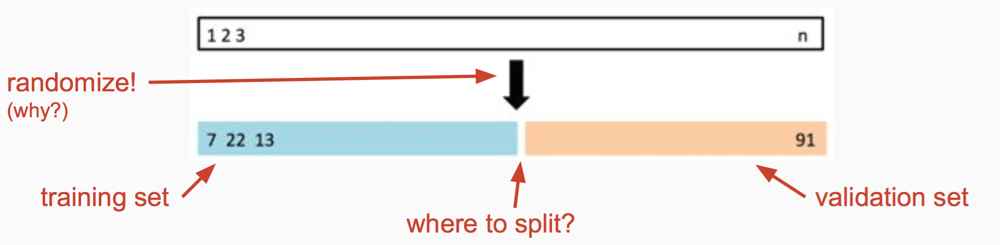
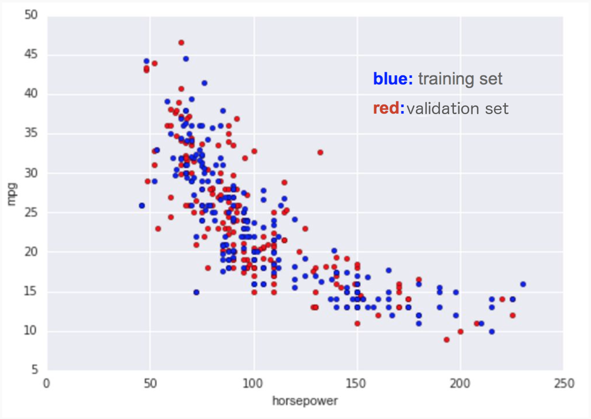
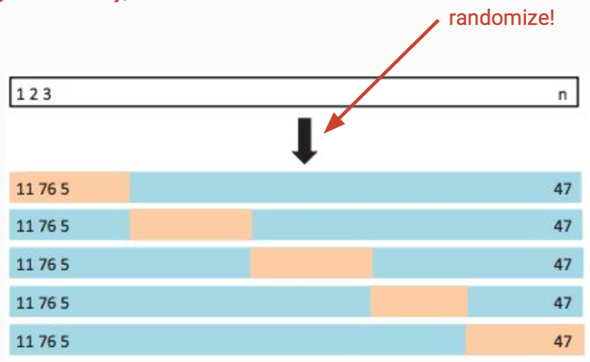

% Cross-Validation, Regularized Regression & Bias-Variance Tradeoff
% [Isaac Laughlin](isaac.laughlin@galvanize.com)
% May 2, 2016

## Objectives

At the end of the lecture you should:

*   State the purpose of Cross Validation
*   Explain k-fold Cross Validation
*   Give the reason for using k-fold CV
*   Describe how to select a model using CV
*   Be able to describe the two kinds of model error.
*   Be able to state the purpose of Lasso and Ridge regression, and compare the two choices
*   Build test error curves for regularized regression
*   Build and interpret learning curves

##  An important question:

What is the best model to use?

Remember our general problem:

$$ y = f(X) + \epsilon $$

* Eventually we will have many $f$s and $X$s to choose from
* So far, we only have one tool, linear regression, but still many choices

## Comparing linear regression models

Imagine we have just a single variable $x_1$.

We can create a linear regression

$$ y = \beta_0 + \beta_1 x_1 $$

or we could create

$$ y = \beta_0 + \beta_1 x_1 + \beta_2 x_1^2 + \beta_2 x_1^3 + ... $$

### Do this:
List some ways to compare these models.

## Business

### Scenario

You are building a house-flipping company which will scrape zillow for
undervalued houses and buy them to flip. You're going to make money like this:

$$ p_{future} = f(X) $$

$$ \sum_i p_{future,i} - p_{today,i} $$

What are the risks to your business scheme?

## Some pitfalls

* Coefficients of linear regression minimize squared error for given X
* p-values tell us whether we can reject the idea that our coefficient could be 0
* $R^2 = f(X, \beta)$ ditto AIC, BIC

## Overfitting

Note, when we learn a model we're looking for a _parsimonious_, _generalizable_ representation of the relation $y = f(X) + \epsilon$

### Question:
What's wrong with each of the models above?

## Underfitting and Overfitting

Both are a failure to capture the true relationship between $y$ and $X$.

### Underfitting
* Model does not fully capture the signal in $X$
* Insufficently flexible model

### Overfitting
* Model erroneously interprets noise as signal
* Overly flexible model

## Bias and Varianc

Typically we refer to the error caused by under/overfitting by their statistical names _bias_ and _variance_.

### Good news
_Bias and Variance describe all *reducible* sources of error in a model_

## Bias and Variance
$$ Y = f(X) + \epsilon  $$

$$ \hat{Y} = \hat{f}(X) $$

$$ E[(y_{unseen} - \hat{f}(x_{unseeen}))^2] = ... = Var(\hat{f}(x_i)) + Bias^2(\hat{f}(x_i)) + Var(\epsilon) $$

## So what should we do?

## Cross-Validation

Model selection tools like $R^2$, AIC, BIC, F-stats consider only the data on which they are trained.

Cross-validation gives us a data set which the trained model has never seen, so we can answer the question how well will my various models perform on unseen data?

## Train-Validation Split

## Cross-Validation

Basic procedure:

1. Split into training/validation sets. (70/30 or 90/10 are some choices)
1. Use training set to train several models of varying complexity (e.g. different features in linear regression)
1. Evaluate each model using the validation set (using a metric you like)
1. Keep the model that performs best over the validation set

## Example use on cars data

## Train-Test error curves

## Train-Test Errors

http://pollev.com/galvanizedsi351

## Potential Problem

### Discuss
Given the train-validation split described, why might we doubt that our chosen model is truly the best? _Hint: what if we're unlucky?_

## K-Fold Cross Validation

## A subtle, but important problem

### Discuss
Is the error from the validation sets actually the error that I can expect on unseen data? _Hint: if I iteratively try many models, and choose the ones that have the best error on the validation data, is my validation representative of unseen data?_

## Bens'

Some definitions:

*   A *set* $S$ consists of all possible outcomes or events and is called the *sample space*
*   *Union*:  $A \cup B = \{ x: x \in A \, \mathtt{or} \, x \in B\}$
*   *Intersection*:   $A \cap B = \{x: x \in A \, \mathtt{and} \, x \in B\}$
*   *Complement*:   $A^c = \{ x: x \notin A \}$
*   *Disjoint*: $A \cap B = \emptyset$
*   *Partition*: a set of pairwise disjoint sets, $\{A_j\}$, such that $\underset{j=1}{\overset{\infty}{\cup}}A_j = S$
*   Plus the commutative, associative, distributive, and DeMorgan's laws

#   Combinatorics

##  Example:    tea

R. A. Fischer is invited to tea with a lady who claims she can tell whether tea or milk is added to the cup first.  Fisher is incredulous and proposes the following experiment:

*   He will prepare three cups with tea added first and milk second and three cups prepared in the opposite order
*   He will order the cups randomly
*   The lady will guess which are which
*   What is the probability she guesses all three correctly by chance?

##  Factorial

*Factorial* counts the number of ways of ordering or picking something when order matters:

*   We write $n! = n \times (n-1) \times ... \times 1$
*   $0! = 1$ by convention
*   Example:    how many ways can we shuffle a deck of cards?

##  Combination

*Combination* counts the number of ways of picking something when order doesn't matter:

*   $\dbinom{n}{k} = \dfrac{n!}{(n-k)! k!}$
*   We say '*$n$ choose $k$*'
*   This is the number of ways of choosing $k$ items from $n$ total items
*   Typically, the items are identical
*   Urns and balls are the classic example:  
    -   If I draw $k$ balls from an urn with $n$ balls, how many different sets are possible?
    -   If I draw $W$ white balls and $B$ black balls from an urn, how many different orderings are possible?

##  Example:    tea revisited

What if we prepare eight cups with four cups tea first and four milk first:

*   What is the probability she can guess at least three out of four cups correctly?
*   Will R. A. Fisher be impressed?

##  Multinomial

The number of ways of assigning $(n_1, n_2, ..., n_k)$ objects to $k$ different categories:

*   $\dbinom{n}{n_1 n_2 \cdots n_k} = \dfrac{n!}{n_1! n_2! \cdots n_k!}$
*   Example:    an urn contains red, white, and blue balls...

#   Probability

##  Introduction

Probability provides the mathematical tools we use to model randomness:

*   Probability tells us how likely an event (Frequentist) is or how likely our beliefs are to be correct (Bayesian)
*   Provides the foundation for statistics and machine learning
*   Often our intuitions about randomness are incorrect because we live only one realization
*   Enumerating all possible outcomes (using combinatorics) can help us compute the probability of an event

##  Definition of probability

Given a sample space, $S$, a *probability function*, $P$, has three properties:

*   $P(A) \geq 0, \forall A \subset S$
*   $P(S) = 1$
*   For a set of pairwise disjoint sets $\{A_j\}$, $P(\underset{j}{\cup} A_j) = \underset{j}{\sum} P(A_j)$

Note: for those who really care about the details, you need to use measure theory and sigma algebras

##  Example:    tossing a coin

Consider a coin toss:

*   $S = \{H, T\}$
*   $P(H) = P(T) = \dfrac{1}{2} > 0$
*   $P(S) = 1$

Note: this means $P(A) = 1 - P(A^c)$

##  Independence

Two events $A$ and $B$ are said to be *independent* if

$$\Pr[A \cap B] = \Pr[A] \cdot \Pr[B]$$

or, equivalently, if

$$\Pr[B | A] = \Pr[B],$$

i.e., knowledge of $A$ provides no information about $B$

*   $A \perp B$ means $A$ and $B$ are independent
*   To compute the probability that any one of a set of independents events, $\{A_n\}$, occurs:

    $$\Pr[\underset{k}{\cup} A_k] = \sum \Pr[A_k],$$

    where $A_i \perp A_j, \forall i \ne j$

##  Multiplication rule

To compute the probability that two independent events occur, multiply their probabilities:

$$\Pr[A \cap B] = \Pr[A] \cdot \Pr[B]$$

Example:

*   What is the probability that A and B happen?

##  Example:    coin tosses

Take a moment to solve this question:

*   Three types of fair coins are in an urn: HH, HT, and TT
*   You pull a coin out of the urn, flip it, and it comes up H
*   **Q**:  what is the probability it comes up H if you flip it a second time?

##  Conditional probability

We often care about whether one event provides information about another event.  The *conditional probability* of $B$ given $A$ is:

$$\Pr[B|A] = \dfrac{\Pr[A \cap B]}{\Pr[A]}$$

*   We say this is the '*probability of B conditional on A*'
*   I.e., if $A$ has occurred, what is the probability $B$ will occur?
*   For a pdf of two random variables,

$$f(y|x) = \dfrac{f(x,y)}{f(x)}$$

##  Probability chain rule

Can condition on an arbitrary number of variables:

*   Simple example:

    $$\Pr[A_3, A_2, A_1] = \Pr[A_3|A_2, A_1] \cdot \Pr[A_2 | A_1] \cdot \Pr[A_1]$$

*   General case:

    $$\Pr[A_n, ..., A_1] = \underset{j}{\Pi} \Pr[A_j|A_{j-1}, ..., A_1]$$

    or

    $$\Pr[ \underset{j}{\overset{n}{\cap}} A_j] = \underset{j}{\overset{n}{\Pi}} \Pr[A_j| \underset{k}{\overset{j-1}{\cap}} A_k ]$$

##  Law of total probability

If $\{B_n\}$ is a partition of the sample space, the *Law of total probability* states:

$$\Pr[A] = \underset{j}{\sum} \Pr[A \cap B_j]$$

or

$$\Pr[A] = \underset{j}{\sum} \Pr[A | B_j] \cdot \Pr[B_j]$$

$\Pr[A]$ is said to be a *marginal distribution* of $\Pr[A,B]$

##  Bayes's Rule

Use Bayes's Rule when you need to compute conditional probability for $B|A$ but only have probability for $A|B$:

$$\Pr[B|A] = \dfrac{\Pr[A|B] \cdot \Pr[B]}{\Pr[A]}$$

*   Proof: use the definition of conditional probability
*   For an arbitrary partition of event space, $\{A_j\}$, use the general form of Bayes's rule:

$$\Pr[A_k|B] = \dfrac{\Pr[B|A_k] \cdot \Pr[A_k]}{\underset{j}{\sum}{\Pr[B|A_j] \cdot \Pr[A_j]}}$$

##  Example:    drug testing

A test for EPO has the following properties:

| Variable          |   Value           |
| :-----------      |   :----------     |
| $\Pr[+|doped]$    |   0.99            |
| $\Pr[+|clean]$    |   0.05            |
| $\Pr[doped]$      |   0.005           |

**Q:**  What is the probability the cyclist is using EPO if the test is positive?  I.e., what is $\Pr[doped|+]$?

##  Solution:   drug testing

#.  Compute probability of being clean:

    $$\Pr[clean] = 1 - \Pr[doped]$$

#.  Use Bayes's Rule:

    $$\Pr[doped|+] = \dfrac{\Pr[+|doped] \cdot \Pr[doped]}{\Pr[+|doped] \cdot \Pr[doped] + \Pr[+|clean] \cdot \Pr[clean]}$$
    $$             = \dfrac{0.99 \cdot 0.005}{0.99 \cdot 0.005 + 0.05 \cdot (1 - 0.005)}$$
    $$             = 0.090$$

Based on [this](http://vassarstats.net/bayes.html) example

#   Random variables and probability distributions

##  Definition: random variable

Given a sample space $S$, a *random variable*, $X$, is a function such that $X(s): S \mapsto \mathbb{R}$:

*   Use capital letters to refer to a random variable, e.g., $X$
*   Use lower case to refer to a specific realization, $x$, or $X = x$
*   Consequently, $\Pr[X = x] = \Pr[ \{ s \in S: X(s) = x\} ]$
*   We write $X \sim \mathtt{XYZ}(\alpha, \beta, ...)$ to mean $X$ is distributed like the $XYZ$ distribution with parameters $\alpha$, $\beta$, ...
*   We say a series of random variables are *i.i.d.* if they are '*independent and identically distributed*'
*   Example:    $X \sim \mathtt{N}(\mu, \sigma^2)$  or $X \sim \mathtt{U}(0,1)$

##  Cumulative distribution function (CDF)

Definition: the cumulative distribution function   $F_X(x) = \Pr[X \leq x]$:

*   Properties:
    -   $0 \leq F_X(x) \leq 1$
    -   $\underset{x \rightarrow -\infty}{\lim} F_X(x) = 0$
    -   $\underset{x \rightarrow \infty}{\lim} F_X(x) = 1$
    -   $F_X(x)$ is monotonically increasing
*   Applies to discrete and continuous random variables
*   Note:   $\Pr[a < X \leq b ] = F_X(b) - F_X(a)$

##  Discrete: probability mass function (PMF)

For a random variable, $X$, which takes discrete values $\{x_i\}$, use a PMF to determine the probability of an individual event:

*   $f_X(x) = P(X=x), \forall x$
*   We say there is *probability mass* $p_i$ on $x_i$, where $p_i = \Pr[X=x_i]$
*   Example:    tossing coins
    -   $X \in \{H, T\}$
    -   $p_H = p_T = \dfrac{1}{2}$

##  Continuous probability density function (PDF)

For a continuous random variable, $X$, use a PDF:

*   $f_X(x)dx = \Pr[x < X < x + dx]$
*   $f_X(x) = \dfrac{dF_x(x)}{dx}$, assuming some regularity conditions
*   $F_X(x) = \int_{-\infty}^x f_X(s) ds$
*   Example:    survival time, $T$, of uranium before decay
    -   $T \sim \texttt{Exp}(\lambda )$
    -   PDF:    $f_T(t) = \lambda \cdot \exp(- \lambda \cdot t)$
    -   CDF:    $F_T(t) = 1 - \exp(- \lambda \cdot t)$ if $t \geq 0$
    -   What fraction survives longer than $t$?

##  Properties of distributions

Use these properties to characterize a distribution:

*   Expectation/mean
*   Variance/standard deviation
*   Skew
*   Kurtosis
*   Correlation

We often compute sample analogs of these properties to compare the empirical distribution of our data to standard distributions

##  Expectation/mean

The *expectation*, *mean*, or *expected value* is a measure of what is a likely value of a random variable:

*   $\mu_{g(X)} = \mathbb{E}_X[g(x)]:$
    -   Continuous: $\mathbb{E}_X[g(x)] = \int_{-\infty}^{\infty} g(s)f_X(s)ds$
    -   Discrete:   $\mathbb{E}_X[g(x)] =  \underset{s \in \{x_i\} }{\sum} g(s)f_X(s)$
*   Expectation is a linear operator
*   The mean is $\mathbb{E}_X[x] = \int_{-\infty}^{\infty} s f(s)ds$
*   The sample mean is $\overline{x} = \dfrac{1}{n} \underset{j=1}{ \overset{n}{\sum} } x_j$

##  Variance

*Variance* measures the spread of a distribution:

*   $\mathtt{Var}[x] = \mathbb{E}_X[(x - \mu_x)^2]$
*   Sometimes variance is written as $\sigma^2(x) = \mathtt{Var}(x)$
*   Often, we use *standard deviation*, $\sigma(X) = \sqrt{\mathtt{Var}[x]}$ which has the same dimensions as $X$
*   Note: the sample variance is $s^2 = \dfrac{1}{n - 1} \underset{j=1}{ \overset{n}{\sum} } (x_j - \overline{x})^2$

##  Warning: ddof

Many Numpy functions compute population values by default:

*   Example:    `np.var(..., ddof=0, ...)` computes

$$s^2 = \dfrac{1}{n} \underset{i=1}{\overset{n}{\sum}} (x_i - \overline{x})^2$$

*   Must set `ddof=1` to get sample variance!

$$s^2 = \dfrac{1}{n-1} \underset{i=1}{\overset{n}{\sum}} (x_i - \overline{x})^2$$

*   `ddof` means 'delta degrees of freedom'

##  Skew and kurtosis

Skew and kurtosis are higher order moments:

*   Skewness:
    -   $\gamma_1 = \mathbb{E}[\left(\dfrac{X - \mu}{\sigma}\right)^3]$
    -   Measures asymmetry of a distribution
    -   Sign of skewness tells whether distribution is left or right skewed
*   Kurtosis:
    -   $\kappa = \mathbb{E}[\left(\dfrac{X - \mu}{\sigma}\right)^4]$
    -   Measures the 'fatness' of the tails of the distribution

##  Variance of the mean

Statistics like the sample mean are random variables:

*   Thus, they have a distribution
*   Can compute their variance:

$$\mathtt{Var}(\overline{x}) = \dfrac{\mathtt{Var}(x)}{N}$$

*   Hence, the standard deviation is:

$$\sigma(\overline{x}) = \sqrt{\dfrac{\mathtt{Var}(x)}{N}}$$

or

$$\sigma(\overline{x}) = \dfrac{\sigma(x)}{\sqrt{N}}$$

##  Quantiles (percentiles)

Quantiles are another way to characterize the distribution of data:

*   The *quantile function* of $X$ is

$$Q_{\alpha}(x) = \underset{x}{\min} \{ x: \Pr(X \leq x) \geq \alpha \}$$
$$Q_{\alpha}(x) = \underset{x}{\min} \{ x: F(x) \geq \alpha \},$$

where $\alpha \in (0, 1)$

*   Given regularity conditions, $Q_{\alpha}[x] = F^{-1}(\alpha)$
*   If if $u = F_X(x)$ then $U \sim \mathit{U}(0,1)$
*   *percentiles* are just the quantile $\times 100$

##  Common quantiles

During EDA, it is often helpful to examine:

*   Median: $Q_{0.5}[x]$
*   Upper quartile: $Q_{0.75}[x]$
*   Lower quartile: $Q_{0.25}[x]$
*   Note: the median usually does not equal the mean, especially for data with a long tail

Pro tip:    compute a box plot

##  Multivariate distributions

Model relationships between multiple random variables with a multivariate (joint) distribution:

*   Let $X(s): S \mapsto \mathbb{R}^k$, i.e., $X$ is a vector of random variables, $X(s) = (X_1(s), X_2(s), ..., X_k(s))^T$
*   CDF:

$$F(x_1, x_2, ..., x_k) = \Pr[X_1 \leq x_1, X_2 \leq x_2, ..., X_k \leq x_k]$$

*   PDF:

$$F(x_1, x_2, ..., x_k) = \int_{-\infty \cdots -\infty}^{x_1 x_2 \cdots x_k} f(s_1, s_2, ..., s_k) ds_1 ds_2 \cdots ds_k$$

##  Multivariate moments

Can compute vector analogs of all moments we have discussed:

*   Mean: $\mu_x = \mathbb{E}[x]$
*   Variance: $\mathtt{Var}[x] = \mathbb{E}[(x - \mu_x) \cdot (x - \mu_x)^T]$
*   Covariance: $\mathtt{Cov}[x,y] = \mathbb{E}[(x - \mu_x) \cdot (y - \mu_y)^T]$
*   Correlation:    $\rho_{XY}(x,y) = \dfrac{ \mathtt{Cov}[x,y] }{ \sigma(x) \cdot \sigma(y) }$

##  Marginal and conditional distributions

To compute the marginal distribution from the joint (multivariate) distribution, just integrate (sum) over the other variable(s):

$$f_X(x) = \int_{- \infty}^{\infty} f_{XY}(x,s)ds$$

For a bivariate distribution, conditional pdf is:

$$f(y|x) = \dfrac{f_{XY}(x,y)}{f_X(x)}$$

##  Covariance and correlation

To explore the relationship between variables compute:

*   *Covariance*:
    -   $\mathtt{Cov}(x,y) = \mathbb{E}[(x - \mu_x) \cdot (y - \mu_y)]$
    -   Size changes with scaling of variables
    -   For random variables which are vectors, use $\mathtt{Cov}[x,y] = \mathbb{E}[(x - \mu_x) \cdot (y - \mu_y)^T]$
*   *Correlation* (Pearson):
    -   Dimensionless measure relationship
    -   $\rho_{XY}(x,y) = \dfrac{ \mathtt{Cov}(x,y) }{ \sigma(x) \cdot \sigma(y) }$
    -   Thus, $\rho_{XY} \in [-1, 1]$
    -   Other correlation coefficients, such as Spearman, use rank and are more robust
*   Correlation is not causation!

##  Correlation and linearity

.](images/correlation816.png)

##  Correlation captures noisiness and direction

.](images/correlation.png)

##  The weak law of large numbers and the analog principle

The *weak law of large numbers* states that, given some regularity conditions,

$$\underset{n \rightarrow \infty}{\lim} \dfrac{1}{n} \underset{i=1}{\overset{n}{\sum}} x_i = \mathbb{E}[x]$$

This motivates the *analog principle*: when creating sample estimators, replace expectations, $\mathbb{E}$, with sums, $\dfrac{1}{n} \underset{i=1}{\overset{n}{\sum}}$

#   Common distributions

##  Overview

We now review the properties of some common distributions:

*   Discrete

    -   Bernoulli
    -   Binomial
    -   Geometric
    -   Poisson

*   Continuous

    -   Uniform
    -   Exponential
    -   Gaussian a.k.a. Normal
    -   $\chi^2$
    -   Student's t
    -   F distribution

##  Bernoulli

Models a toss of an unfair coin or clicking on a website:

*   $X \sim \mathtt{Bernoulli}(p)$
*   PMF:    $\Pr[H] = p$ and $\Pr[T] = 1 - p$
*   Mean:   $\mathbb{E}[x] = p$
*   Variance:   $\mathtt{Var}[x] = p \cdot (1-p)$

##  Example: click through rate

Given $N$ visitors of whom $n$ click on the 'Buy' button:

*   What is click through rate (CTR)?
*   What is the variance of the click through rate?

##  Binomial

Models repeated tosses of a coin:

*   $X \sim \mathtt{Binomial}(n,p)$ for $n$ tosses of a coin where $\Pr[H] = p$
*   PMF:    $\Pr[X = k] = \dbinom{n}{k} p^k \cdot (1 - p)^{(n - k)}, \forall \, 0 \leq k \leq n$
*   Mean:   $n \cdot p$
*   Variance:   $n \cdot p \cdot (1 - p)$
*   Approaches Gaussian for limit of large $n$

##  Geometric

Models probability succeeding on the $k$-th try:

*   $X \sim \mathtt{Geometric}(p, k)$
*   PMF:    $\Pr[X = k] = p \cdot (1-p) ^{(k - 1)}$
*   Mean:   $\dfrac{1}{p}$
*   Variance:   $\dfrac{1-p}{p^2}$

##  Poisson

Models number of events in a period of time, such as number of visitors to website:

*   $X \sim \mathtt{Poisson}(\lambda)$
*   PMF:    $\Pr[X = k] = \exp(- \lambda) \cdot \dfrac{\lambda^k}{k!}, \forall \, k = 0, 1, 2, ...$
*   Mean = variance = $\lambda$
*   $\lambda$ is the number of events during the interval of interest
*   Note:  $\Pr[X = k]$ is just one term in the Taylor's series expansion of $\exp(x)$ when suitably normalized

Remark: the assumption that mean = variance is very strong.  In practice, better to fit a model with *overdispersion* such as the negative binomial distribution, and test whether the assumption holds

##  Uniform

Models a process where all values in an interval are equally likely:

*   $X \sim \mathtt{U}(a,b)$
*   PDF:    $f(x) = \dfrac{1}{b - a}, \forall \, x \in [a, b]$ and $0$ otherwise
*   Mean:   $\dfrac{a+b}{2}$
*   Variance:   $\dfrac{(b-a)^2}{12}$
*   Note:   any continuous random variable can be transformed into a uniformly distributed variable by letting $u = F_X(x)$

##  Exponential

Models survival, such as the fraction of uranium which has not decayed by time $t$ or time until a bus arrives:

*   $T \sim \mathtt{Exp}(\lambda)$
*   $1 / \lambda$ is the half-life
*   CDF:    $\Pr[T \leq t] = 1 - \exp(- \lambda \cdot t), x \geq 0, \lambda \geq 0$
*   Mean:   $1/\lambda$
*   Variance:   $1/\lambda^2$
*   'Memory-less'

##  Gaussian a.k.a. Normal

A benchmark distribution:

*   $X \sim \mathit{N}(\mu, \sigma^2)$
*   PDF:    $f(x; \mu, \sigma^2) = \dfrac{1}{\sqrt{2 \pi}} \exp \left(- \dfrac{1}{2} \dfrac{ (x - \mu)^2 }{\sigma^2} \right)$
*   Often, compute the 'z-statistic':
    -   $z = \dfrac{\overline{x} - \mu}{\sigma / \sqrt{n}}$
    -   Perform a 'z-test' to check probability of observed value
*   'Standard normal' is $\mathit{N}(0,1)$:
    -   PDF is $\phi(x)$
    -   CDF is $\Phi(x)$
*   Will discuss Central Limit Theorem tomorrow

This is the famous 'Bell-curve' distribution and is associated with many processes, such as white noise, Brownian motion, etc.

##  Other distributions

Some other distributions:

*   $\chi^2$:
    -   Models sum of $k$ squared, independent, normally-distributed random variables
    -   Use for goodness of fit tests
*   Student's t:    distribution of the *t-statistic*:
    -   t-statistic:    $t = \dfrac{\overline{x} - \mu}{s / \sqrt{n}},$ where $s$ is the standard error
    -   Perform a 't-test' to check probability of observed value
    -   Has fatter tails than normal distribution
*   F-distribution:
    -   Distribution of the ratio of two $\chi^2$ random variables
    -   Use to test restrictions and ANOVA

##  Digression: random numbers

Bad news: the computer generates *pseudo*-random numbers:

*   Not truly random
*   Generated using a variety of algorithms so that they satisfy statistical tests
*   Most proofs use true random numbers ... so be careful they may not hold with pseudo-random numbers

#  Summary

##  Summary

**Q**:  When do you use factorial vs. combination?

**Q**:  What is independence?

**Q**:  What is conditional probability? How do I use Bayes's rule?

**Q**:  What are the PDF and CDF?

**Q**:  What are moments should you use to characterize a distribution?  How do you calculate them?

**Q**:  What is a quantile?

**Q**:  What are some common distributions?  What type of processes do they model?
