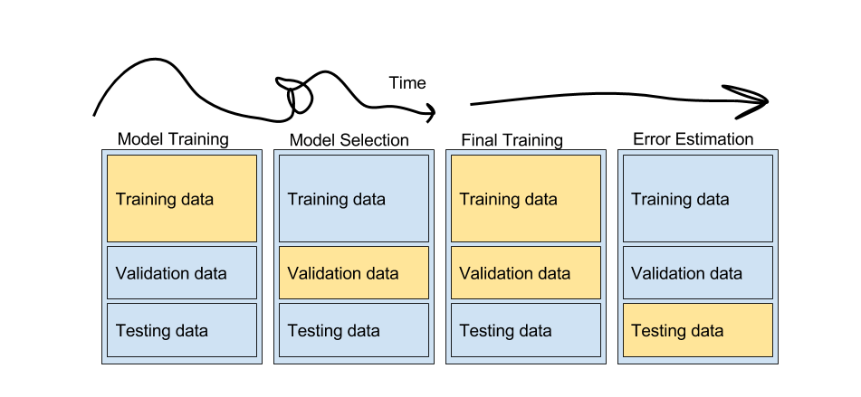
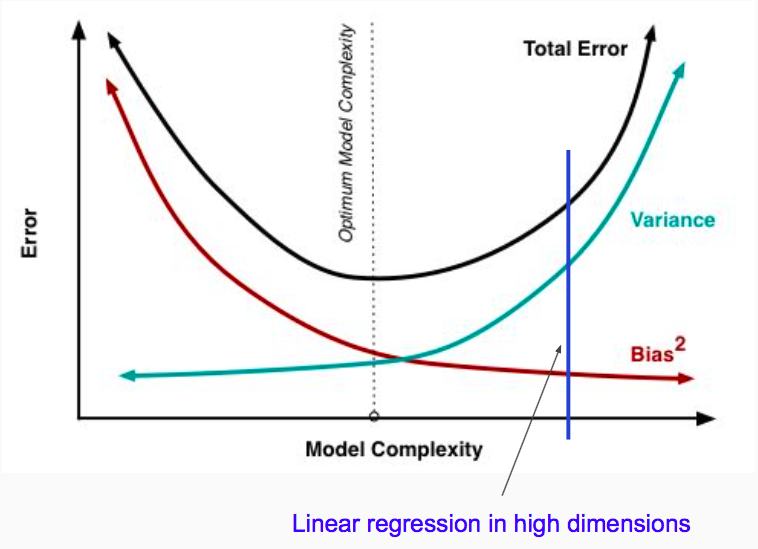

% Cross-Validation, Regularized Regression & Bias-Variance Tradeoff
% [Isaac Laughlin](isaac.laughlin@galvanize.com)

## Objectives

At the end of the lecture you should:

AM

*   State the purpose of Cross Validation
*   Be able to describe the three kinds of model error.
*   Describe how to select a model using CV
*   Give the reason for using k-fold CV
*   Explain k-fold Cross Validation
*   Explain the training, validation, testing data sets and what they are used for

PM

*   Be able to state the purpose of Lasso and Ridge regression, and compare the two choices
*   Build validation error curves for regularized regression

##  The (two) purposes of CV

1. Find the best model to use.
1. Estimate how well that model will perform on unseen data.

## Our general problem:

$$ y = f(X) + \epsilon $$

* Eventually we will have many $f$s and $X$s to choose from
* So far, we only have one tool, linear regression, but still many choices

## Comparing linear regression models

Imagine we have just a single variable $x_1$.

We can create a linear regression

$$ \hat{y}^{(1)} = \beta_0 + \beta_1 x_1 $$

or

$$ \hat{y}^{(2)} = \beta_0 + \beta_1 x_1 $$

or

$$ \hat{y}^{(3)} = \beta_0 + \beta_1 x_1 + \beta_2 x_1^2 + \beta_2 x_1^3 + ... $$

## Business

### Scenario

You are building a house-flipping company which will scrape zillow for
undervalued houses and buy them to flip. You're going to make money like this:

$$ price_{future} = f(X) $$

$$ \sum_i price_{future,i} - price_{today,i} $$

What are the risks to your business scheme?

## Issues

* Coefficients of linear regression minimize squared error for given X
* p-values tell us whether we can reject the idea that our coefficient could be 0
* $R^2 = f(X, \beta)$ ditto AIC, BIC

Of these mean squared error is the only one that seems able to answer the question "How will my model perform on data it hasn't seen?" But, the MSE the model achieves is likely to be *optimistic*.

## Overfitting

### Question:
What's wrong with each of the models above?

## Underfitting and Overfitting

Both are a failure to capture the true relationship between $y$ and $X$.

### Underfitting
* Model does not fully capture the signal in $X$
* Insufficently flexible model

### Overfitting
* Model erroneously interprets noise as signal
* Overly flexible model

## Two kinds of model error: Bias and Variance

Typically we refer to the error caused by under/overfitting by their statistical names _bias_ and _variance_.

### Good news
_Bias and Variance describe all *reducible* sources of error in a model_

## Bias and Variance
$$ Y = f(X) + \epsilon  $$

$$ \hat{Y} = \hat{f}(X) $$

$$ E[(y_0 - \hat{f}(x_0))^2] = ... = Var(\hat{f}(x_0)) + Bias^2(\hat{f}(x_0)) + Var(\epsilon) $$

## CV for Model Selection

## CV for Model Selection

Basic procedure:

1. Split into training/validation sets
1. Use training set to train several models of varying complexity
1. Evaluate each model using the validation set
1. Keep the model that performs best over the validation set

## So what should we do?

## Example use on cars data

## Train-Test error curves

## Train-Test Errors

http://pollev.com/galvanizedsi351

## Potential Problem

### Discuss
Given the train-validation split described, why might we doubt that our chosen model is truly the best? _Hint: what if we're unlucky?_

## K-Fold Cross Validation

## K=3-Fold Example

1.  Given a dataset $D$, partition $D$ into 3 parts, $D_1$, $D_2$, $D_3$.
1.  For each $D_i$
    1.    Mark D_i as the validation set
    1.    Mark the remaining $D_{j \ne i}$ as the training set.
    1.    Train candidate models on the training set.
    1.    Append the model errors to a list.
1. Compute the mean model errors.
1. Select the model with the lowest mean model error.
1. Retrain the model on all data.

## A subtle, but important problem

### Another problem
Is the error from the validation sets actually the error that I can expect on unseen data? _Hint: if I iteratively try many models, and choose the ones that have the best error on the validation data, is my validation set representative of unseen data?_

## Train-Validation-Test
No.

* Just as the errors observed in training are conservative, because those errors are realized on data the model had an opportunity to learn
* _Similarly_ the errors observed in CV are conservative, because those errors are realized on data that the model-selection procedure had an opportunity to learn

## CV Workflow

## Advanced CV techniques:

* Leave One Out CV (like k-fold, where k=n)
* Stratified CV (random within subgroups)
* Time-Series CV (useful for cases when observations are not independent in time)

## Final Word

# Regression for Prediction

