1. [Bias Variance Trade Off](#bias-variance-trade-off)
1. [Underfitting and Overfitting](#underfitting-and-overfitting)
1. [Feature Reduction Techniques](#feature-reduction-techniques)
1. [Metrics](#metrics)
1. [Subset Selection](#subset-selection)
1. [Cross Validation](#cross-validation)
1. [Skrinkage Methods](#shrinkage-methods)
1. [Ridge Regularization](#ridge-regularization)
1. [Lasso Regularization](#lasso-regularization)

# Bias Variance Trade Off

We first want to discuss two key terms: *bias* and *variance*.

We are assuming that our dataset is a random sample of the data. We want to make sure to answer this question: Does the model I'm building represent the *whole population* well? (i.e. not just the sample dataset that I have!)

We can see the different ways that our data can be off in terms of bias and variance.

Imagine this scenario: *If I were to take lots of different random samples of the data from my population, what would all the models look like?*

* **Bias:** Is the average of the residuals of the models close to the true model?
    - A *biased* model would center around the incorrect solution. How you collect data can lead to bias (for example, you only get user data from San Francisco and try to use your model for your whole user base).
    - High bias can also come from *underfitting*, i.e., not fully representing the data you are given.

* **Variance:** Are all the models close together?
    - The main contributor to high variance is insufficient data or that what you're trying to predict isn't actually correlated to your features.
    - High variance is also a result of *overfitting* to your sample dataset.

To see the bias variance tradeoff visually:

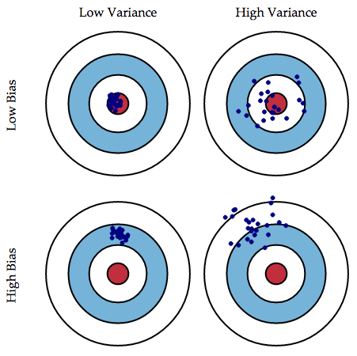

Note that both high bias or high variance are bad. Note that high variance is worse than it sounds since you will only be constructing the model once, so with high variance there's a low probability that your model will be near the optimal one.

Again and again, we will see the *Bias Variance Tradeoff*.

Looking at this from a number of feature perspective:

* Increasing the number of features means:
    - Increase in variance
    - Decrease in bias

## Underfitting and Overfitting

Let's say you're trying to fit a line to your data. Look at the following example. Just fitting a standard linear regression to the data doesn't fully encapsulate what's going on.

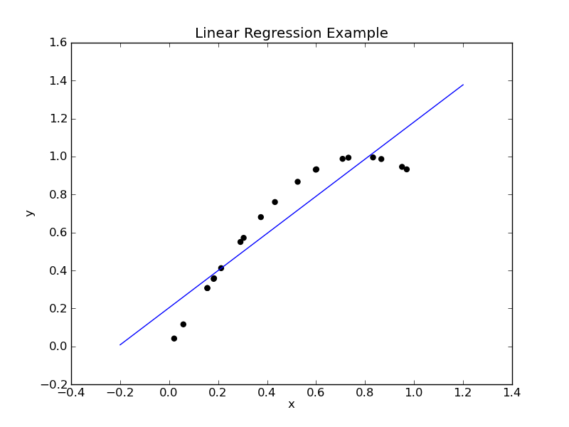

This is called *underfitting*.

It's probably more quadratic. We could however, err on the other side of giving our polynomial too high of a degree and we would *overfit*.

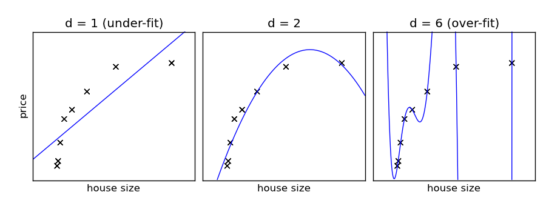

Here you can see if we have a degree of 6, we do a perfect job of predicting this data, but we haven't really done a good job of representing the data.

* **Underfitting:** When we underfit, we have *high bias* (and *low variance*). If we got several sample datasets, they would all build similar models, but they would all have the same poor residuals.

* **Overfitting:** We we overfit, our model is highly dependent on the sample dataset. If we were the build the model again with a new sample of data, we would have a totally different model! This is *high variance*. We also here have *low bias*, because although we aren't doing a good job of representing the true data, we are off in different directions with each model, so the means of the residuals will be small.

A graph can make this more clear:


Model complexity here could mean number of features (or degree of the polynomial)

# Feature Reduction Techniques

1. [Subset Selection](#subset-selection)
2. [Shrinkage Methods](#shrinkage-methods)
3. Dimensionality Reduction (later in the course)

## Metrics

Before we get into subset selection, let's go over metrics we use to measure how well a regression model is performing.

We've already seen R^2, which gives a value from 0 to 1 (0 being awful and 1 being awesome).

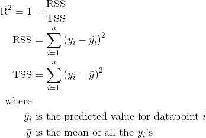

RSS is the *residual sum of squares*.<br/>
TSS is the *total sum of squares*, which is the variance of y.

We also will sometimes use MSE, which the *mean squared error*.

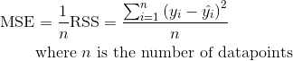

Notes:

* Ordering by R^2 is equivalent to ordering by RSS, which is equivalent to ordering by MSE. The model with the highest R^2 also has the lowest RSS and the lowest MSE.
* We often will use RSS as our metric. MSE has the advantage that it is normalized by the number of data points. R^2 has the benefit that it is normalized to be from 0 to 1.

Note that R^2 will improve (increase) as we add more predictors and encourage overfitting. There are some additional metrics that we can use that will penalize number of features.

**Adjusted R^2**, **AIC** and **BIC** are defined as follows:

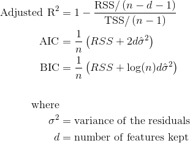

You will often see the more general form of AIC as follows:

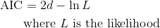


## Subset Selection

We want to determine which subset of features produces the best model. Here, the best model is the one with the highest Adjusted R^2. (We could also use AIC or BIC.)

There are a couple methods for determine which subset to use:

#### Best Subset

Build a model using every possible subset of the *p* predictors.

* This is very computationally intensive. There are going to be *2^p* models you need to build!

#### Forward Stepwise

Iteratively pick the next best predictor.

Here is the psuedocode:

1. Determine a ranking of the features.

    ```
    for j from 1 to p:
        for each predictor k that hasn't been picked yet:
            build the model with the (j-1) best predictors plus predictor k
            calculate the RSS
        choose the feature k from above with the best (lowest) RSS
    ```

2. Now that we have a ranking of the features, we need to determine how many we should keep. We have *p* models that we can build, each containing the *j* best features. We need to determine the appropriate cutoff.

    ```
    for j from 1 to p:
        build the model with the j best features
        calculate the Adjusted R^2
    choose the model with the highest Adjusted R^2
    ```

Notes:
* We use the Adjusted R^2 in Step 2. RSS or R^2 would not work! R^2 will get higher when we add more features and select for overfitting. We want to penalize adding more features to compensate for overfitting.
* We also could've used AIC or BIC in Step 2 instead of Adjusted R^2.
* In Step 1, it's fine to use just RSS. This is because we are comparing models with the same number of features. Using Adjusted R^2, AIC or BIC would be excessive since the penalty term would be the same.


## Cross Validation

Our goal is to get a sense of how good our model is on the whole dataset. The main purpose of this is for comparing models. We'll see different algorithms that we can compare. In the next section, we see variations of Linear Regression which help counteract overfitting, and we can assess which one is the best using *cross validation*.

So far, we have been calculating the metrics on the same dataset that we trained on. This can make us think that we did better than we actually did in the case of overfitting! Cross validation is used to measure how well we do on a *different dataset*.

*We use cross validation as a means to get a sense of the error. Our final model will be built on all of the data so that we can have the best model possible.*

There are three main methods for cross validation.

#### Validation Set

A validation (or hold out) set is a random sample of our data that we reserve for testing. We don't use this part of our data for building our model, just for assessing how well it did.

* A typical breakdown is:
    - 80% of our data in the training set (which we use the build the model)
    - 20% of our data in the test set (which we use to evaluate the model)
* Make sure that you randomize your data! It's really dangerous to pick the first 80% of the data to train and the last 20% to test since data is often sorted by a feature or the target! It would cause trouble if all the expensive houses were in your test set and never in the training set!
* Concerns:
    - *Variable:* Depending what random sample we get, we will get different values
    - *Underestimating:* We are actually underestimating a little bit since we testing a model built on just 80% of the dataset instead of the whole 100%.

#### Leave One Out Cross Validation (LOOCV)

Here we build as many models are there are data points! We take each of the data points out of out dataset, build the model with the rest of the data, and then calculate the MSE on the single data point.

Here are all the models you need to build. The blue part is the training set, and the yellow point is the test point.

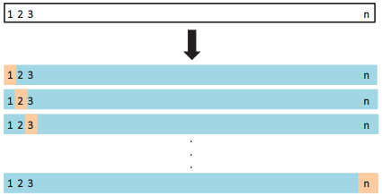

We can then calculate the total MSE.

* We build *n* models, each on *n-1* data points and calculate the MSE on the 1 remaining data point.
* Concerns:
    - Computationally expensive. This is a lot of models to build!
    - High variance. Since the test sets are so small, we will see a large variance in the error that we calculate.

#### KFold Cross Validation

A happy middle between the last two is KFold Cross Validation. Here, we break the data in *k* chunks (folds) all of the same size. Typically we choose *k* to be 5 or 10.

We will be building *k* models. Here we see again that the blue part is the training set and the yellow part the test set.

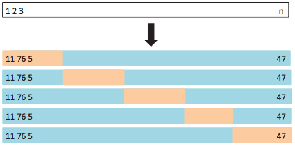

* Each point is used in the training set of *k-1* of the models. In 1 model, it's used in the test set.
* Again, make sure to randomize the data when breaking it up into chunks. Data that's next to each other in the dataset shouldn't be more likely to be in the same fold!
* With kFold cross validation, we will have less variance in our estimation of the error!


#### Cross Validation Example

To see how we can use Cross Validation to pick between models, let's consider the example where we are predicting the MPG of cars from the horsepower. Our data looks like this:

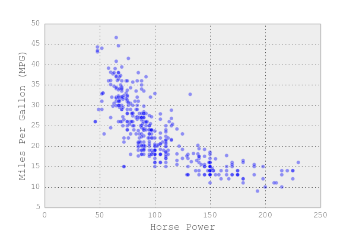

If we try building a Linear Regression model with different degrees of the polynomial, we will get better at predicting on the training set as we increase the degree, but at some point we will be overfitting and hurt our performance on the test set. We can see this graphically:


* *Underfitting:* On the left side of the graph, you can see that both the train and test errors are bad. This is because we are underfit.
* *Overfitting:* On the right side of the graph, you can see that the train error is great, but the test error is bad. This is because we are overfit.
* *Just right:* Around a degree 5 polynomial, we see the perfect balance between the two. This is the point where the test error is minimum.

In practice, we just care about minimizing the test error, we only look at the training error the get a better understanding of what's going on.


## Shrinkage Methods

There are two main shrinkage methods that we will take about. We will modify our linear regression cost function to add a penalty for having large coefficients.

Recall our standard linear regression cost function. We find the beta coefficients which minimize this function.

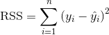

### Ridge Regularization

*Ridge Regularization* is also called *L2 Regularization* since it uses the L2 norm.

Here is our new cost function:

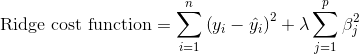

The second term here is the *shrinkage penalty*. Lambda here is an example of a *tuning parameter*. You will need to determine the best value of lambda via cross validation.

* If we increase lambda, the variance will decrease and the bias will increase.
* Lambda=0 is the same as standard Linear Regression.

Squaring the error is nice for differentiability purposes, but it might be too harsh of a penalty. This leads us to *Lasso*.

### Lasso Regularization

*Lasso Regularization* is also called *L1 Regularization* since it uses the L1 norm.

This is what our cost function looks like this time:

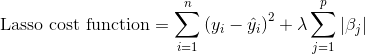

See the subtle difference in the shrinkage penalty. We will still have the same properties of lambda as noted above.

### Lasso vs Ridge

A key difference between Lasso and Ridge is that with Lasso, some of the coefficients will go to 0, while with Ridge, they will just get small.

This can be seen with the following picture.

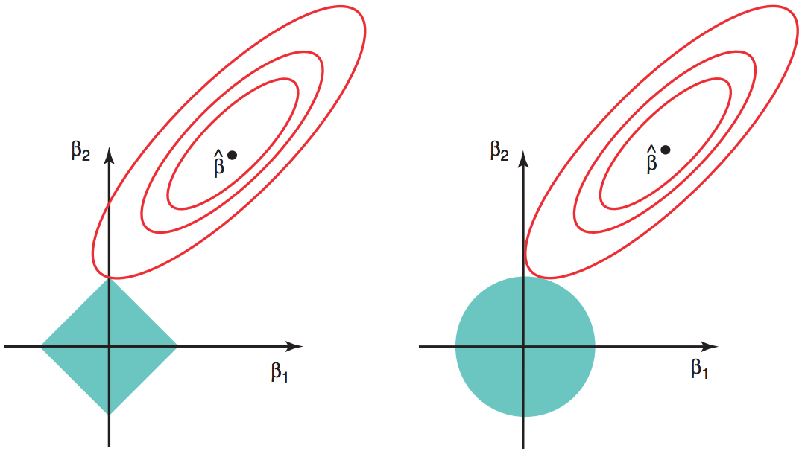

Note that if we fix the shrinkage penalty, with Lasso, we have a diamond and with Ridge we have a circle. As we minimize the RSS, we are more likely to hit Lasso at a corner (where one of the coefficients is 0), than we are to hit in the middle. All points are equally likely with Ridge.

This property often makes Lasso appealing, since we will actually remove features rather than just having some features with small beta coefficients.

## <u>More references</u>:

* [Ridge regression](http://tamino.wordpress.com/2011/02/12/ridge-regression/)
* [Lasso regression](http://statweb.stanford.edu/~tibs/lasso/simple.html)
* [Difference between L1 and L2](http://www.quora.com/Machine-Learning/What-is-the-difference-between-L1-and-L2-regularization), Aleks Jakulins answer. 
* [Matrix for of regression models](http://global.oup.com/booksites/content/0199268010/samplesec3)
* [The statistics bible](http://statweb.stanford.edu/~tibs/ElemStatLearn/printings/ESLII_print10.pdf), chapter 3
* [stats.stackexchange: Ridge vs. LASSO](http://stats.stackexchange.com/questions/866/when-should-i-use-lasso-vs-ridge)
* [MetaOptimize: L1 vs. L2](http://metaoptimize.com/qa/questions/5205/when-to-use-l1-regularization-and-when-l2)


