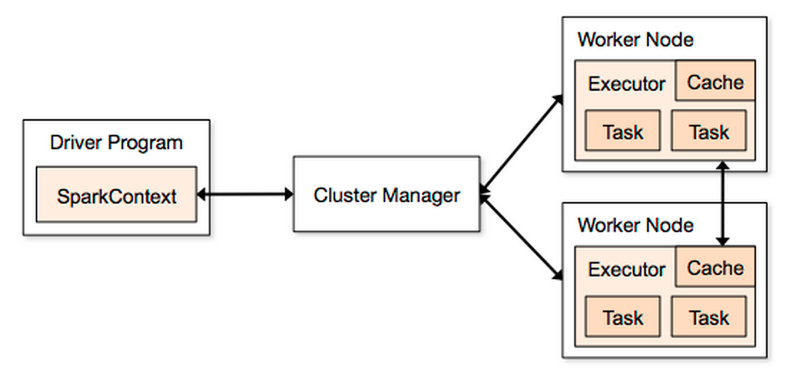

    %%javascript
    $.getScript('http://asimjalis.github.io/ipyn-ext/js/ipyn-present.js')

<h1 class="tocheading">Spark Architecture</h1>

Spark Architecture
==================

Starting Spark
--------------

Start Spark if you do not have it running already.

    import pyspark
    sc = pyspark.SparkContext()
    print sc

Spark Components
----------------

What are the major components of Spark?

Component       |Defines         |Concept                      |Use Case
---------       |-------         |-------                      |--------
Spark           |RDD             |Record Sequences             |Batch Processing
Spark SQL       |DataFrame       |Record Sequences with Schema |SQL queries on data
Spark Streaming |DStream         |Micro-Batches                |Near-Realtime Processing
MLlib           |ML Dataset      |Transformer Pipelines        |ML Algorithms
GraphX          |Edge/Vertex RDD |Graphs                       |Graph Algorithms
SparkR          |DataFrame       |Spark from R                 |Scale up R 

Spark Deployment
----------------

What are the different ways to deploy Spark?

Deployment         |Scenario           |Use Case
----------         |--------           |--------
Local              |Single machine     |For testing or small datasets
Spark Standalone   |Cluster            |Spark-dedicated cluster
YARN               |Cluster            |Shared cluster with HDFS, Map-Reduce, Hive
Mesos              |Cluster            |Shared cluster with web servers, YARN
EC2                |Cluster            |Cloud-based cluster, uses Spark Standalone

Deployment Notes
----------------

- YARN is the most popular configuration in production environments.

- YARN is used for on-prem while Spark Standalone is used for
  cloud hosting.

- Spark Standalone is good for demo, proof-of-concept, or testing.

- Spark Standalone is also used on EC2 for cloud-based clusters.

Metrics Through Application UI
------------------------------

How can I find out:

- How many worker nodes do I have?

- How many executors do I have?

- How many partitions is my data split into?

- Why is it taking so long?

The *Application UI* can tell you all this.

- The application UI serves up metrics through a web UI on port 4040
  on the machine your driver is running on.

- Try it now: <http://localhost:4040>.

Pop Quiz
--------

What if you have multiple Spark applications running? Which ports
are they going to be on?

1. If port 4040 is busy the application UI uses 4041, 4042, and so
on. 
2. Each Spark context has its own application UI. 

Gathering Custom Metrics
------------------------

Suppose I am processing sales transactions and some of the data is
bad. How should I deal with this?

- I could filter out the bad data.

- But what if most of the data is bad?

- Or what if my logic for detecting badness is broken?

Pop Quiz
--------

Here are two solutions. What are the pros and cons?

1. Printing is dangerous because log files can get as big as the data. 
2. Log messages are hard to track down on a cluster. 
3. Counting is better. 
4. It produces a quick actionable number. 

Accumulators
------------

What are *Accumulators*?

- Accumulators are like counters in MapReduce.

- They let you gather execution metrics.

- They should be used for counting small sets of events.

- Accumulators send data from executors to the driver during
  execution.

Accumulator Example: Counting Partitions
----------------------------------------

How can we find out how many partitions are being used for
processing our data?

- Use an accumulator to count each partition.

    def inc_acc(x, acc):
        acc+= 1
        return x

    part_count = sc.accumulator(0)

    record_count = sc.parallelize(xrange(100))\
      .mapPartitions(lambda iter: inc_acc(iter,part_count))\
      .count()

    print record_count
    print repr(part_count)
    print part_count.value

- `mapPartitions()` is called once per partition and gets an iterator
  that can walk through the records in the partition.

Parallelizing More Partitions
-----------------------------

Test the code by passing a second argument to `parallelize` with
the number of partitions.

    part_count = sc.accumulator(0)

    record_count = sc.parallelize(xrange(100),10)\
      .mapPartitions(lambda iter: inc_acc(iter,part_count))\
      .count()

    print record_count
    print repr(part_count)
    print part_count.value

Repartitioning
--------------

Test the code by adding a `repartition` function call before
`mapPartitions`.

    part_count = sc.accumulator(0)

    record_count = sc.parallelize(xrange(100),10)\
      .repartition(20)\
      .mapPartitions(lambda iter: inc_acc(iter,part_count))\
      .count()

    print record_count
    print repr(part_count)
    print part_count.value

Pop Quiz
--------

Where is the accumulator getting created? Where is it getting
incremented? How is it getting passed?

1. The accumulator is created on the driver. 
2. It is incremented on the executors. 
3. The variable `part_acc` contains a reference to the accumulator. 
4. This is passed as part of the `lambda` to the executors. 

Speeding Up Joins
=================

Joining Datasets
----------------

Given this sales data how can we find out which customers produced
the most revenue?

    customers_data = [
      (101, "Alice"),
      (102, "Bob"),
      (103, "Cat"),
    ]
    sales_data = [
      (103, 7.0, "Milk"), 
      (101, 2.0, "Parsley"), 
      (101, 70.0, "Clothes"), 
      (103, 11.0, "Coffee"),
      (102, 5.0, "Eggs"), 
      (101, 5.0, "Coffee"),
    ]

We can join the RDDs and then `reduceByKey` on customer IDs.

    # Parallelize and clean up the data.
    customers = sc.parallelize(customers_data)
    sales = sc.parallelize(sales_data)\
      .map(lambda (customer_id,amount,product): (customer_id,amount))

    # Join and add up all amounts per customer.
    customers.join(sales)\
      .reduceByKey(lambda (name1,amount1),(name2,amount2): (name1,amount1+amount2)) \
      .collect()

Problems with Join
------------------

What is the big problem with joins?

- Joins are a common way of combining datasets.

- They are also very expensive.

- `customers.join(sales)` shuffles `customers` and `sales` records by
  `customer_id` across different machines.

- The network is the bottleneck.

How can we speed this up?

- If one table was smaller you could pass it to all the executors
  first.

Optimizing Joins
----------------

How can we avoid shuffling data in joins?

- What if all the sales transactions for Alice were on the same
  machine as her customer record.
  
- If Spark knows that the records to be joined are all on the same
  machine it won't shuffle them.

    # Parallelize and clean up the data.
    customers = sc.parallelize(customers_data)\
      .partitionBy(2)
    sales = sc.parallelize(sales_data)\
      .map(lambda (customer_id,amount,product): (customer_id,amount))\
      .partitionBy(2)

    # Join and add up all amounts per customer.
    customers.join(sales)\
      .reduceByKey(lambda (name1,amount1),(name2,amount2): (name1,amount1+amount2)) \
      .collect()

- `.partitionBy(n)` creates `n` partitions based on keys.

Pop Quiz
--------

If you apply `map` or `flatMap` to an RDD after `partitionBy` will
Spark still avoid shuffling the data?

1. In that case the keys might have changed, so Spark will reshuffle
the data 
2. To preserve the partitioned-by-key state if you have to transform
data further after `partitionBy` use `mapValues` or `flatMapValues`
instead of `map` and `flatMap`. 

Sharing Data With Executors
---------------------------

How can we share data with all the executors?

- One way of sharing data is through closures. 

- When you reference a variable in the `lambda` or function in a
  transformation it gets sent with the function to the executors.

- Between `customers` and `sales` which one is likely to be smaller?
  Lets send the smaller table in through closures.

    # Turn customers into a dictionary.
    customer_dict = dict(customers_data)

    # Now process sales data and pass customers to the executors.
    sc.parallelize(sales_data)\
      .map(lambda (customer_id,amount,product): (customer_id,amount))\
      .reduceByKey(lambda amount1,amount2: amount1 + amount2)\
      .map(lambda (customer_id,amount): (customer_dict[customer_id],amount))\
      .collect()

Closures
--------

How do closures work?

- The data is serialized with the lambdas or functions passed to the
  transformations.

- A copy of it is then sent to every single task.

Pop Quiz
--------

What is a downside of sending the data to every single task? Could
we do better?

1. It would be nice if we could just send one copy of the data to each
executor 
2. This is exactly what *Broadcast Variables* do. 

Broadcast Variables
-------------------

What are *Broadcast Variables*?

- Broadcast variables let the driver send data to the tasks efficiently.

- Only one copy of the data is sent to each executor.

- The data is transferred through a peer-to-peer algorithm called
  Cornet.

- This speeds up the transfer by 1.7x compared to sending the data
  from the driver to each executor directly according to 
  [research][cornet-paper] at Berkeley.
  
[cornet-paper]: http://www.cs.berkeley.edu/~jordan/papers/chowdhury-etal-sigcomm11.pdf

Using Broadcast Variables
-------------------------

Lets use broadcast variables to transfer the customer dictionary to
the executors.

    # Turn customers into a broadcasted dictionary.
    customer_dict = sc.broadcast(dict(customers_data))

    # Now process sales data and pass customers to the executors.
    sc.parallelize(sales_data)\
      .map(lambda (customer_id,amount,product): (customer_id,amount))\
      .reduceByKey(lambda amount1,amount2: amount1 + amount2)\
      .map(lambda (customer_id,amount): (customer_dict.value[customer_id],amount))\
      .collect()

The key differences are:

- To broadcast your data you wrap it into a `sc.broadcast()` call.

- To access it in a task you use `customer_dict.value` instead of
  `customer_dict`. 

- Calling `.value` accesses the underlying shared broadcast object.

