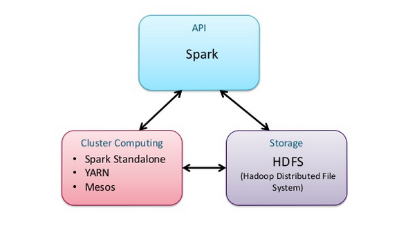
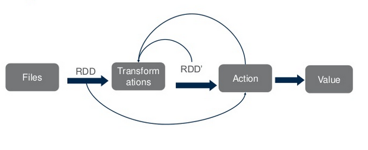
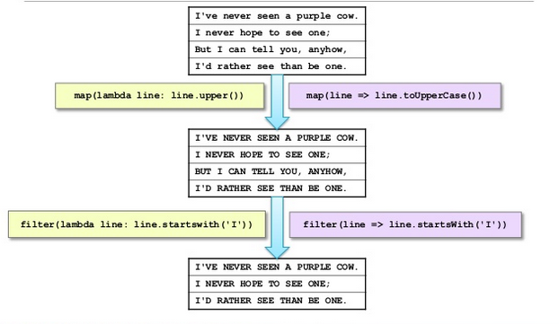
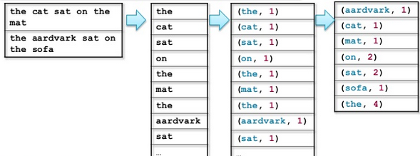

# What is Apache Spark?

* Apache Spark is a fast, general engine for large-scale data processing and analysis
	* Open source, developed at UC Berkeley 
* Written in Scala
	* Functional programming language that runs on the JVM  
	
# Key Concepts
* Avoid the data bottleneck by distributed data when it is stored
* Bring the processing to the data
* Data is stored in memory whenever possible

### Distributed Processing with the Spark Framework



## RDDs

* **RDD (Resilient Distributed Dataset)**

	* **R**esilient -- if the data in memory is lost, it can be recreated
	* **D**istributed -- stored in memory across the cluster
	* **D**ataset -- initial data can come from a file or created programmatically
* RDDs are the fundamental unit of data in Spark
* RDD is a read-only, partitioned collection of records
* Most of Spark programming is performing operations on RDDs
* Two types of RDD operations
	* **Actions** - return values
		* ```count```
		* ```take(n)```
	* **Transformations** - define new RDDs based on the current one
		* ```filter```
		* ```map```
		* ```reduce```
		


		 



* **RDDs can hold any type of element**
	* Primitive types: ints, chars, booleans, strings, etc.
	* Sequence types: lists, arrays, tuples, dicts, etc. (includes nested)
	* Scala/Java Objects (if serializable)
	* Mixed types
	
* **Some types of RDDs have additional functionality**
	* Double RDDs -- RDDs consisting of numeric data
	* Pair RDDs -- RDDs conisting of Key-Value pairs

* **Pair RDDs are a special form of RDD**
	* Each element must be a key-value pair (a two element tuple)
	* Keys and values can be any type
	* Example:
				
			(key1, value1)
			(key2, value2)
			(key3, value3)
* **Why?**
	* Used with Map-Reduce algorithms
	* Many additional functions are available for common data processing needs
		* sorting, joining, grouping, counting, etc.
		

* **MapReduce is a common programming model**
	* **Two Phases**
		* **Map** -- process each element in a data set
		* **Reduce** -- aggregate or consolidate the data
	* Easily applicable to distributed processing of large datasets

* **Hadoop MapReduce is the major implementation**
	* **Limited**
		* Jobs typically contain many map and reduce phases
		* Job output is saved to files after each phase completes
		* This has the effect of writing your intermediate data to disk and reading it back into memory between each phase
		* Many complex quieries (such as joins) can have many chained MapReduce phases, causing a large amount of disk I/O as intermediate phases are spilled to disk
		* Since disk I/O is orders of magnitude slower than RAM, jobs typically take a long time to complete

* **Spark implements MapReduce with much greater flexibility**
	* Map and Reduce fundtions can be interspersed
	* Results are stored in memory and 'pipelined` between phases without incurring the cost of disk I/O
		* Operations can be chained easily
		
# Example: WordCount

```python
counts = sc.textFile(file) \
	.flatMap(lambda line: line.split()) \
	.map(lambda word: (word, 1)) \
	.reduceByKey(lambda v1, v2: v1+v2)
``` 



## Basic Transformations

```python
# Every Spark application requires a Spark Context
# Spark shell provides a proconfigured Spark Context called `sc`
nums = sc.parallelize([1,2,3])
# Pass each element through a function
squared = nums.map(lambda x: x*x) // => {1, 4, 9}
# Keep elements passing a predicate
even = squared.filter(lambda x: x % 2 == 0) // => {4]
# Map each element to zero or more others
nums.flatMap(lambda x: range(x)) // => {0, 0, 1, 0, 1, 2}
```

## Basic Actions

```python
nums = parallelize([1, 2,3])
# Retrieves RDD contents as a local collection
nums.collect() // => [1, 2, 3}]
# Returms first K elements
nums.take(2) // => [1, 2]
# Count number of elements
nums.count // => 3
# Merge elements with an associative function
nums.reduce(lambda: x, y: x + y) // => 6
# Write elements to a text file
nums.saveAsTextFile("hdfs://file.txt")
```

## Key-Value Operations
```python
pets = sc.parallelize(
	[("cat", 1), ("dog", 1), ("cat", 2)])
pets.reduceByKey(lambda x, y: x + y) // => {(cat, 3), (dog, 1)}
pets.groupByKey() // => {(cat, [1, 2]), (dog, [1])}
pets.sortByKey() // => {(cat, 1), (cat, 2), (dog, 1)}
```