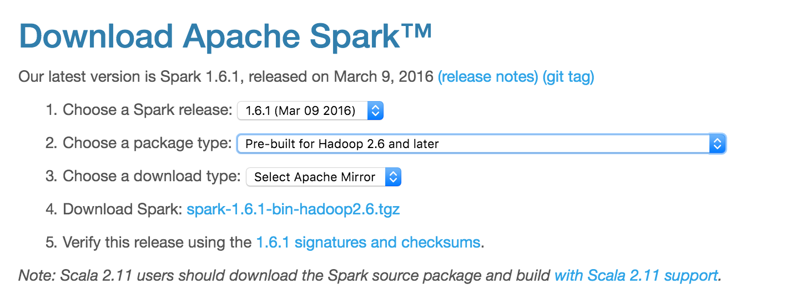
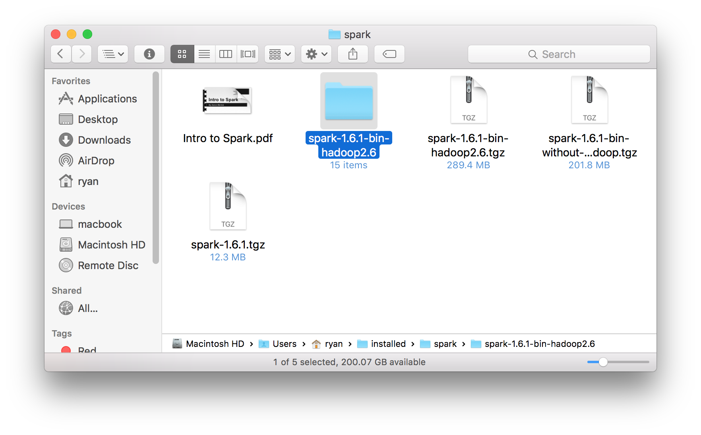

# Installing Spark on OS X

1. Download Spark. Be sure to select pre-built with Hadoop. See below:



2. Unzip somewhere... just remember where! I put mine in `~/installed/spark/...`



3. Modify `~/.profile`. Add the following to the end of the file. You'll have to set `SPARK_HOME` to point to where you unzipped spark.
```
# Spark stuff:
export SPARK_HOME=/Users/ryan/installed/spark/spark-1.6.1-bin-hadoop2.6
export PATH="${SPARK_HOME}/bin:$PATH"
export PYTHONPATH="${SPARK_HOME}/python/:$PYTHONPATH"
export PYTHONPATH="${SPARK_HOME}/python/lib/py4j-0.9-src.zip:$PYTHONPATH"
```

4. Restart Terminal so that the updates to `.profile` take hold.

5. Run `pyspark`. It should work! It will create a SparkContext for you automatically, type `sc` and hit enter to ensure you have your SparkContext available.

6. Spark by default will log A LOT OF STUFF while you're playing with it in `pyspark` (or elsewhere). Let's turn off this crazy amount of logging (we'll leave it where Spark only logs WARNINGS and ERRORS -- by default it logs INFO, WARNINGS, and ERRORS).
```
cd $SPARK_HOME/conf
cp log4j.properties.template log4j.properties
```
Edit "log4j.properties" and replace "rootCategory=INFO" with "rootCategory=WARN".
