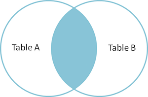
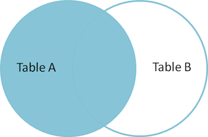
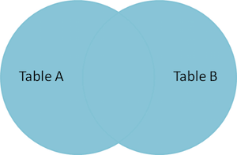

% Introduction to SQL
% September 8, 2016
% Miles Erickson


## Standards 

* Connect to a SQL database via command line (i.e. Postgres).
* Connect to a database from within a python program.
* State function of basic SQL commands.
* Write simple queries on a single table including SELECT, FROM, WHERE, CASE clauses and aggregates.
* Write complex queries including JOINS and subqueries.
* Explain how indexing works in Postgres.
* Create and dump tables.
* Format a query to follow a standard style.
* Move data from SQL database to text file.

## Simplified objective:

By the end of today, you will be able to connect to a Postgres database, answer questions using data and/or download data for further investigation.


## What is a Relational Database Management System? (RDBMS)

*  *Persistent* data storage system
    * survives after the process in which it was created has ended
    * is written to non-volatile storage
    * is infrequently accessed and unlikely to be changed
* RDMBS was the *de facto* standard for storing data
    * Examples: Oracle, MySQL, SQLServer, Postgres
    * With "Big Data", this is beginning to change


## Why RDBMS?

An RDMBS provides the ability to:

* model relations in data
* query data and their relations efficiently
* maintain data consistency and integrity


## RDBMS Data Model

* **Schema** defines the structure of the data
* The database is composed of a number of user-defined **tables**
* Each **table** will have **columns (aka fields)** and **rows (aka records)**
* A **column** is of a certain **data type** such as integer, string, or date
* A **row** is an entry in a table with data for each column of that table

With a new data source, your first task is typically to understand the schema (not trivial)


## Postgres Basics

* [Set up Postgres](https://github.com/zipfian/welcome/blob/master/notes/postgres_setup.md)

* Connecting to Postgres and creating a DB
    * psql

* At psql prompt:
```
    CREATE DATABASE <db_name>;
    \q
```
* psql -d <db_name>

* Some useful psql commands at the prompt:
    ```
    \l - list all the tables in the database
    \d - describe the table schema
    \d db_name - describe table for a specific db
    \h - HELP
    \?, help
    \connect <db_name>
    ```


## Database Table Example

```
  CREATE TABLE users {
      id INTEGER PRIMARY KEY,
      name VARCHAR(255),
      age INTEGER,
      city VARCHAR(255),
      state VARCHAR(2)
  }
```

The data types available vary from system to system. The above is an example for PostgreSQL where VARCHAR is a string data type.


## Primary Key

A primary key is a special column of a table that uniquely identifies that entry.

* EXAMPLE from the *users* table

A primary key is not always an integer - it could be a combination of columns, hash, timestamp..etc.,


## Foreign Keys

**Foreign Keys** are columns that reference some other entry in the database.


Example:
```
CREATE TABLE visits {
    id INTEGER PRIMARY KEY,
    created_at TIMESTAMP,
    user_id INTEGER REFERENCES users(id)
}
```


## Schema Normalization

Minimizes Redundancy. For example:

* Details about a user(address, age) are only stored once (in a *users* table)
* Any other table (eg. *purchases*) where this data might be relevant, only references the user_id

* Choose Normalized or Denormalized Schemas based on the use case:
    * Heavy reporting (Data Warehouse)
    * Transactional Systems (Ordering System)


# SQL

## Structured Query Language (SQL)

* As a data scientist, your main interaction with RDBMS will be to *extract* information that already exists in a database
* SQL is the language used to query relational databases
* All RDBMS use SQL and the syntax and keywords are the same for the most part, across systems
* SQL is used to interact with RDBMS, allowing you to create tables, alter tables, insert records, update records, delete records, and query records within and across tables.
* Even non-relational databases like Hadoop usually have a SQL-like interface available


## SQL syntax

All SQL queries have three main ingredients:

    SELECT  *What* data do you want?
      FROM  *Where* do you want to get the data from?
     WHERE  *Under what* conditions?

SQL is *Declarative* rather than *Imperative*. That is, you tell the machine what you want and it (database optimizer) decides how to do it


*Advanced:* You can use Explain-plan to look at the *how*


## SQL Queries

Select the columns *name*, *age* from the table *users*.

```
SELECT name, age
FROM users
```

* SQL always returns a table, so the output of the query above is a sub-table of *users* with 2 columns.

Select *name* and *age* for every user in *users* who live in CA.

```
SELECT name, age
FROM users
WHERE state = 'CA'
```


# SQL Examples


## More SQL

* Joins
* Subqueries
* Order of Operations


## JOINS

* **JOIN** clause used to query across multiple tables using *foreign keys*

* Every **JOIN** has two segments:
    * Specifying the *tables* to JOIN
    * Specifying the *columns* to match


## JOIN types

There are different JOIN types to deal with different situations:

* **INNER JOIN** discards any entries that do not have a match between the tables based on the keys specified.
* **LEFT OUTER JOIN** keeps all entries in the left table regardless of whether a match is found in the right table
* **RIGHT OUTER JOIN** keeps all the entries in the right table instead of the left regardless of the match.
* **FULL OUTER JOIN** will keep the rows of both tables no matter what


## Inner Joins



*copied from http://blog.codinghorror.com/a-visual-explanation-of-sql-joins/*


## Left Join



*copied from http://blog.codinghorror.com/a-visual-explanation-of-sql-joins/*


## Outer Join



*copied from http://blog.codinghorror.com/a-visual-explanation-of-sql-joins/*


## Subqueries

* In general, you can replace any table name with a SELECT statement.
    * SELECT ..... FROM (SELECT ....)
* If a query returns a *single value*, you can treat it as such.
    * WHERE var1 = (SELECT ...)
* If a query returns a **single column**, you can treat it sort of like a list/vector
    * WHERE var1 IN (SELECT ...)


## Order of Evaluation of a SQL SELECT Statement

1. **FROM + JOIN**: first the product of all tables is formed
2. **WHERE**: the where clause filters rows that do not meet the search condition
3. **GROUP BY + (COUNT, SUM, etc)**: the rows are grouped using the columns in the group by clause and the aggregation functions are applied on the grouping
4. **HAVING**: like the **WHERE** clause, but can be applied after aggregation
5. **SELECT**: the targeted list of columns are evaluated and returned
6. **DISTINCT**: duplicate rows are eliminated
7. **ORDER BY**: the resulting rows are sorted


## References

* [Introduction to SQL for Data Scientists](http://downloads.bensresearch.com/SQL.pdf)
* [Yhat Blog - SQL](http://blog.yhat.com/posts/sql-for-data-scientists.html)
* [Visual Explanation of Joins](http://blog.codinghorror.com/a-visual-explanation-of-sql-joins/)
* [SQLZoo](http://sqlzoo.net/wiki/SQL_Tutorial)
* [Zipfian SQL Tutorial](https://github.com/zipfian/SQL-Tutorial)

# End of Morning Lecture

## Summary:

* Connect to Postgres via the command line
* Explain the difference between different types of joins
* List the order of operations in SQL
* Write queries on a single table using SELECT, FROM, WHERE, GROUP BY
* Write queries on multiple tables using JOINS and Subqueries
* Explain primary and foreign keys
* Create and dump tables
