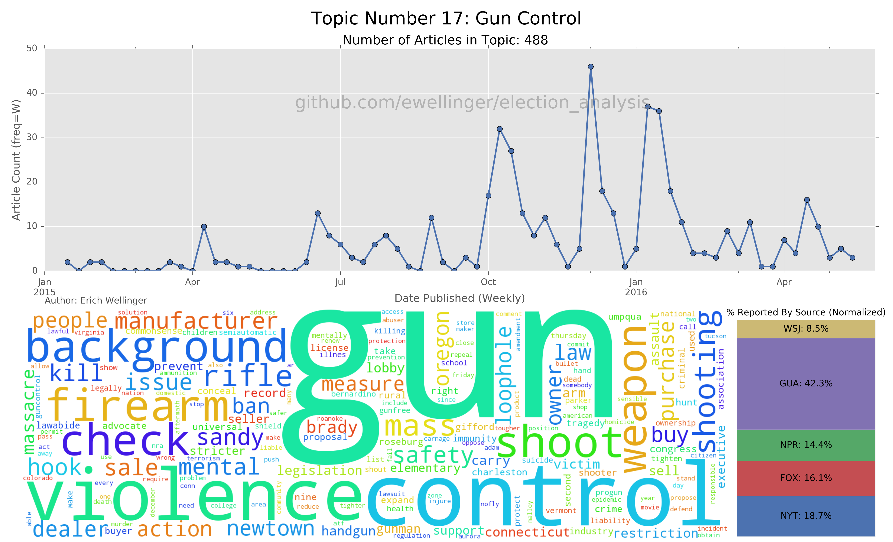

## Goals

Objectives:

* How does NMF differ from PCA/SVD approaches
* NMF and parts-based representation
* Linguistic Applications
* Sparsity of solution
* Overview of algorithm

## NMF Overview

What is NMF?

* A process by which we take a large matrix $V$ and factor it into 2 smaller dimensional matrices $W$ and $H$
* The matrices are all non-negative
    * Often inherent in the data being considered
* Creates a parts-based representation due to the nature of the non-negativity constraint
* Generally speaking, NMF is a method for modeling the generation of directly observable visible variables $V$ from hidden variables $H$
* Each hidden variable co-activates a subset of visible variables

## Parts-Based Representation

* The non-negativity constraints lead to a parts-based representation due to only allowing for additive, not subtractive, combinations
* Intuitively speaking, this means the non-negativity constraint is compatible with the notion of combining parts to form a whole
* We could use NMF on a dataset of human faces to identify latent representations of a face.  We would then use these latent representations to additively build up a face, recreating the original in a piece meal fashion.
    * This differs from a representation produced by a PCA encoding in that components may detract from components already in place.

## Linguistic Applications

When applying NMF to linguistic tasks, NMF has the added benefit of being able to tease out the meaning of words in relation to the semantic feature.

Suppose we used NMF to pick out latent topics from articles in an encyclopedia and we had two articles that each had the word 'lead' appearing numerous times.  In one article 'lead' appeared alongside with the words 'metal', 'copper', and 'steel', while in the other it appeared alongside 'person', 'rules', and 'law'.

NMF would be able to tease out the different meanings of the word based on what words it frequently co-occurs with.

## Sparsity

* NMF representations are naturally sparse in that many of the components are exactly equal to zero.

Latent Topic | Matrix | Alien | Star Wars | Casablanca | Titanic
-------------|--------|-------|-----------|------------|--------
0            | 0.00   | 3.02  | 1.85      | 0.00       | 0.00
1            | 0.00   | 0.20  | 0.00      | 2.19       | 2.19
2            | 5.21   | 0.00  | 2.31      | 0.00       | 0.00

## Sparsity

* This is in contrast to PCA which will often incorporate some aspect of every feature in a component.

Latent Topic | Matrix | Alien | Star Wars | Casablanca | Titanic
-------------|--------|-------|-----------|------------|--------
0            | -0.50  | -0.62 | -0.60     | -0.06      | -0.06
1            | 0.09   | -0.05 | 0.11      | -0.70      | -0.70
2            | -0.78  | 0.62  | 0.03      | -0.07      | -0.07

## NMF Overview

$$V_{n*m} \approx W_{n*p} * H_{p*m}$$

where...

* $v_{i,j} \ge 0$, $\forall v_{i,j} \in V$
* $p \le min\{n, m\}$

## NMF Algorithm

We want to minimize the following cost function with respect to $W$ and $H$ such that $W, H \ge 0$...

$$||V - WH||^2$$

* Lee and Seung's multiplicative update rules
    * Provides a good compromise between speed and ease of implementation
* Additive update rules such as gradient descent
    * Convergence can be slow and is sensitive to choice of step size

## Multiplicative Update Steps

* Start with some random $W$ and $H$
* Repeatedly adjust $W$ and $H$ to make $||V - WH||^2$ smaller

$$H_{a \mu} \leftarrow H_{a \mu} \frac{(W^T V)_{a \mu}}{(W^T W H)_{a \mu}}$$
$$W_{i a} \leftarrow W_{i a} \frac{(V H^T)_{i a}}{(W H H^T)_{i a}}$$

* Stop when some threshold is met

## Objective Function

* General function
$$||V - WH||$$

* Function with regularization

$$
\begin{aligned}
0.5 * ||V - WH|| &+ \alpha * l1\_ratio * ||vec(W)||_1 \\
&+ \alpha * l1\_ratio * ||vec(H)||_1 \\
&+ 0.5 * \alpha * (1 - l1\_ratio) * ||W||_{Fro^2} \\
&+ 0.5 * \alpha * (1 - l1\_ratio) * ||H||_{Fro^2}
\end{aligned}
$$

## Cost Function
* Frobenius Norm
$$||A||_{Fro^2} = \sum_{i,j} A_{ij}^2$$
* Elementwise L1 Norm
$$||vec(A)||_1 = \sum_{i,j} abs(A_{ij})$$

## Example Code {.fragile}

\begin{listing}[H]
\begin{pythoncode}
from sklearn.decomposition import NMF

# We need to choose the number of Latent Topics k
nmf = NMF(n_components=k)
nmf.fit(V)
W = nmf.components_
H = nmf.transform(V)
\end{pythoncode}
\caption{NMF in Scikit-Learn}
\end{listing}

## Example Topic

