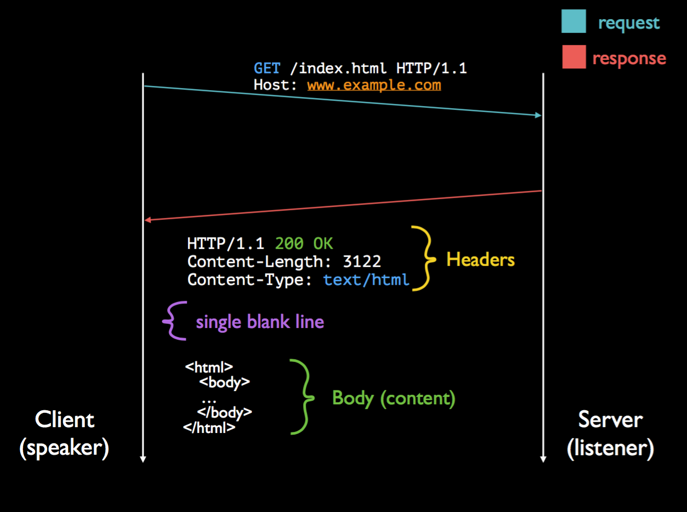
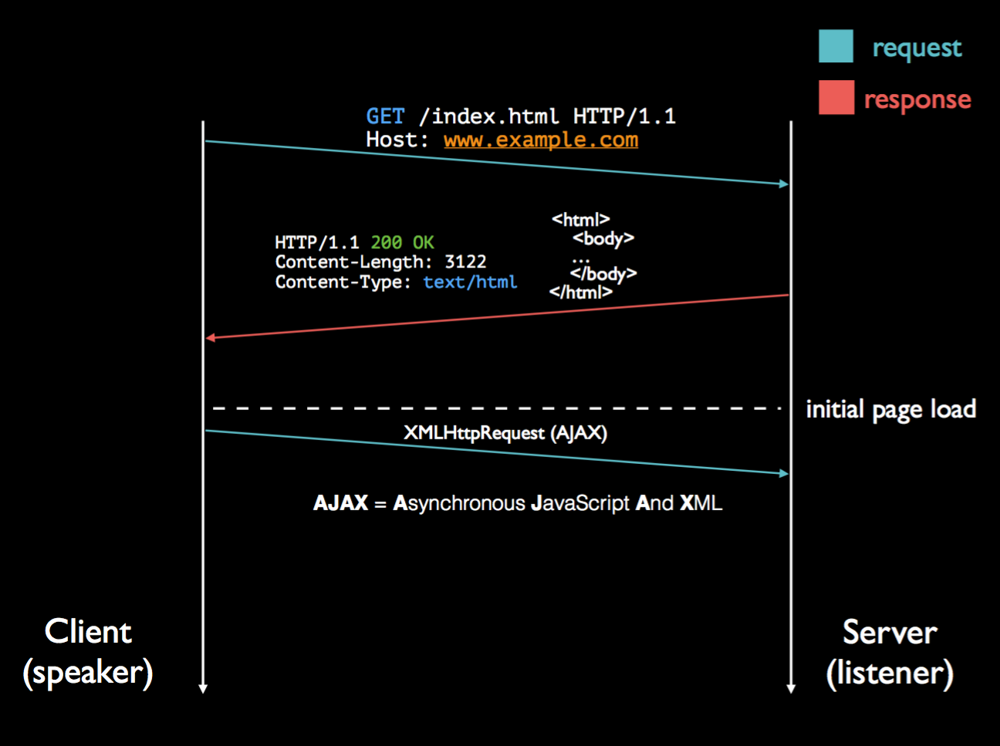
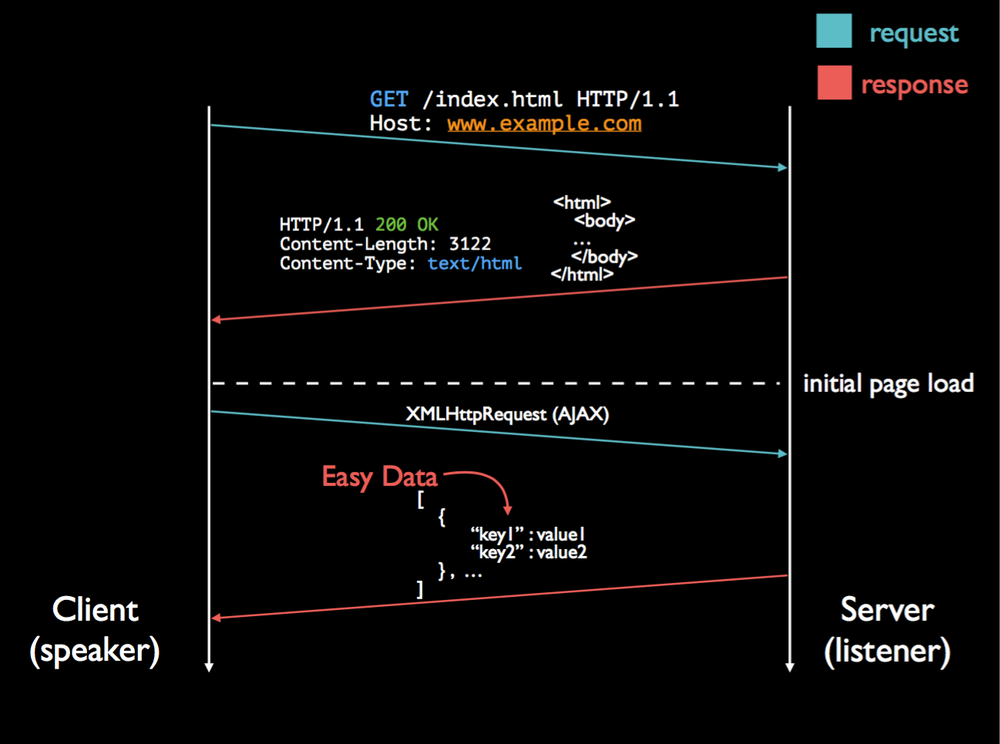
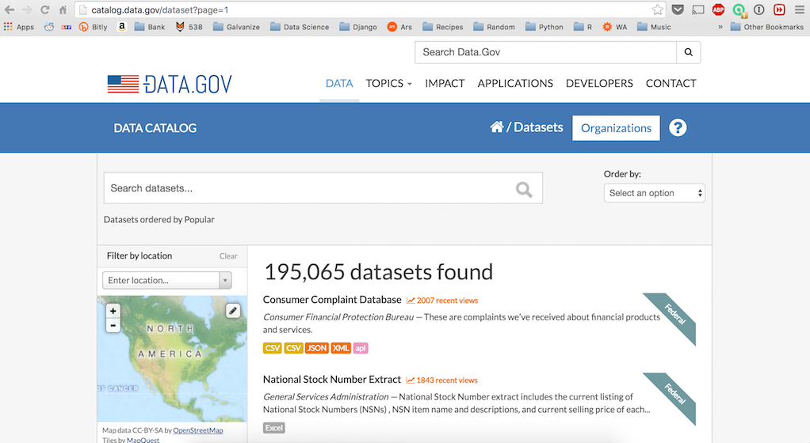
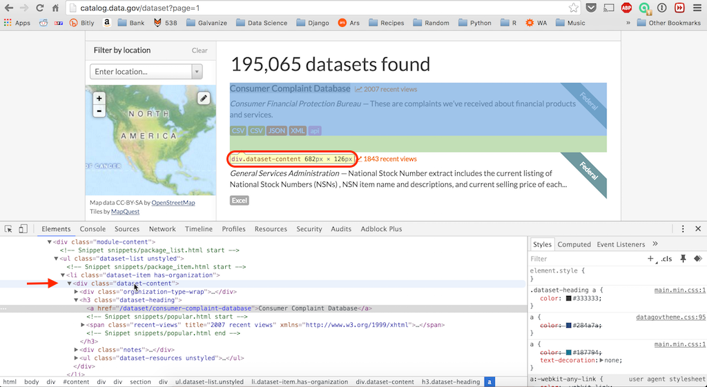
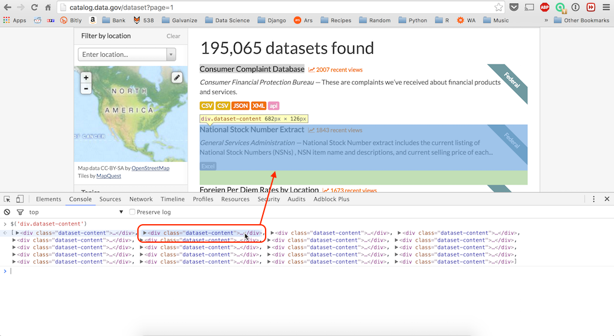
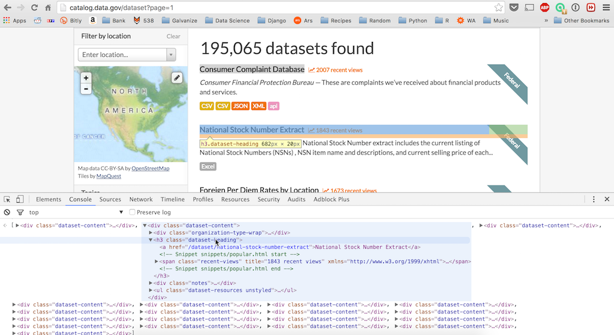

# Web Scraping

The infrastructure of the internet allows us to tap into a insanely large treasure trove of data that can be accessed through the process of web scraping.  Just to put this in perspective, as of 2014, Google has indexed an estimated **200 Terabytes** of data; however, this is only estimated to be 0.004% of the total size of the internet (i.e. the internet is extraordinarily massive).  Thus, getting sufficiently skilled with working with web pages and manipulating HTML within Python allows you to acquire data and address questions that wouldn't necessarily be possible otherwise.

While this is by no means a comprehensive breakdown of web-scraping, this notebook should give you a good starting point for understanding the infrastructure of the internet, how HTML/CSS fit together, and how we can use Python to interact with these technologies.

#### A Note on Ethics & Legality

Before delving into web scraping, we must first be aware of the legality of what we're doing and the associated ethics of these techniques.  Web scraping is often prohibited by a website's Terms of Service, although the enforceability of these terms is unclear.  As such, web scraping (or data mining through the utilization of a *bot*) often falls into a legal gray area.  
For a small, personal project you will rarely run into any issues even if the site you are scraping explicitly prohibits the execution of bots.  Worse case scenario, you may receive a cease-and-desist request from the organization you are scraping.  If, however, you are intending to use this scraped data to build a product that you plan on monetizing you should be **very** careful of the legal ramifications.  
You should also keep in mind the "load" you are placing on the web server you are querying.  As we will learn below, there is a cost incurred by the target server for every query that is made by your bot, which means you should make every effort to avoid performing unnecessary queries if possible.

---

## Web Overview

The World Wide Web (WWW) and the Internet is an extraordinarily vast place and allows you to access all manners of content from every corner of the globe.  While the average person takes the inner-workings of this behemoth for granted, we must have a base understanding of how it works in order to be successful with web scraping.   

### Web Vs. Internet
The first thing to clarify is that the World Wide Web (WWW) is **NOT** synonymous with the Internet.  To illustrate this point, let's consider the website [`http://www.npr.org/`](http://www.npr.org/).  This website exists on a *server* somewhere in the world and has information saved to it.  When we type in this *URL* in our web browser, we are able to view that information.  The *Internet*, meanwhile, is the actual infrastructure which enables us to retrieve this information.

To put this another way, we can think of the web as a collection of islands existing all over the globe and the internet as bridges connecting these islands.

In order to utilize the Internet to view the contents of a particular web server, we must direct our web browser to the location of said server.  We do this by typing in the *Uniform Resource Locator* (URL) in our browser.  But what is a URL?

---

### Components Of A URL
A URL, such as `http://www.mysite.com:80/index.html`, is a reference to a web resource that both specifies the location on a computer network as well as the mechanism for retrieving it.  A URL is a specific type of *Uniform Resource Identifier* (URI).  As we will see, there are several components specified by the URL.

#### Protocol
The protocol specifies how the web server should interpret whatever information you are sending it.  Protocols are the backbone of computer networking.  In the case of our example, the protocol component of the URL is `http`, which stands for [Hypertext Transfer Protocol](https://en.wikipedia.org/wiki/Hypertext_Transfer_Protocol).  This protocol is the standard language of the Web and specifies how packets of information should be structured.  
There are a [multitude of protocols](https://en.wikipedia.org/wiki/Lists_of_network_protocols) which exist for communication between computer systems, but HTTP (and HTTPS, HTTP's encrypted cousin) are by far the most common for viewing web pages.

**NOTE**: Most modern day browsers will fill in this aspect of the URL automatically (i.e. entering `http://www.npr.org` and `www.npr.org` will both take you to the same place), however care should be taken to specify the full URL when web scraping or you will likely run into errors!

#### Host
The host points to the domain name of the web server you would like to communicate with.  In the case of our example this would be `www.mysite.com`.  This domain name corresponds to an associated IP Address (e.g. `http://www.npr.org`'s IP Address is `23.61.194.225`) and can be thought of as that web server's street address.

#### Port
If the host name/IP Address is the street address of the web server we want to reach, we can think of the port as being the apartment number.  The port number, in conjunction with the protocol, tells the system what it should do with the information coming in.  Ultimately, whether we are loading a web page with `http` (Port 80), receiving email with `imap` (Port 143), or transferring files with `ftp` (Ports 21 and 22), the incoming and outgoing data is just a stream of 0's and 1's.  Without a system for differentiating what stream corresponds to what process, all the bits would be jumbled together and none of it would make any sense.  Thus, the port number instructs the system how to interpret different streams of data.  
The port numbers between 0 and 1023 are the well-known ports, or system ports, and are reserved for specific purposes.  In total, port numbers can range from 0 to 65535.  For a somewhat excessive breakdown of what these ports correspond to, [please see this](https://en.wikipedia.org/wiki/List_of_TCP_and_UDP_port_numbers).

**NOTE**: This is probably more in depth than is necessary, just know that HTTP corresponds to port 80 and that, just as browsers will automatically fill in the protocol, they will also automatically specify the port number.

#### Path
The path portion of the URL simply specifies where on the server the file you are requesting exists.  In the case of our example this would be `/index.html`.

---

### Client-Server Relationship
Whenever one machine wants to communicate with another machine a back-and-forth interaction takes place known as the client-server relationship.  

Let's say we want to get the homepage of `http://www.npr.org`.  In this example, our computer is the *client* and `www.npr.org` is the *server*.  The interaction starts with the client sending a `GET` *request* to the server indicating that it would like some piece of information that resides on the server (Figure \ref{server1}).

{width=300px}

Once the server receives this `GET` request, it will send back a *response* with the requested information contained in the body (Figure \ref{server2}).  There is also a status code included in the head of the packet indicating the status of the request; 200 indicates the request was processed successfully.  For a breakdown of the status codes you may encounter, [please refer to this](https://en.wikipedia.org/wiki/List_of_HTTP_status_codes).

{width=300px}

Past the initial page load, there can also be AJAX (Asynchronous Javascript And XML) requests for dynamically loading elements on a page without having to navigate to a new page.  This is shown in the following two images (Figures \ref{server3} and \ref{server4}):

{width=300px}

{width=300px}

As we will see later on, web pages employing Javascript elements can pose problems for our go-to web-scraping techniques.  But fear not, there are ways of addressing these issues!

---

### HTML & CSS

HTML, or *HyperText Markup Language*, is the language that virtually all web pages are written in.  HTML allows us to describe how web pages should render themselves and display content.  They do this by using *HTML Tags*, where each tag is describing different document content.  

For example we could specify the title of our page with the following tags: \mintinline{html}{<title>This is the Title!</title>}.  \mintinline{html}{<title>} is the opening tag and \mintinline{html}{</title>} is the corresponding closing tag.  Anything that falls in the middle will be interpreted as the title of the document.  For a more in-depth introduction to HTML, please refer to [this w3schools Tutorial](http://www.w3schools.com/html/html_intro.asp).

We can also apply *attributes* to HTML tags to control how they will be stylized.  Let's say we would like to change the color of our super original title tag to red to make it pop.  We could easily achieve this with the following style attribute: \mintinline{html}{<title style="color:red;">This is a red Title!</title>}.  

But what if we have a very large website and want to change the look and feel of the entire thing?  Certainly there has to be a better way than manually manipulating individual tags?  

This can easily be achieved with the use of *Cascading Style Sheets*, or CSS.  Typically CSS is defined in a separate style sheet file with a `.css` extension which controls how certain tags are stylized.  For example, the following CSS block would make any `<p>` tags have red text and be in the courier font [\ref{cssblock}]:

\begin{listing}[H]
\begin{minted}[linenos, frame=lines, framesep=8pt, bgcolor=shadecolor]{css}
p  {
    color: red;
    font-family: courier;
}
\end{minted}
\caption{Example CSS Block}
\label{cssblock}
\end{listing}

This is all well and good, but our goal isn't to build websites, it's to systematically extract information from them!  To this end, CSS selectors provide a succinct way of only selecting certain aspects from a potentially giant block of HTML.

#### CSS Selectors

To really see the power of CSS selectors we need to see them in action!  To that end, try getting through the first 10-15 levels of the [Game of Fruit](http://flukeout.github.io/).

How would you go about selecting all `<p>` elements with `class="article_content"` that are also decedents of a `<div>` element?

```
div p.article_count
```

You can also refer to this [CSS Selector Cheatsheet](http://www.cheetyr.com/css-selectors).

### Chrome DevTools

The developer tools contained in your browser of choice are indispensable when scraping a website.  For the purposes of this guide we will be using [Chrome](https://www.google.com/chrome/browser/desktop/index.html)'s DevTools.

#### Using the Console to select CSS elements

1. First we need to go to the website we want to scrape.  Let's look at scraping all of the metadata on available open government datasets provided by [data.gov](http://catalog.data.gov/dataset) (Figure \ref{datagov1}).

{width=400px}

2. We need to decide what information we want to scrape.  Let's start with gathering all the information for each of the datasets listed on this site including the name, number of recent views, source, description, and the available formats.  Right click on the title of the first dataset and click on `Inspect` (Figure \ref{datagov2}).  This will bring up the Chrome Developer Tools.

{width=400px}

3. The exact element that you had right clicked on will be highlighted, but we want more than just the name of each dataset!  Drag your mouse up through the elements listed above the highlighted one until you find a tag that contains all the information we want (Figure \ref{datagov3}).  In this case the \mintinline{html}{<div class="dataset-content">} tag contains everything we need.  You will also notice that, when hovering over this element, we see that the CSS selector for this tag is printed under the highlighted section of the page.  This immediately tells us that we can use a \mintinline{html}{div.dataset-content} selector to grab this section of the page!

{width=400px}

4. Click on `Console` to switch to the console section (Figure \ref{datagov4}).  This is where we will enter our CSS selector to grab just the portions of the page that we are interested in.

{width=400px}

5. We can grab elements specific elements on the page by entering \mintinline{html}{$('your css selector')} into the console.  In this case, we entered \mintinline{html}{$('div.dataset-content')} which is parsing out each of the datasets we are interested in.  You should now see a list of elements that match your selection, hovering over one of them will show you where on the page that element exists (Figure \ref{datagov5}).

{width=400px}

6. We can then drill down into any one of these elements to see how to grab specific pieces of information.  In this case we could look for an `h3` element with `class="dataset-heading"` to get the title of the dataset in question (Figure \ref{datagov6}).

{width=400px}

7. If we were working with `BeautifulSoup`, we would then be able to use this CSS selector on our `soup` object by using \mintinline{python}{soup.select('your css selector')}.  The result will be a list of tags that match our selection similar to entering our CSS selector in the Chrome console.

We will also see another method of selecting individual elements in the walk through (`web_scraping.ipynb`) through the use of the `BeautifulSoup` method `findAll` (e.g. `soup.findAll('div', attrs={'class': 'dataset-content'})`)

The following is a code snippet to extract all of the dataset names:

\begin{pythoncode}
from bs4 import BeautifulSoup
from requests import get

url = 'http://catalog.data.gov/dataset?page=1'
response = get(url)
soup = BeautifulSoup(response.content, 'html.parser')

dataset_tags = soup.select('div.dataset-content')
dataset_names = [tag.find('h3', attrs={'class': 'dataset-heading'})\
                 .text.split('\n')[1] for tag in dataset_tags]
\end{pythoncode}

---

## API Overview

### What Is An Application Programming Interface?

An API, or *Application Programming Interface*, allows us to retrieve information prepackaged in a consistent format making it much nicer to work with than manually scraping a page that may change design.  API's are also agnostic to what language or architecture is requesting the data, making it easy to incorporate in any application.  

Fundamentally speaking, APIs work in a similar manner to how we've been interacting with webpages up to now.  You make a request to the API via HTTP for a specific piece of information and the API returns the data in either XML (Extensible Markup Language) or JSON (JavaScript Object Notation).  While XML is still in wide use, JSON is quickly becoming the encoding protocol of choice.  For example, try entering [ip-api.com/json/128.177.113.102](http://ip-api.com/json/128.177.113.102) in your browser.  

You just made your first API call!  The resulting data could then be used to resolve an IP address to latitude and longitude coordinates for creating a map or for retrieving additional information such as the associated ZIP code.  Refer to [ip-api's documentation](http://ip-api.com/docs/api:json) for further information on how this API is constructed.

### Why Use An API?

APIs follow a standardized set of rules making it easy to craft calls which will produce consistent and standardized results.  Not only can you count on the results to be consistent, but you are also saving bandwidth by not having to load any of the additional formatting or multimedia that would be present if you tried to scape a page manually.  This makes scraping a large set of data much quicker.

There are a variety of APIs available to retrieve all kinds of information.  Want to get data from a news outlet?  There are APIs provided by [New York Times](http://developer.nytimes.com/docs), [NPR](http://www.npr.org/api/index), and [The Guardian](http://open-platform.theguardian.com/).  There are also a wide variety of APIs available for sports and music data.  [Google](https://console.developers.google.com/apis/library) has dozens of APIs available allowing you to employ language translation, geolocation, analytics, and more.  

### Authentication

Some APIs don't require authentication, such as the interface provided by ip-api.com.  Simply send a request for a piece of information and the API will respond in kind.  Many modern APIs, however, require some sort of authentication before they can be used.  The reasons for requiring authentication vary from API to API, but common reasons include charging a fee on a per call basis (or some sort of monthly subscription), tracking who is requesting what information for marketing purposes, restricting access to certain information, or limiting the volume of calls coming from a particular customer.

For example, the New York Times Article Search API is a completely free service for searching through NYTimes archives dating back to 1851 and retrieving headlines, abstracts, and a variety of other metadata.  While this service is free, there are limitations on the frequency that you can ping their service.  Currently their Terms Of Service institute a rate limit of 10 calls per second or 10,000 calls per day.  If you exceed these limits the service will likely just deny the request, but there could be an associated penalty with going over the rate limit so be sure to check what the terms are whenever you are using a new API.

When you request access to an API that requires authentication you will be provided a unique *token* that is passed to the web server along with each API call that is made.  In the case of the New York Times or NPR APIs, you are provided a single key that is passed along.  Other services, such as the Twitter API, require an Access Token, Access Token Secret, Consumer Key, and Consumer Secret in order to query the API.  Because every API is different, you should always refer to the documentation to see how the authentication should be passed along.

The one truism when working with any API that requires authentication is that you should be very careful with your API key.  **Never** hardcode your API key into a script!  If you accidentally push your access credentials to GitHub or some other publicly accessible place, anyone can use them for whatever purpose they desire.  As such, we want to take care to only access them as an environment variable or from a hidden JSON file.  The following section will walk you through setting up one of these methods.

### Working with API Keys

You always want to be **very** careful about pushing sensitive information to GitHub.  If you accidentally push your credentials to AWS or some other service to GitHub you should consider that information to be compromised and change it immediately.  Moreover, even if you quickly remove it from your file, the information is still going to be contained in your previous commit history and thus is still accessible.  There are two general ways to access API information within a Python script and not have to worry about Swiper swiping your keys (hint: [this](https://www.youtube.com/watch?v=AarHxXD_vKY) isn't it!)

#### Method 1: Environment Variables

Define your API key as an Environment Variable within your shell config file.  If you are using `bash` this will be in `~/.bash_profile`, `~/.bashrc`, or `~/.profile`.  If you are using `zsh` this is going to be in `~/.zshrc`.

Within this file we will add something along these lines...

\begin{minted}[frame=lines, framesep=8pt, bgcolor=shadecolor]{bash}
export API_KEY=this_is_my_api_key
\end{minted}

Once that is done you can either close out of the Terminal and reopen it or `source` your config file (\mintinline{bash}{source ~/.bash_profile} / \mintinline{bash}{source ~/.zshrc})

To check that this worked, issue this command in your terminal:

\begin{minted}[frame=lines, framesep=8pt, bgcolor=shadecolor]{bash}
$ echo $API_KEY
\end{minted}

This should print out `this_is_my_api_key` (if this didn't work, try enclosing the key portion in quotes; e.g. \mintinline{bash}{export API_KEY="this_is_my_api_key"})

We can now access this value within a Python script like so...

\begin{pythoncode}
import os
my_key = os.environ['API_KEY']
print my_key
\end{pythoncode}

#### Method 2: JSON Document

We can also save our information in a JSON document that is contained within our repo.  This has its advantages and disadvantages.  This is nice because you don't clutter your config file with a lot of environment variables but has the major drawback in that you defeat the entire purpose if you accidentally push this JSON file to GitHub.  **To avoid doing that you need to remember to add this file to your `.gitignore` file!**

First we need to create the JSON file which will look something like this...

\begin{minted}[frame=lines, framesep=8pt, bgcolor=shadecolor]{json}
{
    "API_KEY": "this_is_my_api_key"
}
\end{minted}

Note: if we had two keys being stored it would look like this (notice the comma):

\begin{minted}[frame=lines, framesep=8pt, bgcolor=shadecolor]{json}
{
    "API_KEY": "this_is_my_api_key",
    "API_KEY2": "this_is_my_api_key2"
}
\end{minted}

From here we would load this into a python script like so...

\begin{pythoncode}
import json
with open('json_file_name.json') as f:
    data = json.load(f)
print data['API_KEY']
\end{pythoncode}

---

## Overview of Python Packages

### Requests

As user testimonials state in their [documentation](http://docs.python-requests.org/en/master/), "When in doubt, or when not in doubt, use Requests. Beautiful, simple, Pythonic."  `requests` provides you efficient ways of requesting HTML, easily add query strings to the URL, handle authentication, automatic content decoding, easily decode JSON data, and even handling streaming downloads!

The following code shows how easy it is to pass in search parameters using traditional dictionary notation, no need to mess with clunky `.../query?key1=value1&key2=value2` syntax!  Furthermore, any keys whose value is `None` isn't included in the resulting URL.

\begin{pythoncode}
import requests

url = 'http://api.npr.org/query'
payload = {
    'id': '1003',
    'requiredAssets': 'text',
    'startDate': '2016-03-21',
    'endDate': '2016-03-25',
    'searchTerm': 'data science',
    'dateType': 'story',
    'output': 'JSON',
    'apiKey': API_KEY
}

r = requests.get(url, params=payload)
print r.url
\end{pythoncode}

For a overview of the additional features of `requests`, refer to their [Quickstart Guide](http://docs.python-requests.org/en/master/user/quickstart/).

### BeautifulSoup

`BeautifulSoup` is the principal package we will be using to work with HTML information because of the ease with which it helps format and organize information into easily-traversable Python objects.  `BeautifulSoup` also has the advantage of being able to deal with messy data by fixing bad HTML tags.  We can instantiate a `BeautifulSoup` object like so...

\begin{pythoncode}
from bs4 import BeautifulSoup
from requests import get

# Retrieve the HTML
html = get('some-url')
# Create the BeautifulSoup Object
soup = BeautifulSoup(html.content, 'html.parser')
\end{pythoncode}

From here we are generally going to use one of three major methods: `.select()`, `.find_all()`, and `.find()`.

* `.select()`
    * This method allows us to select tags using CSS selectors discussed earlier.
* `.find_all()`
    * This method allows us to select all tags matching certain parameters and returns them as a list.  For example, `soup.find_all('div')` would return a list of all `div` tags in the original `soup` object while `soup.find_all('div', attrs={'class': 'content'})` would return only the `div` tags that also had `class=content`.
* `.find()`
    * This method is the exact same as calling `soup.find_all(limit=1)`.  Rather than returning a list, it only returns the first match that it finds.

If we wanted to extract all of the URLs found in a page's `<a>` tags we could do something like so...

\begin{pythoncode}
for link in soup.find_all('a'):
    print link.get('href')
\end{pythoncode}

For a more detailed breakdown of working with `BeautifulSoup`, please refer to their [documentation](https://www.crummy.com/software/BeautifulSoup/bs4/doc/)

### Selenium

The [Selenium Python API](http://selenium-python.readthedocs.io/#) provides a succinct way of interacting with webpages using a web driver.  But what is a web driver?  At a high level you can think of a web driver offering you the ability to open a browser window programmatically and have it go to webpages and click on links as though a human was interacting with the page.

Why might this be advantageous?  If the page in question uses AJAX (*Asynchronous JavaScript and XML*) you need your page to have the ability to allow these updates.  While this is certainly possible with a tool like `requests`, it can be difficult manually managing the session, authentication, cookies, & c.  If you load the page with a web driver, the browser will take care of that for you with the downside being that scraping with a web driver is going to be slower.  

Another advantage is that it makes it harder to identify you as a robot because you would be interacting with the page as though you are using a standard browser.

As a brief introduction, here is code that will create a new web driver using a Chrome browser to log-in to the Wall Street Journal:

\begin{pythoncode}
USER_NAME = os.environ['WSJ_USER_ACCOUNT']
PASSWORD = os.environ['WSJ_PASSWORD']

def log_in_wsj():
    url = 'https://id.wsj.com/access/pages/wsj/us/signin.html?'\
          'url=http%3A%2F%2Fwww.wsj.com&mg=id-wsj'
    driver = webdriver.Chrome()
    driver.get(url)

    user = driver.find_element_by_name('username')
    user.click()
    user.send_keys(USER_NAME)

    pwrd = driver.find_element_by_name('password')
    pwrd.click()
    pwrd.send_keys(PASSWORD)

    driver.find_element_by_id('submitButton').click()
    sleep(10)
    return driver
\end{pythoncode}

What all is happening in this example?

* `driver = webdriver.Chrome()`
    * This is creating our actual browser window.  Once this code is executed you will see the Chrome browser open and a window appear.
    * **NOTE**: In order for this to work you must install the chrome webdriver by running `brew install chromedriver`
* `driver.get(url)`
    * This will drop the `url` specified above in the URL bar and hit enter.
* `user = driver.find_element_by_name('username')`
    * This finds a element on the page called username.
    * We then click on that element (`user.click()`) and enter our username (`user.send_keys(USER_NAME)`)
* `sleep(10)`
    * Once we submit our username and password, we should give our web driver sufficient amount of time to complete the signin process

The previous code is far from a comprehensive guide to Selenium.  For more information, check out their [getting started](http://selenium-python.readthedocs.io/getting-started.html) guide.


### PyMongo

MongoDB is a great way of storing data that we extract through the process of web-scraping and to that effect we would use the `PyMongo` package to interface with our Mongo Database.  As a quick refresher we can create a record in a particular database/table like so...

\begin{pythoncode}
from pymongo import MongoClient

# Create MongoClient
client = MongoClient()
# Initialize the Database
db = client['our_database']
# Initialize the table
tab = db['our_table']

sample_record = {'Name': 'John Doe',
                 'Friends': ['Jane Doe'],
                 'Interests': ['Python Programming', 'Coffee', 'Pizza']}
tab.insert_one(sample_record)
\end{pythoncode}

For a much greater breakdown of MongoDB in general, and `PyMongo` in particular, refer to the Mongo lecture on Day 2 of Week 1 of this course.

### Other Packages & Techniques to Note

#### Scrapy
`scrapy` is a web scraper **framework**.  It allows you to create web spiders to crawl web sites and extract data from them.  You can think of `scrapy` as a combination of `requests` and `BeautifulSoup` rolled into one in that it can manage requests and be used to parse the resulting HTML.

* [Difference between `scrapy` and `BeautifulSoup`](https://www.quora.com/What-are-the-advantages-of-Scrapy-compared-to-Beautiful-Soup)
* [Documentation](http://doc.scrapy.org/en/latest/intro/overview.html)

#### lxml

[lxml](http://lxml.de/) is a fast, production quality HTML and XML parser that has similar functionality to the `BeautifulSoup` package.  There are trade-offs to using each and which package you choose to use depends on use case as well as which one you feel more comfortable with.

Generally speaking, `BeautifulSoup` is going to be more robust and easy to use but comes with the downside of slower performance and less efficiency.  `BeautifulSoup` also has better support for encoding detection than `lxml` does.  `lxml`, meanwhile, is much faster and better suited for production level code but is more susceptible to errors in a site's HTML code.

That being said, there is a fair amount of overlap for using both packages alongside one another.  You could use the `BeautifulSoup` module and employ `lxml` as the parser (e.g. `BeautifulSoup(html.content, 'lxml')`) or use the `lxml` module and employ `BeautifulSoup` as the parser.

The following [StackOverflow question](http://stackoverflow.com/questions/4967103/beautifulsoup-and-lxml-html-what-to-prefer/19548832#19548832) provides a decent breakdown of why you would choose one over the other.

#### urllib2

`urllib`/`urllib2`/`urllib3` provide mechanisms for requesting content through HTTP similar to those provided by the `requests` module.  They provide functions for accomplishing tasks such as basic authentication, getting cookies, handling GET/POST requests, error handling, etc.  Generally speaking the `requests` module is the preferred package to use due to it's flexibility and ease of use.

For example, consider making a simple HTTP GET request using `urllib2`...

\begin{pythoncode}
import urllib2

url = 'https://www.example.com'
username, password = 'user', 'pass'

request = urllib2.Request(url)

password_manager = urllib2.HTTPPasswordMgrWithDefaultRealm()
password_manager.add_password(None, url, username, password)

auth_manager = urllib2.HTTPBasicAuthHandler(password_manager)
opener = urllib2.build_opener(auth_manager)

urllib2.install_opener(opener)

handler = urllib2.urlopen(request)

print handler.getcode()
print handler.headers.getheader('content-type')
\end{pythoncode}

And the same HTTP GET request using the `requests` package...

\begin{pythoncode}
import requests

r = requests.get('https://www.example.com', auth=('user', 'pass'))

print r.status_code
print r.headers['content-type']
\end{pythoncode}

#### Regular Expressions

Regular Expressions (often referred to as *regex*) are unbelievably powerful, but also look like absolute nonsense to the layperson.  As the old saying goes, "let's say you have a problem and you decide to solve it with regular expressions.  Well, now you have two problems."  
A regular expression is essentially a special text string for describing a search pattern.  At a high level you can think of regular expressions as wildcards on steroids.  
Giving an overview of regular expressions is beyond the scope of this guide, however the following resources can be tapped for further information:  

* [Documentation for the Python `re` package](https://docs.python.org/2/library/re.html)
* [Relatively quick video tutorial](https://www.youtube.com/watch?v=sZyAn2TW7GY)
* [Nice resource for testing regex expressions](https://regex101.com/#python)

**NOTE**: You should not be trying to parse raw HTML using regular expressions.  If you feel the urge to try, please refer to the first answer of [this](http://stackoverflow.com/questions/1732348/regex-match-open-tags-except-xhtml-self-contained-tags/1732454#1732454) StackOverflow question.

#### Tor & PySocks

Because some web sites don't want you to scrape them, they try to blacklist any IP addresses that they associate with known "bad actors."  To that end we can use *The Onion Relay* Network, or Tor, to mask where the request for information is coming from.  This works by routing your traffic through many layers of different servers to obscure where the initial request was coming from.

Using the python package `PySocks` requires that you [download and install](https://www.torproject.org/download/download.html) Tor before use.

A full run down of how to use Tor and `PySocks` is beyond the scope of this guide.  For a quick rundown of `PySocks` usage, refer to its [GitHub README](https://github.com/Anorov/PySocks).  
